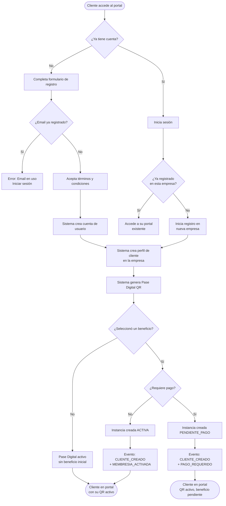
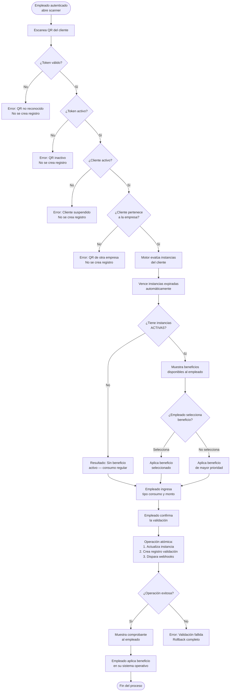
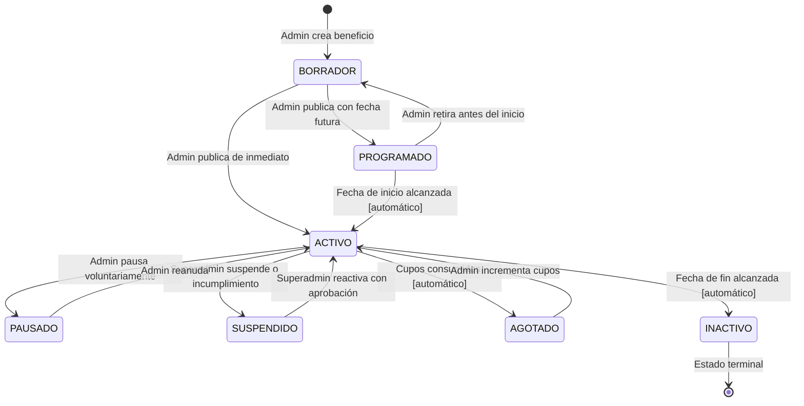
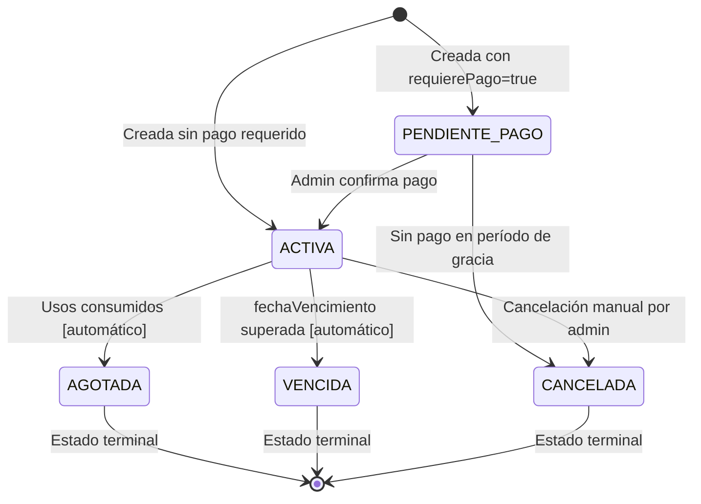
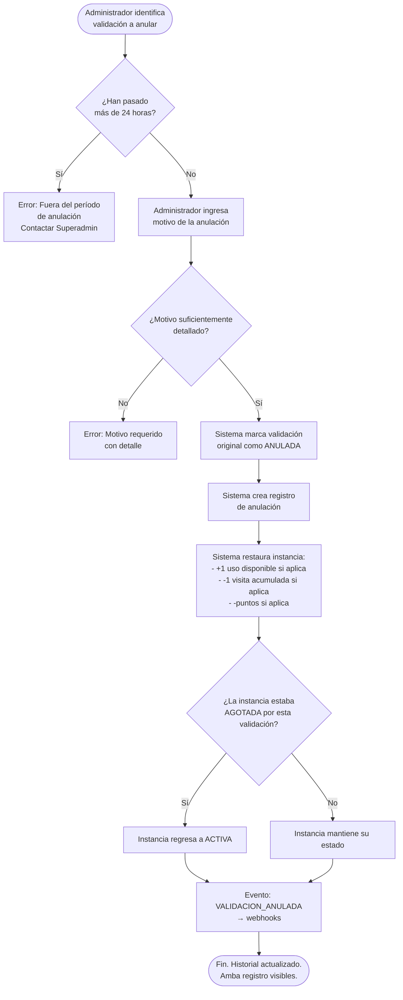
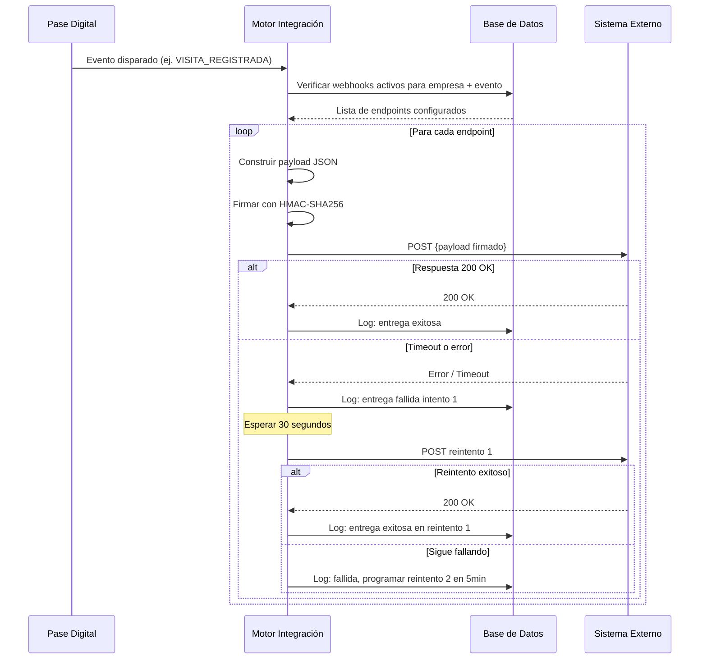
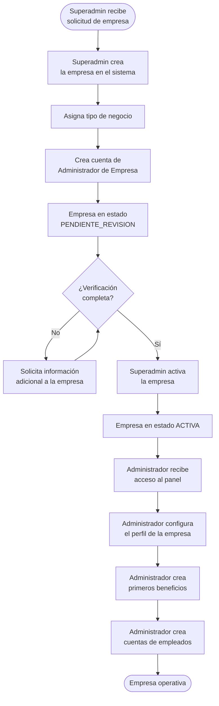

# Business Rules & Functional Flows
## Pase Digital — Reglas de Negocio y Flujos Funcionales

---

**Documento:** BRFF-001  
**Versión:** 1.0.0  
**Estado:** Activo — Fuente Oficial de Reglas de Negocio  
**Clasificación:** Interno — Producto, Arquitectura y Desarrollo  
**Última actualización:** 2026-06-26  
**Depende de:** PAD-001 (Product Architecture Document)  
**Propietario:** Equipo de Producto y Arquitectura de Pase Digital  

---

> *Este documento define las reglas de negocio que gobiernan el comportamiento funcional de la plataforma Pase Digital. Toda implementación técnica deberá producir exactamente el comportamiento aquí descrito. En caso de ambigüedad entre el código y este documento, este documento prevalece y el código debe corregirse.*

---

## Tabla de Contenidos

1. [Ciclo de Vida de una Empresa](#1-ciclo-de-vida-de-una-empresa)
2. [Ciclo de Vida de un Cliente](#2-ciclo-de-vida-de-un-cliente)
3. [Ciclo de Vida de un Beneficio](#3-ciclo-de-vida-de-un-beneficio)
4. [Ciclo de Vida de una Validación](#4-ciclo-de-vida-de-una-validación)
5. [Taxonomía Completa de Beneficios](#5-taxonomía-completa-de-beneficios)
6. [Reglas de Elegibilidad](#6-reglas-de-elegibilidad)
7. [Reglas de Validación](#7-reglas-de-validación)
8. [Flujo para Empresas sin Integración](#8-flujo-para-empresas-sin-integración)
9. [Flujo para Empresas con Integración API](#9-flujo-para-empresas-con-integración-api)
10. [Flujo para Empresas con Webhooks](#10-flujo-para-empresas-con-webhooks)
11. [Reglas Antifraude](#11-reglas-antifraude)
12. [Reglas de Auditoría](#12-reglas-de-auditoría)
13. [Casos Excepcionales y Contingencias](#13-casos-excepcionales-y-contingencias)
14. [Flujos Funcionales Completos (Diagramas)](#14-flujos-funcionales-completos-diagramas)
15. [Decisiones de Negocio](#15-decisiones-de-negocio)
16. [Auditoría del Documento — Vacíos Funcionales Identificados](#16-auditoría-del-documento--vacíos-funcionales-identificados)

---

## 1. Ciclo de Vida de una Empresa

### 1.1 Estados de una Empresa

Una Empresa en la plataforma puede encontrarse en uno de los siguientes estados:

```
PENDIENTE_REVISION → ACTIVA → SUSPENDIDA → INACTIVA
                          ↑         ↓
                          └─────────┘ (reactivación)
```

| Estado | Descripción | Quién puede modificarlo |
|---|---|---|
| `PENDIENTE_REVISION` | La empresa ha sido registrada en la plataforma pero aún no ha sido habilitada para operar. | Superadmin |
| `ACTIVA` | La empresa está completamente operativa. Puede publicar beneficios, registrar clientes y ejecutar validaciones. | Superadmin |
| `SUSPENDIDA` | La empresa ha sido deshabilitada temporalmente. Sus datos se conservan pero ninguna operación está disponible para sus empleados o clientes. | Superadmin |
| `INACTIVA` | La empresa ha abandonado formalmente la plataforma. Estado terminal para el ciclo regular. Sus datos históricos se conservan según la política de retención. | Superadmin (a solicitud de la empresa) |

---

### 1.2 Registro de una Empresa

**RN-EMP-001 — Registro inicial**  
Una empresa solo puede ser registrada en la plataforma por el Superadministrador. No existe registro público de empresas. Esta decisión garantiza que cada empresa en la plataforma sea verificada y calificada antes de operar.

**RN-EMP-002 — Datos mínimos para el registro**  
Para crear una empresa se requiere obligatoriamente:
- Nombre legal o comercial de la empresa
- Tipo de negocio (de los tipos disponibles en la plataforma)
- Al menos un Administrador de Empresa asignado

Los siguientes datos son opcionales en el registro pero recomendados para la experiencia del cliente:
- Logo
- Color principal de marca
- Descripción pública
- Datos de contacto (teléfono, WhatsApp)
- Dirección y ciudad

**RN-EMP-003 — Activación**  
La empresa queda en estado `PENDIENTE_REVISION` inmediatamente después del registro. El Superadmin debe habilitarla explícitamente a `ACTIVA`. No existe activación automática.

**RN-EMP-004 — Una empresa por dominio operativo**  
La plataforma no impone límite de empresas registradas por entidad legal. Una misma organización puede tener múltiples empresas en la plataforma si operan como unidades de negocio independientes con clientes y beneficios distintos.

---

### 1.3 Administración de Empleados

**RN-EMP-005 — Empleados creados por el Administrador**  
Los empleados son creados únicamente por el Administrador de la Empresa. No pueden auto-registrarse. Cada empleado queda vinculado a una sola empresa.

**RN-EMP-006 — Permisos inmutables por rol**  
Los empleados tienen un conjunto fijo de permisos (escanear QR, registrar validación, ver propio historial). No puede alterarse por empresa. Si una empresa necesita que un empleado tenga más permisos, debe asignarle el rol de Administrador.

**RN-EMP-007 — Desvinculación de empleado**  
Cuando un empleado deja de pertenecer a la empresa, el Administrador debe desactivar su cuenta. A partir de ese momento, el empleado no puede acceder al sistema. Su historial de validaciones se conserva y es atribuible a su identidad para fines de auditoría.

**RN-EMP-008 — Auditoría de acciones del empleado**  
Todas las validaciones registradas por un empleado quedan permanentemente ligadas a su identidad. No pueden ser reasignadas a otro empleado ni anonimizadas, excepto bajo requerimiento legal documentado y aprobado por el Superadmin.

---

### 1.4 Publicación y Gestión de Beneficios

**RN-EMP-009 — Autonomía editorial**  
Cada empresa es completamente autónoma en la creación y gestión de sus beneficios. El Superadmin no interviene en la definición de los beneficios de una empresa. La plataforma no valida si el beneficio ofrecido es comercialmente razonable o si la empresa tiene capacidad para cumplirlo.

**RN-EMP-010 — Responsabilidad del beneficio**  
La empresa es la única responsable de cumplir el beneficio que publica. La plataforma es el sistema de validación y registro, no el garante del cumplimiento del beneficio. Si la empresa no cumple un beneficio validado, la disputa es entre la empresa y el cliente, fuera del alcance de la plataforma.

**RN-EMP-011 — No se puede eliminar un beneficio con instancias activas**  
Si un beneficio tiene clientes con Instancias en estado `ACTIVA`, el beneficio no puede ser eliminado. Solo puede ser suspendido o pausado. La eliminación física de un beneficio solo es posible si no tiene ninguna Instancia de cliente asociada (lo que ocurre cuando el beneficio fue creado pero nunca asignado a ningún cliente).

---

### 1.5 Suspensión y Abandono

**RN-EMP-012 — Suspensión de la empresa**  
Cuando una empresa es suspendida:
- Sus empleados pierden acceso al sistema inmediatamente
- Los clientes no pueden ser validados
- Los beneficios activos quedan en estado `CONGELADO` (no se vencen, no se modifican, no se consumen)
- El portal del cliente muestra un mensaje de servicio temporalmente no disponible
- Los datos se conservan íntegramente

**RN-EMP-013 — Reactivación de empresa suspendida**  
Cuando una empresa es reactivada desde `SUSPENDIDA`:
- Los empleados recuperan acceso automáticamente
- Los beneficios `CONGELADOS` regresan a su estado anterior (`ACTIVA` o `PAUSADA`)
- Los vencimientos continúan desde el momento de reactivación (el tiempo de suspensión no se descuenta del plazo original)

**RN-EMP-014 — Abandono de la plataforma**  
Una empresa puede solicitar la baja de la plataforma. El proceso requiere:
1. Solicitud formal al Superadmin
2. Revisión de Instancias de Beneficio activas pendientes
3. Notificación a los clientes con Instancias activas (fuera del alcance técnico de la plataforma en v1)
4. Período de gracia de 30 días para que los clientes consuman beneficios pendientes
5. Al cabo del período, todos los beneficios pasan a `CANCELADO` y la empresa pasa a `INACTIVA`

**RN-EMP-015 — Datos post-baja**  
Una vez que la empresa pasa a `INACTIVA`, sus datos históricos (validaciones, clientes, beneficios) se conservan durante el período definido en la Política de Retención de Datos (ver documento de Compliance). No pueden ser modificados. Pueden ser exportados por el Superadmin bajo solicitud formal.

---

## 2. Ciclo de Vida de un Cliente

### 2.1 Estados de un Cliente

```
PENDIENTE_VERIFICACION → ACTIVO → SUSPENDIDO → ELIMINADO
                              ↑        ↓
                              └────────┘ (reactivación por admin)
```

| Estado | Descripción |
|---|---|
| `PENDIENTE_VERIFICACION` | El cliente se ha registrado pero su cuenta está pendiente de confirmación (verificación de email, en versiones futuras). En v1.0 este estado es transitorio y se resuelve automáticamente. |
| `ACTIVO` | El cliente puede presentar su Pase Digital, ver sus beneficios y utilizar el sistema normalmente. |
| `SUSPENDIDO` | El cliente no puede utilizar su Pase Digital. Sus beneficios están congelados. El Administrador puede suspender a un cliente por cualquier razón operativa. |
| `ELIMINADO` | La cuenta del cliente ha sido marcada para eliminación. Sus datos personales son anonimizados. Sus validaciones históricas se conservan de forma anónima para integridad del registro. |

---

### 2.2 Registro de un Cliente

**RN-CLI-001 — Dos vías de registro**  
Un cliente puede registrarse por dos vías:

*Vía 1 — Autoregistro:* El cliente accede al portal de registro de una empresa específica y completa el formulario por cuenta propia.

*Vía 2 — Registro manual:* Un empleado o el Administrador registra al cliente directamente desde el panel de administración.

**RN-CLI-002 — Unicidad de email por plataforma**  
El email es el identificador global único de un cliente en la plataforma. No pueden existir dos cuentas con el mismo email. Si un cliente intenta registrarse en una segunda empresa con el mismo email que ya usa en otra empresa, la plataforma vincula su cuenta existente con la nueva empresa creando un nuevo perfil de cliente (pero reutilizando la misma identidad de autenticación).

**RN-CLI-003 — Un cliente puede pertenecer a múltiples empresas**  
Un cliente con cuenta en la plataforma puede estar registrado simultáneamente en N empresas distintas. Cada registro genera un Pase Digital independiente. Los beneficios de cada empresa son completamente independientes entre sí. Un cliente con 3 empresas tiene 3 QRs distintos, 3 conjuntos de beneficios sin relación entre ellos.

**RN-CLI-004 — Datos requeridos para el registro**  
Datos obligatorios para el autoregistro:
- Nombre completo
- Correo electrónico
- Contraseña (mínimo 6 caracteres en v1)
- Aceptación explícita de los términos y condiciones

Datos opcionales (configurables por empresa):
- Teléfono
- Fecha de nacimiento
- Campos dinámicos específicos del Tipo de Negocio de la empresa

**RN-CLI-005 — Campos dinámicos**  
Cada Tipo de Negocio puede requerir campos adicionales al momento del registro. Estos campos son definidos por el Superadmin a nivel del Tipo de Negocio, no por la empresa individual. La empresa no puede agregar campos arbitrarios no definidos en el Tipo de Negocio.

---

### 2.3 Verificación y Aceptación de Términos

**RN-CLI-006 — Aceptación de términos en el registro**  
La aceptación de los términos y condiciones de la plataforma es un requisito no omitible del proceso de registro. El sistema debe registrar la versión de los términos aceptados y el timestamp de la aceptación.

**RN-CLI-007 — Verificación de email (Horizonte 2)**  
En v1.0, el email no requiere verificación activa. El cliente queda activo inmediatamente al registrarse. La verificación de email mediante enlace de confirmación está planificada para el Horizonte 2 como medida adicional de seguridad.

---

### 2.4 Asignación del Pase Digital

**RN-CLI-008 — Generación automática del QR**  
El Pase Digital se genera automáticamente al momento del registro del cliente en una empresa. No requiere acción manual del Administrador ni del cliente. El cliente tiene acceso a su QR desde el instante en que completa el registro.

**RN-CLI-009 — Unicidad del token**  
El token que identifica a cada Pase Digital es único en toda la plataforma, no solo dentro de una empresa. No puede existir dos Pases Digitales con el mismo token, en ninguna circunstancia.

**RN-CLI-010 — Un Pase activo por cliente por empresa**  
En cualquier momento, un cliente tiene exactamente un Pase Digital activo por empresa. Si se regenera el QR (por pérdida, cambio de dispositivo, o compromiso de seguridad), el token anterior es invalidado y el nuevo token entra en vigor inmediatamente.

**RN-CLI-011 — El QR no expira por tiempo**  
El Pase Digital no tiene fecha de vencimiento intrínseca. Se mantiene válido mientras el cliente esté en estado `ACTIVO` en esa empresa. El QR solo se invalida si es regenerado explícitamente o si el cliente es suspendido/eliminado.

---

### 2.5 Obtención y Uso de Beneficios

**RN-CLI-012 — Obtención por autoregistro**  
Un cliente puede obtener una Instancia de Beneficio durante el proceso de registro si la empresa tiene beneficios disponibles para nuevos registros.

**RN-CLI-013 — Obtención posterior al registro**  
Un cliente ya registrado puede obtener Instancias de Beneficio adicionales en cualquier momento mientras el beneficio esté en estado `ACTIVO` y el cliente cumpla las condiciones de elegibilidad.

**RN-CLI-014 — Una Instancia activa por tipo de beneficio por empresa**  
Un cliente no puede tener dos Instancias del mismo beneficio en estado `ACTIVA` simultáneamente dentro de la misma empresa. Si un cliente tiene una Instancia `ACTIVA` del Plan Oro y solicita el Plan Oro nuevamente, la plataforma debe notificar que ya tiene ese beneficio activo.

**Excepción:** Si la empresa configura un beneficio como "apilable" (stacking), pueden coexistir múltiples instancias. Esta capacidad es un feature del Horizonte 2.

---

### 2.6 Historial del Cliente

**RN-CLI-015 — Acceso al historial propio**  
Cada cliente puede consultar, en cualquier momento, el historial completo de todas sus validaciones en todas las empresas en las que está registrado. El historial es de solo lectura. El cliente nunca puede modificar ni eliminar entradas de su historial.

**RN-CLI-016 — Historial post-suspensión**  
Si un cliente es suspendido, su historial previo se conserva y es visible para el Administrador. El cliente no puede acceder a su historial mientras esté suspendido.

---

### 2.7 Modificación de Datos del Cliente

**RN-CLI-017 — Modificación de datos por el propio cliente**  
El cliente puede modificar su nombre, teléfono, fecha de nacimiento y campos dinámicos desde su portal. No puede modificar su email (el email es el identificador de autenticación inmutable en v1).

**RN-CLI-018 — Modificación de email (Horizonte 2)**  
La modificación de email requerirá verificación del nuevo email y confirmación desde el email anterior. Este proceso está planificado para el Horizonte 2.

**RN-CLI-019 — Modificación por el Administrador**  
El Administrador de la Empresa puede modificar los datos del cliente que pertenecen al perfil de su empresa (campos dinámicos, teléfono registrado en su empresa). No puede modificar la contraseña del cliente ni su email.

---

### 2.8 Suspensión y Eliminación

**RN-CLI-020 — Suspensión por el Administrador**  
El Administrador puede suspender a un cliente de su empresa. Esta suspensión afecta únicamente al perfil del cliente en esa empresa. El cliente puede seguir usando su Pase Digital en otras empresas donde está registrado.

**RN-CLI-021 — Solicitud de eliminación**  
Un cliente puede solicitar la eliminación de su cuenta. El proceso de eliminación:
1. El cliente solicita eliminación desde su portal
2. Se activa un período de gracia de 30 días durante los cuales el cliente puede cancelar la solicitud
3. Transcurrido el período, los datos personales son anonimizados
4. Las validaciones históricas se conservan pero con identidad anonimizada
5. Las Instancias de Beneficio activas son canceladas

**RN-CLI-022 — El historial de validaciones es indestructible**  
Incluso tras la eliminación del cliente, los registros de validaciones se conservan de forma permanente pero anonimizados. Esto garantiza la integridad del audit trail de la empresa. Lo que se elimina es la asociación entre la validación y la identidad personal del cliente.

---

## 3. Ciclo de Vida de un Beneficio

### 3.1 Estados de un Beneficio (Definición)

Un Beneficio (la plantilla) puede existir en los siguientes estados:

```
BORRADOR → PROGRAMADO → ACTIVO → PAUSADO → SUSPENDIDO → INACTIVO
                           ↑         ↓
                           └─────────┘ (reanudación)
                                       AGOTADO (automático, por cupos)
```

**Estados de una Instancia de Beneficio (la asignación a un cliente):**

```
PENDIENTE_PAGO → ACTIVA → AGOTADA
                    ↓
                  VENCIDA (automático, por fecha)
                    ↓
                  CANCELADA (manual)
```

---

### 3.2 Estados del Beneficio (Definición Detallada)

#### BORRADOR
**Descripción:** El Administrador está configurando el beneficio pero no ha sido publicado. No es visible para clientes ni empleados.  
**Quién puede accederlo:** Solo el Administrador de la Empresa.  
**Transiciones posibles:** → `PROGRAMADO` (si tiene fecha de inicio futura) o → `ACTIVO` (si se publica de inmediato).  
**Regla:** Un beneficio en estado `BORRADOR` no puede generar Instancias. Si se borra desde este estado, no deja rastro operativo.

#### PROGRAMADO
**Descripción:** El beneficio ha sido configurado y publicado, pero tiene una fecha de inicio futura. No está todavía disponible para los clientes, pero puede ser visualizado como "próximamente" si la empresa lo configura así.  
**Quién puede accederlo:** Solo lectura para clientes (si la empresa habilita la vista previa). Editable por el Administrador.  
**Transiciones posibles:** → `ACTIVO` (automático al llegar la fecha de inicio) o → `BORRADOR` (si el admin retira la publicación antes del inicio).

#### ACTIVO
**Descripción:** El beneficio está completamente operativo. Los clientes elegibles pueden obtener Instancias. Las validaciones pueden ejecutarse contra este beneficio.  
**Transiciones posibles:** → `PAUSADO` (manual por el admin), → `SUSPENDIDO` (por el admin o por el sistema ante anomalías), → `AGOTADO` (automático cuando se consumen todos los cupos disponibles), → `INACTIVO` (si se supera la fecha de fin configurada).

#### PAUSADO
**Descripción:** El Administrador ha detenido temporalmente el beneficio. Los clientes que ya tienen una Instancia `ACTIVA` mantienen su estado. No se pueden crear nuevas Instancias. No se pueden ejecutar nuevas validaciones sobre este beneficio.  
**Quién puede cambiarlo:** Administrador de la Empresa.  
**Transiciones posibles:** → `ACTIVO` (reanudación manual).  
**Diferencia con SUSPENDIDO:** El estado `PAUSADO` es una decisión operativa voluntaria del Administrador (ej. "pausamos la membresía de verano hasta el lunes"). El estado `SUSPENDIDO` implica una intervención externa o un problema de cumplimiento.

#### SUSPENDIDO
**Descripción:** El beneficio ha sido detenido por decisión del Superadmin (ej. denuncia de incumplimiento, violación de términos) o por el Administrador ante una situación grave. Las Instancias activas quedan congeladas. No se pueden ejecutar validaciones.  
**Quién puede cambiarlo:** Superadmin (o Administrador para auto-suspensión).  
**Transiciones posibles:** → `ACTIVO` (solo con aprobación del Superadmin si fue suspendido por el Superadmin).

#### AGOTADO
**Descripción:** El beneficio alcanzó el límite de cupos configurados. No pueden crearse nuevas Instancias. Las Instancias ya existentes continúan funcionando normalmente.  
**Cuándo ocurre:** Automáticamente cuando `cuposOtorgados == limiteCupos`.  
**Transiciones posibles:** → `ACTIVO` si el Administrador incrementa el límite de cupos.  
**Nota:** Un beneficio sin límite de cupos nunca pasa a estado `AGOTADO`.

#### INACTIVO
**Descripción:** El beneficio ha alcanzado su fecha de fin, fue cancelado definitivamente, o el Administrador decidió cerrarlo formalmente. Estado terminal para el beneficio. Las Instancias existentes continúan su propio ciclo de vida normal (pueden vencer, ser consumidas, etc.).  
**Quién puede cambiarlo:** No es reversible. Si se quiere un beneficio similar, debe crearse uno nuevo.

---

### 3.3 Estados de una Instancia de Beneficio

#### PENDIENTE_PAGO
**Descripción:** La Instancia fue creada para un cliente pero requiere confirmación de pago para activarse. El cliente no puede utilizar el beneficio.  
**Cuándo ocurre:** Cuando el beneficio tiene `requierePago = true`.  
**Transiciones posibles:** → `ACTIVA` (cuando el admin confirma el pago), → `CANCELADA` (si el pago no llega en el período configurado).

#### ACTIVA
**Descripción:** El cliente puede presentar esta Instancia en cualquier validación. Está completamente operativa.  
**Transiciones posibles:** → `AGOTADA` (cuando se consumen todos los usos disponibles), → `VENCIDA` (cuando llega la fecha de vencimiento), → `CANCELADA` (cancelación manual).

#### AGOTADA
**Descripción:** El cliente ha consumido todos los usos disponibles de su Instancia. La Instancia ya no genera beneficios en nuevas validaciones pero el historial permanece.  
**Cuándo ocurre:** Automáticamente cuando `usosConsumidos == cantidadUsos` para membresías y paquetes. Para puntos y visitas acumuladas, este estado no aplica directamente.  
**Transiciones posibles:** Estado terminal. Si la empresa quiere renovar, debe crear una nueva Instancia.

#### VENCIDA
**Descripción:** La fecha de vencimiento de la Instancia fue superada. El cliente ya no puede utilizarla.  
**Cuándo ocurre:** Automáticamente cuando `now > fechaVencimiento`.  
**Transiciones posibles:** Estado terminal. La empresa puede crear una nueva Instancia como cortesía, pero la vencida no se reactiva.

#### CANCELADA
**Descripción:** La Instancia fue cancelada manualmente por el Administrador o por el sistema (ej. el cliente fue eliminado, la empresa cerró). Estado terminal.  
**Transiciones posibles:** Estado terminal. Siempre debe registrarse el motivo de la cancelación y quién la ejecutó.

---

### 3.4 Reglas de Transición de Estado (Beneficio)

**RN-BEN-001 — Un beneficio publicado no puede regresar a BORRADOR**  
Una vez que un beneficio sale del estado `BORRADOR`, no puede volver a ese estado. Si el Administrador quiere "empezar de cero", debe crear un beneficio nuevo.

**RN-BEN-002 — La fecha de fin es vinculante**  
Si un beneficio tiene fecha de fin configurada, la plataforma lo pasa automáticamente a `INACTIVO` al llegar esa fecha, sin intervención manual. Este proceso debe ejecutarse con fiabilidad (no puede depender de una visita al sistema).

**RN-BEN-003 — Los contadores son de solo incremento**  
Los contadores de uso (`cuposOtorgados`, `usosConsumidos`, `visitasAcumuladas`) solo pueden incrementarse, nunca decrementarse, excepto en caso de anulación documentada de una validación (ver Sección 4).

**RN-BEN-004 — Modificación de un beneficio ACTIVO**  
Un beneficio en estado `ACTIVO` puede modificarse en sus atributos descriptivos (nombre, descripción, imagen). No puede modificarse su tipo de beneficio ni su lógica de recompensa mientras tenga Instancias activas. Solo puede modificarse el límite de cupos (ampliándolo, no reduciéndolo por debajo de los cupos ya otorgados).

---

## 4. Ciclo de Vida de una Validación

### 4.1 Concepto Fundamental

Una Validación es el evento central y más crítico de la plataforma. Es el momento en que la plataforma determina si un cliente tiene derecho a recibir un beneficio y registra esa determinación de forma permanente.

**Una Validación siempre ocurre, independientemente del resultado.** Si el cliente no tiene ningún beneficio activo, igual se registra la validación con resultado "consumo regular sin beneficio". Esto es fundamental para el audit trail.

### 4.2 Estados de una Validación

Una Validación puede encontrarse en los siguientes estados:

| Estado | Descripción |
|---|---|
| `REGISTRADA` | La validación fue completada y registrada exitosamente. Estado de cierre normal. |
| `ANULADA` | La validación fue registrada pero posteriormente anulada con justificación documentada. El beneficio consumido debe ser restituido. |

**Nota importante:** A diferencia de otros sistemas, en Pase Digital una validación NO tiene estado "pendiente". El proceso de validación es síncrono: o se completa y queda `REGISTRADA`, o falla y no se crea el registro. No existen validaciones en estado limbo.

---

### 4.3 Flujo Detallado de la Validación

#### Fase 1: Presentación del Pase Digital

**RN-VAL-001 — Inicio por escaneo del empleado**  
El proceso de validación siempre es iniciado por un Empleado autorizado, nunca por el cliente. El cliente no puede auto-validar su propio Pase Digital.

**RN-VAL-002 — El empleado debe estar autenticado**  
Ninguna validación puede ejecutarse si el empleado no está activamente autenticado en el sistema. La sesión del empleado debe estar vigente. Si la sesión expiró, el empleado debe re-autenticarse antes de poder escanear.

**RN-VAL-003 — Validez del token**  
Cuando el empleado escanea el QR, la plataforma verifica:
- Que el token existe en el sistema
- Que el token está marcado como activo
- Que el token pertenece a un cliente en estado `ACTIVO`
- Que el cliente pertenece a la misma empresa que el empleado

Si cualquiera de estas verificaciones falla, la validación es rechazada con el motivo específico y no se crea ningún registro.

#### Fase 2: Consulta de Elegibilidad

**RN-VAL-004 — Evaluación del Motor de Validación**  
Una vez identificado el cliente, el Motor de Validación consulta todas sus Instancias de Beneficio en estado `ACTIVA` para esa empresa. El Motor evalúa:
- Si alguna Instancia tiene `fechaVencimiento < now` → la marca como `VENCIDA` antes de responder
- Qué Instancias están genuinamente activas y elegibles
- Para cada Instancia elegible, qué beneficio concreto aplica en este momento

**RN-VAL-005 — Selección del beneficio a aplicar**  
Si el cliente tiene múltiples Instancias activas, el empleado puede ver todas y seleccionar cuál aplicar. Si el empleado no selecciona, se aplica la Instancia más reciente por fecha de creación. Esta regla de prioridad por defecto puede ser configurada por la empresa en el Horizonte 2.

**RN-VAL-006 — Validación sin beneficio activo**  
Si el cliente no tiene ninguna Instancia activa, la validación se ejecuta igualmente y queda registrada como "consumo regular". Esto no es un error — es un resultado válido de la validación. El empleado ve el mensaje "Cliente identificado — sin beneficio activo".

#### Fase 3: Confirmación por el Empleado

**RN-VAL-007 — El empleado confirma el consumo**  
El empleado debe confirmar los detalles del consumo antes de que la validación quede registrada:
- Tipo de consumo (descripción del servicio o producto)
- Monto del consumo (opcional, pero requerido para beneficios que calculan puntos por monto)

**RN-VAL-008 — La confirmación es irreversible en el momento**  
Una vez que el empleado confirma, la validación queda registrada de forma inmutable. No existe un botón de "cancelar antes de guardar" — la acción de confirmar es la acción de registrar.

#### Fase 4: Registro Permanente

**RN-VAL-009 — Campos mínimos del registro de validación**  
Toda validación registrada debe contener como mínimo:
- Identificador único de la validación
- Identificador del cliente validado
- Identificador del empleado que ejecutó la validación
- Identificador de la empresa
- Identificador de la Instancia de Beneficio aplicada (si aplica)
- Tipo de consumo ingresado por el empleado
- Monto del consumo (puede ser 0)
- Resultado: nombre del beneficio aplicado o "sin beneficio"
- Puntos generados (puede ser 0)
- Usos descontados (puede ser 0)
- Timestamp exacto (fecha + hora + zona horaria)
- Dirección IP del dispositivo del empleado (cuando esté disponible)

**RN-VAL-010 — El registro es atómico**  
El registro de la validación y la actualización del estado de la Instancia (decrementar usos, sumar visitas, sumar puntos) deben ocurrir como una sola operación atómica. No puede existir un escenario donde la validación quede registrada pero la Instancia no se actualice, o viceversa.

#### Fase 5: Comprobante

**RN-VAL-011 — Comprobante generado automáticamente**  
Inmediatamente después del registro, el sistema genera un comprobante de validación disponible tanto para el empleado (en pantalla) como para el cliente (en su historial). El comprobante incluye todos los campos del registro más un identificador legible por humanos.

**RN-VAL-012 — El comprobante no es una factura**  
El comprobante de validación emitido por la plataforma es una evidencia interna de que la validación ocurrió. No tiene valor fiscal, no reemplaza la factura emitida por el sistema de la empresa, y no puede ser utilizado como comprobante de compra.

---

### 4.4 Anulación de una Validación

**RN-VAL-013 — La anulación es posible pero restringida**  
Una validación puede ser anulada por el Administrador de la Empresa dentro de un período máximo de 24 horas desde su registro. Transcurrido ese período, la validación es definitivamente inmodificable.

**RN-VAL-014 — La anulación requiere motivo documentado**  
Toda anulación debe ir acompañada de un motivo escrito que quede registrado en el sistema. No existe anulación sin motivo.

**RN-VAL-015 — Efecto de la anulación sobre la Instancia**  
Cuando una validación es anulada:
- El registro de la validación original se conserva pero se marca como `ANULADA`
- Se crea un nuevo registro de anulación con todos los datos
- La Instancia de Beneficio afectada es actualizada para restituir el uso consumido (si aplica: +1 uso disponible, -1 visita acumulada, etc.)
- Si la anulación revierte un vencimiento automático (la validación fue la última que agotó los usos y causó el estado `AGOTADA`), la Instancia regresa a `ACTIVA`

**RN-VAL-016 — El historial de anulaciones es visible**  
El Administrador puede ver todas las anulaciones ejecutadas, quién las hizo, cuándo y por qué.

---

## 5. Taxonomía Completa de Beneficios

### 5.1 Principio de Extensibilidad

La arquitectura de tipos de beneficio está diseñada para ser extendida sin necesidad de modificar el núcleo del sistema. Cada tipo de beneficio implementa una interfaz estándar con tres funciones:

1. **`evaluar(instancia, contexto)`** — Dada una Instancia y el contexto del escaneo, determina si el beneficio aplica y cuál es la recompensa concreta.
2. **`actualizarInstancia(instancia, resultado)`** — Actualiza el estado interno de la Instancia después de una validación.
3. **`verificarAgotamiento(instancia)`** — Determina si la Instancia debe pasar al estado `AGOTADA`.

Cualquier comportamiento de beneficio, por complejo que sea, puede ser representado mediante la implementación de estas tres funciones.

---

### 5.2 Clasificación por Categoría

#### CATEGORÍA A — Beneficios Basados en Membresía

**A1 · Membresía de Usos**  
El cliente adquiere N usos de un servicio específico durante un período.  
Parámetros: cantidad de usos (`cantidadUsos`), duración en días (`duracionDias`), precio, tipo de servicio incluido.  
Lógica: Cada validación descuenta 1 uso. Cuando `usosConsumidos == cantidadUsos`, la Instancia pasa a `AGOTADA`.  
Ejemplo: Plan Oro — 8 lavados básicos en 30 días.

**A2 · Membresía de Acceso**  
El cliente tiene acceso ilimitado a un servicio durante un período.  
Parámetros: duración en días, precio.  
Lógica: Cada validación registra el acceso pero no decrementa ningún contador. El vencimiento es únicamente por fecha.  
Ejemplo: Acceso ilimitado al gimnasio durante 1 mes.

**A3 · Plan de Servicios (Paquete)**  
El cliente adquiere un paquete con cantidades específicas de múltiples servicios distintos.  
Parámetros: lista de servicios con cantidades individuales, precio total, duración.  
Lógica: Cada validación especifica qué tipo de servicio se consume y decrementa el contador correspondiente. La Instancia se agota cuando todos los servicios del paquete han sido consumidos.  
Ejemplo: Paquete Premium — 4 cortes + 3 afeitados + 2 tratamientos capilares.

#### CATEGORÍA B — Beneficios Basados en Acumulación

**B1 · Conteo de Visitas**  
El cliente acumula visitas hasta alcanzar una meta, momento en que recibe una recompensa automática.  
Parámetros: meta de visitas (`metaVisitas`), tipo de recompensa (porcentaje descuento o servicio gratis), ciclo de reinicio (la meta se reinicia después de la recompensa).  
Lógica: Cada validación incrementa `visitasAcumuladas`. Cuando `visitasAcumuladas == metaVisitas`, se aplica la recompensa y el contador regresa a 0.  
Ejemplo: 5ª visita gratis. La tarjeta se reinicia para el siguiente ciclo.

**B2 · Sistema de Puntos por Visita**  
El cliente acumula puntos fijos por cada visita realizada.  
Parámetros: puntos por visita (`puntosPorConsumo`).  
Lógica: Cada validación incrementa `puntosAcumulados += puntosPorConsumo`.

**B3 · Sistema de Puntos por Monto**  
El cliente acumula puntos proporcionales al monto consumido.  
Parámetros: puntos por unidad de monto (`puntosPorMonto`, ej. 1 punto por cada RD$50).  
Lógica: Cada validación calcula `puntosGanados = floor(montoConsumo / puntosPorMonto)` y los suma al acumulado.

**B4 · Sistema de Puntos Mixto**  
Combina puntos fijos por visita más puntos por monto.  
Lógica: `puntosGanados = puntosPorConsumo + floor(montoConsumo / puntosPorMonto)`.

**B5 · Canje de Puntos**  
El cliente utiliza sus puntos acumulados para obtener una recompensa.  
Nota: El canje de puntos es una operación separada de la acumulación y requiere diseño específico para el Horizonte 2 (actualmente los puntos se acumulan pero el canje es manual/externo a la plataforma en v1).

#### CATEGORÍA C — Beneficios Basados en Descuento

**C1 · Descuento Porcentual Único (Cupón)**  
El cliente tiene derecho a recibir un descuento de X% en su próximo consumo.  
Parámetros: porcentaje de descuento (`descuentoPct`), fecha de vencimiento, cantidad de usos (típicamente 1).  
Lógica: Al ser aplicado en una validación, la Instancia pasa a `AGOTADA`.  
Ejemplo: 20% de descuento en tu próxima visita.

**C2 · Descuento Porcentual Recurrente**  
El cliente recibe un descuento en cada visita durante un período.  
Parámetros: porcentaje, duración, cantidad máxima de aplicaciones.  
Ejemplo: 15% de descuento en todas tus visitas durante julio.

**C3 · Descuento Fijo (Monto)**  
El cliente recibe un descuento de un monto fijo en lugar de un porcentaje.  
Parámetros: monto de descuento, moneda, fecha de vencimiento.  
Ejemplo: RD$200 de descuento en tu próximo servicio.

**C4 · Servicio Gratuito**  
El cliente tiene derecho a recibir un servicio completamente gratis (descuento del 100%).  
Equivalente al C1 con `descuentoPct = 100`.

#### CATEGORÍA D — Beneficios Basados en Tiempo

**D1 · Promoción Temporal**  
Un beneficio disponible para todos los clientes elegibles durante un período específico, sin requerir activación individual.  
Parámetros: fechas de inicio y fin, tipo de recompensa, condición de elegibilidad del cliente.  
Lógica: El Motor de Validación evalúa si `now` está entre `fechaInicio` y `fechaFin`. Si sí, aplica la recompensa.  
Ejemplo: 2x1 los martes de agosto para todos los clientes registrados.

**D2 · Beneficio de Cumpleaños**  
Se activa automáticamente durante el período de cumpleaños del cliente.  
Parámetros: ventana temporal (día exacto, semana, mes), tipo de recompensa.  
Lógica: El Motor verifica si la fecha de nacimiento del cliente corresponde al período activo.  
Ejemplo: 30% de descuento durante tu semana de cumpleaños.

**D3 · Campaña Especial**  
Un beneficio temporal vinculado a un evento o campaña nombrada. Similar a la Promoción Temporal pero con identidad propia (nombre, imagen, narrativa de marketing).  
Ejemplo: "Campaña Día del Padre — 25% para todos los titulares del Plan Plata."

#### CATEGORÍA E — Beneficios Basados en Comportamiento (Horizonte 2)

**E1 · Beneficio de Referido**  
El cliente que refiere a un nuevo cliente activo recibe una recompensa.  
Requiere: módulo de tracking de referidos, código único de referido por cliente.

**E2 · Beneficio de Nivel (VIP / Tier)**  
El cliente sube de nivel según su actividad acumulada. Cada nivel desbloquea beneficios adicionales automáticamente.  
Ejemplo: Nivel Bronce (0-9 visitas) → Nivel Plata (10-24) → Nivel Oro (25+).

**E3 · Beneficio de Inactividad (Reactivación)**  
Se activa automáticamente cuando un cliente no ha visitado en N días, como incentivo para retornar.  
Ejemplo: ¡Te extrañamos! 15% de descuento si vuelves esta semana.

#### CATEGORÍA F — Beneficios Compuestos (Horizonte 3)

**F1 · Beneficio con Reglas Condicionales**  
Un beneficio que combina condiciones complejas mediante un motor de reglas configurable.  
Ejemplo: 20% de descuento solo si el monto supera RD$1,000 Y el cliente tiene el Plan Oro Y la visita es en día de semana.

**F2 · Beneficio Sorpresa**  
La recompensa se determina aleatoriamente en el momento de la validación, con probabilidades configurables por la empresa.

**F3 · Beneficio de Grupo**  
Se activa cuando un grupo de clientes llega simultáneamente o completan acciones colectivas.

---

### 5.3 Representación Uniforme de Todos los Beneficios

Independientemente del tipo, todo beneficio se almacena en la misma estructura con los siguientes atributos:

| Atributo | Aplica a |
|---|---|
| `tipoEstrategia` | Todos (es el discriminador del tipo) |
| `nombre`, `descripcion` | Todos |
| `estado` | Todos |
| `requierePago`, `precio` | Membresías, Planes, algunos Cupones |
| `duracionDias` | Membresías, Planes, Cupones con fecha |
| `cantidadUsos` | Membresías de Usos, Cupones |
| `metaVisitas` | Conteo de Visitas |
| `puntosPorConsumo`, `puntosPorMonto` | Sistemas de Puntos |
| `descuentoPct` | Cupones, Descuentos, Visitas con recompensa |
| `recompensa` | Descripción textual de la recompensa para el empleado |
| `fechaInicio`, `fechaFin` | Promociones Temporales, Campañas |
| `limiteCupos`, `cuposDisponibles` | Cualquier beneficio con cupo limitado |
| `destacada`, `escasezTipo` | Cualquier beneficio con urgencia visual |
| `incluye` | Planes y Paquetes (lista de servicios incluidos) |

Esta estructura uniforme permite que nuevos tipos de beneficio sean creados sin agregar nuevas columnas al modelo de datos, únicamente implementando nuevos Módulos de Beneficio que interpreten los campos existentes de forma diferente.

---

## 6. Reglas de Elegibilidad

### 6.1 Definición de Elegibilidad

La **elegibilidad** es la condición que determina si un cliente específico puede obtener o utilizar un beneficio específico en un momento dado. La elegibilidad se evalúa en dos momentos distintos:

1. **Elegibilidad de obtención:** ¿Puede este cliente obtener una Instancia de este beneficio?
2. **Elegibilidad de uso:** ¿Puede este cliente utilizar su Instancia activa en este momento?

---

### 6.2 Reglas de Elegibilidad de Obtención

**RN-ELG-001 — El beneficio debe estar ACTIVO**  
Un cliente solo puede obtener una Instancia si el Beneficio está en estado `ACTIVO`. Un beneficio `PAUSADO`, `SUSPENDIDO`, `AGOTADO` o `INACTIVO` no puede generar nuevas Instancias.

**RN-ELG-002 — El cliente debe estar registrado en la empresa**  
Solo los clientes registrados en una empresa pueden obtener Instancias de los beneficios de esa empresa. No existe la obtención de beneficios de empresas ajenas.

**RN-ELG-003 — No duplicar Instancias activas**  
Un cliente no puede obtener una segunda Instancia del mismo beneficio mientras tenga una Instancia activa de ese mismo beneficio. Debe esperar a que la Instancia actual venza, sea agotada o cancelada.

**RN-ELG-004 — Verificación de cupos**  
Si el beneficio tiene `limiteCupos` configurado, la plataforma verifica que `cuposOtorgados < limiteCupos` antes de crear la Instancia. Si los cupos están agotados, el beneficio se marca como `AGOTADO` automáticamente y el cliente recibe un mensaje informando que los cupos se han agotado.

**RN-ELG-005 — Segmentación de clientes (Horizonte 2)**  
En el Horizonte 2, los beneficios podrán tener condiciones de elegibilidad adicionales: solo para clientes de nivel VIP, solo para clientes registrados hace más de N días, solo para clientes con más de N visitas históricas. En v1.0, todos los clientes activos de una empresa son elegibles para cualquier beneficio activo de esa empresa.

---

### 6.3 Reglas de Elegibilidad de Uso

**RN-ELG-006 — La Instancia debe estar ACTIVA**  
Una Instancia solo genera beneficio si está en estado `ACTIVA`. Un empleado no puede aplicar una Instancia `VENCIDA`, `AGOTADA` o `CANCELADA`.

**RN-ELG-007 — La fecha de vencimiento no debe estar superada**  
Si `fechaVencimiento != null AND now > fechaVencimiento`, la Instancia se marca automáticamente como `VENCIDA` en el momento del escaneo y el cliente es informado de que su beneficio ha expirado.

**RN-ELG-008 — Los usos disponibles deben ser positivos (para tipos basados en usos)**  
Para beneficios de tipo `MEMBRESIA` y paquetes, si `usosDisponibles == 0`, el beneficio ya no aplica aunque la fecha de vencimiento no haya llegado. La Instancia pasa a `AGOTADA`.

**RN-ELG-009 — Las fechas de la promoción deben estar vigentes (para tipos temporales)**  
Para beneficios de tipo `PROMOCION_TEMPORAL`, el beneficio solo aplica si `now` está dentro del rango `[fechaInicio, fechaFin]`. Fuera de ese rango, el motor informa que la promoción no está vigente pero registra igualmente la visita como consumo regular.

**RN-ELG-010 — El cliente debe estar ACTIVO**  
Si el cliente ha sido suspendido por la empresa mientras está en el establecimiento (caso excepcional), el QR no genera ningún beneficio. Sin embargo, la validación puede registrarse como consumo regular si el empleado lo confirma explícitamente.

---

### 6.4 Restricciones Configurables

Las siguientes restricciones adicionales son posibles de configurar pero están planificadas para el Horizonte 2:

| Restricción | Descripción |
|---|---|
| **Restricción por día de semana** | El beneficio solo aplica en días específicos (ej. solo lunes y martes) |
| **Restricción por horario** | El beneficio solo aplica en ciertos horarios (ej. 2pm-5pm) |
| **Restricción por monto mínimo** | El beneficio solo aplica si `montoConsumo >= montoMinimo` |
| **Restricción por sucursal** | El beneficio solo aplica en sucursales específicas de la empresa |
| **Restricción de frecuencia** | El cliente solo puede usar el beneficio una vez por día/semana |
| **Restricción de combinación** | El beneficio no puede combinarse con otras promociones activas |

---

## 7. Reglas de Validación

### 7.1 El Flujo de Validación es Sagrado

El proceso de validación es la operación más crítica de la plataforma. Cada paso está diseñado para garantizar tres cosas simultáneamente:
1. **Precisión:** El beneficio correcto se aplica al cliente correcto en el momento correcto.
2. **Seguridad:** No puede ejecutarse una validación fraudulenta.
3. **Trazabilidad:** Todo queda registrado sin posibilidad de alteración posterior.

---

### 7.2 Paso 1: Autenticación del Empleado

Antes de poder escanear cualquier QR, el empleado debe:
- Estar autenticado con su cuenta de la plataforma
- Tener una sesión activa no expirada
- Pertenecer a la empresa cuyo cliente va a escanear

**La plataforma no permite escanear en nombre de una empresa diferente a la del empleado autenticado.**

---

### 7.3 Paso 2: Escaneo e Identificación

Cuando el empleado escanea el QR del cliente:

1. La plataforma recibe el token del QR
2. Busca el token en la base de datos
3. Verifica:
   - Token existe → si no, error "QR no reconocido"
   - Token activo → si no, error "QR inactivo"
   - Cliente activo → si no, error "Cliente suspendido"
   - Cliente pertenece a la empresa del empleado → si no, error "QR de otra empresa"
4. Si todas las verificaciones pasan, la plataforma devuelve la información del cliente

---

### 7.4 Paso 3: Consulta de Beneficios

Inmediatamente después de identificar al cliente:

1. Se recuperan todas las Instancias de Beneficio del cliente para esa empresa
2. Para cada Instancia se evalúa su estado actualizado (incluyendo vencimientos que aún no se han procesado)
3. Las Instancias vencidas se actualizan automáticamente a `VENCIDA`
4. Se construye la lista de Instancias elegibles para aplicar

---

### 7.5 Paso 4: Presentación al Empleado

El empleado recibe en su pantalla:
- Nombre del cliente
- Foto o inicial del cliente (para verificación visual)
- Estado del cliente
- Lista de beneficios activos con sus detalles (tipo, qué aplica, usos restantes, fecha de vencimiento)
- Si no hay beneficios activos: mensaje "Cliente sin beneficio activo — registrar como consumo regular"

---

### 7.6 Paso 5: Aplicación y Confirmación

El empleado:
1. Confirma que el cliente frente a él coincide con el perfil mostrado
2. Selecciona (si hay múltiples) qué beneficio aplicar
3. Ingresa el tipo de consumo (ej. "Lavado básico", "Corte de cabello")
4. Ingresa el monto del consumo (si aplica)
5. Confirma la operación

**En ningún paso puede el empleado modificar el beneficio que la plataforma ha determinado. El empleado solo puede confirmar o no confirmar. No puede cambiar el tipo de recompensa, aumentar descuentos ni otorgar beneficios no definidos.**

---

### 7.7 Paso 6: Procesamiento Atómico

Al confirmar el empleado, la plataforma ejecuta en una sola operación atómica:
1. Aplica la lógica del Módulo de Beneficio correspondiente
2. Actualiza la Instancia (decrementa usos, suma visitas, suma puntos, o marca como `AGOTADA`/`VENCIDA`)
3. Crea el registro de Validación con todos los campos requeridos
4. Si el beneficio alcanzó su límite, actualiza el estado de la Instancia
5. Dispara los eventos de integración correspondientes

Si cualquier parte de esta operación falla, toda la operación se revierte. No puede existir un estado parcialmente aplicado.

---

### 7.8 Paso 7: Comprobante y Notificación

Inmediatamente después del registro exitoso:
- El empleado ve en pantalla el resultado: qué beneficio se aplicó, nuevo estado del beneficio
- El registro queda disponible en el historial del cliente
- Los sistemas de integración reciben el evento (webhook)

---

### 7.9 Reglas Adicionales de Validación

**RN-VAL-017 — Rate limiting por IP**  
La API de validación implementa rate limiting. Un mismo dispositivo no puede enviar más de N solicitudes de validación en M segundos (configurable). Esto previene ataques automatizados de escaneo masivo.

**RN-VAL-018 — Una validación simultánea por cliente**  
Si el mismo QR es escaneado simultáneamente por dos empleados, la plataforma garantiza que solo una validación se procesa exitosamente. La segunda recibe un error de concurrencia.

**RN-VAL-019 — El tipo de consumo es obligatorio**  
Ninguna validación puede registrarse sin que el empleado haya ingresado el tipo de consumo. Este campo no puede estar vacío ni ser genérico como "consumo".

---

## 8. Flujo para Empresas sin Integración

### 8.1 Contexto

La mayoría de las empresas en el lanzamiento inicial operarán sin ninguna integración técnica entre sus sistemas operativos (POS, caja registradora) y la plataforma Pase Digital. Este es el modo de operación por defecto y debe funcionar perfectamente sin ninguna integración.

### 8.2 Flujo Completo

```
CLIENTE llega al establecimiento
        ↓
EMPLEADO solicita el Pase Digital del cliente
        ↓
CLIENTE muestra el QR (desde su portal web)
        ↓
EMPLEADO escanea el QR desde la app/web de Pase Digital
        ↓
PLATAFORMA identifica al cliente y evalúa beneficios
        ↓
EMPLEADO ve el resultado en pantalla
  ┌─────────────────────────────────────────┐
  │ "Membresía Plan Oro — 3 usos restantes"│
  │ "Aplica: Lavado básico INCLUIDO"        │
  └─────────────────────────────────────────┘
        ↓
EMPLEADO confirma la validación
(ingresa tipo de consumo y monto)
        ↓
PLATAFORMA registra la validación
        ↓
EMPLEADO aplica el beneficio EN SU PROPIO SISTEMA
(descuenta el servicio en su POS/caja/sistema)
        ↓
EMPRESA emite factura/recibo al cliente
desde su propio sistema operativo
        ↓
PLATAFORMA conserva el comprobante interno
de la validación (independiente de la factura)
```

### 8.3 Relación entre el Comprobante de Pase Digital y la Factura del Negocio

**RN-SINT-001 — Dos evidencias independientes**  
El Comprobante de Validación de Pase Digital y la factura/recibo del negocio son documentos completamente independientes. Uno no depende del otro. El Comprobante de Pase Digital prueba que la plataforma validó un beneficio. La factura del negocio prueba que se realizó una transacción comercial. Ambos pueden existir sin el otro.

**RN-SINT-002 — No se requiere el número de factura**  
En el modo sin integración, la plataforma no solicita ni almacena el número de factura del negocio. Esta correlación manual puede agregarse en el futuro como campo opcional.

**RN-SINT-003 — El empleado es el nexo**  
En el modo sin integración, el empleado es el nexo entre ambos sistemas. La plataforma valida el beneficio y el empleado lo aplica manualmente en su sistema. Esta dependencia humana es una limitación conocida y aceptada del modo sin integración.

### 8.4 Inconsistencias Posibles en el Modo Sin Integración

| Escenario | Descripción | Manejo |
|---|---|---|
| Empleado valida en Pase Digital pero no aplica el descuento en su POS | La plataforma no puede detectar esto. El cliente tiene el comprobante como evidencia. | El cliente puede mostrar el comprobante si hay disputa. La resolución es entre cliente y empresa. |
| Empleado aplica el descuento en su POS pero no valida en Pase Digital | El beneficio no se descuenta. La Instancia sigue intacta. | El Administrador puede ejecutar la validación manualmente desde el panel con fecha retroactiva (dentro de 24h). |
| Empleado valida dos veces por error | Segunda validación registrada como "segundo uso". | El Administrador puede anular una de las validaciones dentro de 24h con motivo documentado. |

---

## 9. Flujo para Empresas con Integración API

### 9.1 Concepto

Una empresa con Integración API permite que su sistema operativo (POS, ERP) consulte y notifique a la plataforma Pase Digital de forma programática, eliminando la necesidad de que el empleado use dos sistemas separados.

### 9.2 Modalidades de Integración API

**Modalidad Pull (el sistema externo consulta):**  
El POS de la empresa consulta a Pase Digital si el cliente tiene beneficio activo, recibe la respuesta y la procesa internamente.

**Modalidad Push (el sistema externo notifica):**  
El POS de la empresa notifica a Pase Digital que se ejecutó una transacción para que la plataforma registre la validación automáticamente.

**Modalidad Bidireccional:**  
El POS consulta primero y luego notifica la confirmación. Este es el modo de mayor fidelidad.

### 9.3 Flujo con Integración API Bidireccional

```
CLIENTE llega al establecimiento
        ↓
CAJERO ingresa el ID del cliente en el POS (o el POS lee el QR)
        ↓
POS envía solicitud a Pase Digital:
POST /api/qr/scan {token}
        ↓
PLATAFORMA responde con perfil del cliente y beneficios activos
        ↓
POS muestra en su pantalla el beneficio aplicable
        ↓
CAJERO confirma en el POS (con un botón "Aplicar beneficio")
        ↓
POS envía confirmación a Pase Digital:
POST /api/qr/confirm {token, tipoConsumo, monto}
        ↓
PLATAFORMA registra la validación y actualiza la instancia
        ↓
PLATAFORMA devuelve resultado al POS
        ↓
POS aplica automáticamente el descuento en la factura
        ↓
POS emite la factura con el descuento ya incorporado
```

### 9.4 Autenticación de la Integración API

**RN-API-001 — Token de API por empresa**  
Cada empresa tiene un token de API único que debe incluirse en todas las solicitudes de su sistema externo. El token identifica a la empresa y garantiza que el sistema externo solo puede acceder a los datos de su propia empresa.

**RN-API-002 — Rotación de tokens**  
El Administrador puede regenerar el token de API de su empresa en cualquier momento. Al regenerarlo, el token anterior queda invalidado inmediatamente. Todos los sistemas integrados deben actualizarse con el nuevo token.

**RN-API-003 — Logs de todas las llamadas API**  
Toda llamada a la API desde un sistema externo queda registrada con timestamp, endpoint, IP de origen, y resultado. Este log es visible para el Administrador de la empresa.

---

## 10. Flujo para Empresas con Webhooks

### 10.1 Concepto

Los Webhooks permiten que la plataforma Pase Digital notifique proactivamente a los sistemas externos de la empresa cada vez que ocurre un evento relevante, sin que el sistema externo tenga que hacer polling.

### 10.2 Catálogo de Eventos

| Evento | Cuándo ocurre |
|---|---|
| `CLIENTE_CREADO` | Un nuevo cliente se registra en la empresa |
| `MEMBRESIA_ACTIVADA` | Una Instancia de Beneficio pasa a estado `ACTIVA` |
| `VISITA_REGISTRADA` | Se completa exitosamente una validación |
| `BENEFICIO_USADO` | Se aplica un beneficio con recompensa (descuento, servicio gratis, etc.) |
| `BENEFICIO_VENCIDO` | Una Instancia pasa automáticamente a estado `VENCIDA` |
| `BENEFICIO_AGOTADO` | Una Instancia pasa automáticamente a estado `AGOTADA` |
| `PAGO_REQUERIDO` | Una Instancia entra en estado `PENDIENTE_PAGO` |
| `PAGO_CONFIRMADO` | El Administrador confirma el pago y activa la Instancia |
| `VALIDACION_ANULADA` | El Administrador anula una validación con motivo |
| `CLIENTE_SUSPENDIDO` | Un cliente pasa a estado `SUSPENDIDO` |

### 10.3 Flujo de Entrega de Webhooks

```
EVENTO ocurre en la plataforma
        ↓
Motor de Integraciones construye el payload
(JSON con todos los datos del evento)
        ↓
Motor verifica si hay webhooks activos para ese evento en esa empresa
        ↓
        ┌────────────────────────────────────────────────┐
        │ SÍ hay webhook configurado                     │
        │   → Enviar POST al endpoint configurado        │
        │   → Esperar respuesta (timeout: 10 segundos)   │
        │   → Registrar resultado en log de integración  │
        └────────────────────────────────────────────────┘
        ↓
Sistema externo responde 200 OK → Entrega exitosa
        ↓ (si falla)
Primer reintento: 30 segundos después
        ↓ (si falla)
Segundo reintento: 5 minutos después
        ↓ (si falla)
Tercer reintento: 30 minutos después
        ↓ (si sigue fallando)
Webhook marcado como fallido en el log
Administrador puede ver el error y reintentar manualmente
```

### 10.4 Reglas de Webhooks

**RN-WHK-001 — Idempotencia del receptor**  
La plataforma no garantiza que un evento sea entregado exactamente una vez (puede haber reintentos). El sistema receptor debe implementar idempotencia usando el identificador único del evento incluido en el payload.

**RN-WHK-002 — Formato estándar del payload**  
Todos los eventos siguen el mismo formato base:
```
{
  "evento": "VISITA_REGISTRADA",
  "empresaId": "...",
  "timestamp": "2026-06-26T14:30:00Z",
  "idEvento": "evt_unique_id",
  "datos": { ... datos específicos del evento ... }
}
```

**RN-WHK-003 — Secreto de firma**  
El payload del webhook va firmado con HMAC-SHA256 usando el secreto de integración de la empresa. El sistema receptor debe verificar la firma para confirmar que el evento proviene legítimamente de Pase Digital.

**RN-WHK-004 — Visibilidad del estado de entrega**  
El Administrador de la empresa puede ver en tiempo real el estado de cada entrega de webhook: éxito, en reintento, fallido. Puede ver el payload enviado y la respuesta recibida del sistema externo.

---

## 11. Reglas Antifraude

### 11.1 Principio Fundamental

El fraude en una plataforma de beneficios puede provenir de tres fuentes: (1) clientes que intentan usar beneficios que no les corresponden, (2) empleados que otorgan beneficios fraudulentamente a conocidos, y (3) administradores que manipulan registros para ocultar incumplimientos. La arquitectura de Pase Digital está diseñada para hacer que el fraude sea técnicamente difícil y operativamente imposible de encubrir.

### 11.2 Medidas Preventivas

**RN-AF-001 — El QR no contiene valor**  
El token del QR no contiene ningún tipo de información sobre beneficios. Capturar el QR de otro cliente solo da acceso a su identidad, pero la plataforma verifica que el empleado y el cliente pertenezcan a la misma empresa. Un QR robado es inútil para obtener beneficios en otras empresas.

**RN-AF-002 — Toda validación requiere empleado autenticado**  
No existe validación anónima. Todo beneficio aplicado tiene un empleado responsable identificado. Esto hace que el fraude interno sea trazable.

**RN-AF-003 — Atomicidad de la operación**  
No se puede crear una validación sin que la Instancia correspondiente sea actualizada. No se puede manipular la Instancia sin que la validación sea registrada. El par validación-actualización es indivisible.

**RN-AF-004 — Sin doble uso**  
El sistema verifica la consistencia de los contadores antes de registrar cada validación. Si la Instancia ya tiene 0 usos disponibles, la validación no aplica el beneficio. El Motor de Validación opera dentro de una transacción con verificación de estado previo.

**RN-AF-005 — Rate limiting por IP y por empleado**  
Un empleado no puede registrar más de N validaciones por minuto. Esto previene scripts automatizados que puedan abusar del sistema.

---

### 11.3 Datos de Trazabilidad Requeridos en Cada Validación

Cada validación registra obligatoriamente:

| Dato | Propósito |
|---|---|
| `empleadoId` | Responsabilidad individual del empleado |
| `clienteId` | Identidad del cliente beneficiado |
| `empresaId` | Aislamiento de empresa |
| `fechaTransaccion` | Timestamp exacto en UTC |
| `tipoConsumo` | El servicio o producto declarado |
| `montoConsumo` | El monto declarado (0 si no aplica) |
| `beneficioAplicado` | Descripción textual del beneficio otorgado |
| `instanciaId` | Instancia específica afectada |
| `ipOrigen` | Dirección IP del dispositivo del empleado |

### 11.4 Detección de Anomalías (Horizonte 2)

Las siguientes alertas están planificadas para el Horizonte 2:

| Anomalía | Señal | Acción |
|---|---|---|
| Empleado con pico inusual de validaciones | >3x el promedio diario del empleado en 1 hora | Alerta al Administrador |
| Mismo cliente validado múltiples veces en pocas horas | >2 validaciones del mismo cliente en 3 horas | Alerta al Administrador |
| Validaciones en horarios fuera del horario comercial | Validación registrada fuera del horario configurado | Alerta al Administrador |
| IPs inusuales | Empleado usando múltiples IPs en la misma sesión | Registro y alerta |
| Patrón de consumo mínimo repetitivo | Monto siempre exactamente RD$1 (para acumular puntos sin consumo real) | Alerta al Administrador |

### 11.5 Reglas para Anulaciones

**RN-AF-006 — Las anulaciones son la prueba máxima de integridad**  
El número y frecuencia de anulaciones por empleado es un indicador antifraude de primer orden. Un empleado con muchas anulaciones debe ser investigado.

**RN-AF-007 — Motivo obligatorio en toda anulación**  
Sin excepción. Motivos vagos como "error" o "equivocación" no son aceptables. El motivo debe describir qué ocurrió.

**RN-AF-008 — Anulaciones visibles para el Superadmin**  
Todas las anulaciones de todas las empresas son visibles para el Superadmin en un reporte global de anulaciones. Un patrón inusual de anulaciones puede indicar fraude sistémico.

---

## 12. Reglas de Auditoría

### 12.1 Principio General

**Toda acción que modifica el estado del sistema genera un registro permanente.** No existe acción sin rastro.

### 12.2 Eventos que Deben Quedar Registrados

#### Categoría Crítica (Registros permanentes, nunca eliminables)

| Evento | Datos mínimos |
|---|---|
| Validación registrada | Todos los campos de validación |
| Validación anulada | Motivo, quién anuló, cuándo, validación original |
| Pago confirmado (Instancia activada) | Quién confirmó, cuándo, instancia afectada |
| Cliente suspendido/reactivado | Quién, cuándo, motivo |
| Empresa suspendida/reactivada | Quién, cuándo, motivo |
| Beneficio suspendido/cancelado | Quién, cuándo, motivo, instancias afectadas |
| QR regenerado | Quién solicitó, token anterior, token nuevo |
| Empleado creado/desactivado | Quién ejecutó la acción, cuándo |

#### Categoría Operacional (Registros conservados 2 años)

| Evento | Datos mínimos |
|---|---|
| Login exitoso | Usuario, IP, timestamp |
| Login fallido | IP, timestamp, email intentado |
| Sesión cerrada | Usuario, cuándo |
| Beneficio creado/modificado | Estado anterior, estado nuevo, campos modificados |
| Configuración de webhook modificada | Quién, cuándo, cambio |
| Exportación de datos | Quién exportó, qué exportó |

#### Categoría de Integración (Registros conservados 90 días)

| Evento | Datos mínimos |
|---|---|
| Webhook enviado | Endpoint, payload, respuesta, timestamp |
| Webhook fallido | Endpoint, motivo del fallo, intentos realizados |
| Llamada API recibida | Empresa, endpoint, IP, resultado |

---

### 12.3 Retención de Datos

| Categoría | Período de retención |
|---|---|
| Registros de validación (Críticos) | Permanente (sin eliminación) |
| Registros de auditoría operacional | Mínimo 3 años |
| Logs de integración | 90 días (configurable hasta 1 año) |
| Logs de acceso (login/logout) | 1 año |
| Datos personales de clientes eliminados | Anonimizados permanentemente, registros conservados |

### 12.4 Acciones Que Nunca Pueden Eliminarse

**RN-AUD-001 — Lista de acciones irrevocables:**
- Registro de una Validación
- Registro de una Anulación de Validación
- Registro de activación de una Instancia de Beneficio
- Registro de cualquier cambio de estado de una Empresa
- Registro de cualquier cambio de estado de un Cliente
- Registro de creación o eliminación de un Empleado

**RN-AUD-002 — No existe "limpieza de historial" para administradores**  
Un Administrador de Empresa no puede eliminar, modificar ni exportar selectivamente registros de auditoría. Puede ver el historial pero no puede alterar su contenido.

**RN-AUD-003 — Superadmin con capacidad de exportación, no de eliminación**  
Incluso el Superadmin no puede eliminar registros de la Categoría Crítica. Solo puede exportarlos bajo solicitud formal documentada.

---

## 13. Casos Excepcionales y Contingencias

Esta sección define el comportamiento esperado del sistema en escenarios fuera del flujo normal. Cada escenario tiene un protocolo definido.

---

### E-01 · Cliente sin conexión a internet

**Escenario:** El cliente llega al establecimiento pero no tiene conexión a internet para mostrar su QR desde el portal web.

**Protocolos disponibles:**
1. **QR impreso:** Si el cliente tiene el QR guardado como imagen o impreso, puede presentarlo. El QR es estático y funciona sin conexión del cliente.
2. **QR en caché del navegador:** Si el cliente visitó recientemente su portal, el QR puede estar en caché del dispositivo aunque no haya internet.
3. **Búsqueda por nombre/email:** El Administrador o empleado puede buscar al cliente en el sistema por su nombre o email y ejecutar la validación sin necesidad de que el cliente presente el QR físicamente. Esta opción debe ser habilitada explícitamente por la empresa (para evitar suplantación).
4. **Registro manual posterior:** Si ninguna opción anterior está disponible, el empleado puede registrar la visita como "consumo regular" y el Administrador puede aplicar manualmente el beneficio dentro de las 24 horas siguientes con justificación documentada.

**Protocolo recomendado:** Las empresas deben instruir a sus clientes a descargar el QR como imagen. La plataforma debe facilitar esta descarga de forma prominente en el portal del cliente.

---

### E-02 · Empresa sin conexión a internet

**Escenario:** El establecimiento no tiene internet y el empleado no puede acceder al sistema de Pase Digital.

**Impacto:** La plataforma es completamente dependiente de conectividad para ejecutar validaciones. No existe modo offline nativo en v1.

**Protocolo:**
1. El empleado atiende al cliente con el beneficio que el cliente declara verbalmente (basado en el honor).
2. Una vez que la conexión se restablece, el Administrador registra manualmente la validación retroactiva (dentro de 24 horas) con documentación del motivo (fallo de conectividad).
3. Para las empresas en zonas con conectividad inestable, se recomienda implementar conexión de respaldo (datos móviles en el dispositivo del empleado).

**Evolución planeada:** El Horizonte 2 incluye un modo de validación offline con sincronización posterior para escenarios de conectividad limitada.

---

### E-03 · QR dañado o ilegible

**Escenario:** El QR del cliente está dañado, sucio, con pantalla rota o en una imagen de muy baja resolución y el escáner no puede leerlo.

**Protocolo:**
1. El empleado puede buscar al cliente por nombre o email desde el panel de búsqueda
2. Una vez identificado el cliente, puede ejecutar la validación directamente desde el perfil del cliente sin necesidad del QR
3. El sistema registra que la validación fue ejecutada "sin QR — búsqueda manual" con el ID del empleado

**Regla de seguridad:** La búsqueda manual sin QR debe quedar flaggeada en el registro de auditoría. El Administrador puede configurar si quiere o no habilitar la búsqueda manual para su empresa.

---

### E-04 · QR duplicado o potencialmente comprometido

**Escenario:** Se sospecha que el token de un cliente fue capturado y un tercero intenta usarlo.

**Indicadores de alerta:** El mismo QR es escaneado en dos ubicaciones geográficas distintas en un intervalo muy corto, o múltiples veces en un período inusualmente corto.

**Protocolo:**
1. El Administrador o el propio cliente puede solicitar la regeneración del QR desde el portal
2. Al regenerar, el token anterior queda invalidado inmediatamente
3. El nuevo QR está disponible de inmediato
4. Todas las Instancias de Beneficio del cliente se conservan intactas y pasan automáticamente al nuevo QR
5. El historial de validaciones con el QR anterior se conserva sin modificación

**Nota:** La regeneración del QR es una acción de bajo costo que puede ejecutarse en cualquier momento sin consecuencias para los beneficios del cliente.

---

### E-05 · Cliente cambia de teléfono

**Escenario:** El cliente obtiene un nuevo teléfono y quiere acceder a su Pase Digital desde el nuevo dispositivo.

**Resolución:** La plataforma es web-first. No hay datos en el dispositivo del cliente. El cliente simplemente inicia sesión desde su nuevo teléfono con su email y contraseña, y su Pase Digital está disponible exactamente igual. No existe migración de dispositivo porque no hay estado local.

---

### E-06 · Cliente olvida su contraseña / pierde acceso

**Escenario:** El cliente no puede iniciar sesión.

**Protocolo v1.0 (manual):**
1. El cliente contacta al negocio
2. El Administrador puede resetear la contraseña del cliente desde el panel
3. Se establece una contraseña temporal que el cliente debe cambiar

**Protocolo v2.0 (Horizonte 2):**
Recuperación de contraseña automática vía email verificado.

---

### E-07 · Cliente cambia de correo electrónico

**Escenario:** El correo del cliente ya no existe o quiere usar otro.

**En v1.0:** El email no puede cambiarse por el cliente. Solo el Superadmin puede modificar un email con justificación documentada. El nuevo email no puede estar ya registrado en la plataforma.

**En v2.0:** El cliente puede iniciar el proceso de cambio de email con verificación doble (email actual + nuevo email).

---

### E-08 · Beneficio vence durante la operación (cliente está en caja)

**Escenario:** El empleado escanea el QR del cliente. La plataforma muestra que tiene un beneficio activo. Pero entre el escaneo y la confirmación, el beneficio vence por fecha (extremadamente raro pero teóricamente posible).

**Resolución:** La plataforma evalúa el estado del beneficio en el momento de la confirmación, no en el momento del escaneo. Si el beneficio venció entre los dos momentos, la plataforma informa en la confirmación que el beneficio ha vencido.

**Política de gracia:** Para evitar una experiencia negativa para el cliente que lleva años de fidelización, el Administrador puede configurar una "ventana de gracia" de N horas (ej. 2 horas) para que una Instancia recién vencida todavía pueda ser aplicada una última vez. Esta configuración está planificada para el Horizonte 2.

---

### E-09 · Beneficio suspendido mientras el cliente está en caja

**Escenario:** El Administrador suspende un beneficio exactamente mientras un empleado está a punto de confirmar una validación de ese beneficio.

**Resolución:** La plataforma verifica el estado del beneficio en el momento de la confirmación (no del escaneo). Si el beneficio fue suspendido entre el escaneo y la confirmación, la operación falla con el mensaje "El beneficio ya no está disponible". El empleado debe informar al cliente y el Administrador debe manejar la situación directamente.

**Práctica recomendada:** Los administradores no deben suspender beneficios durante el horario de mayor operación. La plataforma mostrará una advertencia cuando se intente suspender un beneficio con actividad reciente.

---

### E-10 · Factura anulada en el sistema del negocio

**Escenario:** Una venta fue registrada en el POS de la empresa, se validó el beneficio en Pase Digital, pero luego la factura fue anulada en el POS (devolución, error de cobro, etc.).

**Resolución:** La validación en Pase Digital y la factura del negocio son documentos independientes. La anulación de la factura en el POS no anula automáticamente la validación en Pase Digital.

**Protocolo:** El Administrador debe anular manualmente la validación en Pase Digital dentro de las 24 horas, documentando el motivo y el número de la factura anulada. Esta es la razón por la que existe el mecanismo de anulación (sección 4.4).

---

### E-11 · Empleado registra una validación por error (cliente equivocado)

**Escenario:** El empleado escanea el QR de la persona equivocada y confirma la validación sin darse cuenta.

**Protocolo:**
1. El empleado o el Administrador anula la validación dentro de las 24 horas
2. El motivo registrado: "Error de escaneo — cliente incorrecto"
3. La Instancia del cliente afectado es restaurada automáticamente
4. El beneficio del cliente correcto no fue afectado (nunca fue validado)

---

### E-12 · El sistema de Pase Digital no está disponible (downtime)

**Escenario:** La plataforma experimenta un período de indisponibilidad durante el horario operativo de una empresa.

**Protocolo de contingencia:**
1. Los empleados atienden a los clientes normalmente sin validar en la plataforma
2. El empleado registra manualmente en papel o en su sistema los clientes atendidos con beneficios declarados
3. Una vez que la plataforma se recupera, el Administrador registra las validaciones pendientes de forma retroactiva (máximo 24 horas de retroactividad)
4. Cada validación retroactiva debe documentar el motivo ("indisponibilidad del sistema — [fecha y hora]")

**Compromisos de disponibilidad:** Los SLAs de disponibilidad de la plataforma se definen en el documento `08-OPERACIONES/SLA.md`.

---

## 14. Flujos Funcionales Completos (Diagramas)

### 14.1 Flujo de Registro de Cliente (Autoregistro)



---

### 14.2 Flujo Completo de Validación



---

### 14.3 Ciclo de Vida de un Beneficio



---

### 14.4 Ciclo de Vida de una Instancia de Beneficio



---

### 14.5 Flujo de Anulación de Validación



---

### 14.6 Flujo de Integración Webhook



---

### 14.7 Proceso de Alta de una Empresa



---

## 15. Decisiones de Negocio

### DB-01 · El empleado no puede otorgar beneficios que la plataforma no aprueba

**Decisión:** El empleado solo puede confirmar lo que el Motor de Validación presenta. No puede agregar descuentos manualmente, no puede cambiar el tipo de recompensa, no puede saltar el proceso de validación.

**Impacto operativo:** Esto puede generar fricciones en casos donde el empleado quiere "hacerle un favor" a un cliente regular que no tiene beneficio activo. El empleado no puede "autorizar una excepción" desde la plataforma.

**Impacto para el cliente:** El cliente sabe exactamente qué va a recibir y puede confiar en que ningún empleado puede darle menos de lo que le corresponde.

**Impacto para la empresa:** La empresa mantiene control total. Las excepciones deben ser canalizadas a través del Administrador. Esto reduce el margen de discrecionalidad individual de los empleados, lo cual reduce tanto el fraude como la inconsistencia operativa.

**Justificación:** La plataforma vale por su consistencia y confiabilidad. Si los empleados pudieran otorgar beneficios arbitrarios, el sistema sería una herramienta de entrada de datos sin valor real de gestión de beneficios.

---

### DB-02 · 24 horas como ventana de anulación

**Decisión:** Las validaciones solo pueden anularse dentro de las 24 horas siguientes al registro.

**Impacto operativo:** Después de 24 horas, un error de validación no puede corregirse de forma directa. Se requiere escalar al Superadmin.

**Impacto para el cliente:** Si se registró una validación errónea que afectó negativamente al cliente (ej. se consumió un uso que no debía), debe reportarse rápidamente.

**Impacto para la empresa:** Obliga a los administradores a revisar el historial del día con frecuencia.

**Justificación:** Una ventana de anulación ilimitada crearía la posibilidad de modificar históricos para ocultar fraude o satisfacer intereses particulares. Las 24 horas son suficientes para corregir errores genuinos sin crear una brecha de manipulación histórica.

---

### DB-03 · El cliente no puede auto-validar su beneficio

**Decisión:** Toda validación requiere la intervención de un empleado autenticado. El cliente no puede marcar su propia visita o aplicar su propio beneficio.

**Impacto operativo:** Requiere que el empleado use activamente el sistema en cada visita.

**Impacto para el cliente:** El cliente debe presentar su QR en cada visita. No puede acumular visitas "en casa" o sin haber ido al establecimiento.

**Impacto para la empresa:** Garantiza que cada validación representa una visita o consumo real en el establecimiento.

**Justificación:** Si el cliente pudiera auto-validar, se elimina completamente la función de control del beneficio. Los beneficios solo tienen valor si representan visitas o consumos reales. Esta regla es el pilar de la integridad de los datos de la plataforma.

---

### DB-04 · Período de gracia de 30 días al dar de baja una empresa

**Decisión:** Cuando una empresa decide abandonar la plataforma, sus clientes tienen 30 días para consumir sus beneficios antes de que sean cancelados.

**Impacto operativo:** La empresa sigue siendo responsable de honrar los beneficios durante este período aunque haya decidido irse.

**Impacto para el cliente:** El cliente no pierde inmediatamente sus beneficios pagados o ganados cuando la empresa decide retirarse.

**Impacto para la empresa:** La empresa debe planificar su salida con anticipación para poder gestionar los beneficios pendientes.

**Justificación:** Los clientes pueden haber pagado por membresías o planes. Una cancelación inmediata sería una violación de la confianza del cliente. Los 30 días balancean la agilidad para que las empresas se vayan con la protección mínima para los clientes.

---

### DB-05 · Un email como único identificador global de autenticación

**Decisión:** El email es el identificador único que une la cuenta de autenticación de un usuario con todos sus perfiles de cliente en diferentes empresas.

**Impacto operativo:** Si un cliente quiere registrarse en una nueva empresa, la plataforma reconoce su email y no le pide crear una nueva contraseña.

**Impacto para el cliente:** Una sola cuenta, múltiples empresas. Simplificación de la experiencia.

**Impacto para la empresa:** No hay riesgo de que un mismo cliente tenga múltiples perfiles duplicados con diferentes identidades.

**Justificación:** La alternativa (permitir múltiples cuentas con el mismo email) crearía fragmentación de datos y dificultaría la identificación de clientes que ya tienen beneficios en otras empresas de la plataforma.

---

### DB-06 · Los puntos acumulados no tienen valor monetario garantizado

**Decisión:** La plataforma acumula puntos pero no define su valor de canje. El canje de puntos es responsabilidad de la empresa y ocurre fuera de la plataforma en v1.

**Impacto operativo:** En v1, el canje de puntos es un proceso manual entre la empresa y el cliente. La plataforma solo muestra el acumulado.

**Impacto para el cliente:** El cliente puede ver cuántos puntos tiene pero no puede canjearlos directamente desde la plataforma.

**Impacto para la empresa:** La empresa define y gestiona el valor de los puntos fuera del sistema.

**Justificación:** Implementar un sistema de canje de puntos con valor económico implica consideraciones regulatorias (moneda virtual, pasivos financieros, etc.) que están fuera del alcance inicial de la plataforma. El canje automático de puntos está planificado para el Horizonte 2 con el diseño apropiado.

---

## 16. Auditoría del Documento — Vacíos Funcionales Identificados

Al concluir este documento, el equipo ha identificado los siguientes vacíos funcionales que requieren definición en futuras versiones del documento o en documentos separados:

---

### Vacío F-01 · Reglas de Prioridad entre Múltiples Beneficios Activos Simultáneos

**Gap:** Si un cliente tiene 3 Instancias activas simultáneamente (ej. un cupón de 20%, una membresía con usos, y una promoción temporal del 15%), ¿cuál aplica por defecto? ¿Cuál tiene prioridad? ¿Pueden combinarse?

**Recomendación:** Definir un sistema de prioridad explícito: (1) el empleado siempre puede seleccionar manualmente, (2) si no selecciona, se aplica la instancia con mayor descuento, o (3) la instancia más antigua. Esta regla debe ser documentada y configurable por empresa en el Horizonte 2.

---

### Vacío F-02 · Proceso de Renovación de Instancias Vencidas o Agotadas

**Gap:** ¿Puede el Administrador renovar automáticamente una membresía cuando vence? ¿Existe una regla de renovación automática? ¿Puede el cliente solicitar renovación desde su portal?

**Recomendación:** Definir el flujo completo de renovación de instancias, incluyendo si requiere nuevo pago y cómo se notifica al cliente próximo a vencimiento (7 días antes, 3 días antes, día de vencimiento).

---

### Vacío F-03 · Transferibilidad del Pase Digital

**Gap:** ¿Puede un cliente transferir su Pase Digital (con sus beneficios activos) a otra persona? Por ejemplo, una membresía pagada que el cliente no puede usar.

**Recomendación:** Por defecto, los beneficios son nominativos e intransferibles. Definir si existe un proceso de transferencia controlado por el Administrador para casos excepcionales (ej. fallecimiento, incapacidad).

---

### Vacío F-04 · Política de Congelamiento de Puntos por Inactividad

**Gap:** ¿Los puntos acumulados vencen si el cliente no visita por N meses? ¿La empresa puede definir una política de vencimiento de puntos?

**Recomendación:** Definir regla de vencimiento de puntos como parámetro configurable por empresa: puntos sin vencimiento, puntos que vencen a los 12 meses, puntos que vencen si no hay visitas en 90 días.

---

### Vacío F-05 · Proceso de Disputa Formal entre Cliente y Empresa

**Gap:** El documento menciona que las disputas sobre cumplimiento del beneficio son entre cliente y empresa, fuera de la plataforma. Sin embargo, no existe un proceso definido para que ambas partes presenten su versión de los hechos usando la plataforma como árbitro de evidencia.

**Recomendación:** Diseñar un módulo de "Centro de Disputas" donde el cliente puede presentar una queja, el Administrador puede responder, y ambos pueden ver el historial de validaciones como evidencia. Resolución manual por el Superadmin.

---

### Vacío F-06 · Reglas para Beneficios en el Contexto de Múltiples Sucursales

**Gap:** Cuando se implemente el módulo de Sucursales (Horizonte 2), deberán definirse: ¿Los beneficios son válidos en todas las sucursales por defecto? ¿Un empleado de la Sucursal Norte puede ver a los clientes de la Sucursal Sur? ¿Las validaciones se contabilizan globalmente o por sucursal?

**Recomendación:** Crear un documento específico para el diseño del módulo de Sucursales antes de su implementación.

---

### Vacío F-07 · Proceso de Comunicación con el Cliente

**Gap:** El documento define cuándo se generan eventos (CLIENTE_CREADO, MEMBRESIA_ACTIVADA, BENEFICIO_VENCIDO) pero no define cómo y si la plataforma debe notificar proactivamente al cliente sobre estos eventos (email, push, SMS).

**Recomendación:** Definir la política de notificaciones al cliente: qué eventos generan notificación, por qué canal, con qué plantilla, y cómo el cliente puede configurar sus preferencias de notificación.

---

### Vacío F-08 · Reglas para el Período de Gracia de Instancias Próximas a Vencer

**Gap:** No está definido si existe un período de gracia para instancias que vencen mientras el cliente está siendo atendido (ni cómo lo gestiona el Administrador para ofrecer una buena experiencia).

**Recomendación:** Definir una ventana de gracia configurable por empresa (0 a 48 horas) después del vencimiento durante la cual la instancia puede ser utilizada una última vez, con aprobación del Administrador.

---

### Vacío F-09 · Reglas de Negocio para el Canje de Puntos

**Gap:** El sistema acumula puntos pero el canje es declarado como "fuera del alcance v1" sin un esquema funcional para v2. La lógica de canje (¿cómo se canjean?, ¿cuántos puntos por qué recompensa?, ¿quién autoriza?) necesita diseño.

**Recomendación:** Diseñar el flujo de canje de puntos como parte del Horizonte 2: el cliente solicita el canje desde su portal, el Administrador aprueba, la plataforma crea automáticamente una Instancia de Beneficio de tipo "Recompensa por Puntos" con el valor correspondiente, y descuenta los puntos.

---

### Vacío F-10 · Reglas para Beneficios que Requieren Verificación Adicional del Cliente

**Gap:** Algunos beneficios podrían requerir verificación adicional del cliente más allá del QR: foto del vehículo para carwash, número de reserva para restaurantes, etc. No hay un mecanismo definido para esto.

**Recomendación:** Diseñar el concepto de "condición de verificación adicional" como un campo configurable del beneficio donde el empleado debe confirmar activamente una condición adicional antes de que el sistema permita la validación.

---

*Fin del documento BRFF-001 v1.0.0*

---

**Historial de Versiones**

| Versión | Fecha | Autor | Cambios |
|---|---|---|---|
| 1.0.0 | 2026-06-26 | Equipo de Producto y Arquitectura Pase Digital | Documento inicial |

---

*Este documento depende del PAD-001. Toda terminología oficial se rige por el Glosario del PAD-001. Para proponer cambios a las reglas de negocio, abrir un issue con el tag `[BRFF]` describiendo la regla propuesta y su justificación de negocio. Los cambios a este documento requieren revisión del Product Manager, el Business Analyst y el CTO.*
