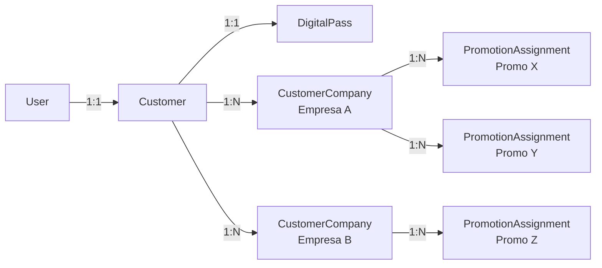
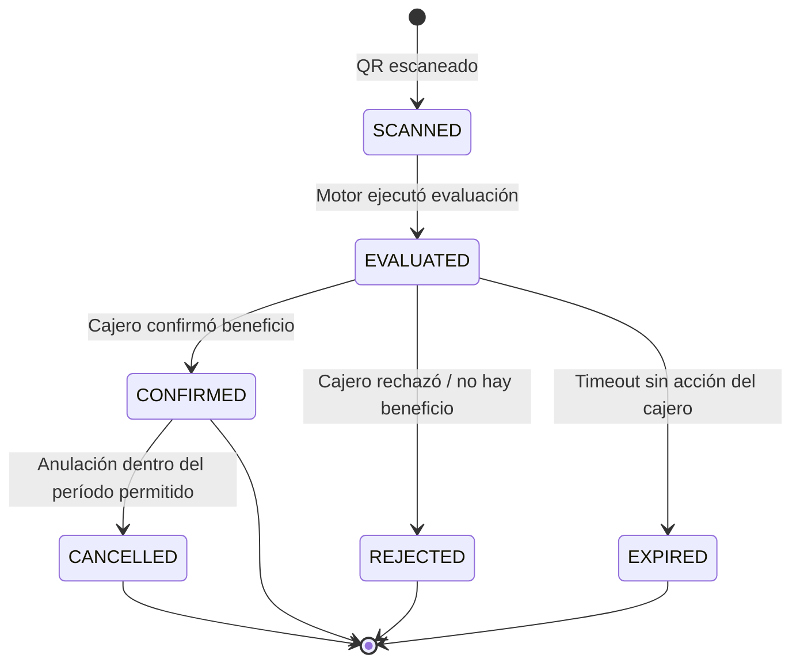
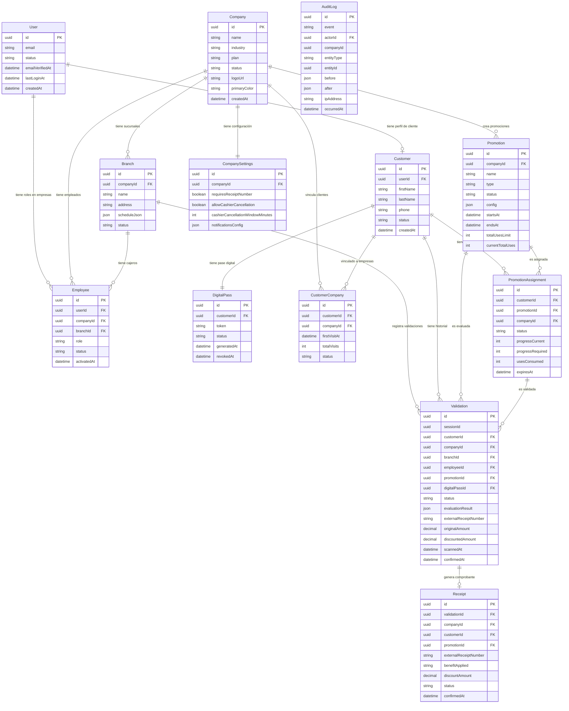
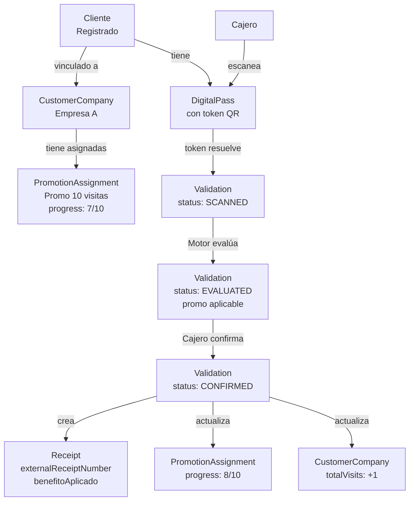
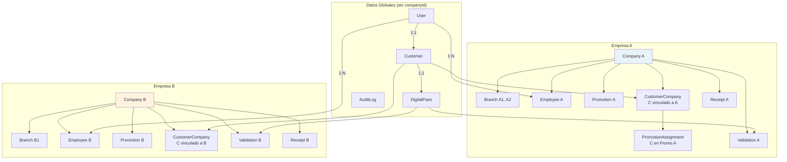
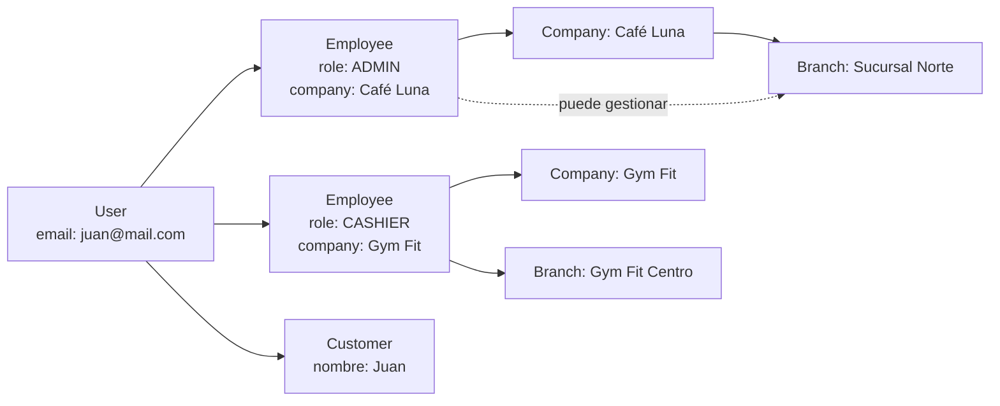

# DB-001 — Database Blueprint
# Modelo de Datos Oficial del MVP

**Documento:** DB-001
**Versión:** 1.0.0
**Estado:** Aprobado — Referencia Oficial de Base de Datos
**Fecha:** 2026-06-27
**Fase:** B — Arquitectura Técnica
**Clasificación:** Plano de Datos del Proyecto

---

> **ADVERTENCIA:** Este documento es el diseño oficial del modelo de datos. Todo lo que se implemente en `schema.prisma` debe seguir este diseño. Ningún modelo, campo, relación ni índice puede desviarse sin aprobación explícita documentada. Este documento no contiene código Prisma ni SQL. Describe entidades, relaciones, principios y decisiones de diseño.

---

## Tabla de Contenidos

1. [Filosofía del Modelo de Datos](#1-filosofía-del-modelo-de-datos)
2. [Entidades Principales del MVP](#2-entidades-principales-del-mvp)
3. [Multiempresa](#3-multiempresa)
4. [Usuarios y Roles](#4-usuarios-y-roles)
5. [Clientes](#5-clientes)
6. [Promociones](#6-promociones)
7. [Asignación de Promociones al Cliente](#7-asignación-de-promociones-al-cliente)
8. [Validación QR](#8-validación-qr)
9. [Comprobantes](#9-comprobantes)
10. [Auditoría](#10-auditoría)
11. [Estados Oficiales](#11-estados-oficiales)
12. [Relaciones — Diagramas](#12-relaciones--diagramas)
13. [Índices y Restricciones](#13-índices-y-restricciones)
14. [Seguridad desde los Datos](#14-seguridad-desde-los-datos)
15. [Preparación para Prisma](#15-preparación-para-prisma)
16. [Lo que NO Entra en el MVP](#16-lo-que-no-entra-en-el-mvp)
17. [Checklist de Implementación](#17-checklist-de-implementación)
18. [Autoauditoría](#18-autoauditoría)

---

## 1. Filosofía del Modelo de Datos

### 1.1 Declaración de Principios

El modelo de datos es el contrato más duradero del sistema. A diferencia del código, que puede refactorizarse, una decisión equivocada en el modelo de datos puede propagarse durante años y requerir migraciones complejas y costosas para corregirse. Por esta razón, el diseño del modelo parte de principios claros y no de intuiciones.

---

**Principio 1 — Simplicidad antes que exhaustividad**

El MVP debe persistir exactamente lo que necesita para funcionar, no lo que podría necesitar algún día. Cada campo que se agrega al modelo tiene un costo: debe mantenerse, documentarse, migrarse y testearse. Un campo que existe "por si acaso" en el MVP es deuda técnica con intereses.

La pregunta que guía cada decisión de campo es: "¿Qué funcionalidad del MVP requiere este dato hoy?" Si la respuesta es ninguna, el campo no existe en el MVP.

---

**Principio 2 — Multiempresa desde el primer día**

El modelo de datos no puede ser retrofitado para multiempresa después de que está en producción. El aislamiento entre empresas debe estar en la estructura desde el inicio, no como una capa de filtro encima de una base de datos de empresa única.

Esto significa que toda entidad que pertenezca a una empresa específica debe tener un campo `companyId` desde su creación. No como un campo opcional que "puede servir" — como un campo requerido sin el cual la entidad no puede existir.

---

**Principio 3 — Trazabilidad completa e inmutable**

El sistema administra beneficios económicos reales. Una empresa confía en que el historial de validaciones es correcto. Un cliente confía en que sus usos están registrados. Un administrador de PASE confía en que puede auditar cualquier operación.

Esto implica que ningún registro de validación, uso de promoción o cambio de estado puede eliminarse físicamente. Los registros se anulan o archivan, pero nunca se borran. La inmutabilidad no es una feature — es el modelo de datos.

---

**Principio 4 — Consistencia antes que flexibilidad**

Es preferible un modelo ligeramente más rígido que sea consistente a uno tan flexible que permita estados incoherentes. Los enumerados (enums) son mejores que strings libres para estados. Las claves foráneas son mejores que IDs sin relación formal. Las restricciones a nivel de base de datos son la última línea de defensa contra datos corruptos.

---

**Principio 5 — Separar identidad de pertenencia**

Un cliente es una persona real. Una empresa es una organización real. Su existencia en el sistema es independiente de su relación entre sí. El modelo refleja esto: un `Customer` existe aunque no esté vinculado a ninguna empresa. Una `Company` existe aunque no tenga clientes. La relación entre ellos es una entidad separada.

Esta separación permite que un cliente tenga múltiples empresas asociadas sin duplicar su identidad, y que una empresa tenga múltiples clientes sin acoplar su estructura a la del cliente.

---

**Principio 6 — Preparar el crecimiento sin anticiparlo**

La diferencia entre un modelo que puede crecer y uno sobrediseñado está en dónde se ponen los puntos de extensión. Un campo `metadata` de tipo JSON en la tabla de promociones no es sobrediseño — es el mecanismo que permite agregar atributos opcionales por tipo de promoción sin alterar el esquema. Una tabla separada para cada tipo de promoción, en cambio, es sobrediseño si el MVP solo necesita 10 tipos con una estructura común.

Los puntos de extensión correctos son deliberados y mínimos. No son "agregar JSON a todas las tablas" — son decisiones conscientes sobre dónde la variabilidad futura es predecible.

---

### 1.2 Lo que el Modelo No Es

**No es un modelo contable.** La plataforma no lleva contabilidad de la empresa. No registra ingresos, gastos, ni balances. El monto registrado en una validación es referencial, no contable.

**No es un inventario.** La plataforma no sabe qué productos tiene la empresa. No gestiona stock. No controla precios de catálogo. Los precios que aparecen en las promociones son configurados manualmente por la empresa.

**No es un CRM.** El perfil del cliente es mínimo. No hay segmentación avanzada, ni scoring de clientes, ni campos de comportamiento predictivo en el MVP.

**No es un sistema de facturación.** Los comprobantes internos de PASE no son facturas fiscales. Son registros de operación que se relacionan con facturas externas del sistema de la empresa.

---

## 2. Entidades Principales del MVP

### 2.1 Resumen de Entidades

| Entidad | Módulo | Propósito Central | En MVP |
|---------|--------|------------------|--------|
| `User` | Global | Identidad de autenticación | Sí |
| `Company` | Empresas | La organización que usa la plataforma | Sí |
| `Branch` | Empresas | Sucursal física de una empresa | Sí |
| `Employee` | Empresas | Persona que opera en nombre de una empresa | Sí |
| `Customer` | Clientes | Persona que usa el Pase Digital | Sí |
| `CustomerCompany` | Clientes | Relación cliente ↔ empresa | Sí |
| `DigitalPass` | Clientes | El Pase Digital QR del cliente | Sí |
| `Promotion` | Promociones | Definición de una promoción | Sí |
| `PromotionAssignment` | Promociones | Promoción asignada a un cliente | Sí |
| `Validation` | Validación QR | Evento de escaneo y evaluación | Sí |
| `Receipt` | Validación QR | Comprobante interno de una validación confirmada | Sí |
| `AuditLog` | Global | Registro inmutable de eventos del sistema | Sí |
| `CompanySettings` | Configuración | Configuración extendida de la empresa | Sí |
| `ReportSnapshot` | Reportes | Snapshot precalculado para reportes | Futuro (v1.5) |

---

### 2.2 Entidad: `User`

**Propósito:** Representa la identidad de autenticación de cualquier persona que accede a la plataforma, sin importar su rol.

**Responsabilidad:** Gestionar credenciales, sesiones, correo electrónico y estado de la cuenta. No tiene lógica de negocio propia — es solo el ancla de autenticación.

**Qué representa:**
- La cuenta de autenticación (gestionada principalmente por Supabase Auth)
- El correo electrónico como identificador único
- El estado de la cuenta (activo, suspendido, eliminado)
- La fecha del último inicio de sesión
- La fecha de verificación del correo

**Qué NO debe representar:**
- La empresa a la que pertenece (eso es `Employee`)
- El perfil de cliente (eso es `Customer`)
- El rol del usuario (el rol viene del contexto: si tiene un registro en `Employee`, es empleado; si tiene en `Customer`, es cliente)

**Relaciones principales:**
- `User` → `Employee` (uno a muchos: un usuario puede ser empleado en múltiples empresas, aunque en el MVP es uno a uno)
- `User` → `Customer` (uno a uno: un usuario puede tener un solo perfil de cliente)

**Campos representativos:**
- `id` — UUID
- `email` — único, verificado
- `emailVerifiedAt` — fecha de verificación
- `status` — ACTIVE | SUSPENDED | DELETED
- `createdAt`, `updatedAt`
- `lastLoginAt`

**Regla importante:** El `id` de `User` es el mismo `id` que Supabase Auth genera para ese usuario. No se crea un ID separado — se usa el ID de Supabase como clave primaria para mantener sincronía sin lookups adicionales.

---

### 2.3 Entidad: `Company`

**Propósito:** Representa una empresa que usa la plataforma para administrar sus promociones digitales.

**Responsabilidad:** Ser el contenedor principal del modelo multiempresa. Todo dato de negocio que pertenezca a una empresa (sucursales, empleados, promociones, validaciones) referencia esta entidad.

**Qué representa:**
- La identidad comercial de la organización
- Su estado en el ciclo de vida (pre-registro, activa, suspendida, etc.)
- Su plan de suscripción
- Su configuración básica (nombre, industria, país, ciudad)
- Su identidad visual básica (logotipo, color principal)

**Qué NO debe representar:**
- Sus empleados (eso es `Employee`)
- Sus sucursales (eso es `Branch`)
- Sus promociones (eso es `Promotion`)
- Sus clientes (eso es `CustomerCompany`)
- Información fiscal detallada (fuera del MVP)

**Relaciones principales:**
- `Company` → `Branch` (uno a muchos)
- `Company` → `Employee` (uno a muchos)
- `Company` → `Promotion` (uno a muchos)
- `Company` → `CustomerCompany` (uno a muchos)
- `Company` → `CompanySettings` (uno a uno)
- `Company` → `Validation` (uno a muchos)

**Campos representativos:**
- `id` — UUID
- `name` — nombre comercial
- `industry` — enum de industria
- `country`, `city`
- `phone`, `email`
- `logoUrl` — URL en Supabase Storage
- `primaryColor` — hex string
- `plan` — STARTER | GROWTH | BUSINESS | ENTERPRISE
- `status` — ver estados en Sección 11
- `createdAt`, `updatedAt`

---

### 2.4 Entidad: `Branch`

**Propósito:** Representa una sucursal física de una empresa.

**Responsabilidad:** Proveer el contexto de ubicación para cada validación. Cuando un cajero valida un QR, el sistema registra en qué sucursal ocurrió esa validación.

**Qué representa:**
- Una ubicación física donde opera la empresa
- Sus horarios de operación
- Su estado (activa, inactiva)
- Su nombre interno para identificación

**Qué NO debe representar:**
- La empresa completa (solo referencia a `Company`)
- Los empleados asignados (eso es `Employee.branchId`)
- Las promociones específicas de esa sucursal (en el MVP, las promociones aplican a nivel empresa; la restricción por sucursal se define en `Promotion`)

**Relaciones principales:**
- `Branch` → `Company` (muchos a uno)
- `Branch` → `Employee` (uno a muchos, un empleado tiene sucursal asignada)
- `Branch` → `Validation` (uno a muchos)

**Campos representativos:**
- `id` — UUID
- `companyId` — FK a Company
- `name`
- `address`
- `scheduleJson` — JSON con horarios (mañana/tarde, días de la semana)
- `status` — ACTIVE | INACTIVE
- `createdAt`, `updatedAt`

**Regla:** El `scheduleJson` es un JSON porque los horarios son una estructura semi-estructurada que no justifica una tabla separada en el MVP. Es un punto de extensión controlado.

---

### 2.5 Entidad: `Employee`

**Propósito:** Representa la membresía de un usuario dentro de una empresa, en un rol específico.

**Responsabilidad:** Conectar un `User` con una `Company`, asignarle un rol operativo y restringir su acceso a una sucursal específica.

**Qué representa:**
- La relación de trabajo entre un usuario y una empresa
- El rol operativo de ese usuario en esa empresa (ADMIN, MANAGER, CASHIER)
- La sucursal a la que está asignado
- El estado de esa relación (activo, inactivo)

**Qué NO debe representar:**
- Los datos personales del empleado (nombre, foto — esos están en `User`)
- El historial de acciones del empleado (eso es `AuditLog`)
- Los turnos o asistencia (fuera del MVP)

**Relaciones principales:**
- `Employee` → `User` (muchos a uno)
- `Employee` → `Company` (muchos a uno)
- `Employee` → `Branch` (muchos a uno, opcional para Admin)
- `Employee` → `Validation` (uno a muchos — las validaciones que realizó)

**Campos representativos:**
- `id` — UUID
- `userId` — FK a User
- `companyId` — FK a Company
- `branchId` — FK a Branch (nullable para Administrador que no está atado a una sucursal)
- `role` — ADMIN | MANAGER | CASHIER
- `status` — ACTIVE | INACTIVE | PENDING_ACTIVATION
- `invitedAt`
- `activatedAt`
- `createdAt`, `updatedAt`

**Regla importante:** La combinación `(userId, companyId)` debe ser única. Un usuario no puede tener dos roles en la misma empresa.

---

### 2.6 Entidad: `Customer`

**Propósito:** Representa el perfil de cliente de una persona en la plataforma.

**Responsabilidad:** Contener los datos de perfil del cliente y ser el punto de entrada para todo lo relacionado con sus beneficios, su Pase Digital y su historial.

**Qué representa:**
- El perfil público del cliente (nombre, foto, teléfono opcional)
- Su estado en la plataforma
- Su fecha de registro
- Su vinculación con su cuenta de autenticación

**Qué NO debe representar:**
- Sus credenciales de autenticación (eso es `User`)
- Su Pase Digital (eso es `DigitalPass`)
- Sus promociones asignadas (eso es `PromotionAssignment`)
- Sus validaciones (eso es `Validation`)
- Su relación con empresas específicas (eso es `CustomerCompany`)

**Relaciones principales:**
- `Customer` → `User` (uno a uno)
- `Customer` → `DigitalPass` (uno a uno)
- `Customer` → `CustomerCompany` (uno a muchos)
- `Customer` → `PromotionAssignment` (uno a muchos)
- `Customer` → `Validation` (uno a muchos)

**Campos representativos:**
- `id` — UUID
- `userId` — FK a User, único
- `firstName`, `lastName`
- `phone` — opcional
- `avatarUrl` — opcional
- `status` — ANONYMOUS | PENDING_VERIFICATION | ACTIVE | INACTIVE | DELETED | ARCHIVED
- `createdAt`, `updatedAt`

---

### 2.7 Entidad: `CustomerCompany`

**Propósito:** Representa la relación entre un cliente y una empresa. Es la entidad que registra que un cliente "pertenece" o está vinculado a un negocio específico.

**Responsabilidad:** Esta entidad es la que permite que un cliente esté asociado a múltiples empresas sin duplicar su perfil. También registra el historial de esa relación: cuándo fue la primera visita, cuántas visitas ha tenido, si sigue activo en esa empresa.

**Qué representa:**
- El vínculo entre un `Customer` y una `Company`
- La fecha de la primera visita a esa empresa (primera validación)
- El número total de visitas registradas en esa empresa
- El estado de la relación (activa, inactiva)

**Qué NO debe representar:**
- Las promociones que tiene en esa empresa (eso es `PromotionAssignment`)
- Las validaciones específicas (eso es `Validation`)

**Relaciones principales:**
- `CustomerCompany` → `Customer` (muchos a uno)
- `CustomerCompany` → `Company` (muchos a uno)

**Campos representativos:**
- `id` — UUID
- `customerId` — FK a Customer
- `companyId` — FK a Company
- `firstVisitAt` — timestamp de la primera validación
- `totalVisits` — contador desnormalizado para performance
- `status` — ACTIVE | INACTIVE
- `createdAt`, `updatedAt`

**Regla:** La combinación `(customerId, companyId)` debe ser única. Un cliente no puede tener dos registros de vinculación con la misma empresa.

**Nota sobre el contador desnormalizado:** `totalVisits` es un entero que se incrementa en cada validación confirmada. Es un dato derivado (podría calcularse desde `Validation`) pero se guarda directamente porque es consultado frecuentemente en reportes y en el motor de elegibilidad (para reglas de "X visitas mínimas"). La contra-trade es que debe mantenerse consistente — se actualiza en la misma transacción que confirma la validación.

---

### 2.8 Entidad: `DigitalPass`

**Propósito:** Representa el Pase Digital QR de un cliente. Es el artefacto físico-digital que el cliente presenta en el negocio.

**Responsabilidad:** Contener el token opaco que es codificado en el QR, gestionar su vigencia y registrar cuándo fue generado o regenerado.

**Qué representa:**
- El token QR opaco y único del cliente
- El estado del pase (activo, revocado)
- La fecha de generación
- La fecha de expiración del token (si aplica)

**Qué NO debe representar:**
- Las promociones del cliente (el QR no contiene promociones)
- Los datos personales del cliente (el QR solo tiene un token opaco)
- El historial de validaciones

**Relaciones principales:**
- `DigitalPass` → `Customer` (uno a uno)

**Campos representativos:**
- `id` — UUID
- `customerId` — FK a Customer, único
- `token` — string único, opaco, generado criptográficamente (no derivado de datos personales)
- `status` — ACTIVE | REVOKED
- `generatedAt`
- `revokedAt` — nullable, timestamp de cuando fue revocado
- `createdAt`, `updatedAt`

**Regla crítica:** El campo `token` es el que se codifica en el QR. Nunca es el `id` del cliente, nunca contiene datos personales, nunca contiene información sobre promociones. Es una cadena aleatoria de 32 caracteres. Cuando el cliente regenera su QR, el registro anterior pasa a REVOKED y se crea uno nuevo con un token diferente.

**Índice crítico:** `token` debe tener un índice único. Es el campo más consultado de todo el sistema — cada escaneo de QR lo busca primero.

---

### 2.9 Entidad: `Promotion`

**Propósito:** Define una promoción creada por una empresa. Contiene todas las reglas y configuraciones que determinan cómo funciona esa promoción.

**Responsabilidad:** Ser la fuente de verdad sobre qué es la promoción: su tipo, su beneficio, su vigencia, sus límites y sus restricciones.

Descripción completa en la Sección 6.

---

### 2.10 Entidad: `PromotionAssignment`

**Propósito:** Representa que un cliente tiene asignada una promoción. Es el estado de progreso de un cliente en una promoción específica.

Descripción completa en la Sección 7.

---

### 2.11 Entidad: `Validation`

**Propósito:** Registra cada evento de escaneo de QR con su resultado. Es el corazón del historial operativo del sistema.

Descripción completa en la Sección 8.

---

### 2.12 Entidad: `Receipt`

**Propósito:** Registra el comprobante interno generado cuando una validación es confirmada y un beneficio es aplicado.

Descripción completa en la Sección 9.

---

### 2.13 Entidad: `AuditLog`

**Propósito:** Registro inmutable de todos los eventos relevantes del sistema para auditoría, debugging y seguridad.

Descripción completa en la Sección 10.

---

### 2.14 Entidad: `CompanySettings`

**Propósito:** Almacena configuración extendida de la empresa que no cabe en los campos principales de `Company` sin saturar esa tabla.

**Responsabilidad:** Centralizar configuraciones opcionales, preferencias y metadatos extendidos de la empresa en una estructura de uno a uno con `Company`.

**Qué representa:**
- Configuración de validación (requiere siempre factura, permite anulación en X minutos)
- Configuración de notificaciones (qué correos se envían a qué eventos)
- Configuración de branding (color secundario, si en el futuro se expande)
- Límites operativos personalizados si en el futuro se permiten overrides del plan

**Qué NO debe representar:**
- Los datos de identidad de la empresa (eso es `Company`)
- Sus sucursales, empleados o promociones

**Relaciones:**
- `CompanySettings` → `Company` (uno a uno)

**Campos representativos:**
- `id` — UUID
- `companyId` — FK a Company, único
- `requiresReceiptNumber` — boolean (¿siempre es obligatorio el número de factura?)
- `allowCashierCancellation` — boolean
- `cashierCancellationWindowMinutes` — integer
- `notificationsConfig` — JSON (configuración de correos)
- `createdAt`, `updatedAt`

**Razón del JSON para notificaciones:** La configuración de notificaciones es un conjunto de flags booleanos y opciones que en el MVP no tiene operaciones de consulta individual. Se agrupa en JSON para simplicidad. Si en v1.1 se necesita filtrar por tipo de notificación, se normaliza en ese momento.

---

### 2.15 Entidad: `ReportSnapshot` (Diferida a v1.5)

**Propósito futuro:** Almacenar snapshots precalculados de reportes para empresas con alto volumen de validaciones, evitando consultas agregadas pesadas en tiempo real.

**Por qué está fuera del MVP:** Los reportes del MVP se calculan en tiempo real con consultas directas sobre `Validation`. Para el volumen esperado del MVP (cientos de validaciones diarias por empresa), las consultas directas son suficientemente rápidas. Los snapshots agregan complejidad de sincronización (¿cuándo se regeneran? ¿cuánto tiempo son válidos?) que no se justifica hasta que el volumen lo requiera.

---

## 3. Multiempresa

### 3.1 El Principio del `companyId` Obligatorio

El aislamiento multiempresa se implementa a nivel de datos, no solo a nivel de aplicación. Toda entidad que pertenece a una empresa específica tiene `companyId` como campo requerido, nunca nullable.

Esta decisión hace que sea imposible (por restricciones de base de datos) insertar un registro de negocio sin asociarlo a una empresa. No existe la situación donde una validación, una promoción o un empleado "existe" sin empresa.

---

### 3.2 Entidades con `companyId` (Datos de Negocio)

| Entidad | companyId | Razón |
|---------|-----------|-------|
| `Branch` | Obligatorio | Las sucursales pertenecen a una empresa |
| `Employee` | Obligatorio | El empleado opera en nombre de una empresa |
| `Promotion` | Obligatorio | Las promociones son creadas por una empresa |
| `Validation` | Obligatorio | Las validaciones ocurren en el contexto de una empresa |
| `Receipt` | Obligatorio | Los comprobantes son de una empresa |
| `CustomerCompany` | Obligatorio | El vínculo cliente-empresa define el tenant |
| `CompanySettings` | Obligatorio | Es la configuración de una empresa específica |

---

### 3.3 Entidades sin `companyId` (Datos Globales)

| Entidad | Razón de la ausencia |
|---------|---------------------|
| `User` | Es una identidad global de autenticación, no pertenece a ningún tenant |
| `Customer` | Un cliente es una persona de la plataforma, no de una empresa. Su relación con empresas es a través de `CustomerCompany` |
| `DigitalPass` | El pase pertenece al cliente, no a la empresa |
| `AuditLog` | El log de auditoría es del sistema, no de un tenant (aunque registra el companyId del contexto en su metadata) |

---

### 3.4 Cómo se Previene el Acceso Cruzado

El aislamiento opera en tres niveles:

**Nivel 1 — Aplicación (primera defensa):**
El middleware extrae el `companyId` del JWT y lo inyecta en el contexto. Cada query de Prisma que toca datos de empresa incluye `where: { companyId: contextCompanyId }`. Si el desarrollador olvida este filtro, la segunda defensa lo captura.

**Nivel 2 — Row Level Security en Supabase (segunda defensa):**
PostgreSQL tiene políticas RLS que verifican que el usuario autenticado tiene acceso al `companyId` de cada fila. Incluso si la aplicación envía una query sin el filtro de empresa, la base de datos la rechaza.

**Nivel 3 — Restricciones de clave foránea (tercera defensa):**
Un registro con `companyId` solo puede existir si ese `companyId` apunta a una empresa real en la tabla `Company`. No se puede insertar un registro con un `companyId` fabricado.

---

### 3.5 Cómo se Relaciona un Cliente con Varias Empresas

Un `Customer` es una entidad global — existe una sola vez en la tabla de clientes. Su relación con cada empresa es a través de la tabla `CustomerCompany`, que actúa como la tabla de unión de la relación muchos-a-muchos entre clientes y empresas.

```
Customer (1) ─── (∞) CustomerCompany (∞) ─── (1) Company
```

Cuando un cliente es validado por primera vez en una empresa, el sistema crea automáticamente un registro en `CustomerCompany` con `firstVisitAt` igual al momento de la primera validación. En validaciones posteriores, ese registro ya existe y solo se actualiza `totalVisits`.

La separación entre `Customer` y `CustomerCompany` garantiza que:
- El cliente puede ser eliminado de una empresa (`CustomerCompany.status = INACTIVE`) sin afectar su perfil global
- Los datos del cliente (nombre, correo) son propiedad del cliente, no de la empresa
- Una empresa puede ver cuántas visitas tuvo un cliente sin acceder a sus datos en otras empresas

---

### 3.6 Cómo Funcionan los Empleados por Empresa

Un `Employee` es la encarnación de un `User` dentro de una `Company`. El mismo usuario puede, en teoría, ser empleado de múltiples empresas (por ejemplo, una persona que trabaja para dos negocios diferentes). Cada relación es un registro separado en `Employee`.

En el MVP, el caso de uso normal es un usuario = un empleado en una empresa. La arquitectura soporta el caso de múltiples empresas sin que el MVP tenga que gestionar activamente ese escenario.

El aislamiento se garantiza por la combinación `(userId, companyId)` única en `Employee`. No existen permisos globales para empleados — sus permisos son siempre relativos a una empresa y una sucursal.

---

### 3.7 Cómo Funcionan las Sucursales

Una `Branch` pertenece a exactamente una `Company`. Un `Employee` está asignado a exactamente una `Branch` (excepto el Administrador, que puede no tener sucursal asignada o estar asignado a una "sede principal").

Las validaciones siempre registran la sucursal donde ocurrieron. Si una empresa tiene 3 sucursales, puede filtrar su historial de validaciones por sucursal usando el `branchId` en la tabla `Validation`.

---

## 4. Usuarios y Roles

### 4.1 Arquitectura de Identidad

El sistema tiene dos tipos de usuario fundamentalmente diferentes que se autentican por el mismo mecanismo (Supabase Auth) pero acceden a portales distintos y tienen modelos de datos distintos:

**Tipo 1 — Usuarios del lado empresa:**
Son personas que operan en nombre de una empresa. Su identidad de negocio está en `Employee`. Un `User` de este tipo tiene uno o más registros en `Employee`.

**Tipo 2 — Usuarios del lado cliente:**
Son personas que usan el Pase Digital para obtener beneficios. Su identidad de negocio está en `Customer`. Un `User` de este tipo tiene exactamente un registro en `Customer`.

**Tipo 3 — Superadmin de PASE:**
Son miembros del equipo interno de PASE. No tienen registro en `Employee` ni en `Customer`. Su acceso al panel de administración se controla por un claim en el JWT de Supabase (`role: 'superadmin'`) y opcionalmente una tabla `PaseAdmin` separada.

---

### 4.2 Representación de Roles

Los roles no viven en la tabla `User`. Viven en la tabla `Employee` como el campo `role`. Esta decisión es importante: un usuario puede ser `CASHIER` en la empresa A y `MANAGER` en la empresa B (dos registros en `Employee` con diferentes roles).

| Rol | Tabla | Descripción |
|-----|-------|-------------|
| `SUPERADMIN` | Claim en JWT | Equipo interno de PASE, acceso cruzado a todo |
| `ADMIN` | `Employee.role` | Administrador de una empresa específica |
| `MANAGER` | `Employee.role` | Gerente de una sucursal específica |
| `CASHIER` | `Employee.role` | Cajero de una sucursal específica |
| (cliente) | `Customer` | No tiene rol explícito — su acceso es al portal de cliente |

---

### 4.3 ¿Un Usuario Puede Tener Más de un Rol?

Sí, con restricciones:

- Un usuario puede ser empleado (tipo empresa) en una empresa y cliente (tipo cliente) al mismo tiempo. Esto es normal: la dueña de una cafetería puede usar PASE como cliente en otro negocio.
- Un usuario puede ser empleado en múltiples empresas (registros separados en `Employee`).
- Un usuario NO puede tener dos roles distintos dentro de la misma empresa. La combinación `(userId, companyId)` es única en `Employee`.

---

### 4.4 Cómo se Relaciona un Usuario con una Empresa

```
User (id) ──FK──> Employee (userId, companyId, role, branchId)
                        │
                        └──FK──> Company (id)
                        │
                        └──FK──> Branch (id)
```

El usuario accede a la plataforma y el middleware verifica su JWT. Del JWT extrae el `userId`. Busca en `Employee` el registro `{ userId, status: ACTIVE }` para obtener el `companyId` y el `role`. Con ese contexto, todas las queries tienen el filtro de empresa correcto.

---

### 4.5 Cómo se Evita que un Empleado Acceda a Otra Empresa

El `companyId` que filtra los datos no viene nunca de la URL ni del body de la solicitud. Viene exclusivamente del registro `Employee` vinculado al `userId` en el JWT. Si un empleado malintencionado modifica la URL para poner un `companyId` diferente, el sistema lo ignora — siempre usa el `companyId` del registro de empleado.

Para un empleado con registros en múltiples empresas (caso raro en el MVP), el sistema debe saber "cuál empresa estás usando ahora". En el MVP, si un usuario tiene múltiples registros activos en `Employee`, el sistema muestra un selector de empresa al iniciar sesión. Esto es un flujo excepcional que no necesita diseño elaborado en el MVP.

---

## 5. Clientes

### 5.1 Un Cliente, Múltiples Empresas

El modelo de clientes separa explícitamente tres capas:

**Capa 1 — Identidad:** `User` + `Customer`. Existe una sola vez en el sistema. Representa a la persona real.

**Capa 2 — Relación:** `CustomerCompany`. Existe una vez por cada empresa donde el cliente ha sido validado. Representa el vínculo con un negocio específico.

**Capa 3 — Beneficios:** `PromotionAssignment`. Existe una vez por cada promoción que el cliente tiene activa. Representa el estado de progreso del cliente en esa promoción.



---

### 5.2 El Pase Digital QR

El `DigitalPass` es una entidad separada de `Customer` por una razón de diseño importante: el Pase Digital tiene su propio ciclo de vida. Puede ser revocado y regenerado sin afectar al cliente. Si el token QR fuera un campo en `Customer`, la regeneración requeriría historial adicional de tokens anteriores. Con `DigitalPass` como entidad separada, el historial de tokens es automático: cada `DigitalPass` tiene su fecha de generación y su estado.

**Flujo del token QR:**
1. Cliente se registra → se crea automáticamente un `DigitalPass` con un token nuevo
2. Cliente solicita nuevo QR → el `DigitalPass` actual pasa a REVOKED, se crea uno nuevo
3. El sistema de validación busca el token en `DigitalPass` → si encuentra el token y está ACTIVE, la validación puede continuar
4. Si el token es REVOKED, la validación falla con `QR_REVOKED`

---

### 5.3 Relación Cliente → Empresa → Promociones → Validaciones

El recorrido completo de un cliente a través del sistema:

```
Customer
  │
  ├── DigitalPass (1 activo a la vez)
  │       └── token → usado en escaneos
  │
  ├── CustomerCompany → Company (vinculación por primera validación)
  │       ├── firstVisitAt
  │       └── totalVisits
  │
  ├── PromotionAssignment → Promotion → Company
  │       ├── status, usesRemaining, progress
  │       └── createdAt, expiresAt
  │
  └── Validation → Company → Branch → Employee
          ├── Escaneo registrado
          └── Receipt (si fue confirmada)
```

---

## 6. Promociones

### 6.1 Una Tabla para Todos los Tipos

El diseño usa una única tabla `Promotion` para todos los tipos de promoción. La alternativa — una tabla por tipo — crearía 10 tablas con estructura similar y haría que el Motor de Elegibilidad necesite consultar 10 tablas en cada validación. Esto es sobreingeniería para el MVP.

La variabilidad entre tipos de promoción se maneja mediante:
- El campo `type` (enum) que define el tipo
- El campo `config` (JSON) que contiene la configuración específica del tipo
- Campos comunes que aplican a todos los tipos (vigencia, límites, estado)

---

### 6.2 Campos Universales (Aplican a Todos los Tipos)

Estos campos existen sin importar el tipo de promoción:

| Campo | Tipo | Descripción |
|-------|------|-------------|
| `id` | UUID | Identificador único |
| `companyId` | UUID | FK a Company |
| `name` | string | Nombre visible de la promoción |
| `description` | string | Descripción para el cliente |
| `type` | enum | Tipo de promoción (ver tabla debajo) |
| `status` | enum | Estado en el ciclo de vida |
| `startsAt` | datetime | Inicio de vigencia |
| `endsAt` | datetime | Fin de vigencia |
| `totalUsesLimit` | integer? | Límite total de usos (null = ilimitado) |
| `usesPerCustomerLimit` | integer? | Límite de usos por cliente (null = ilimitado) |
| `usesPerCustomerPeriod` | enum? | Período del límite: DAY / WEEK / MONTH / TOTAL |
| `currentTotalUses` | integer | Contador desnormalizado de usos totales |
| `requiresBranchIds` | UUID[]? | Si está limitada a sucursales específicas |
| `requiresMinimumAmount` | decimal? | Monto mínimo de compra requerido |
| `terms` | string? | Términos y condiciones (opcional en MVP) |
| `config` | JSON | Configuración específica del tipo (ver 6.3) |
| `createdAt` | datetime | |
| `updatedAt` | datetime | |
| `publishedAt` | datetime? | Cuando fue publicada por primera vez |
| `archivedAt` | datetime? | Cuando fue archivada |

---

### 6.3 El Campo `config` por Tipo de Promoción

El campo `config` es un JSON que varía según el `type`. Para cada tipo, se define qué esperar en ese JSON:

| Tipo | Contenido del `config` |
|------|------------------------|
| `DISCOUNT_PERCENTAGE` | `{ percentage: 15 }` |
| `DISCOUNT_FIXED` | `{ amount: 5.00, currency: "USD" }` |
| `FREE_PRODUCT` | `{ productName: "Café mediano", productDescription: "..." }` |
| `VISIT_ACCUMULATION` | `{ requiredVisits: 10, rewardType: "FREE_PRODUCT", rewardDescription: "1 café gratis" }` |
| `AMOUNT_ACCUMULATION` | `{ amountPerCredit: 10.00, creditsRequired: 20, rewardDescription: "..." }` |
| `MEMBERSHIP` | `{ price: 25.00, durationDays: 30, benefits: ["..."] }` |
| `SINGLE_USE_COUPON` | `{ benefitType: "DISCOUNT_PERCENTAGE", benefitValue: 20 }` |
| `MULTI_USE_COUPON` | `{ benefitType: "DISCOUNT_FIXED", benefitValue: 3.00, maxUses: 100 }` |
| `TIME_LIMITED_OFFER` | `{ discountPercentage: 20, applicableHoursStart: "14:00", applicableHoursEnd: "18:00" }` |

**Por qué JSON y no campos normalizados:**
La configuración varía completamente entre tipos. Normalizar cada variante requeriría un modelo complejo con tablas por tipo o campos opcionales masivos. El JSON es la solución correcta cuando: (a) los datos son consultados como unidad, no campo a campo, y (b) la variabilidad es alta. Ambas condiciones se cumplen aquí.

**Validación del JSON:** La validación de que el `config` tiene la estructura correcta para su `type` se hace en la capa de aplicación (Zod), no en la base de datos. La base de datos garantiza que `config` es JSON válido; la aplicación garantiza que es el JSON correcto para ese tipo.

---

### 6.4 Tipos de Promoción del MVP

| Enum Value | Descripción |
|------------|-------------|
| `DISCOUNT_PERCENTAGE` | Descuento porcentual directo |
| `DISCOUNT_FIXED` | Descuento de monto fijo |
| `FREE_PRODUCT` | Producto o servicio gratis |
| `VISIT_ACCUMULATION` | Acumula visitas, canjea al llegar al objetivo |
| `AMOUNT_ACCUMULATION` | Acumula por monto de compra, canjea al llegar al objetivo |
| `MEMBERSHIP` | Plan de membresía con beneficios durante un período |
| `SINGLE_USE_COUPON` | Cupón de un solo uso |
| `MULTI_USE_COUPON` | Cupón de múltiples usos (con límite total) |
| `TIME_LIMITED_OFFER` | Descuento válido en horario específico |

---

### 6.5 Compatibilidad Futura

El modelo de `Promotion` está diseñado para soportar tipos adicionales sin modificar la estructura. Agregar un nuevo tipo en v1.1 requiere:
1. Agregar el valor al enum `PromotionType`
2. Agregar la validación del `config` correspondiente en la aplicación
3. Agregar el caso en el Motor de Elegibilidad

La tabla `Promotion` no requiere migraciones de schema para nuevos tipos.

---

## 7. Asignación de Promociones al Cliente

### 7.1 Propósito de `PromotionAssignment`

La `PromotionAssignment` es el registro de que un cliente tiene (o tuvo) una promoción específica. Es la entidad que responde a la pregunta: "¿Qué ha ganado o está progresando este cliente en esta promoción?"

Existen dos casos distintos en cómo se crea una `PromotionAssignment`:

**Caso A — Asignación automática:** Para promociones disponibles públicamente (descuentos directos, cupones), la `PromotionAssignment` se crea en el momento de la primera validación. No existe previamente.

**Caso B — Asignación explícita por pago (membresías):** Para membresías con precio, la `PromotionAssignment` se crea cuando el cliente confirma el pago. Tiene un estado `PENDING_PAYMENT` hasta que el pago es confirmado.

---

### 7.2 Campos de `PromotionAssignment`

| Campo | Tipo | Descripción |
|-------|------|-------------|
| `id` | UUID | Identificador único |
| `customerId` | UUID | FK a Customer |
| `promotionId` | UUID | FK a Promotion |
| `companyId` | UUID | FK a Company (desnormalizado para performance) |
| `status` | enum | Estado de la asignación |
| `usesRemaining` | integer? | Usos restantes (null para acumulaciones sin límite fijo) |
| `usesConsumed` | integer | Cuántos usos ha realizado |
| `progressCurrent` | integer | Progreso actual (visitas acumuladas o créditos) |
| `progressRequired` | integer? | Cuánto se necesita para completar (copiado de config al asignar) |
| `validFrom` | datetime | Inicio de validez de la asignación |
| `expiresAt` | datetime? | Cuándo expira la asignación |
| `paymentConfirmedAt` | datetime? | Para membresías con pago |
| `completedAt` | datetime? | Para acumulaciones: cuándo completó el objetivo |
| `createdAt` | datetime | |
| `updatedAt` | datetime | |

**Nota sobre `companyId` desnormalizado:** Aunque `companyId` puede derivarse a través de `Promotion.companyId`, se guarda directamente en `PromotionAssignment` para que el motor de elegibilidad pueda filtrar las asignaciones de un cliente para una empresa específica con un solo campo de filtro, sin JOIN adicional.

---

### 7.3 Estados de `PromotionAssignment`

| Estado | Descripción |
|--------|-------------|
| `PENDING_PAYMENT` | Membresía creada, esperando confirmación de pago |
| `ACTIVE` | Promoción disponible para ser usada |
| `COMPLETED` | Acumulación completada, beneficio pendiente de canje |
| `USED` | Beneficio ya fue canjeado o la promoción fue completamente usada |
| `EXPIRED` | La fecha de expiración pasó sin completarse |
| `CANCELLED` | Cancelada manualmente (por el admin o el cliente) |
| `BLOCKED` | Bloqueada temporalmente por actividad sospechosa |

---

### 7.4 Cómo Funciona el Progreso en Acumulaciones

Para `VISIT_ACCUMULATION` y `AMOUNT_ACCUMULATION`, los campos `progressCurrent` y `progressRequired` funcionan así:

- Al crear la asignación: `progressCurrent = 0`, `progressRequired` se copia del `config` de la promoción
- Cada validación confirmada incrementa `progressCurrent` en la misma transacción
- Cuando `progressCurrent >= progressRequired`, el estado cambia a `COMPLETED`
- Cuando el empleado aplica el beneficio completado, el estado cambia a `USED` y se puede iniciar una nueva asignación si la promoción lo permite

---

## 8. Validación QR

### 8.1 Propósito y Diseño de `Validation`

La `Validation` registra cada evento de escaneo de QR. Es el registro más frecuentemente creado en el sistema y el más crítico para la integridad del negocio.

**Principio fundamental:** La `Validation` se crea cuando el cajero ESCANEA el QR, no cuando confirma. El escaneo registra la evaluación. La confirmación transforma la validación en una `Receipt`. Esto garantiza que incluso si el cajero escanea y no confirma (cliente se arrepiente, error del sistema), el evento de evaluación quedó registrado.

---

### 8.2 Estados del Flujo de Validación



---

### 8.3 Campos de `Validation`

| Campo | Tipo | Descripción |
|-------|------|-------------|
| `id` | UUID | Identificador único |
| `sessionId` | UUID | ID de sesión de escaneo (para idempotencia) |
| `customerId` | UUID | FK a Customer |
| `companyId` | UUID | FK a Company |
| `branchId` | UUID | FK a Branch |
| `employeeId` | UUID | FK a Employee (el cajero) |
| `digitalPassId` | UUID | FK a DigitalPass (cuál token fue escaneado) |
| `promotionId` | UUID? | FK a Promotion (nullable si no hubo beneficio aplicable) |
| `assignmentId` | UUID? | FK a PromotionAssignment (nullable si no había asignación previa) |
| `status` | enum | SCANNED → EVALUATED → CONFIRMED / REJECTED / EXPIRED / CANCELLED |
| `evaluationResult` | JSON | Qué promociones fueron evaluadas, cuáles aplican y por qué |
| `rejectionCode` | string? | Código de rechazo si no aplica ninguna promoción |
| `externalReceiptNumber` | string? | Número de factura del sistema externo de la empresa |
| `originalAmount` | decimal? | Monto original de la venta |
| `discountedAmount` | decimal? | Monto descontado |
| `finalAmount` | decimal? | Monto final pagado |
| `notes` | string? | Observaciones del cajero |
| `scannedAt` | datetime | Momento del escaneo |
| `confirmedAt` | datetime? | Momento de la confirmación |
| `cancelledAt` | datetime? | Momento de la anulación |
| `cancelledByEmployeeId` | UUID? | Quién anuló |
| `cancellationReason` | string? | Motivo de anulación |
| `createdAt` | datetime | |
| `updatedAt` | datetime | |

---

### 8.4 El `sessionId` para Idempotencia

El `sessionId` es un UUID generado por el cliente (el navegador del cajero) al abrir la pantalla de escaneo. Es único por sesión de escaneo. Si el cajero hace clic en confirmar dos veces (por latencia de red o doble clic), el servidor verifica si ya existe un `Validation` con ese `sessionId` en estado CONFIRMED. Si existe, devuelve la confirmación sin crear un duplicado.

**Restricción:** El campo `sessionId` tiene un índice único. No pueden existir dos `Validation` con el mismo `sessionId`.

---

### 8.5 El Campo `evaluationResult`

El `evaluationResult` es un JSON que guarda una fotografía del estado al momento de la evaluación:

```json
{
  "promotionsEvaluated": 3,
  "promotionsApplicable": [
    {
      "promotionId": "...",
      "promotionName": "10ma visita gratis",
      "eligibilityReason": "VISIT_COUNT_MET",
      "benefitDescription": "Café mediano gratis"
    }
  ],
  "promotionsRejected": [
    {
      "promotionId": "...",
      "rejectionCode": "PROMO_EXHAUSTED"
    }
  ]
}
```

Este campo sirve como evidencia inmutable de la lógica que se ejecutó en el momento de la validación, independientemente de cambios posteriores en las promociones.

---

## 9. Comprobantes

### 9.1 Propósito de `Receipt`

El `Receipt` es el comprobante interno de PASE que se genera cuando una validación es CONFIRMADA. Existe solo cuando hay una acción real que registrar.

**Distinción importante:**
- La **factura fiscal** la genera el sistema externo de la empresa (su caja, su POS). PASE no la emite.
- El **comprobante interno** es el registro que PASE genera de que un beneficio fue aplicado. Referencia la factura externa por número.

Separar `Validation` de `Receipt` permite que el historial de escaneos (incluyendo los que no resultaron en beneficio) sea independiente del historial de comprobantes (los que sí resultaron en beneficio). Los reportes de la empresa generalmente quieren ver solo los `Receipts`, no todos los `Validations`.

---

### 9.2 Campos de `Receipt`

| Campo | Tipo | Descripción |
|-------|------|-------------|
| `id` | UUID | Identificador único |
| `validationId` | UUID | FK a Validation (único — un solo comprobante por validación) |
| `companyId` | UUID | FK a Company |
| `branchId` | UUID | FK a Branch |
| `customerId` | UUID | FK a Customer |
| `employeeId` | UUID | FK a Employee |
| `promotionId` | UUID | FK a Promotion |
| `assignmentId` | UUID? | FK a PromotionAssignment |
| `externalReceiptNumber` | string | Número de factura del sistema externo |
| `benefitApplied` | string | Descripción del beneficio que se aplicó |
| `originalAmount` | decimal? | Monto original |
| `discountAmount` | decimal? | Monto del descuento aplicado |
| `finalAmount` | decimal? | Monto final |
| `status` | enum | ACTIVE | CANCELLED |
| `cancelledAt` | datetime? | |
| `cancelledByEmployeeId` | UUID? | |
| `cancellationReason` | string? | |
| `confirmedAt` | datetime | Momento en que el cajero confirmó |
| `createdAt` | datetime | |

---

### 9.3 Relación entre Validation y Receipt

```
Validation (CONFIRMED)
    │
    └── Receipt (1:1)
            │
            ├── externalReceiptNumber  ←→  Factura en sistema externo
            └── Se relaciona con:
                    PromotionAssignment.usesConsumed ++
                    Promotion.currentTotalUses ++
                    CustomerCompany.totalVisits ++
```

Todas estas actualizaciones se ejecutan en una sola transacción de base de datos cuando el cajero confirma. Si cualquier parte falla, toda la transacción se revierte.

---

## 10. Auditoría

### 10.1 Estrategia de `AuditLog`

El `AuditLog` es una tabla de solo inserción. Nunca se actualiza ni se elimina. Registra todos los eventos relevantes del sistema con suficiente contexto para responder: ¿qué pasó?, ¿quién lo hizo?, ¿sobre qué?, ¿cuándo?, ¿desde dónde?

---

### 10.2 Eventos que se Registran

| Categoría | Evento | Trigger |
|-----------|--------|---------|
| **Empresas** | `COMPANY_CREATED` | Registro completado |
| | `COMPANY_ACTIVATED` | Cambio a estado ACTIVE |
| | `COMPANY_SUSPENDED` | Cambio a estado SUSPENDED |
| | `COMPANY_PLAN_CHANGED` | Cambio de plan |
| **Sucursales** | `BRANCH_CREATED` | Nueva sucursal |
| | `BRANCH_DEACTIVATED` | Sucursal desactivada |
| **Empleados** | `EMPLOYEE_INVITED` | Invitación enviada |
| | `EMPLOYEE_ACTIVATED` | Empleado acepta invitación |
| | `EMPLOYEE_DEACTIVATED` | Empleado desactivado |
| | `EMPLOYEE_ROLE_CHANGED` | Cambio de rol |
| **Clientes** | `CUSTOMER_REGISTERED` | Registro completado |
| | `CUSTOMER_DELETED` | Cuenta eliminada |
| | `DIGITALPASS_GENERATED` | QR generado |
| | `DIGITALPASS_REVOKED` | QR revocado |
| **Promociones** | `PROMOTION_CREATED` | Borrador creado |
| | `PROMOTION_PUBLISHED` | Promoción publicada |
| | `PROMOTION_PAUSED` | Promoción pausada |
| | `PROMOTION_RESUMED` | Promoción reactivada |
| | `PROMOTION_EXHAUSTED` | Alcanzó límite total |
| | `PROMOTION_EXPIRED` | Fecha de fin alcanzada |
| | `PROMOTION_ARCHIVED` | Archivada manualmente |
| **Validaciones** | `VALIDATION_SCANNED` | QR escaneado |
| | `VALIDATION_CONFIRMED` | Cajero confirmó beneficio |
| | `VALIDATION_REJECTED` | Sin beneficio aplicable |
| | `VALIDATION_CANCELLED` | Validación anulada |
| **Configuración** | `SETTINGS_UPDATED` | Configuración de empresa modificada |
| **Seguridad** | `LOGIN_FAILED` | Intento de login fallido |
| | `UNAUTHORIZED_ACCESS` | Intento de acceso a recurso sin permisos |

---

### 10.3 Campos de `AuditLog`

| Campo | Tipo | Descripción |
|-------|------|-------------|
| `id` | UUID | |
| `event` | string | Código del evento (ver tabla anterior) |
| `actorId` | UUID? | ID del User que ejecutó la acción (null si es el sistema) |
| `actorRole` | string? | Rol del actor en el momento del evento |
| `companyId` | UUID? | Tenant del evento (null para eventos globales) |
| `entityType` | string | Tipo de entidad afectada (`COMPANY`, `PROMOTION`, etc.) |
| `entityId` | UUID? | ID de la entidad afectada |
| `before` | JSON? | Estado antes del cambio (para modificaciones) |
| `after` | JSON? | Estado después del cambio (para modificaciones) |
| `metadata` | JSON? | Datos adicionales del evento |
| `ipAddress` | string? | IP de la solicitud |
| `userAgent` | string? | User agent del navegador |
| `requestId` | string? | ID único de la solicitud HTTP |
| `occurredAt` | datetime | Timestamp exacto del evento |

**Nota sobre `before` / `after`:** Solo se registran para eventos de modificación de estado o cambios de configuración. Para eventos de creación, solo `after`. Para eventos de eliminación, solo `before`. Para eventos de acción pura (login, escaneo), ninguno de los dos — los detalles están en `metadata`.

---

## 11. Estados Oficiales

### 11.1 Estados de `Company`

| Estado | Descripción |
|--------|-------------|
| `PRE_REGISTERED` | Formulario iniciado, sin verificar |
| `PENDING_VERIFICATION` | Correo enviado, pendiente de verificación |
| `ACTIVE` | Empresa activa y operativa |
| `ONBOARDING` | Activa pero en configuración inicial |
| `SUSPENDED` | Suspendida (pago vencido, violación de políticas) |
| `CANCELLED` | Cancelada por solicitud de la empresa |
| `ARCHIVED` | Archivada permanentemente |

---

### 11.2 Estados de `Branch`

| Estado | Descripción |
|--------|-------------|
| `ACTIVE` | Sucursal operativa |
| `INACTIVE` | Sucursal desactivada temporalmente |

---

### 11.3 Estados de `Employee`

| Estado | Descripción |
|--------|-------------|
| `PENDING_ACTIVATION` | Invitado, sin activar |
| `ACTIVE` | Activo y puede iniciar sesión |
| `INACTIVE` | Desactivado por el administrador |

---

### 11.4 Estados de `Customer`

| Estado | Descripción |
|--------|-------------|
| `PENDING_VERIFICATION` | Registrado, correo pendiente de verificación |
| `ACTIVE` | Activo y puede usar el sistema |
| `INACTIVE` | Cuenta inactiva sin actividad prolongada |
| `DELETED` | Eliminado por solicitud del cliente (datos anonimizados) |
| `ARCHIVED` | Archivado por el sistema |

---

### 11.5 Estados de `Promotion`

| Estado | Descripción |
|--------|-------------|
| `DRAFT` | Borrador en edición |
| `ACTIVE` | Publicada y disponible |
| `PAUSED` | Pausada temporalmente |
| `EXHAUSTED` | Alcanzó el límite total de usos |
| `EXPIRED` | La fecha de fin fue alcanzada |
| `ARCHIVED` | Archivada (no puede reactvarse) |

---

### 11.6 Estados de `PromotionAssignment`

| Estado | Descripción |
|--------|-------------|
| `PENDING_PAYMENT` | Membresía con pago requerido, pendiente |
| `ACTIVE` | Disponible para usar |
| `COMPLETED` | Acumulación completada, beneficio listo para canjear |
| `USED` | Beneficio fue canjeado / agotado |
| `EXPIRED` | Venció sin usarse o completarse |
| `CANCELLED` | Cancelada |
| `BLOCKED` | Bloqueada por sospecha de fraude |

---

### 11.7 Estados de `Validation`

| Estado | Descripción |
|--------|-------------|
| `SCANNED` | QR leído, procesando |
| `EVALUATED` | Motor ejecutó evaluación, esperando acción del cajero |
| `CONFIRMED` | Cajero confirmó el beneficio |
| `REJECTED` | Sin beneficio aplicable o cajero no confirmó |
| `EXPIRED` | Timeout — el cajero no actuó a tiempo |
| `CANCELLED` | Anulada después de confirmada |

---

### 11.8 Estados de `Receipt`

| Estado | Descripción |
|--------|-------------|
| `ACTIVE` | Comprobante vigente |
| `CANCELLED` | Comprobante anulado (por el cajero o el administrador) |

---

## 12. Relaciones — Diagramas

### 12.1 Modelo Completo de Entidades



---

### 12.2 Flujo Cliente → Promoción → Validación



---

### 12.3 Diagrama Multiempresa



---

### 12.4 Diagrama Usuario → Rol → Empresa



---

## 13. Índices y Restricciones

### 13.1 Índices Críticos (por Tabla)

**Tabla `DigitalPass`**
- `INDEX UNIQUE ON token` — El escaneo de QR busca por token. Es la consulta más frecuente del sistema. Debe ser O(1).

**Tabla `Validation`**
- `INDEX UNIQUE ON sessionId` — Para idempotencia. Garantiza que no existan dos validaciones con el mismo sessionId.
- `INDEX ON (companyId, scannedAt DESC)` — Para el historial de validaciones de una empresa filtrado por fecha.
- `INDEX ON (customerId, companyId)` — Para el historial del cliente en una empresa específica.
- `INDEX ON (branchId, scannedAt DESC)` — Para reportes filtrados por sucursal.
- `INDEX ON status` — Para consultas que filtran por estado (ej: buscar CONFIRMED).

**Tabla `PromotionAssignment`**
- `INDEX ON (customerId, companyId, status)` — El Motor de Elegibilidad busca las asignaciones activas de un cliente en una empresa. Esta combinación debe ser rápida.
- `INDEX ON (promotionId, status)` — Para reportes de una promoción específica.

**Tabla `Promotion`**
- `INDEX ON (companyId, status)` — Para cargar todas las promociones activas de una empresa durante la validación.
- `INDEX ON endsAt WHERE status = 'ACTIVE'` — Índice parcial para encontrar promociones próximas a vencer.

**Tabla `Receipt`**
- `INDEX ON (companyId, confirmedAt DESC)` — Para el historial de comprobantes de una empresa.
- `INDEX ON externalReceiptNumber` — Para buscar comprobantes por número de factura externa.
- `INDEX UNIQUE ON validationId` — Un receipt por validation.

**Tabla `CustomerCompany`**
- `INDEX UNIQUE ON (customerId, companyId)` — Un cliente no puede tener dos vínculos con la misma empresa.

**Tabla `Employee`**
- `INDEX UNIQUE ON (userId, companyId)` — Un usuario no puede tener dos roles en la misma empresa.

**Tabla `AuditLog`**
- `INDEX ON (companyId, occurredAt DESC)` — Para auditorías por empresa.
- `INDEX ON (actorId, occurredAt DESC)` — Para auditorías por usuario.
- `INDEX ON (entityType, entityId)` — Para ver todos los eventos de una entidad específica.

---

### 13.2 Restricciones de Unicidad

| Tabla | Restricción | Propósito |
|-------|-------------|-----------|
| `User` | UNIQUE ON `email` | No pueden existir dos cuentas con el mismo correo |
| `DigitalPass` | UNIQUE ON `token` | El token del QR debe ser globalmente único |
| `DigitalPass` | UNIQUE ON `customerId WHERE status = 'ACTIVE'` | Un cliente solo tiene un pase activo a la vez |
| `CustomerCompany` | UNIQUE ON `(customerId, companyId)` | Un cliente no puede vincularse dos veces a la misma empresa |
| `Employee` | UNIQUE ON `(userId, companyId)` | Un usuario no puede tener dos roles en la misma empresa |
| `Receipt` | UNIQUE ON `validationId` | Una validación no puede tener dos comprobantes |
| `Validation` | UNIQUE ON `sessionId` | Idempotencia: no hay dos validaciones del mismo escaneo |
| `CompanySettings` | UNIQUE ON `companyId` | Una empresa solo tiene una configuración |
| `Customer` | UNIQUE ON `userId` | Un usuario solo tiene un perfil de cliente |

---

### 13.3 Restricciones de Integridad Referencial

Todas las claves foráneas tienen `ON DELETE RESTRICT` (no se puede eliminar un registro si tiene registros hijo que dependen de él) con las siguientes excepciones documentadas:

- `Employee.branchId` → `Branch`: `ON DELETE SET NULL` — Si una sucursal se elimina, el empleado queda sin sucursal asignada en lugar de ser eliminado.
- `Validation.promotionId` → `Promotion`: `ON DELETE RESTRICT` — No se puede archivar una promoción que tiene validaciones pendientes. Se debe pasar por el flujo de archivado.

**Nota:** En el modelo real, las entidades no se eliminan físicamente. Los `ON DELETE RESTRICT` son una segunda línea de defensa, pero el flujo normal es cambiar estados (ARCHIVED, INACTIVE) sin DELETE.

---

## 14. Seguridad desde los Datos

### 14.1 Prevención de Acceso Cruzado entre Empresas

**Mecanismo 1 — `companyId` en cada tabla de negocio:**
Toda consulta de datos de negocio incluye `WHERE companyId = ?`. Si falta el filtro, la RLS de Supabase bloquea la consulta.

**Mecanismo 2 — Row Level Security en Supabase:**
Se define una política para cada tabla: `USING (company_id = auth.jwt() ->> 'companyId')`. Solo los usuarios cuyo JWT incluye ese `companyId` pueden leer esas filas.

**Mecanismo 3 — No hay rutas de acceso cruzado en el modelo:**
Un `Employee` de la empresa A no tiene ningún campo que apunte a datos de la empresa B. No existen claves foráneas entre empresas.

---

### 14.2 Prevención de Uso Duplicado de Promociones

**Mecanismo 1 — `sessionId` único en `Validation`:**
El índice `UNIQUE ON sessionId` garantiza que el mismo escaneo no pueda procesarse dos veces.

**Mecanismo 2 — `usesPerCustomerLimit` en `Promotion`:**
El Motor de Elegibilidad verifica antes de mostrar la promoción al cajero si el cliente ha excedido su límite de usos. Si ya lo excedió, la promoción no aparece como opción.

**Mecanismo 3 — Transacción atómica en confirmación:**
El incremento de `usesConsumed` en `PromotionAssignment` y de `currentTotalUses` en `Promotion` ocurren en la misma transacción de base de datos. Si la transacción falla a mitad, los contadores no quedan inconsistentes.

---

### 14.3 Prevención de Fraude de Empleados

**Mecanismo 1 — Registro del `employeeId` en `Validation`:**
Toda validación registra qué empleado la realizó. Si un empleado aplica descuentos sin clientes reales, el patrón aparece en el historial de ese empleado.

**Mecanismo 2 — El beneficio solo se aplica con QR:**
No existe un flujo para que el cajero aplique un beneficio sin escanear un QR real. No hay "aplicar descuento manual" en el MVP.

**Mecanismo 3 — `externalReceiptNumber` obligatorio:**
La configuración de empresa puede requerir que toda validación incluya un número de factura externo. Si el cajero no puede proporcionar el número de factura, la confirmación falla. Esto correlaciona cada beneficio con una venta real.

**Mecanismo 4 — AuditLog:**
Cada confirmación genera un `AuditLog` con el evento `VALIDATION_CONFIRMED`, el `actorId` (empleado), la empresa, la sucursal y la IP. Esto permite detectar patrones sospechosos post-hoc.

---

### 14.4 Prevención de Reutilización Indebida de QR

**Mecanismo 1 — El token QR no tiene semántica:**
El token es una cadena aleatoria. No puede derivarse de los datos del cliente. No puede predecirse.

**Mecanismo 2 — Estado del `DigitalPass`:**
El sistema solo acepta tokens de `DigitalPass` con `status = ACTIVE`. Un QR fotografiado antes de que el cliente lo regenerara queda inválido (REVOKED) tras la regeneración.

**Mecanismo 3 — `scannedAt` en `Validation`:**
Dos validaciones del mismo `customerId` en la misma empresa dentro de un intervalo muy corto (ej: 30 segundos) es una señal de anomalía. La aplicación puede detectar este patrón y marcarlo en el `AuditLog`.

---

### 14.5 Prevención de Validaciones sin Factura

**Mecanismo — `requiresReceiptNumber` en `CompanySettings`:**
Si `requiresReceiptNumber = true`, la aplicación valida que `externalReceiptNumber` no sea null al confirmar. Esta validación ocurre en la capa de aplicación antes de escribir en la base de datos, y la columna tiene un constraint a nivel de base de datos para el caso donde `requiresReceiptNumber` está activo.

---

### 14.6 Prevención de Modificación Indebida de Contadores

**Mecanismo — `currentTotalUses` y `progressCurrent` solo se actualizan en transacciones de confirmación:**
La mutación de confirmación es el único punto del código donde estos contadores se incrementan. La arquitectura modular garantiza que ningún otro módulo puede escribir en estos campos directamente.

El Motor de Elegibilidad solo lee estos campos — nunca los escribe. Los incrementos ocurren en `mutations/` del módulo de Validación QR, dentro de una transacción atómica.

---

## 15. Preparación para Prisma

### 15.1 Modelos Prisma Correspondientes

Cada entidad del MVP se convierte en un modelo de Prisma. La siguiente tabla mapea la entidad al modelo Prisma y a la tabla PostgreSQL:

| Entidad | Modelo Prisma | Tabla PostgreSQL |
|---------|--------------|-----------------|
| `User` | `User` | `users` |
| `Company` | `Company` | `companies` |
| `Branch` | `Branch` | `branches` |
| `Employee` | `Employee` | `employees` |
| `Customer` | `Customer` | `customers` |
| `DigitalPass` | `DigitalPass` | `digital_passes` |
| `CustomerCompany` | `CustomerCompany` | `customer_companies` |
| `Promotion` | `Promotion` | `promotions` |
| `PromotionAssignment` | `PromotionAssignment` | `promotion_assignments` |
| `Validation` | `Validation` | `validations` |
| `Receipt` | `Receipt` | `receipts` |
| `AuditLog` | `AuditLog` | `audit_logs` |
| `CompanySettings` | `CompanySettings` | `company_settings` |

---

### 15.2 Enums en Prisma

Los siguientes enums se definen una sola vez en el schema y son referenciados por múltiples modelos:

- `CompanyStatus` — Estados de Company
- `BranchStatus` — Estados de Branch
- `EmployeeStatus` — Estados de Employee
- `EmployeeRole` — Roles de Employee (ADMIN, MANAGER, CASHIER)
- `CustomerStatus` — Estados de Customer
- `DigitalPassStatus` — Estados de DigitalPass (ACTIVE, REVOKED)
- `PromotionType` — Tipos de Promotion (los 9 del MVP)
- `PromotionStatus` — Estados de Promotion
- `AssignmentStatus` — Estados de PromotionAssignment
- `ValidationStatus` — Estados de Validation
- `ReceiptStatus` — Estados de Receipt
- `CompanyPlan` — Planes de suscripción (STARTER, GROWTH, BUSINESS, ENTERPRISE)
- `CompanyIndustry` — Industrias (IND-01 a IND-14 del documento CM-001)
- `UsesPerCustomerPeriod` — Periodos para límite de usos (DAY, WEEK, MONTH, TOTAL)

---

### 15.3 Campos JSON en Prisma

Prisma usa el tipo `Json` (nativo de PostgreSQL como `jsonb`) para:

| Modelo | Campo | Tipo en Prisma | Justificación |
|--------|-------|---------------|---------------|
| `Promotion` | `config` | `Json` | Configuración variable por tipo |
| `Promotion` | `requiresBranchIds` | `String[]` (array) | Lista de IDs de sucursales |
| `Branch` | `scheduleJson` | `Json` | Horarios semi-estructurados |
| `Validation` | `evaluationResult` | `Json` | Snapshot de la evaluación |
| `AuditLog` | `before` | `Json?` | Estado antes del cambio |
| `AuditLog` | `after` | `Json?` | Estado después del cambio |
| `AuditLog` | `metadata` | `Json?` | Datos adicionales del evento |
| `CompanySettings` | `notificationsConfig` | `Json` | Configuración de notificaciones |

**Campos que NO usan JSON (aunque podrían):**
- `Validation.externalReceiptNumber` — string simple, se consulta individualmente
- `Receipt.benefitApplied` — string simple, se muestra directamente

---

### 15.4 Consideraciones de Migración

Al implementar el schema en Prisma:

1. **Orden de creación de modelos:** El schema debe definir los modelos en orden de dependencia. `User` y `Company` primero, luego los que dependen de ellos, finalmente los que tienen múltiples dependencias (`Validation`, `Receipt`).

2. **Campo `id` como UUID:** Prisma define `@id @default(uuid())` para todos los modelos. No se usan IDs auto-incrementales enteros.

3. **Timestamps automáticos:** `createdAt DateTime @default(now())` y `updatedAt DateTime @updatedAt` en todos los modelos.

4. **Índices compuestos:** Se definen con `@@index([field1, field2])` en Prisma. Los índices únicos con `@@unique([field1, field2])`.

5. **Relaciones:** Prisma requiere definir ambos lados de cada relación. Se debe verificar que cada FK tiene su relación inversa definida.

6. **Campos opcionales:** Los campos nullable se definen con el sufijo `?` en Prisma (`String?`, `DateTime?`).

---

## 16. Lo que NO Entra en el MVP

### 16.1 Sistema de Puntos

No existe una tabla `PointBalance`, `PointTransaction` ni `PointExchange`. El MVP tiene acumulación por visitas y por monto, pero no un sistema de puntos canjeables con equivalencias configurables. Agregar puntos requiere:
- Un saldo de puntos por cliente-empresa
- Historial de movimientos de puntos
- Tasas de conversión
- Canjes parciales y totales
- Expiración de puntos

Ninguna de estas tablas se crea en el MVP.

---

### 16.2 Marketplace

No existe una entidad de "listado público de empresas" ni "catálogo de promociones públicas". En el MVP, el cliente accede a promociones solo de empresas donde ya está vinculado. No hay búsqueda ni descubrimiento de empresas.

---

### 16.3 Gamificación

No existen tablas de `Badge`, `Achievement`, `Level`, `Streak` ni `Leaderboard`. Estas entidades tienen su propia lógica de negocio y no se justifican en el MVP.

---

### 16.4 Sistema de Referidos

No existe `ReferralCode`, `ReferralLog` ni `ReferralReward`. El tracking de origen del cliente no se implementa en el MVP.

---

### 16.5 API Pública

No existe un modelo `ApiKey`, `ApiScope` ni `OAuthClient`. El MVP no expone API pública. La API interna (Server Actions y Route Handlers de Next.js) no requiere estos modelos.

---

### 16.6 Notificaciones Avanzadas

No existe una tabla `Notification`, `NotificationTemplate` ni `NotificationQueue`. En el MVP, los correos transaccionales se envían síncronamente con plantillas hardcodeadas. La gestión avanzada de notificaciones es v1.5.

---

### 16.7 Integraciones Externas

No existe `IntegrationConnector`, `WebhookEndpoint` ni `ExternalSystemSync`. La integración con sistemas POS externos es v1.5. En el MVP, el número de factura se ingresa manualmente.

---

### 16.8 Facturación Fiscal

No existe `FiscalDocument`, `TaxConfiguration` ni `InvoiceLine`. La plataforma no emite facturas fiscales. Solo registra comprobantes internos que referencian facturas externas por número.

---

### 16.9 Segmentación de Clientes

No existe `CustomerSegment`, `SegmentRule` ni `SegmentMembership`. La elegibilidad en el MVP es simple: la promoción aplica a todos los clientes vinculados a la empresa. La segmentación avanzada es v1.5.

---

## 17. Checklist de Implementación

Este checklist define el orden y los criterios de aceptación para cuando se proceda a implementar el `schema.prisma`.

### Bloque A — Enums

| ID | Ítem | Descripción |
|----|------|-------------|
| DB-A01 | Definir `CompanyStatus` | PRE_REGISTERED, PENDING_VERIFICATION, ACTIVE, ONBOARDING, SUSPENDED, CANCELLED, ARCHIVED |
| DB-A02 | Definir `BranchStatus` | ACTIVE, INACTIVE |
| DB-A03 | Definir `EmployeeStatus` | PENDING_ACTIVATION, ACTIVE, INACTIVE |
| DB-A04 | Definir `EmployeeRole` | ADMIN, MANAGER, CASHIER |
| DB-A05 | Definir `CustomerStatus` | PENDING_VERIFICATION, ACTIVE, INACTIVE, DELETED, ARCHIVED |
| DB-A06 | Definir `DigitalPassStatus` | ACTIVE, REVOKED |
| DB-A07 | Definir `PromotionType` | Los 9 tipos del MVP |
| DB-A08 | Definir `PromotionStatus` | DRAFT, ACTIVE, PAUSED, EXHAUSTED, EXPIRED, ARCHIVED |
| DB-A09 | Definir `AssignmentStatus` | PENDING_PAYMENT, ACTIVE, COMPLETED, USED, EXPIRED, CANCELLED, BLOCKED |
| DB-A10 | Definir `ValidationStatus` | SCANNED, EVALUATED, CONFIRMED, REJECTED, EXPIRED, CANCELLED |
| DB-A11 | Definir `ReceiptStatus` | ACTIVE, CANCELLED |
| DB-A12 | Definir `CompanyPlan` | STARTER, GROWTH, BUSINESS, ENTERPRISE |
| DB-A13 | Definir `CompanyIndustry` | Los 14 valores del catálogo del documento CM-001 |
| DB-A14 | Definir `UsesPerCustomerPeriod` | DAY, WEEK, MONTH, TOTAL |

---

### Bloque B — Modelos (en orden de dependencia)

| ID | Modelo | Dependencias | Campos Críticos |
|----|--------|-------------|-----------------|
| DB-B01 | `User` | Ninguna | email único, emailVerifiedAt, status |
| DB-B02 | `Company` | Ninguna | name, plan, status, companyId auto |
| DB-B03 | `Branch` | Company | companyId requerido, scheduleJson |
| DB-B04 | `Employee` | User, Company, Branch | userId+companyId unique |
| DB-B05 | `Customer` | User | userId único |
| DB-B06 | `DigitalPass` | Customer | token único, customerId único cuando ACTIVE |
| DB-B07 | `CustomerCompany` | Customer, Company | customerId+companyId unique |
| DB-B08 | `Promotion` | Company | type, config json, startsAt, endsAt, status |
| DB-B09 | `CompanySettings` | Company | companyId único |
| DB-B10 | `PromotionAssignment` | Customer, Promotion, Company | companyId desnormalizado |
| DB-B11 | `Validation` | Customer, Company, Branch, Employee, DigitalPass, Promotion | sessionId único, todos FKs requeridos menos promotionId |
| DB-B12 | `Receipt` | Validation, Company, Customer, Promotion, Employee | validationId único |
| DB-B13 | `AuditLog` | User (nullable) | Solo inserción, nunca update |

---

### Bloque C — Relaciones

| ID | Relación | Cardinalidad | Observación |
|----|----------|-------------|-------------|
| DB-C01 | User → Employee | 1:N | Un user puede tener N empleados |
| DB-C02 | User → Customer | 1:1 | Un user tiene máximo 1 customer |
| DB-C03 | Company → Branch | 1:N | |
| DB-C04 | Company → Employee | 1:N | |
| DB-C05 | Company → Promotion | 1:N | |
| DB-C06 | Company → CustomerCompany | 1:N | |
| DB-C07 | Company → CompanySettings | 1:1 | |
| DB-C08 | Branch → Employee | 1:N | branchId nullable en Employee |
| DB-C09 | Branch → Validation | 1:N | |
| DB-C10 | Customer → DigitalPass | 1:1 activo | Puede haber histórico revocado |
| DB-C11 | Customer → CustomerCompany | 1:N | |
| DB-C12 | Customer → PromotionAssignment | 1:N | |
| DB-C13 | Customer → Validation | 1:N | |
| DB-C14 | Promotion → PromotionAssignment | 1:N | |
| DB-C15 | Promotion → Validation | 1:N | promotionId nullable |
| DB-C16 | PromotionAssignment → Validation | 1:N | assignmentId nullable |
| DB-C17 | Validation → Receipt | 1:1 | Un comprobante por validación |

---

### Bloque D — Índices

| ID | Tabla | Índice | Tipo |
|----|-------|--------|------|
| DB-D01 | `digital_passes` | `token` | UNIQUE |
| DB-D02 | `validations` | `session_id` | UNIQUE |
| DB-D03 | `validations` | `(company_id, scanned_at DESC)` | INDEX |
| DB-D04 | `validations` | `(customer_id, company_id)` | INDEX |
| DB-D05 | `validations` | `(branch_id, scanned_at DESC)` | INDEX |
| DB-D06 | `validations` | `status` | INDEX |
| DB-D07 | `promotion_assignments` | `(customer_id, company_id, status)` | INDEX |
| DB-D08 | `promotion_assignments` | `(promotion_id, status)` | INDEX |
| DB-D09 | `promotions` | `(company_id, status)` | INDEX |
| DB-D10 | `receipts` | `(company_id, confirmed_at DESC)` | INDEX |
| DB-D11 | `receipts` | `external_receipt_number` | INDEX |
| DB-D12 | `receipts` | `validation_id` | UNIQUE |
| DB-D13 | `customer_companies` | `(customer_id, company_id)` | UNIQUE |
| DB-D14 | `employees` | `(user_id, company_id)` | UNIQUE |
| DB-D15 | `audit_logs` | `(company_id, occurred_at DESC)` | INDEX |
| DB-D16 | `audit_logs` | `(actor_id, occurred_at DESC)` | INDEX |
| DB-D17 | `audit_logs` | `(entity_type, entity_id)` | INDEX |

---

### Bloque E — Migración y Seed

| ID | Ítem | Descripción |
|----|------|-------------|
| DB-E01 | Primera migración | Ejecutar `prisma migrate dev --name init` con todos los modelos |
| DB-E02 | Seed: Empresa demo | Una empresa de prueba para desarrollo |
| DB-E03 | Seed: Sucursal demo | Una sucursal de la empresa demo |
| DB-E04 | Seed: Admin demo | Un empleado con rol ADMIN para la empresa demo |
| DB-E05 | Seed: Cliente demo | Un cliente registrado con DigitalPass |
| DB-E06 | Seed: Promociones demo | Al menos 3 promociones de tipos distintos |
| DB-E07 | Seed: Superadmin PASE | Usuario para acceso al panel administrativo |

---

### Bloque F — Verificaciones Post-Migración

| ID | Verificación | Cómo verificar |
|----|-------------|---------------|
| DB-F01 | El índice de `token` es UNIQUE | Intentar insertar dos DigitalPass con el mismo token |
| DB-F02 | El índice de `sessionId` es UNIQUE | Intentar insertar dos Validations con el mismo sessionId |
| DB-F03 | `(customerId, companyId)` es UNIQUE en CustomerCompany | Intentar crear vínculo duplicado |
| DB-F04 | `(userId, companyId)` es UNIQUE en Employee | Intentar crear empleado duplicado en misma empresa |
| DB-F05 | Las FKs tienen RESTRICT correcto | Intentar eliminar una Company con Branch dependiente |
| DB-F06 | RLS está activa en tablas de negocio | Ejecutar query directa en Supabase sin JWT y verificar que falla |
| DB-F07 | Los timestamps son automáticos | Insertar un registro sin `createdAt` y verificar que se auto-asigna |

---

## 18. Autoauditoría

### 18.1 ¿Está Alineado al MVP?

**Verificación módulo a módulo:**

| Módulo MVP | Entidades que lo soportan | Cobertura |
|------------|--------------------------|-----------|
| Empresas | `Company`, `Branch`, `Employee`, `CompanySettings` | ✓ Completo |
| Clientes | `Customer`, `DigitalPass`, `CustomerCompany` | ✓ Completo |
| Promociones | `Promotion`, `PromotionAssignment` | ✓ Completo |
| Validación QR | `Validation`, `Receipt` | ✓ Completo |
| Reportes | Consultas sobre `Validation`, `Receipt`, `Promotion`, `CustomerCompany` | ✓ Suficiente (sin ReportSnapshot en MVP) |
| Configuración | `CompanySettings`, campos de `User`, `Customer` | ✓ Suficiente |
| Auditoría | `AuditLog` | ✓ Completo |

---

### 18.2 ¿Hay Sobreingeniería?

Se revisaron las decisiones potencialmente complejas:

**¿`Validation` separada de `Receipt` es sobreingeniería?**
No. La separación es funcionalmente correcta: un escaneo puede no resultar en comprobante (si no hay beneficio o el cajero rechaza). Mezclarlos en una tabla requeriría campos nulos masivos y lógica de negocio más compleja.

**¿`CustomerCompany` es sobreingeniería?**
No. Es la tabla de unión correcta para la relación N:M. Sin ella, se tendría que duplicar el perfil del cliente por empresa o usar arrays de IDs, ambas soluciones peores.

**¿`DigitalPass` separada de `Customer` es sobreingeniería?**
No. Permite el ciclo de vida del QR (revocación, regeneración) sin necesitar campos adicionales en `Customer`. La separación es limpia y justificada.

**¿`CompanySettings` separada de `Company` es sobreingeniería?**
Podría debatirse. La alternativa es agregar los campos de configuración directamente en `Company`. Se optó por la separación porque `CompanySettings` puede crecer con muchos campos de configuración y mantenerlos en `Company` la convierte en una tabla monolítica con muchos campos opcionales. La relación 1:1 tiene costo mínimo.

---

### 18.3 ¿Falta Alguna Entidad Crítica?

Revisión final de los flujos del MVP:

- **¿Cómo se registra quién invitó a un empleado?** — El `AuditLog` con evento `EMPLOYEE_INVITED` y `actorId` cubre este caso sin necesitar un campo en `Employee`.
- **¿Dónde se guarda el historial de tokens QR anteriores?** — En la tabla `DigitalPass`, cada token revocado queda como registro con `status = REVOKED`. No se necesita tabla separada.
- **¿Cómo sabe el sistema si una empresa puede crear más sucursales?** — Se verifica en la aplicación: se cuenta `Branch` con ese `companyId` y se compara con el límite del plan en `Company.plan`. No requiere entidad adicional.
- **¿Dónde quedan las notificaciones enviadas?** — En el MVP, no se persisten. Se envían y se registra el evento en `AuditLog`. Una tabla `SentNotification` es v1.1.

**Conclusión:** No faltan entidades críticas para el flujo del MVP.

---

### 18.4 ¿Hay Entidades Innecesarias?

Se revisó cada entidad con la pregunta "¿El MVP puede funcionar sin esto?":

- `ReportSnapshot` → Ya estaba diferida a v1.5. ✓
- `CompanySettings` → Si se elimina, los campos vuelven a `Company`. Costo de mantenerla es bajo. Se conserva. ✓
- Todas las demás entidades son requeridas por al menos un flujo crítico del MVP.

---

### 18.5 ¿El Modelo Soporta Empresas Múltiples?

Sí. El `companyId` en todas las tablas de negocio garantiza el aislamiento. Las restricciones de RLS de Supabase lo refuerzan. Los índices en `companyId` garantizan que los filtros por empresa son eficientes.

---

### 18.6 ¿El Modelo Soporta Clientes en Múltiples Empresas?

Sí. `Customer` existe independientemente de cualquier empresa. `CustomerCompany` registra cada vínculo. `PromotionAssignment` tiene `companyId` desnormalizado para filtrar eficientemente por empresa. Un cliente puede tener 10 registros en `CustomerCompany` con 10 empresas distintas.

---

### 18.7 ¿El Modelo Soporta Promociones, Planes y Cupones?

Sí. Los 9 tipos de promoción del MVP están definidos como valores del enum `PromotionType`. La estructura de `config` como JSON permite que cada tipo tenga su configuración específica. Los planes de membresía son `MEMBERSHIP`. Los cupones de uno y múltiples usos son `SINGLE_USE_COUPON` y `MULTI_USE_COUPON`. Las acumulaciones son `VISIT_ACCUMULATION` y `AMOUNT_ACCUMULATION`.

---

### 18.8 ¿El Modelo Soporta Validación Manual con Factura Externa?

Sí. El campo `externalReceiptNumber` en `Validation` y `Receipt` almacena el número de factura del sistema externo. `CompanySettings.requiresReceiptNumber` permite que la empresa exija que este campo sea completado en cada validación. La relación entre el comprobante interno de PASE y la factura externa del sistema de la empresa se establece por este número.

---

### 18.9 ¿El Modelo Protege Contra Fraude Básico?

Sí. Se implementan 6 mecanismos de protección:
1. `sessionId` único previene doble procesamiento
2. `externalReceiptNumber` vincula beneficios con ventas reales
3. `employeeId` en `Validation` rastrea qué cajero realizó cada operación
4. `AuditLog` registra toda operación crítica
5. Transacciones atómicas en confirmación previenen inconsistencias en contadores
6. Token QR opaco previene derivación de información sensible del código

---

### 18.10 Declaración de Cierre

El modelo de datos diseñado en este documento:

- **Es simple:** 13 entidades para cubrir 6 módulos del MVP
- **Es seguro:** Aislamiento multiempresa en tres niveles
- **Es trazable:** `AuditLog` inmutable para todos los eventos críticos
- **Es extensible:** JSON en `config` de Promotion, enums extensibles, estructura modular
- **Es correcto:** Transacciones atómicas, restricciones de unicidad, RLS de Supabase

El siguiente paso es implementar este diseño en `schema.prisma` siguiendo el checklist de la Sección 17, comenzando por los enums y avanzando en orden de dependencia de modelos.

---

## Historial de Versiones

| Versión | Fecha | Autor | Cambios |
|---------|-------|-------|---------|
| 1.0.0 | 2026-06-27 | Equipo Database Architect + Backend + Prisma Expert + CTO | Versión inicial aprobada |

---

*Documento DB-001 v1.0.0 — PASE Digital Platform*
*Este documento es un diseño de datos, no código. No contiene SQL, Prisma DSL ni código de aplicación. Define entidades, relaciones, principios y decisiones de diseño que serán traducidas a `schema.prisma` en la siguiente fase.*
