# Domain Model — Modelo Oficial del Dominio

**Document ID:** DM-001  
**Version:** 1.0.0  
**Date:** 2026-06-26  
**Status:** APPROVED  
**Authors:** Domain Architecture Team — Pase Digital  
**Companion documents:** PAD-001, BRFF-001

---

## Table of Contents

1. [Introducción](#1-introducción)
2. [Bounded Contexts](#2-bounded-contexts)
3. [Entidades Principales](#3-entidades-principales)
4. [Value Objects](#4-value-objects)
5. [Agregados (Aggregates)](#5-agregados-aggregates)
6. [Relaciones](#6-relaciones)
7. [Responsabilidades](#7-responsabilidades)
8. [Reglas del Dominio](#8-reglas-del-dominio)
9. [Estados](#9-estados)
10. [Eventos del Dominio](#10-eventos-del-dominio)
11. [Servicios del Dominio](#11-servicios-del-dominio)
12. [Invariantes](#12-invariantes)
13. [Casos Límite](#13-casos-límite)
14. [Diagramas](#14-diagramas)
15. [Preparación para la Base de Datos](#15-preparación-para-la-base-de-datos)
16. [Auditoría del Modelo](#16-auditoría-del-modelo)

---

## 1. Introducción

### 1.1 ¿Qué es el Modelo del Dominio?

El Modelo del Dominio es la representación conceptual del conocimiento del negocio. No es una base de datos. No es un conjunto de clases. No es un diagrama ER. Es el lenguaje compartido — el **Ubiquitous Language** en terminología DDD — que permite que ingenieros, diseñadores, product managers y stakeholders de negocio hablen exactamente de lo mismo cuando dicen "cliente", "beneficio" o "validación".

En Pase Digital, el Modelo del Dominio responde a una pregunta fundamental:

> **¿Cuál es el derecho que tiene un cliente para utilizar un beneficio dentro de una empresa, y cómo se administra ese derecho a lo largo del tiempo?**

El modelo no representa cómo se almacenan los datos. Representa cómo el negocio piensa sobre sus propias reglas. La implementación técnica (PostgreSQL, Prisma, APIs REST) vendrá después, como una proyección fiel de este modelo.

### 1.2 ¿Por qué es importante?

Sin un modelo de dominio explícito, cada ingeniero construye su propia interpretación del negocio. El resultado es inconsistencia: validaciones duplicadas, reglas contradictorias, entidades con nombres distintos para el mismo concepto, y código que solo su autor entiende.

El Modelo del Dominio de Pase Digital sirve como:

- **Contrato entre el negocio y la ingeniería.** Cualquier decisión técnica que lo contradiga está equivocada.
- **Guía de diseño de APIs.** Los endpoints reflejan acciones del dominio, no operaciones CRUD.
- **Base para el diseño de la base de datos.** Las tablas son proyecciones de entidades del dominio.
- **Referencia para pruebas.** Los tests de negocio validan reglas del dominio, no implementaciones.
- **Mecanismo de incorporación.** Un nuevo ingeniero que lee este documento entiende el sistema antes de leer una sola línea de código.

### 1.3 ¿Cómo será utilizado durante el desarrollo?

El proceso de desarrollo seguirá este orden invariable:

```
Modelo del Dominio (este documento)
        ↓
Diseño de Base de Datos (DM-002)
        ↓
Diseño de APIs (DM-003)
        ↓
Implementación técnica
        ↓
Pruebas de reglas del dominio
```

Cualquier entidad, campo, endpoint o tabla que no encuentre su justificación en este documento es candidato a eliminación. El dominio es la fuente de verdad. La técnica es su reflejo.

### 1.4 Principios que gobiernan este modelo

| Principio | Descripción |
|-----------|-------------|
| **DDD (Domain-Driven Design)** | El diseño del sistema está guiado por el dominio del negocio, no por la tecnología |
| **Bounded Contexts** | El dominio está dividido en contextos con fronteras claras y lenguaje propio |
| **Aggregate Pattern** | Las entidades se agrupan alrededor de raíces que garantizan consistencia |
| **Ubiquitous Language** | Un único vocabulario compartido por negocio e ingeniería |
| **Clean Architecture** | El dominio no depende de infraestructura; la infraestructura depende del dominio |
| **SOLID** | Cada entidad y servicio tiene una responsabilidad única, bien definida |
| **Extensibilidad** | El núcleo del dominio no debe modificarse para agregar nuevas industrias o tipos |

---

## 2. Bounded Contexts

Un Bounded Context es una frontera conceptual dentro de la cual un modelo particular es válido y consistente. Dentro de un contexto, el lenguaje es preciso. Entre contextos, la comunicación ocurre mediante eventos del dominio o contratos de integración explícitos.

Pase Digital está dividido en los siguientes Bounded Contexts:

---

### BC-01 — Identidad y Acceso (Identity & Access Management)

**Responsabilidad central:** Gestionar quién puede acceder al sistema y con qué privilegios.

Este contexto es transversal. Todos los demás contextos confían en él para verificar identidad y permisos, pero no tienen dependencia directa de sus detalles internos. Un empleado para el contexto de Validaciones es simplemente un `ActorId` con un rol. Los detalles de contraseña, sesión y tokens son invisibles para otros contextos.

**Conceptos propios de este contexto:**
- Credenciales (email, contraseña hasheada)
- Sesión
- Token de acceso
- Rol
- Permiso
- Política de acceso

**Comunica hacia afuera mediante:**
- Evento `UsuarioAutenticado`
- Evento `SesiónIniciada`
- Evento `SesiónCerrada`
- Evento `PermisoRevocado`

---

### BC-02 — Empresas y Estructura Organizacional (Organization)

**Responsabilidad central:** Modelar la jerarquía organizacional de cada empresa cliente de Pase Digital: la empresa, sus sucursales y sus empleados.

Este contexto define quién es el operador del sistema. Una empresa es la unidad de negocio que contrata Pase Digital. Una sucursal es un punto de operación. Un empleado es quien opera en ese punto.

**Conceptos propios:**
- Empresa
- Sucursal
- Empleado
- Plan de suscripción
- Configuración de empresa

**Comunica hacia afuera mediante:**
- Evento `EmpresaCreada`
- Evento `EmpresaActivada`
- Evento `EmpresaSuspendida`
- Evento `SucursalCreada`
- Evento `EmpleadoAgregado`

---

### BC-03 — Clientes y Membresía (Membership)

**Responsabilidad central:** Modelar la relación entre una persona y una empresa dentro del programa de beneficios. Un cliente en este contexto no es una persona en abstracto — es la vinculación entre una persona y una empresa específica.

**Conceptos propios:**
- Cliente (la persona como miembro de un programa)
- Pase Digital (el identificador del cliente dentro de un programa)
- Nivel de membresía
- Historial de membresía

**Comunica hacia afuera mediante:**
- Evento `ClienteRegistrado`
- Evento `PaseDigitalAsignado`
- Evento `ClienteSuspendido`
- Evento `ClienteEliminado`

---

### BC-04 — Beneficios y Catálogo (Benefits Catalog)

**Responsabilidad central:** Modelar los beneficios que una empresa ofrece a sus clientes. Define QUÉ se ofrece, CUÁNDO se ofrece y BAJO QUÉ CONDICIONES se puede usar.

Este contexto es el catálogo. No ejecuta beneficios. No valida usos. Define la oferta.

**Conceptos propios:**
- Beneficio
- Tipo de beneficio
- Campaña
- Condición de elegibilidad
- Límite de uso
- Período de vigencia

**Comunica hacia afuera mediante:**
- Evento `BeneficioCreado`
- Evento `BeneficioPublicado`
- Evento `BeneficioPausado`
- Evento `BeneficioAgotado`
- Evento `BeneficioVencido`

---

### BC-05 — Instancias y Derechos (Entitlements)

**Responsabilidad central:** Modelar el derecho concreto que un cliente tiene sobre un beneficio específico. Una instancia es la materialización del beneficio en el contexto de un cliente particular.

Si BC-04 dice "existe un descuento del 20% para miembros Gold", BC-05 dice "María García tiene derecho a ese descuento, y le quedan 3 usos disponibles".

**Conceptos propios:**
- Instancia de beneficio
- Saldo de usos
- Período de vigencia personal
- Estado de derecho

**Comunica hacia afuera mediante:**
- Evento `InstanceCreada`
- Evento `InstanceAgotada`
- Evento `InstanceVencida`
- Evento `InstanceCancelada`

---

### BC-06 — Validaciones (Validation)

**Responsabilidad central:** Modelar el acto de uso de un beneficio. Cuando un empleado escanea el QR de un cliente y confirma el uso, ocurre una Validación. Este contexto es el registro histórico inmutable de todos los usos.

**Conceptos propios:**
- Validación
- Resultado de validación
- Comprobante
- Motivo de rechazo
- Anulación

**Comunica hacia afuera mediante:**
- Evento `ValidaciónRegistrada`
- Evento `ValidaciónAnulada`
- Evento `ComprobanteGenerado`

---

### BC-07 — Pagos y Facturación (Billing)

**Responsabilidad central:** Modelar la relación financiera entre Pase Digital y las empresas que lo contratan. Registra facturas, pagos y el estado de la suscripción.

Este contexto NO modela los pagos que hacen los clientes finales a las empresas. Modela lo que las empresas pagan a Pase Digital.

**Conceptos propios:**
- Plan de suscripción
- Factura
- Pago
- Período de facturación
- Estado de cuenta

**Comunica hacia afuera mediante:**
- Evento `FacturaEmitida`
- Evento `PagoRegistrado`
- Evento `SuscripciónVencida`

---

### BC-08 — Auditoría (Audit)

**Responsabilidad central:** Registrar de forma inmutable cada acción relevante que ocurre en el sistema. El contexto de Auditoría no toma decisiones. Solo escucha eventos de otros contextos y los persiste.

**Conceptos propios:**
- Registro de auditoría
- Actor
- Acción
- Contexto de origen
- Snapshot del estado anterior/posterior

---

### BC-09 — Notificaciones (Notifications)

**Responsabilidad central:** Gestionar la entrega de comunicaciones a usuarios y clientes. No genera contenido. Recibe instrucciones de otros contextos y las ejecuta a través de canales configurados.

**Conceptos propios:**
- Notificación
- Canal (email, SMS, push, webhook)
- Plantilla
- Registro de entrega

---

### BC-10 — Integraciones (Integrations)

**Responsabilidad central:** Gestionar la comunicación bidireccional con sistemas externos: POS, ERP, CRM, plataformas de pago, sistemas de fidelización de terceros.

**Conceptos propios:**
- Integración
- Conector
- API Key externa
- Webhook entrante/saliente
- Log de sincronización

---

### BC-11 — Reportes y Analytics (Reporting)

**Responsabilidad central:** Transformar datos históricos en información accionable. Lee desde todos los contextos pero nunca escribe en ellos. Es un contexto de solo lectura.

**Conceptos propios:**
- Reporte
- Métrica
- Período de análisis
- Dashboard

---

### Mapa de Bounded Contexts

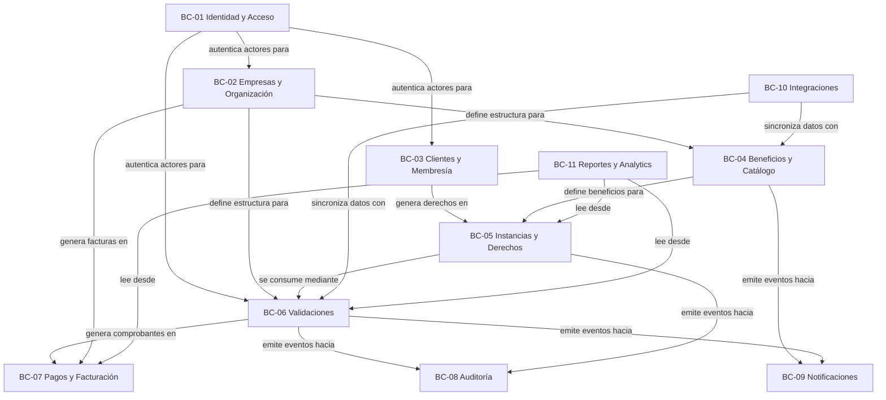

---

## 3. Entidades Principales

Una entidad es un objeto del dominio con identidad propia. Dos instancias con los mismos datos son distintas si tienen identidades distintas. Las entidades tienen ciclo de vida, pueden cambiar de estado y son persistidas.

---

### ENT-01 — Empresa

**Bounded Context:** BC-02 Organizacional

La Empresa es la unidad de negocio que contrata Pase Digital para administrar sus programas de beneficios. Es la entidad más alta en la jerarquía del dominio. Toda la información del sistema está particionada por empresa — es el límite natural del multitenant.

Una empresa tiene un nombre comercial, una identidad fiscal, una configuración operacional y un estado que determina si puede operar en la plataforma.

**Identidad:** Generada por el sistema al momento de creación (UUID o identificador secuencial).

**Atributos conceptuales:**
- Nombre comercial
- Razón social
- Identificación fiscal (RUC, NIT, RFC, CUIT, según el país)
- País y zona horaria de operación
- Estado operacional
- Plan de suscripción vigente
- Configuración general
- Fecha de incorporación
- Fecha de último cambio de estado

---

### ENT-02 — Sucursal

**Bounded Context:** BC-02 Organizacional

La Sucursal es un punto físico o virtual de operación de una empresa. Las validaciones de beneficios ocurren en sucursales. Los empleados están asignados a sucursales. Las métricas se desagregan por sucursal.

Una empresa puede tener cero o más sucursales. Si opera sin sucursales explícitas, se considera que opera desde una sucursal sede implícita.

**Identidad:** Generada por el sistema.

**Atributos conceptuales:**
- Nombre de la sucursal
- Empresa a la que pertenece
- Dirección operacional (Value Object)
- Estado (activa, inactiva, cerrada)
- Tipo (física, virtual, móvil)
- Horarios de operación

---

### ENT-03 — Usuario del Sistema

**Bounded Context:** BC-01 Identidad y Acceso

El Usuario del Sistema es cualquier persona que tiene credenciales para acceder al panel administrativo de Pase Digital. Se distingue del Cliente (quien usa los beneficios) por su naturaleza operacional.

Un usuario puede tener uno de tres roles sistémicos: Superadmin (operador de Pase Digital), Admin de Empresa, o Empleado. Estos roles determinan sus permisos dentro del sistema.

**Identidad:** Generada por el sistema.

**Atributos conceptuales:**
- Nombre completo
- Correo electrónico (único en el sistema)
- Credencial de acceso (no legible, derivada)
- Rol
- Empresa a la que pertenece (nulo para Superadmin)
- Sucursal a la que pertenece (para Empleados)
- Estado de la cuenta
- Fecha de último acceso

---

### ENT-04 — Rol

**Bounded Context:** BC-01 Identidad y Acceso

El Rol agrupa un conjunto de permisos y define qué puede hacer un usuario en el sistema. Los roles son estáticos y definidos por el sistema, no configurables por empresas individuales.

**Roles del sistema (v1.0):**
- `SUPERADMIN` — Operador de Pase Digital. Acceso total.
- `ADMIN_EMPRESA` — Administrador de una empresa cliente. Acceso a su empresa.
- `EMPLEADO` — Operador de punto de venta. Acceso limitado a escaneo y consulta.

**Identidad:** Nombre del rol (string canónico, no UUID).

**Nota para evolución futura:** El modelo debe soportar roles personalizados por empresa en versiones futuras, sin romper los roles sistémicos.

---

### ENT-05 — Cliente

**Bounded Context:** BC-03 Membresía

El Cliente es la persona que participa en el programa de beneficios de una empresa. En el dominio de Pase Digital, el Cliente siempre existe en el contexto de una empresa. La misma persona física puede ser cliente de múltiples empresas, pero cada vínculo es independiente.

El Cliente no es sinónimo de "usuario del sistema". El Cliente usa sus beneficios mediante el Pase Digital. No necesita credenciales para el panel administrativo.

**Identidad:** Generada por el sistema.

**Atributos conceptuales:**
- Nombre completo
- Correo electrónico
- Teléfono de contacto
- Empresa a la que pertenece
- Fecha de nacimiento (para elegibilidad por edad o cumpleaños)
- Nivel de membresía
- Estado en el programa
- Fecha de registro
- Método de verificación utilizado

---

### ENT-06 — Pase Digital

**Bounded Context:** BC-03 Membresía

El Pase Digital es el identificador único del cliente dentro del programa de beneficios de una empresa. Es la entidad que el cliente presenta para ejercer sus derechos. Se materializa como un código QR, pero el QR es solo una representación visual — el Pase Digital es el objeto conceptual subyacente.

Un cliente tiene exactamente un Pase Digital por empresa. El Pase Digital tiene un código único que no cambia durante la vida del cliente en el programa. Puede ser regenerado en caso de compromiso de seguridad, pero el historial de uso anterior permanece intacto.

**Identidad:** Código único (generado por el sistema, no predecible).

**Atributos conceptuales:**
- Código único del pase
- Cliente al que pertenece
- Empresa en la que es válido
- Estado del pase
- Fecha de emisión
- Fecha de última regeneración (si aplica)

---

### ENT-07 — Beneficio

**Bounded Context:** BC-04 Catálogo de Beneficios

El Beneficio es la definición de lo que una empresa ofrece a sus clientes. Es la plantilla. Define las reglas, condiciones, límites y vigencia del beneficio, pero no registra usos individuales — eso corresponde a las Instancias y Validaciones.

Un beneficio pertenece a exactamente una empresa. Una empresa puede tener múltiples beneficios. Los beneficios pueden pertenecer a Campañas.

**Identidad:** Generada por el sistema.

**Atributos conceptuales:**
- Nombre del beneficio
- Descripción
- Empresa propietaria
- Tipo de beneficio
- Categoría
- Valor del beneficio (expresado mediante Value Objects)
- Condiciones de elegibilidad
- Límites de uso (por cliente, global, por período)
- Vigencia (fecha de inicio, fecha de fin)
- Sucursales donde aplica
- Estado del beneficio
- Indicador de visibilidad para el cliente

---

### ENT-08 — Tipo de Beneficio

**Bounded Context:** BC-04 Catálogo de Beneficios

El Tipo de Beneficio es la clasificación que determina la naturaleza del valor que entrega un beneficio. No es una categoría de negocio — es la estructura del valor.

Los tipos actuales incluyen: Descuento Porcentual, Descuento Fijo, Producto Gratuito, Servicio Gratuito, Acumulación de Puntos, Canje de Puntos, Acceso Especial, Beneficio Informativo.

El Tipo de Beneficio es extensible. Nuevas industrias podrán requerir nuevos tipos sin modificar las entidades existentes.

**Identidad:** Código del tipo (string canónico).

**Atributos conceptuales:**
- Código del tipo
- Nombre descriptivo
- Descripción de la mecánica
- Parámetros requeridos (según el tipo)
- Industrias para las que aplica

---

### ENT-09 — Campaña

**Bounded Context:** BC-04 Catálogo de Beneficios

La Campaña es un agrupador de beneficios con un propósito comercial o temporal común. Por ejemplo: "Campaña de Navidad 2026", "Temporada Alta", "Lanzamiento de nueva sucursal".

Una campaña agrupa múltiples beneficios. Un beneficio puede pertenecer a una sola campaña (o ninguna). La campaña no añade reglas propias — simplifica la administración masiva de beneficios relacionados.

**Identidad:** Generada por el sistema.

**Atributos conceptuales:**
- Nombre de la campaña
- Empresa propietaria
- Descripción
- Período de la campaña
- Estado
- Beneficios asociados

---

### ENT-10 — Instancia de Beneficio

**Bounded Context:** BC-05 Instancias y Derechos

La Instancia de Beneficio es la materialización de un Beneficio para un Cliente específico. Es el derecho concreto, individual e intransferible. Mientras el Beneficio define la oferta, la Instancia registra cuántos usos le quedan a María García del beneficio "20% de descuento".

Una Instancia siempre pertenece a un Cliente y a un Beneficio. Una Instancia tiene su propio saldo de usos y su propia vigencia, que puede diferir de la vigencia del Beneficio padre.

**Identidad:** Generada por el sistema.

**Atributos conceptuales:**
- Cliente beneficiario
- Beneficio del que deriva
- Empresa (redundante para consultas rápidas)
- Saldo de usos disponibles
- Total de usos al momento de creación
- Usos consumidos hasta el momento
- Fecha de inicio de vigencia personal
- Fecha de fin de vigencia personal
- Estado de la instancia
- Origen de la instancia (registro inicial, renovación, regalo, bonificación)

---

### ENT-11 — Validación

**Bounded Context:** BC-06 Validaciones

La Validación es el registro de un intento de uso de un beneficio. Existe independientemente de si el intento fue exitoso o no. Una validación siempre tiene un resultado: aprobada o rechazada.

La Validación es inmutable una vez registrada, salvo el proceso de anulación, que crea un registro complementario (no elimina la validación original).

**Identidad:** Generada por el sistema.

**Atributos conceptuales:**
- Instancia de beneficio que se intentó usar
- Cliente
- Beneficio
- Empresa
- Sucursal donde ocurrió
- Empleado que realizó la operación
- Timestamp exacto del intento
- Resultado (aprobada / rechazada)
- Motivo de rechazo (si aplica)
- Estado (vigente / anulada)
- Referencia al comprobante (si fue aprobada)

---

### ENT-12 — Comprobante

**Bounded Context:** BC-06 Validaciones

El Comprobante es el documento que acredita que una Validación exitosa ocurrió. Es el registro de valor para la empresa: cuántos beneficios fueron efectivamente entregados a clientes. El Comprobante puede ser la base para conciliaciones y reportes.

Un Comprobante pertenece a exactamente una Validación aprobada.

**Identidad:** Código único generado por el sistema (legible por humanos, no predecible).

**Atributos conceptuales:**
- Número de comprobante
- Validación que lo originó
- Timestamp de emisión
- Descripción del beneficio entregado
- Valor estimado del beneficio entregado
- Estado (válido / anulado)

---

### ENT-13 — Factura Externa

**Bounded Context:** BC-07 Pagos y Facturación

La Factura Externa es el documento fiscal que una empresa cliente presenta a Pase Digital para acreditar el pago de su plan de suscripción. Pase Digital registra esta factura como evidencia del pago, pero no genera facturas — las recibe.

**Identidad:** Número de factura fiscal (único por empresa y período).

**Atributos conceptuales:**
- Número de factura
- Empresa que la presenta
- Período que cubre
- Monto
- Fecha de emisión
- Fecha de registro en el sistema
- Estado (registrada, verificada, rechazada)
- Referencia a archivos adjuntos

---

### ENT-14 — Plan de Suscripción

**Bounded Context:** BC-07 Pagos y Facturación

El Plan de Suscripción define los límites operacionales que una empresa tiene en la plataforma: cantidad máxima de clientes, beneficios, empleados, integraciones habilitadas, etc. Es el contrato comercial entre Pase Digital y la empresa.

**Identidad:** Código del plan (string canónico).

**Atributos conceptuales:**
- Nombre del plan
- Precio mensual
- Límites operacionales (clientes, beneficios, empleados, sucursales)
- Funcionalidades habilitadas
- Período de facturación
- Estado (activo, deprecado)

---

### ENT-15 — Registro de Auditoría

**Bounded Context:** BC-08 Auditoría

El Registro de Auditoría es la evidencia inmutable de que una acción ocurrió. Cada evento relevante del sistema genera un Registro de Auditoría. No puede ser modificado ni eliminado.

**Identidad:** Generada por el sistema (secuencial + timestamp).

**Atributos conceptuales:**
- Identificador del registro
- Contexto de origen (qué bounded context emitió el evento)
- Tipo de evento
- Actor que originó la acción (usuario, sistema, proceso automatizado)
- Entidad afectada (tipo + ID)
- Snapshot del estado anterior (si aplica)
- Snapshot del estado posterior
- Timestamp UTC
- IP de origen (si la acción fue humana)
- Metadatos adicionales del contexto

---

### ENT-16 — Integración

**Bounded Context:** BC-10 Integraciones

La Integración define la configuración de una conexión con un sistema externo para una empresa específica. Puede ser un POS, ERP, CRM, plataforma de ecommerce u otro sistema de fidelización.

**Identidad:** Generada por el sistema.

**Atributos conceptuales:**
- Empresa propietaria
- Tipo de integración (POS, ERP, Webhook, API Pública)
- Estado de la integración
- Credenciales de autenticación (cifradas)
- Configuración de sincronización
- Último estado de salud (health check)
- Log de último intento de sincronización

---

### ENT-17 — Notificación

**Bounded Context:** BC-09 Notificaciones

La Notificación es el registro de una comunicación enviada o pendiente de envío. Contiene el destinatario, el canal, el contenido y el estado de entrega.

**Identidad:** Generada por el sistema.

**Atributos conceptuales:**
- Destinatario (referencia al cliente o usuario del sistema)
- Canal (email, SMS, push, webhook)
- Asunto / título
- Contenido renderizado
- Estado de entrega (pendiente, enviada, fallida, rebotada)
- Timestamp de intento de envío
- Timestamp de entrega confirmada
- Intentos realizados
- Evento del dominio que la originó

---

### ENT-18 — Condición de Elegibilidad

**Bounded Context:** BC-04 Catálogo de Beneficios

La Condición de Elegibilidad define el criterio que un cliente debe cumplir para que una Instancia del Beneficio sea creada en su favor. Es una regla evaluable, no un atributo simple.

**Identidad:** Generada por el sistema.

**Atributos conceptuales:**
- Beneficio al que pertenece
- Tipo de condición (nivel de membresía, antigüedad, rango de edad, historial de usos, código de invitación, atributo personalizado)
- Parámetros de la condición (umbral, valor de referencia, etc.)
- Operador lógico para combinar múltiples condiciones (AND, OR)

---

### ENT-19 — Nivel de Membresía

**Bounded Context:** BC-03 Membresía

El Nivel de Membresía es la categoría que una empresa asigna a sus clientes dentro de su programa. Los niveles son configurables por empresa y determinan qué beneficios recibe cada cliente.

**Identidad:** Nombre del nivel dentro de la empresa (único por empresa).

**Atributos conceptuales:**
- Empresa propietaria
- Nombre del nivel
- Descripción
- Criterios de ascenso y descenso
- Orden jerárquico
- Beneficios asignados automáticamente a este nivel

---

### ENT-20 — Historial de Membresía

**Bounded Context:** BC-03 Membresía

El Historial de Membresía registra cada cambio de nivel de un cliente. Permite rastrear la trayectoria del cliente en el programa.

**Identidad:** Generada por el sistema.

**Atributos conceptuales:**
- Cliente
- Nivel anterior
- Nivel nuevo
- Motivo del cambio
- Timestamp
- Actor que realizó el cambio

---

## 4. Value Objects

Un Value Object es un objeto del dominio definido por sus atributos, no por su identidad. Dos Value Objects con los mismos atributos son intercambiables. Son inmutables — no cambian, se reemplazan.

---

### VO-01 — Dirección

Representa la ubicación física de una sucursal o empresa. No tiene identidad propia. Si la dirección cambia, se crea una nueva instancia del Value Object y se reemplaza.

**Atributos:** Calle, número, colonia/barrio, ciudad, estado/provincia, país, código postal, referencia, coordenadas geográficas opcionales.

**Por qué es Value Object:** Dos sucursales en la misma dirección no comparten identidad — ambas tienen su propia instancia del Value Object Dirección con los mismos datos. La dirección no "vive" independientemente de la entidad que la contiene.

---

### VO-02 — Correo Electrónico

Representa una dirección de correo electrónico validada. Encapsula las reglas de formato. Normalizado a minúsculas.

**Atributos:** Valor del correo.

**Invariante:** No puede representar un correo con formato inválido.

---

### VO-03 — Teléfono

Representa un número telefónico incluyendo código de país. Normalizado en formato E.164.

**Atributos:** Código de país, número, extensión opcional.

---

### VO-04 — Dinero

Representa un valor monetario con su moneda. Encapsula las reglas de aritmética monetaria (sin pérdida de precisión por punto flotante).

**Atributos:** Monto (entero en centavos), código de moneda (ISO 4217).

**Por qué es Value Object:** Un precio de $50.00 MXN no tiene identidad. Es simplemente ese valor. Si el precio cambia a $55.00, se reemplaza el Value Object completo.

**Invariante:** El monto no puede ser negativo para representar precios o valores de beneficio.

---

### VO-05 — Porcentaje

Representa un valor porcentual. Usado para Beneficios de tipo descuento porcentual.

**Atributos:** Valor (entre 0 y 100, dos decimales de precisión).

**Invariante:** El valor no puede ser menor que 0 ni mayor que 100.

---

### VO-06 — Período

Representa un intervalo de tiempo con fechas de inicio y fin. Usado para vigencias de beneficios, campañas y planes de suscripción.

**Atributos:** Fecha de inicio, fecha de fin.

**Invariante:** La fecha de fin debe ser posterior o igual a la fecha de inicio.

**Comportamiento:** Puede responder si un momento específico está dentro del período, si el período ha vencido, si el período aún no ha comenzado.

---

### VO-07 — Horario de Operación

Representa los horarios en que un beneficio o sucursal está disponible. Es una estructura que define días de la semana y rangos de horas para cada día.

**Atributos:** Colección de entradas (día de la semana, hora de apertura, hora de cierre), zona horaria.

**Comportamiento:** Puede responder si un timestamp dado cae dentro del horario operacional.

---

### VO-08 — Límite de Uso

Representa la restricción cuantitativa de cuántas veces puede usarse un beneficio. Puede expresarse en distintas dimensiones.

**Atributos:** Cantidad máxima, dimensión de la restricción (por cliente total, por cliente por día, por cliente por semana, por cliente por mes, global del beneficio).

**Por qué es Value Object:** El límite "máximo 3 usos por cliente por mes" es una configuración, no una entidad. No tiene ciclo de vida propio.

---

### VO-09 — Código QR

Representa el contenido que se codifica en el QR del Pase Digital. Encapsula el proceso de generación y los metadatos necesarios para validar su autenticidad.

**Atributos:** Payload (string codificado), algoritmo de firma, timestamp de generación.

**Invariante:** El payload debe estar firmado con la clave del sistema para detectar manipulaciones.

---

### VO-10 — Estado (genérico)

Los estados de las entidades (empresa activa, beneficio pausado, etc.) son Value Objects que encapsulan las transiciones permitidas. Un estado no es un simple string — es un objeto que conoce desde qué estados puede llegarse a él y hacia qué estados puede avanzar.

**Atributos:** Valor del estado, transiciones permitidas.

---

### VO-11 — Identificación Fiscal

Representa el número de identificación tributaria de una empresa según el país. Encapsula las reglas de formato por país.

**Atributos:** Tipo (RUC, NIT, RFC, CUIT, etc.), valor, país.

**Invariante:** El formato debe ser válido para el tipo especificado.

---

### VO-12 — Resultado de Validación

Representa el resultado de evaluar si un beneficio puede ser usado en un momento dado. No es simplemente un booleano — incluye el diagnóstico completo.

**Atributos:** Decisión (aprobado / rechazado), código de resultado, descripción legible, entidad evaluada.

---

## 5. Agregados (Aggregates)

Un Agregado es un grupo de entidades y Value Objects que forman una unidad de consistencia. El Aggregate Root es el único punto de entrada al agregado — ninguna entidad externa puede acceder directamente a los miembros internos del agregado sin pasar por el root.

---

### AG-01 — Agregado Empresa

**Aggregate Root:** Empresa

**Miembros del agregado:**
- Sucursal (entidad interna)
- Configuración de empresa (Value Object complejo)
- Plan de suscripción vigente (referencia)

**Justificación:** La coherencia entre una empresa y sus sucursales debe garantizarse dentro del mismo límite transaccional. No puede existir una sucursal sin empresa. No puede activarse una empresa con una configuración inválida. La Empresa es el guardián de estas invariantes.

**Invariantes del agregado:**
- Una empresa en estado SUSPENDIDA no puede agregar nuevas sucursales.
- El número de sucursales no puede exceder el límite del plan.
- Una sucursal cerrada no puede reabrirse si la empresa está suspendida.

**Acceso externo:** Otros agregados referencian la Empresa mediante su ID. Nunca acceden directamente a las Sucursales.

---

### AG-02 — Agregado Usuario

**Aggregate Root:** Usuario del Sistema

**Miembros del agregado:**
- Rol (referencia — el rol vive fuera del agregado)
- Sesiones activas (Value Object interno)

**Justificación:** El Usuario es la unidad de autenticación. Sus credenciales, sesiones y permisos deben gestionarse de forma cohesiva. No puede existir una sesión sin usuario.

**Invariantes del agregado:**
- Un usuario no puede tener dos sesiones activas simultáneas (por dispositivo).
- Un usuario SUSPENDIDO no puede iniciar sesión.
- Las credenciales solo pueden modificarse mediante el proceso de cambio de contraseña — nunca directamente.

---

### AG-03 — Agregado Cliente

**Aggregate Root:** Cliente

**Miembros del agregado:**
- Pase Digital (entidad interna — exactamente uno por empresa)
- Nivel de membresía vigente (referencia)
- Historial de membresía (entidad de solo escritura)

**Justificación:** El Pase Digital no puede existir sin un Cliente. El nivel de membresía de un cliente es parte de su identidad dentro del programa. El historial de membresía documenta cambios dentro del contexto del cliente.

**Invariantes del agregado:**
- Un cliente tiene exactamente un Pase Digital por empresa.
- Un cliente ELIMINADO no puede recibir nuevas instancias de beneficio.
- El Pase Digital de un cliente SUSPENDIDO no puede ser validado.

---

### AG-04 — Agregado Beneficio

**Aggregate Root:** Beneficio

**Miembros del agregado:**
- Condiciones de Elegibilidad (entidades internas)
- Límites de Uso (Value Objects)
- Período de Vigencia (Value Object)
- Tipo de Beneficio (referencia)
- Campaña (referencia opcional)

**Justificación:** Las condiciones de elegibilidad y los límites de uso solo tienen sentido en el contexto del beneficio al que pertenecen. No pueden compartirse entre beneficios. La coherencia entre el estado del beneficio y sus reglas debe garantizarse en un solo límite.

**Invariantes del agregado:**
- Un beneficio AGOTADO no puede añadir nuevas condiciones de elegibilidad.
- Un beneficio no puede publicarse sin al menos una condición de elegibilidad o sin período de vigencia definido.
- Los límites de uso no pueden ser negativos.
- Una empresa SUSPENDIDA no puede publicar beneficios.

---

### AG-05 — Agregado Instancia de Beneficio

**Aggregate Root:** Instancia de Beneficio

**Miembros del agregado:**
- Saldo de usos (Value Object interno)
- Período de vigencia personal (Value Object)

**Justificación:** El saldo de usos es el estado central de la instancia — es lo que cambia con cada validación. La coherencia entre el saldo y el estado de la instancia (ej: saldo en cero → estado AGOTADA) debe garantizarse en un solo lugar.

**Invariantes del agregado:**
- El saldo de usos no puede ser negativo.
- Cuando el saldo llega a cero, el estado cambia automáticamente a AGOTADA.
- Una instancia VENCIDA o AGOTADA no puede tener su saldo incrementado (salvo proceso de renovación explícito).
- Una instancia CANCELADA no puede ser reactivada.

---

### AG-06 — Agregado Validación

**Aggregate Root:** Validación

**Miembros del agregado:**
- Comprobante (entidad interna — generado solo si la validación es aprobada)
- Registro de anulación (Value Object interno — solo si fue anulada)

**Justificación:** El Comprobante no puede existir sin la Validación que lo originó. Una vez registrada, la Validación y su Comprobante forman una unidad contable inmutable.

**Invariantes del agregado:**
- Una Validación APROBADA siempre tiene exactamente un Comprobante.
- Una Validación RECHAZADA nunca tiene Comprobante.
- Una Validación no puede pasar de APROBADA a RECHAZADA — solo puede ANULARSE.
- Una Anulación siempre tiene un motivo y un actor responsable.

---

### AG-07 — Agregado Factura

**Aggregate Root:** Factura Externa

**Miembros del agregado:**
- Archivos adjuntos (Value Objects de referencia a almacenamiento)

**Justificación:** Una factura es una unidad documental. Sus adjuntos son parte de ella. No pueden existir adjuntos sin factura.

---

## 6. Relaciones

### 6.1 Relaciones por tipo

#### Uno a Uno
| Entidad A | Entidad B | Descripción |
|-----------|-----------|-------------|
| Cliente (en empresa X) | Pase Digital (en empresa X) | Un cliente tiene exactamente un pase por empresa |
| Validación aprobada | Comprobante | Una validación aprobada genera exactamente un comprobante |

#### Uno a Muchos
| Entidad padre | Entidad hija | Descripción |
|--------------|--------------|-------------|
| Empresa | Sucursal | Una empresa puede tener múltiples sucursales |
| Empresa | Usuario (Admin/Empleado) | Una empresa tiene múltiples usuarios |
| Empresa | Beneficio | Una empresa define múltiples beneficios |
| Empresa | Campaña | Una empresa puede crear múltiples campañas |
| Empresa | Cliente | Una empresa tiene múltiples clientes en su programa |
| Empresa | Integración | Una empresa puede tener múltiples integraciones |
| Sucursal | Empleado | Una sucursal puede tener múltiples empleados asignados |
| Beneficio | Condición de Elegibilidad | Un beneficio puede tener múltiples condiciones |
| Beneficio | Instancia de Beneficio | Un beneficio puede tener múltiples instancias (una por cliente elegible) |
| Instancia | Validación | Una instancia puede tener múltiples validaciones a lo largo del tiempo |
| Campaña | Beneficio | Una campaña agrupa múltiples beneficios |
| Cliente | Instancia de Beneficio | Un cliente puede tener múltiples instancias activas simultáneas |
| Cliente | Historial de Membresía | Un cliente tiene un historial de cambios de nivel |

#### Muchos a Muchos
| Entidad A | Entidad B | Entidad de relación | Descripción |
|-----------|-----------|---------------------|-------------|
| Beneficio | Sucursal | BeneficioSucursal | Un beneficio puede aplicar en múltiples sucursales; una sucursal puede tener múltiples beneficios vigentes |
| Nivel de Membresía | Beneficio | NivelBeneficio | Un nivel otorga acceso a múltiples beneficios; un beneficio puede estar disponible para múltiples niveles |

### 6.2 Diagrama de relaciones principal

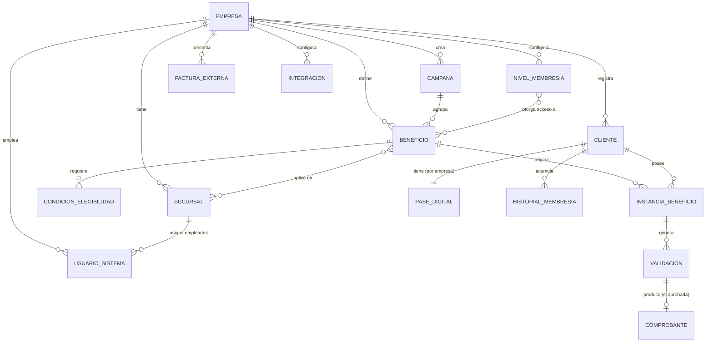

---

## 7. Responsabilidades

### 7.1 Responsabilidades por entidad

| Entidad | Responsabilidad | Lo que NO hace |
|---------|-----------------|----------------|
| **Empresa** | Define el contexto multitenancy. Es la unidad de configuración, facturación y operación | No procesa pagos. No valida beneficios. No interactúa con clientes directamente |
| **Sucursal** | Define el punto físico de operación. Contexto geográfico de las validaciones | No configura beneficios. No administra clientes. No genera reportes |
| **Usuario del Sistema** | Representa al operador humano del panel administrativo | No representa al cliente final. No tiene Pase Digital. No usa beneficios |
| **Rol** | Define el conjunto de permisos de un tipo de usuario | No gestiona identidad. No almacena credenciales |
| **Cliente** | Representa al miembro del programa de beneficios de una empresa | No tiene credenciales de sistema. No administra beneficios. No puede ver datos de otros clientes |
| **Pase Digital** | Es el identificador presentable del cliente. El QR que escanea el empleado | No almacena los beneficios directamente. No registra usos. Solo identifica al cliente |
| **Beneficio** | Define la oferta: qué se da, cuándo, a quién, cuántas veces | No registra quién lo usó. No tiene saldo propio. No conoce clientes individuales |
| **Tipo de Beneficio** | Clasifica la naturaleza del valor que entrega un beneficio | No define condiciones. No tiene vigencia. No pertenece a una empresa específica |
| **Campaña** | Agrupa beneficios con propósito común para facilitar su administración | No añade reglas propias. No define elegibilidad. No tiene saldo |
| **Instancia de Beneficio** | Registra el derecho concreto de un cliente sobre un beneficio. Mantiene el saldo | No decide si el cliente es elegible (eso lo hace el Motor de Elegibilidad). No registra el uso (eso hace la Validación) |
| **Validación** | Registra el uso efectivo de una instancia. Es el evento contable | No modifica instancias directamente. No genera facturas. No notifica |
| **Comprobante** | Acredita que una validación exitosa ocurrió | No tiene valor transaccional propio. No es una factura |
| **Factura Externa** | Registra el pago de la empresa a Pase Digital | No gestiona pagos a terceros. No es el comprobante de uso de beneficios |
| **Registro de Auditoría** | Persiste el historial inmutable de eventos | No toma decisiones. No ejecuta acciones. Solo registra |
| **Integración** | Mantiene la configuración de conexión con sistemas externos | No ejecuta la sincronización. No transforma datos. Eso lo hace el Servicio de Integración |

---

## 8. Reglas del Dominio

Las reglas del dominio son restricciones de negocio que el sistema debe hacer cumplir en todo momento. A diferencia de las invariantes (que son técnicas), estas reglas reflejan decisiones del negocio que podrían cambiar.

### RD-01 — Reglas de Propiedad y Partición

| ID | Regla |
|----|-------|
| RD-01-001 | Un Beneficio pertenece a exactamente una Empresa. No puede compartirse entre empresas. |
| RD-01-002 | Una Validación siempre pertenece a exactamente un Beneficio, a través de una Instancia. |
| RD-01-003 | Un Comprobante siempre pertenece a exactamente una Validación. |
| RD-01-004 | Un Empleado nunca puede validar beneficios de una empresa diferente a la suya. |
| RD-01-005 | Un Empleado solo puede validar beneficios en las sucursales a las que está asignado (o en todas, si no tiene restricción de sucursal). |
| RD-01-006 | Un Cliente puede pertenecer al programa de múltiples Empresas, pero cada membresía es independiente. |
| RD-01-007 | El Pase Digital de un cliente es único dentro del programa de una empresa. |
| RD-01-008 | Una Condición de Elegibilidad pertenece a exactamente un Beneficio. |
| RD-01-009 | Una Instancia de Beneficio pertenece a exactamente un Cliente y a exactamente un Beneficio. |
| RD-01-010 | Un Superadmin no pertenece a ninguna empresa. Sus acciones afectan a todas. |

### RD-02 — Reglas de Operación de Beneficios

| ID | Regla |
|----|-------|
| RD-02-001 | Un beneficio solo puede ser usado por clientes que cumplan sus condiciones de elegibilidad en el momento de la validación. |
| RD-02-002 | Un beneficio solo puede ser usado durante su período de vigencia. |
| RD-02-003 | Un beneficio con límite de uso no puede ser usado más veces de lo permitido por ese límite. |
| RD-02-004 | Un beneficio PAUSADO no puede generar nuevas validaciones pero las instancias existentes permanecen intactas. |
| RD-02-005 | Un beneficio SUSPENDIDO (por Superadmin) bloquea tanto nuevas instancias como nuevas validaciones. |
| RD-02-006 | Un beneficio no puede activarse si la empresa propietaria está SUSPENDIDA. |
| RD-02-007 | Si un beneficio se AGOTA (uso global máximo alcanzado), no puede validarse aunque el cliente tenga instancia activa. |

### RD-03 — Reglas de Validación

| ID | Regla |
|----|-------|
| RD-03-001 | Solo un Empleado o Admin autenticado puede registrar una validación. |
| RD-03-002 | Una validación siempre requiere identificar al Cliente (mediante el Pase Digital). |
| RD-03-003 | Una validación siempre requiere identificar el Beneficio. |
| RD-03-004 | Una validación rechazada debe registrar el motivo específico del rechazo. |
| RD-03-005 | Una validación aprobada genera inmediatamente un Comprobante. |
| RD-03-006 | El saldo de la Instancia se decrementa inmediatamente al aprobarse la validación. |
| RD-03-007 | Una anulación solo puede realizarse por un Admin o Superadmin con motivo documentado. |
| RD-03-008 | La anulación de una validación devuelve el uso a la Instancia y anula el Comprobante. |
| RD-03-009 | No puede anularse una validación si la empresa está SUSPENDIDA. |

### RD-04 — Reglas de Membresía

| ID | Regla |
|----|-------|
| RD-04-001 | Un cliente ELIMINADO no puede recibir nuevas instancias de beneficio. |
| RD-04-002 | Un cliente SUSPENDIDO no puede usar su Pase Digital para validaciones. |
| RD-04-003 | El nivel de membresía de un cliente puede cambiar solo por acción de un Admin o por proceso automático configurado. |
| RD-04-004 | El historial de membresía es de solo lectura después de su creación. |
| RD-04-005 | Si un cliente cambia de nivel, las instancias activas obtenidas por su nivel anterior permanecen válidas hasta su vencimiento natural. |

### RD-05 — Reglas de Empresa

| ID | Regla |
|----|-------|
| RD-05-001 | Una empresa PENDIENTE_REVISION no puede operar (no puede tener empleados activos ni beneficios publicados). |
| RD-05-002 | Una empresa SUSPENDIDA no puede: publicar beneficios, registrar clientes, ni procesar validaciones. |
| RD-05-003 | El número de empleados activos no puede exceder el límite del plan de suscripción. |
| RD-05-004 | El número de clientes activos no puede exceder el límite del plan de suscripción. |
| RD-05-005 | La desactivación de una empresa no elimina su historial. Los datos permanecen en estado archivado. |

### RD-06 — Reglas de Auditoría

| ID | Regla |
|----|-------|
| RD-06-001 | Toda acción que modifique el estado de una entidad debe generar un Registro de Auditoría. |
| RD-06-002 | Un Registro de Auditoría nunca puede ser modificado ni eliminado, ni siquiera por Superadmin. |
| RD-06-003 | El Registro de Auditoría debe capturar el estado anterior y posterior de la entidad modificada. |

---

## 9. Estados

### 9.1 Estados de Empresa

| Estado | Descripción |
|--------|-------------|
| `PENDIENTE_REVISION` | Empresa registrada, pendiente de aprobación por Superadmin |
| `ACTIVA` | Empresa operando normalmente |
| `SUSPENDIDA` | Empresa bloqueada temporalmente (falta de pago, violación de términos) |
| `INACTIVA` | Empresa dada de baja voluntariamente |

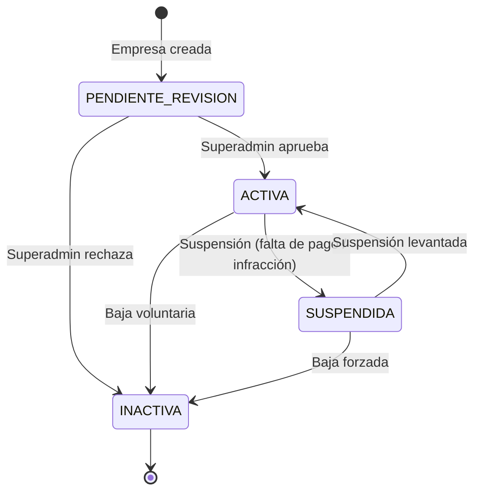

### 9.2 Estados de Cliente

| Estado | Descripción |
|--------|-------------|
| `PENDIENTE_VERIFICACION` | Cliente registrado, pendiente de confirmar correo o datos |
| `ACTIVO` | Cliente operando normalmente |
| `SUSPENDIDO` | Cliente bloqueado temporalmente |
| `ELIMINADO` | Cliente dado de baja (soft delete — datos conservados) |

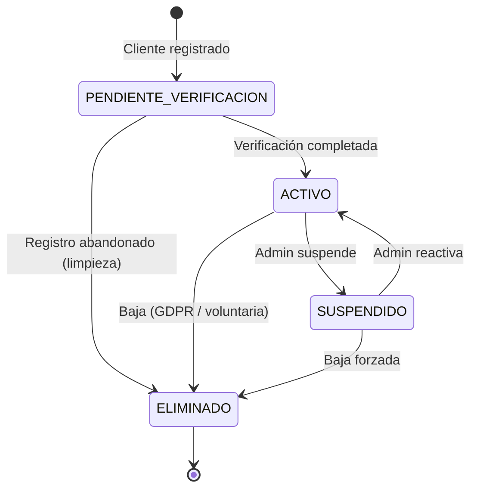

### 9.3 Estados de Beneficio

| Estado | Descripción |
|--------|-------------|
| `BORRADOR` | En construcción, no visible |
| `PROGRAMADO` | Configurado, esperando fecha de inicio |
| `ACTIVO` | Disponible para clientes elegibles |
| `PAUSADO` | Temporalmente suspendido por la empresa |
| `SUSPENDIDO` | Bloqueado por Superadmin |
| `AGOTADO` | Límite global de usos alcanzado |
| `INACTIVO` | Finalizado (expiró o fue dado de baja) |

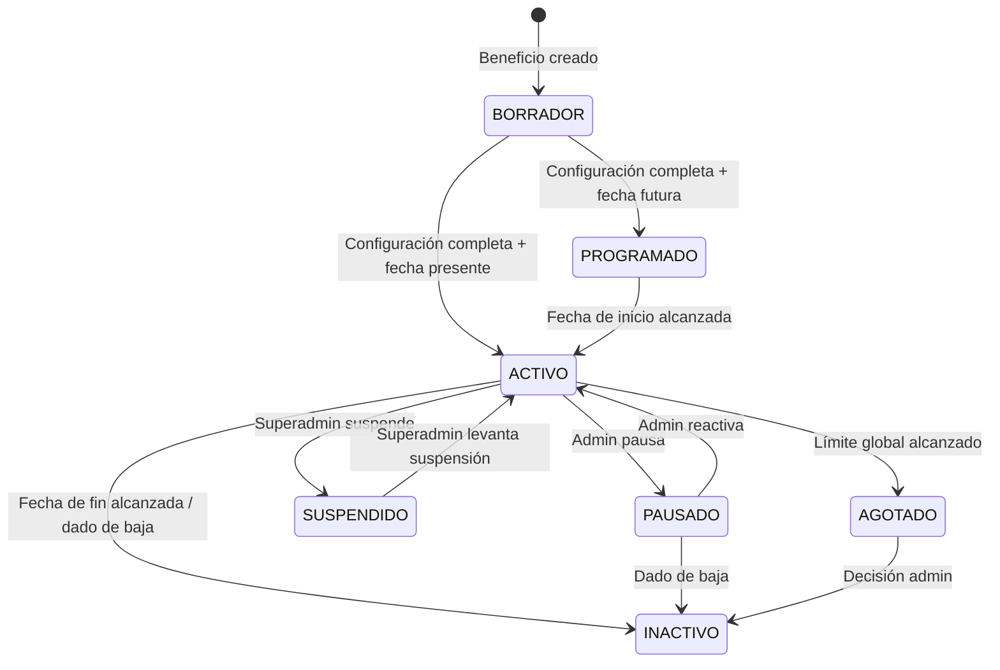

### 9.4 Estados de Instancia de Beneficio

| Estado | Descripción |
|--------|-------------|
| `PENDIENTE_PAGO` | Instancia creada pero condicionada a pago previo |
| `ACTIVA` | Instancia disponible para uso |
| `AGOTADA` | Saldo de usos en cero |
| `VENCIDA` | Período de vigencia expirado |
| `CANCELADA` | Cancelada manualmente |

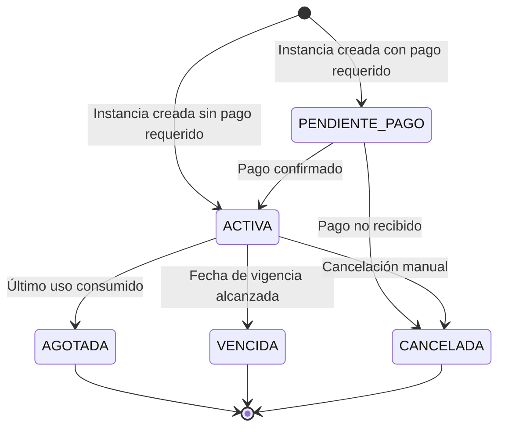

### 9.5 Estados de Validación

| Estado | Descripción |
|--------|-------------|
| `REGISTRADA` | Validación aprobada y vigente |
| `ANULADA` | Validación revertida por acción administrativa |

*(Las validaciones rechazadas no tienen un "estado" propiamente — son registros con resultado RECHAZADO, inmutables desde su creación.)*

### 9.6 Estados de Pase Digital

| Estado | Descripción |
|--------|-------------|
| `ACTIVO` | Pase válido y utilizable |
| `BLOQUEADO` | Temporalmente inhabilitado (sigue al estado del cliente) |
| `REVOCADO` | Código invalidado por seguridad (se emite uno nuevo) |

---

## 10. Eventos del Dominio

Los Eventos del Dominio son hechos que ocurrieron en el pasado dentro del sistema. Están en tiempo pasado, son inmutables y representan transiciones significativas del estado del dominio. Otros contextos pueden reaccionar a ellos sin crear acoplamiento directo.

### 10.1 Catálogo de Eventos

#### Contexto Organizacional (BC-02)

| Evento | Cuándo ocurre | Contextos que reaccionan |
|--------|---------------|--------------------------|
| `EmpresaCreada` | Al registrar una nueva empresa en el sistema | Auditoría, Notificaciones (aviso al Superadmin) |
| `EmpresaActivada` | Cuando Superadmin aprueba la empresa | Auditoría, Notificaciones (aviso al Admin de Empresa) |
| `EmpresaSuspendida` | Cuando Superadmin suspende la empresa | Auditoría, Notificaciones, Beneficios (bloquear), Validaciones (bloquear) |
| `EmpresaReactivada` | Cuando Superadmin levanta la suspensión | Auditoría, Notificaciones |
| `SucursalCreada` | Al agregar una sucursal a una empresa | Auditoría |
| `SucursalCerrada` | Al cerrar una sucursal | Auditoría, Validaciones (redirigir o bloquear) |
| `EmpleadoAgregado` | Al crear un usuario con rol EMPLEADO | Auditoría, Notificaciones (credenciales) |
| `EmpleadoDesactivado` | Al desactivar un empleado | Auditoría |

#### Contexto de Membresía (BC-03)

| Evento | Cuándo ocurre | Contextos que reaccionan |
|--------|---------------|--------------------------|
| `ClienteRegistrado` | Al completar el registro de un cliente | Auditoría, Notificaciones (bienvenida), Beneficios (evaluar elegibilidad inicial) |
| `ClienteVerificado` | Al confirmar el correo o datos del cliente | Auditoría, Notificaciones, Instancias (crear instancias iniciales) |
| `PaseDigitalAsignado` | Al generar el Pase Digital del cliente | Auditoría, Notificaciones (enviar QR) |
| `PaseDigitalRegenerado` | Al revocar y emitir nuevo Pase Digital | Auditoría, Notificaciones |
| `ClienteSuspendido` | Al suspender un cliente | Auditoría, Pase Digital (bloquear) |
| `ClienteReactivado` | Al reactivar un cliente suspendido | Auditoría, Pase Digital (desbloquear) |
| `ClienteEliminado` | Al eliminar (soft delete) a un cliente | Auditoría, Instancias (cancelar activas) |
| `NivelMembresiaCambiado` | Al cambiar el nivel de un cliente | Auditoría, Notificaciones, Instancias (evaluar nuevos beneficios) |

#### Contexto de Catálogo (BC-04)

| Evento | Cuándo ocurre | Contextos que reaccionan |
|--------|---------------|--------------------------|
| `BeneficioCreado` | Al guardar un beneficio en borrador | Auditoría |
| `BeneficioPublicado` | Al activar o programar un beneficio | Auditoría, Instancias (crear instancias para clientes elegibles) |
| `BeneficioPausado` | Al pausar un beneficio activo | Auditoría, Notificaciones |
| `BeneficioReactivado` | Al reactivar un beneficio pausado | Auditoría |
| `BeneficioSuspendido` | Cuando Superadmin suspende el beneficio | Auditoría, Validaciones (bloquear) |
| `BeneficioAgotado` | Cuando el saldo global del beneficio llega a cero | Auditoría, Notificaciones (aviso Admin) |
| `BeneficioVencido` | Cuando la fecha de fin es alcanzada | Auditoría, Instancias (marcar como vencidas) |
| `CampañaCreada` | Al crear una nueva campaña | Auditoría |
| `CampañaFinalizada` | Cuando la campaña concluye | Auditoría |

#### Contexto de Instancias (BC-05)

| Evento | Cuándo ocurre | Contextos que reaccionan |
|--------|---------------|--------------------------|
| `InstanceCreada` | Al asignar un beneficio a un cliente elegible | Auditoría, Notificaciones (avisar al cliente) |
| `InstanceActivada` | Al confirmar el pago y activar la instancia | Auditoría, Notificaciones |
| `InstanceUsada` | Al decrementar el saldo por una validación | Auditoría |
| `InstanceAgotada` | Cuando el saldo llega a cero | Auditoría, Notificaciones |
| `InstanceVencida` | Cuando la vigencia expira | Auditoría |
| `InstanceCancelada` | Al cancelar manualmente una instancia | Auditoría, Notificaciones |

#### Contexto de Validaciones (BC-06)

| Evento | Cuándo ocurre | Contextos que reaccionan |
|--------|---------------|--------------------------|
| `ValidaciónRegistrada` | Al completar el proceso de validación (exitosa o fallida) | Auditoría, Instancias (actualizar saldo si exitosa) |
| `ValidaciónAprobada` | Específicamente cuando el resultado es APROBADO | Auditoría, Comprobantes (generar), Reportes, Notificaciones |
| `ValidaciónRechazada` | Cuando el resultado es RECHAZADO | Auditoría, Antifraude (evaluar patrones) |
| `ValidaciónAnulada` | Al anular una validación previamente aprobada | Auditoría, Instancias (devolver saldo), Comprobantes (anular) |
| `ComprobanteGenerado` | Al crear el comprobante de una validación exitosa | Auditoría, Facturación |

#### Contexto de Facturación (BC-07)

| Evento | Cuándo ocurre | Contextos que reaccionan |
|--------|---------------|--------------------------|
| `FacturaRegistrada` | Al subir una factura de pago | Auditoría, Notificaciones (aviso Superadmin) |
| `PagoVerificado` | Al confirmar el pago de la factura | Auditoría, Empresas (extender suscripción), Notificaciones |
| `SuscripciónVencida` | Cuando la fecha de renovación no fue cubierta | Auditoría, Empresas (suspender), Notificaciones |

### 10.2 Diagrama de flujo de eventos principales

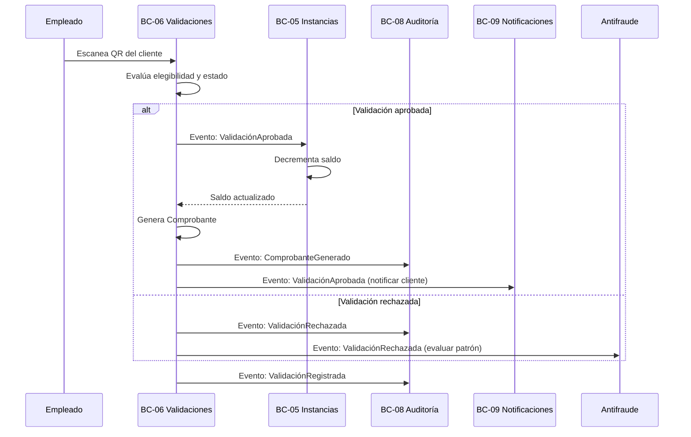

---

## 11. Servicios del Dominio

Los Servicios del Dominio encapsulan procesos que no pertenecen naturalmente a una entidad específica — procesos que coordinan múltiples entidades o que implementan algoritmos complejos de negocio.

---

### SRV-01 — Motor de Elegibilidad (EligibilityEngine)

**Responsabilidad:** Evaluar si un Cliente cumple las condiciones para que se le cree una Instancia de un Beneficio determinado.

**Entradas:** Beneficio (con sus condiciones), Cliente (con sus atributos y nivel de membresía).

**Salida:** Resultado de evaluación (elegible / no elegible + motivo).

**Proceso:**
1. Recupera todas las `CondicionElegibilidad` del beneficio.
2. Evalúa cada condición contra los atributos del cliente (nivel, antigüedad, edad, historial, etc.).
3. Combina los resultados usando el operador lógico definido (AND/OR).
4. Retorna el resultado con diagnóstico completo.

**No hace:** No crea la Instancia. Solo decide. La creación es responsabilidad del caso de uso.

---

### SRV-02 — Motor de Validación (ValidationEngine)

**Responsabilidad:** Ejecutar el proceso completo de evaluación de una solicitud de uso de beneficio en tiempo real.

**Entradas:** Pase Digital (ID del cliente), ID del Beneficio, Empleado que valida, Sucursal.

**Salida:** Resultado de validación (aprobado / rechazado + código de resultado).

**Proceso:**
1. Verifica que el Pase Digital existe y está ACTIVO.
2. Verifica que el Cliente está ACTIVO.
3. Verifica que la Empresa está ACTIVA.
4. Verifica que la Sucursal está ACTIVA.
5. Verifica que el Empleado pertenece a la empresa del beneficio.
6. Verifica que el Beneficio está ACTIVO y dentro de su vigencia.
7. Verifica que existe una Instancia ACTIVA para este Cliente/Beneficio.
8. Verifica que la Instancia tiene saldo disponible.
9. Verifica que no se superan los límites de uso por período.
10. Consulta al Motor Antifraude.
11. Si todo pasa: registra la Validación, decrementa el saldo, genera el Comprobante.
12. Si algo falla: registra la Validación con estado RECHAZADO y motivo específico.

**No hace:** No modifica el Beneficio. No crea Instancias. No notifica al cliente (lo hace el sistema de Notificaciones en respuesta al evento).

---

### SRV-03 — Motor Antifraude (AntiFraudEngine)

**Responsabilidad:** Analizar patrones de uso para detectar comportamientos anómalos y prevenir abuso del sistema.

**Señales de alerta que evalúa:**
- Múltiples intentos de validación fallidos consecutivos del mismo cliente.
- Velocidad de uso inusualmente alta (demasiados usos en poco tiempo).
- Mismo QR presentado simultáneamente en dos sucursales distantes.
- Uso fuera del horario habitual del cliente.
- IP o dispositivo del empleado no reconocido.
- Patrón de anulaciones y re-validaciones sospechoso.

**Salida:** Nivel de riesgo (BAJO, MEDIO, ALTO) + acciones recomendadas.

**No hace:** No bloquea por sí solo — emite señales. La decisión de bloqueo está en el Motor de Validación y en las reglas configuradas por el Superadmin.

---

### SRV-04 — Motor de Asignación de Instancias (EntitlementEngine)

**Responsabilidad:** Crear Instancias de Beneficio para los clientes elegibles cuando ocurre un evento relevante.

**Disparadores:**
- Un cliente verifica su cuenta.
- Un cliente cambia de nivel de membresía.
- Un nuevo Beneficio es publicado.
- Un Admin asigna manualmente una instancia.

**Proceso:**
1. Identifica clientes elegibles para el beneficio (o beneficios para el cliente).
2. Verifica que no existe ya una Instancia activa para ese par cliente/beneficio.
3. Crea la Instancia con el saldo inicial y la vigencia correcta.
4. Emite el evento `InstanceCreada`.

**No hace:** No valida usos. No evalúa condiciones en el momento del uso (eso lo hace el Motor de Validación).

---

### SRV-05 — Motor de Auditoría (AuditEngine)

**Responsabilidad:** Escuchar eventos del dominio y persistir Registros de Auditoría de forma centralizada.

**No hace:** No toma decisiones. No emite eventos. Solo persiste.

**Garantías:**
- Todos los eventos relevantes son persistidos sin excepción.
- Los registros son inmutables una vez escritos.
- El almacenamiento de auditoría es independiente del almacenamiento operacional.

---

### SRV-06 — Motor de Notificaciones (NotificationEngine)

**Responsabilidad:** Traducir eventos del dominio en comunicaciones concretas para usuarios y clientes.

**Proceso:**
1. Recibe un evento del dominio.
2. Determina si ese evento requiere notificación (según configuración).
3. Selecciona la plantilla y el canal apropiados.
4. Renderiza el contenido con los datos del evento.
5. Encola la notificación para envío.
6. Registra el intento y el resultado.

**No hace:** No decide si una validación fue exitosa. No genera Comprobantes.

---

### SRV-07 — Motor de Integraciones (IntegrationEngine)

**Responsabilidad:** Sincronizar datos entre Pase Digital y sistemas externos (POS, ERP, CRM, etc.).

**Modos:**
- **Saliente:** Enviar eventos de Pase Digital a sistemas externos (webhooks).
- **Entrante:** Recibir datos de sistemas externos para actualizar registros en Pase Digital.

**No hace:** No modifica directamente entidades del dominio — propone cambios que deben pasar por los mismos casos de uso del sistema.

---

### SRV-08 — Motor de Reportes (ReportingEngine)

**Responsabilidad:** Calcular métricas y generar reportes a partir del historial de eventos y validaciones.

**No hace:** No escribe en el dominio. Solo lee.

---

## 12. Invariantes

Las invariantes son reglas que el sistema debe hacer cumplir de forma absoluta, en cualquier circunstancia. A diferencia de las reglas del dominio, las invariantes no tienen excepciones conocidas y su violación representa un estado de corrupción del sistema.

### INV-01 — Invariantes de Instancia de Beneficio

| ID | Invariante |
|----|------------|
| INV-01-001 | El saldo de usos de una Instancia nunca puede ser negativo. |
| INV-01-002 | El saldo de usos de una Instancia nunca puede exceder el total de usos original. |
| INV-01-003 | Una Instancia AGOTADA (saldo = 0) no puede recibir validaciones. |
| INV-01-004 | Una Instancia VENCIDA no puede recibir validaciones. |
| INV-01-005 | Una Instancia CANCELADA no puede recibir validaciones ni ser reactivada. |
| INV-01-006 | Si el saldo llega a 0 y el estado no es AGOTADA, es un estado inválido que debe corregirse. |

### INV-02 — Invariantes de Validación

| ID | Invariante |
|----|------------|
| INV-02-001 | Una Validación registrada no puede ser eliminada — solo anulada. |
| INV-02-002 | Una Validación APROBADA siempre tiene exactamente un Comprobante. |
| INV-02-003 | Una Validación RECHAZADA nunca tiene Comprobante. |
| INV-02-004 | Una Validación no puede ser aprobada si el Beneficio o la Empresa están SUSPENDIDOS. |
| INV-02-005 | Una Validación no puede ser aprobada si el Pase Digital del cliente está BLOQUEADO. |
| INV-02-006 | El timestamp de una Validación nunca puede ser modificado después de su creación. |

### INV-03 — Invariantes de Auditoría

| ID | Invariante |
|----|------------|
| INV-03-001 | Un Registro de Auditoría nunca puede ser modificado ni eliminado. |
| INV-03-002 | Toda validación (aprobada o rechazada) debe tener exactamente un Registro de Auditoría. |
| INV-03-003 | Toda transición de estado de una entidad principal debe tener un Registro de Auditoría. |

### INV-04 — Invariantes de Multitenancy

| ID | Invariante |
|----|------------|
| INV-04-001 | Un Empleado nunca puede ver ni operar datos de una empresa diferente a la suya. |
| INV-04-002 | Un Admin de Empresa nunca puede ver ni modificar datos de otra empresa. |
| INV-04-003 | Una consulta de datos siempre debe estar filtrada por `empresaId`, excepto para Superadmin. |
| INV-04-004 | El `empresaId` de una entidad nunca puede modificarse después de su creación. |

### INV-05 — Invariantes de Identidad

| ID | Invariante |
|----|------------|
| INV-05-001 | El correo electrónico de un Usuario del Sistema es único en todo el sistema. |
| INV-05-002 | El código del Pase Digital es único en todo el sistema. |
| INV-05-003 | El número de Comprobante es único en todo el sistema. |
| INV-05-004 | Los IDs de entidades nunca se reutilizan, incluso si la entidad es eliminada. |

---

## 13. Casos Límite

### CL-01 — Beneficio suspendido durante una validación en proceso

**Escenario:** Un empleado inicia el proceso de escaneo del QR del cliente. En el microsegundo entre que el QR es leído y que la validación es registrada, un Superadmin suspende el beneficio.

**Comportamiento esperado:** El Motor de Validación evalúa el estado del beneficio en el momento exacto de registrar la validación. Si el beneficio está SUSPENDIDO al momento del commit de la transacción, la validación debe rechazarse con código `BENEFICIO_SUSPENDIDO`. No existe una "reserva" previa del beneficio.

**Garantía:** Las transacciones de validación deben leer el estado actual con bloqueo de lectura consistente (snapshot isolation o serializable).

---

### CL-02 — Cliente eliminado con instancias activas

**Escenario:** Un cliente con 3 instancias activas solicita ser eliminado del sistema.

**Comportamiento esperado:** El proceso de eliminación (soft delete) cancela todas las instancias activas del cliente con motivo `CLIENTE_ELIMINADO`. El historial de validaciones se preserva. El Pase Digital pasa a estado REVOCADO. El correo del cliente es anonimizado o eliminado según política GDPR.

**Invariante:** El historial de Validaciones y Comprobantes no se elimina — es un registro contable. Solo se desvincula de los datos personales identificables.

---

### CL-03 — Sucursal cerrada con empleados asignados

**Escenario:** Se cierra una sucursal que tiene empleados asignados y validaciones en curso.

**Comportamiento esperado:** Los empleados asignados a esa sucursal son notificados y reasignados (a otra sucursal o dejados sin sucursal específica). Las validaciones registradas en esa sucursal permanecen intactas en el historial. Los beneficios restringidos a esa sucursal dejan de estar disponibles.

---

### CL-04 — Empleado desactivado con sesión activa

**Escenario:** Un Admin desactiva a un empleado mientras este tiene una sesión abierta en el dispositivo de escaneo.

**Comportamiento esperado:** La sesión del empleado debe invalidarse inmediatamente. Cualquier intento de validación posterior debe rechazarse con código `ACTOR_NO_AUTORIZADO`. El sistema no puede esperar a que la sesión expire naturalmente.

**Mecanismo:** Las sesiones tienen un TTL corto y deben verificarse contra el estado del usuario en cada operación sensible.

---

### CL-05 — Empresa suspendida durante una validación

**Escenario:** Similar a CL-01 pero a nivel de empresa. La empresa es suspendida mientras una validación está en proceso.

**Comportamiento esperado:** Mismo principio que CL-01. El estado de la empresa se evalúa en el momento del commit. Si la empresa está SUSPENDIDA, la validación se rechaza.

---

### CL-06 — Cliente con múltiples instancias del mismo beneficio

**Escenario:** Por un error de proceso, un cliente recibe dos Instancias del mismo Beneficio simultáneamente.

**Comportamiento esperado:** El Motor de Asignación debe verificar, antes de crear una Instancia, que no existe ya una Instancia ACTIVA para ese par cliente/beneficio. Si ya existe, se rechaza la creación con error `INSTANCIA_DUPLICADA`. Si el error ya ocurrió (en producción), el proceso de auditoría debe detectarlo y el Superadmin debe decidir cuál cancelar.

---

### CL-07 — Beneficio vencido durante el proceso de validación

**Escenario:** La fecha de fin de un beneficio es las 23:59:59 y el empleado inicia la validación a las 23:59:58. La transacción tarda 2 segundos.

**Comportamiento esperado:** La vigencia se evalúa en el momento del commit de la transacción. Si la fecha ha vencido al momento de registrar, la validación se rechaza. La granularidad del tiempo es de segundos; no hay "gracia" por milisegundos.

---

### CL-08 — Factura anulada después de que activó la suscripción

**Escenario:** Una empresa paga, la suscripción se activa. Días después, la factura es anulada o reportada como fraudulenta.

**Comportamiento esperado:** El Superadmin debe poder suspender manualmente la empresa. El sistema no revierte automáticamente validaciones ya procesadas durante el período fraudulento — eso es una investigación manual. El historial permanece intacto. La suspensión bloquea operaciones futuras.

---

### CL-09 — Cliente con membresía en múltiples empresas y el mismo correo

**Escenario:** La misma persona se registra como cliente en la empresa A y en la empresa B, usando el mismo correo electrónico.

**Comportamiento esperado:** Son dos entidades Cliente completamente independientes. Pase Digital no une implícitamente perfiles de distintas empresas. Cada empresa ve solo a sus clientes. El correo puede repetirse entre empresas porque el identificador único del cliente incluye la empresa.

---

### CL-10 — Integración externa falla durante una validación

**Escenario:** Una empresa usa una integración con su POS para confirmar validaciones. El POS está caído durante el proceso.

**Comportamiento esperado:** El sistema de Pase Digital no debe quedar bloqueado por fallos de sistemas externos. La validación se registra en Pase Digital. La sincronización con el POS se encola para reintento. Si el POS falla consistentemente, la integración marca su estado como `DEGRADADA` y notifica al Admin.

**Principio:** Pase Digital es la fuente de verdad para sus datos. No delega su consistencia a sistemas externos.

---

### CL-11 — Regeneración del Pase Digital con validaciones en tránsito

**Escenario:** Un cliente solicita regenerar su Pase Digital (por pérdida del teléfono). Simultáneamente, un empleado intenta escanear el QR anterior.

**Comportamiento esperado:** Al regenerarse el Pase Digital, el código anterior queda inmediatamente REVOCADO. Cualquier intento de validación con el código anterior se rechaza con `PASE_REVOCADO`. Las Instancias y el historial del cliente no se ven afectados — solo cambia el código de identificación.

---

### CL-12 — Anulación en cascada por suspensión de empresa

**Escenario:** Una empresa con 10,000 clientes activos y 50 beneficios publicados es suspendida.

**Comportamiento esperado:** La suspensión no cancela masivamente todas las instancias ni anula las validaciones históricas. Solo bloquea operaciones futuras. Si la empresa es eventualmente reactivada, todo vuelve a funcionar sin reconstruir datos. Si pasa a INACTIVA, se procesan las cancelaciones en cola como proceso en segundo plano.

---

## 14. Diagramas

### 14.1 Mapa general del dominio

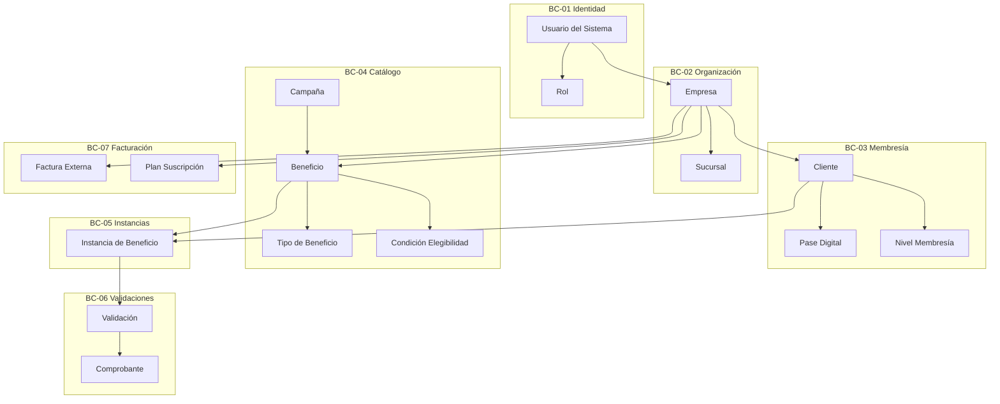

### 14.2 Diagrama de agregados

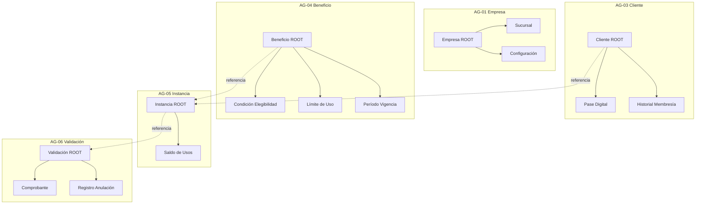

### 14.3 Flujo de vida completo de un beneficio

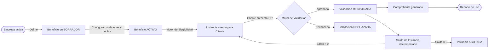

### 14.4 Diagrama de Bounded Contexts y comunicación

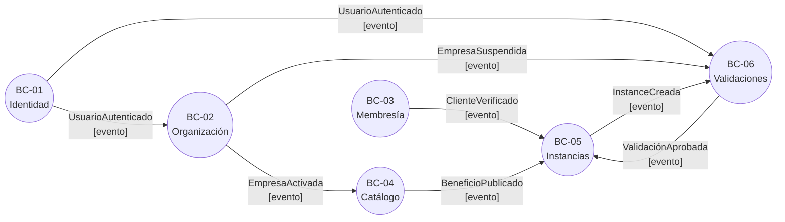

---

## 15. Preparación para la Base de Datos

### 15.1 De entidades a tablas

Cada Entidad del dominio se convertirá en una tabla de base de datos. El ID de la entidad se convierte en la clave primaria. Las relaciones entre entidades se convierten en claves foráneas. Los Value Objects, dependiendo de su complejidad, se convierten en columnas embebidas (p. ej., `monto` + `moneda` en la misma tabla) o en tablas separadas.

Los Aggregate Roots definen los límites de las transacciones: una operación que modifica un agregado debe ejecutarse en una sola transacción de base de datos.

### 15.2 Partición por empresa (multitenancy)

Casi todas las tablas del sistema llevarán una columna `empresaId` como columna de partición lógica. Esto permite:

- **Seguridad:** Un índice compuesto `(empresaId, pk)` garantiza que las consultas nunca mezclan datos de empresas.
- **Rendimiento:** Las consultas siempre filtran por `empresaId` primero, aprovechando índices selectivos.
- **Escalabilidad futura:** Permite migrar a particionamiento físico (PostgreSQL table partitioning) sin cambiar el modelo de datos.

### 15.3 Soft delete universal

Ninguna entidad principal del dominio se elimina físicamente. El soft delete se implementa mediante:
- Una columna `eliminadoEn` (timestamp nullable) o `estado` (con valor `ELIMINADO`/`INACTIVO`).
- Un índice parcial que excluye registros eliminados de las consultas operacionales.
- Un proceso de archivado periódico que mueve datos eliminados a tablas de archivo.

### 15.4 Inmutabilidad de auditoría

La tabla de Registros de Auditoría se implementará con:
- Restricción `NO DELETE` a nivel de base de datos (revocar permiso `DELETE` al usuario de la aplicación).
- Almacenamiento en tabla separada con usuario de base de datos exclusivo de solo escritura.
- Consideración de particionamiento por fecha para gestión del volumen.

### 15.5 Diseño para extensibilidad

El modelo de dominio utiliza varias estrategias que facilitan la extensión:

1. **Tipo de Beneficio como entidad extensible:** Los nuevos tipos se agregan sin modificar la tabla de Beneficios. La tabla `TipoBeneficio` actúa como catálogo.

2. **Condiciones de Elegibilidad como política:** Cada condición tiene un `tipo` y `parámetros` en formato estructurado. Agregar un nuevo tipo de condición no modifica el modelo relacional.

3. **Eventos del dominio como log:** La tabla de Auditoría almacena eventos genéricos con payload JSON. Nuevos tipos de eventos no requieren migraciones de schema.

4. **Value Objects como columnas embebidas:** `Dinero` (monto + moneda), `Período` (inicio + fin), `Límite de Uso` (cantidad + dimensión) se almacenan como columnas en la misma tabla del agregado. No hay overhead de joins para datos que conceptualmente son parte de una entidad.

### 15.6 Consideraciones de consistencia

Los Agregados definen los límites de consistencia inmediata (dentro de la misma transacción). La consistencia entre Agregados es eventual (a través de eventos del dominio). Esto permite:

- Escalar lecturas con réplicas de solo lectura.
- Implementar colas de eventos para procesos asíncronos (notificaciones, sincronizaciones).
- Mantener el tiempo de respuesta de las validaciones bajo (< 200ms) al no bloquear la transacción por procesos secundarios.

---

## 16. Auditoría del Modelo

*Esta sección identifica las áreas que requieren revisión, refinamiento o documentos complementarios antes de iniciar el diseño de base de datos.*

### 16.1 Entidades identificadas como incompletas

| ID | Entidad | Gap | Acción requerida |
|----|---------|-----|-----------------|
| GAP-01 | Condición de Elegibilidad | Los tipos de condición y sus parámetros exactos aún no están formalizados | Documento: Especificación del Motor de Elegibilidad |
| GAP-02 | Nivel de Membresía | Los criterios de ascenso/descenso automático no están modelados | Documento: Especificación de Membresía Progresiva |
| GAP-03 | Integración | El modelo de conectores (POS, ERP, etc.) necesita especificación por tipo | Documento: Integration Connectors Specification |
| GAP-04 | Plan de Suscripción | Los límites exactos por plan no están definidos (requiere decisión comercial) | Decisión de producto + Documento: Pricing Model |
| GAP-05 | Notificación | Las plantillas y disparadores exactos no están modelados | Documento: Notification Templates Catalog |

### 16.2 Relaciones que requieren revisión

| ID | Relación | Incertidumbre |
|----|----------|---------------|
| REL-01 | Beneficio ↔ Sucursal | ¿Un beneficio SIN restricción de sucursal aplica a TODAS las sucursales automáticamente? Necesita confirmación de negocio. |
| REL-02 | Instancia ↔ Renovación | El modelo actual no contempla la renovación de instancias. ¿Se crea una nueva instancia o se reinicia el saldo de la existente? |
| REL-03 | Cliente ↔ Empresa | ¿Puede el mismo correo registrarse en más de 3 empresas? ¿Hay un límite? |
| REL-04 | Campaña ↔ Beneficio | ¿Un beneficio puede moverse entre campañas o es asignación permanente? |

### 16.3 Reglas de dominio pendientes de formalización

| ID | Área | Descripción |
|----|------|-------------|
| RDP-01 | Prioridad de beneficios | Si un cliente tiene múltiples beneficios del mismo tipo, ¿cuál se presenta primero? |
| RDP-02 | Expiración de puntos | Si el sistema soporta acumulación de puntos, ¿cuándo vencen? ¿Pueden transferirse? |
| RDP-03 | Proceso de disputa | Si un cliente disputa una validación, ¿cuál es el proceso formal? |
| RDP-04 | Reglas multi-sucursal | ¿El límite "3 usos por semana" se aplica globalmente o por sucursal? |
| RDP-05 | Gracia por vencimiento | ¿Hay un período de gracia cuando un beneficio vence? ¿Y cuando la suscripción de la empresa vence? |

### 16.4 Entidades que podrían ser necesarias en fases futuras

| Entidad futura | Contexto | Justificación |
|---------------|----------|---------------|
| `Reseña` | BC-03 Membresía | Clientes califican la experiencia al usar un beneficio |
| `Invitación` | BC-03 Membresía | Referidos entre clientes con beneficio adicional |
| `Wallet de Puntos` | BC-05 Instancias | Acumulación de puntos como moneda interna |
| `Transacción de Puntos` | BC-05 Instancias | Historial de débitos y créditos del wallet |
| `Grupo de Clientes` | BC-03 Membresía | Segmentación manual de clientes para campañas dirigidas |
| `Dispositivo de Escaneo` | BC-02 Organización | Registro de tablets/dispositivos autorizados por sucursal |
| `Plantilla de Beneficio` | BC-04 Catálogo | Templates reutilizables para crear beneficios rápidamente |
| `Periodo de Gracia` | BC-05 Instancias | Extensión temporal del vencimiento de una instancia |

### 16.5 Invariantes que requieren implementación especial

| ID | Invariante | Complejidad de implementación |
|----|-----------|-------------------------------|
| IMPL-01 | El saldo de una Instancia nunca puede ser negativo bajo condiciones de concurrencia | Requiere bloqueo optimista o SERIALIZABLE en PostgreSQL. Riesgo de race condition si dos empleados validan simultáneamente el mismo beneficio del mismo cliente. |
| IMPL-02 | El código de Pase Digital debe ser único globalmente y no predecible | Requiere generador criptográfico + verificación de colisión en DB |
| IMPL-03 | Los registros de auditoría son inmutables | Requiere configuración a nivel de base de datos (no solo a nivel de aplicación) |

### 16.6 Conclusión de la auditoría

El modelo presentado en este documento es **suficientemente completo y coherente** para iniciar el diseño de base de datos. Los GAPs identificados son áreas de refinamiento, no bloqueantes fundamentales para el núcleo del sistema.

El núcleo inmutable del dominio — `Empresa → Beneficio → Instancia → Validación → Comprobante` — está completamente modelado, con sus invariantes, estados y eventos bien definidos.

Los siguientes documentos deben crearse antes de iniciar la implementación de módulos avanzados:

1. **DM-002:** Diseño de Base de Datos (proyección del modelo del dominio en PostgreSQL + Prisma)
2. **DM-003:** Especificación del Motor de Elegibilidad
3. **DM-004:** Integration Connectors Specification
4. **DM-005:** Notification Templates Catalog

---

*Document ID: DM-001 | Version: 1.0.0 | Status: APPROVED*  
*© 2026 Pase Digital — Confidential and Proprietary*
