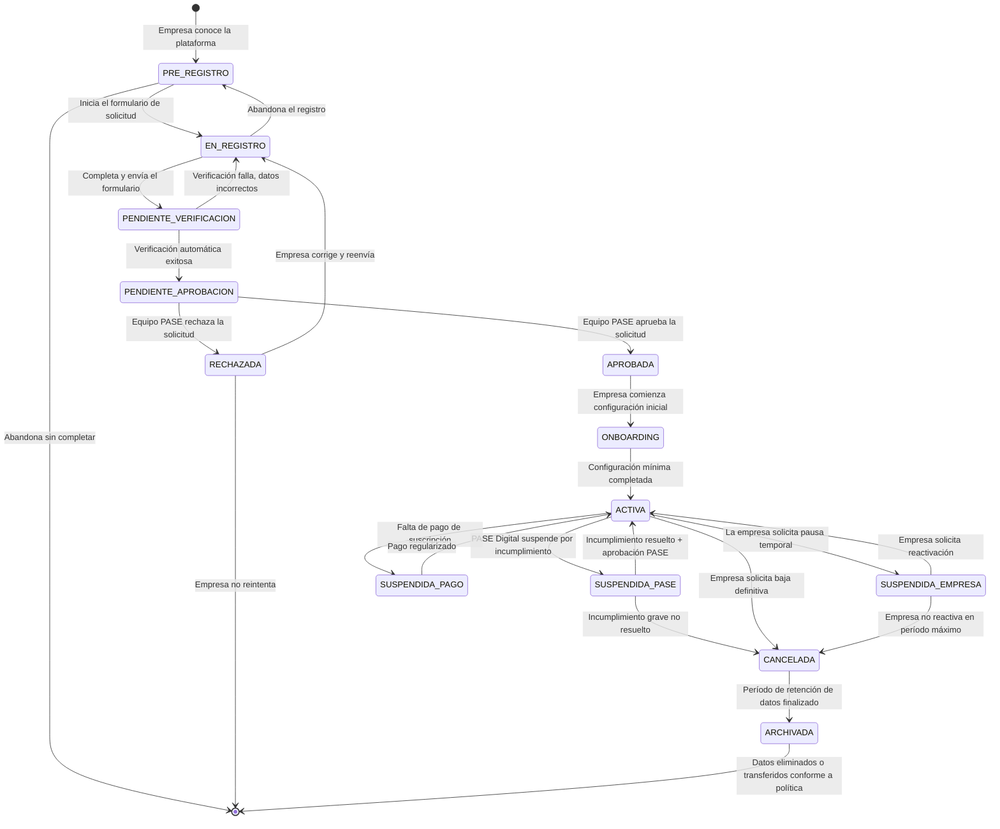
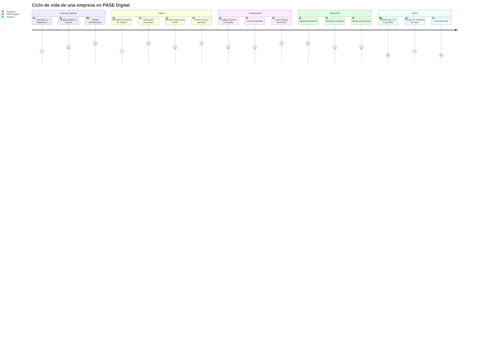

# Companies Module — Módulo de Empresas

**Documento:** CM-001
**Versión:** 1.0.0
**Fecha:** 2026-06-27
**Estado:** Borrador Oficial
**Clasificación:** Documento de Producto — Especificación Funcional
**Proyecto:** PASE Digital Platform

---

> *"Una empresa en PASE Digital no es un usuario con más permisos. Es una entidad autónoma, con su propia identidad, su propio equipo, sus propias reglas y sus propios clientes. El módulo de Empresas es el contenedor que hace posible que todo lo demás exista."*

---

## Tabla de Contenidos

1. [Introducción — ¿Qué representa una Empresa dentro de la plataforma?](#1-introducción)
2. [Ciclo de Vida de una Empresa](#2-ciclo-de-vida-de-una-empresa)
3. [Registro de Empresas](#3-registro-de-empresas)
4. [Perfil de la Empresa](#4-perfil-de-la-empresa)
5. [Configuración Inicial](#5-configuración-inicial)
6. [Gestión de Sucursales](#6-gestión-de-sucursales)
7. [Gestión de Empleados](#7-gestión-de-empleados)
8. [Configuración Comercial](#8-configuración-comercial)
9. [Dashboard Empresarial](#9-dashboard-empresarial)
10. [Reglas del Módulo](#10-reglas-del-módulo)
11. [Escenarios Reales](#11-escenarios-reales)
12. [Escalabilidad](#12-escalabilidad)
13. [Autoauditoría](#13-autoauditoría)

---

## 1. Introducción

### 1.1 ¿Qué representa una Empresa dentro de la plataforma?

Una **Empresa** es la unidad organizacional fundamental dentro de PASE Digital. Todo lo que existe en la plataforma pertenece a una empresa o existe en función de una empresa: sus sucursales, sus empleados, sus clientes, sus promociones, sus validaciones, sus reportes.

Desde la perspectiva del producto, una Empresa es un **inquilino** (tenant) dentro de un edificio multiempresa. El edificio — la plataforma — es de PASE Digital. Pero cada apartamento — el espacio de datos, configuración y operación de cada empresa — es totalmente privado, independiente e impenetrable desde los demás apartamentos. Esta metáfora del multi-tenancy no es solo técnica; define todo el modelo de negocio, de confianza y de responsabilidad del producto.

Desde la perspectiva del negocio, una Empresa es un **cliente de PASE Digital** que ha contratado la plataforma para gestionar sus programas de promociones y fidelización. La empresa no usa la plataforma para administrar sus operaciones centrales (ventas, inventario, nómina), sino específicamente para construir, publicar y medir las relaciones de valor que establece con sus propios clientes a través de beneficios digitales.

Desde la perspectiva operativa, una Empresa es el **contexto de toda acción** dentro del sistema. No existe ninguna operación significativa en la plataforma que no esté vinculada a una empresa específica. Un cliente final existe porque es cliente de una empresa. Una promoción existe porque fue creada por una empresa. Una validación existe porque ocurrió en un establecimiento de una empresa.

### 1.2 Por qué la Empresa es la entidad más importante del sistema

La jerarquía de entidades en PASE Digital es:

```
PASE Digital (plataforma)
    └── Empresa
            ├── Sucursales
            ├── Empleados
            ├── Clientes
            ├── Promociones
            ├── Validaciones
            └── Reportes
```

Cada elemento de este árbol existe como descendiente de una Empresa. Si la empresa desaparece del sistema, todos sus descendientes dejan de tener contexto operativo. Esta centralidad no es una decisión arbitraria de diseño: refleja la realidad del negocio. Una promoción sin empresa es un descuento sin comercio. Un cliente sin empresa es un consumidor sin relación. Una validación sin empresa es un evento sin origen.

### 1.3 Responsabilidades de la Empresa en la plataforma

Una empresa que opera dentro de PASE Digital tiene responsabilidades bien definidas:

**Responsabilidades de configuración:**
- Mantener actualizado su perfil público (nombre, logo, descripción, horarios, ubicación)
- Configurar sus sucursales con información precisa y actualizada
- Gestionar el equipo de empleados con los roles y permisos correctos
- Definir las reglas de validación que se aplicarán en sus establecimientos

**Responsabilidades operativas:**
- Diseñar y publicar sus propias promociones dentro de los límites de su plan de suscripción
- Asegurar que sus empleados (cajeros) usen el sistema correctamente
- Monitorear el uso de las promociones y responder ante anomalías
- Respetar las promociones publicadas y no modificar condiciones retroactivamente

**Responsabilidades hacia sus clientes:**
- Cumplir los beneficios prometidos en sus promociones
- Comunicar claramente las condiciones y restricciones de cada beneficio
- Proteger los datos personales de sus clientes conforme a la normativa aplicable
- Mantener disponibles las promociones activas durante el período declarado

**Responsabilidades hacia PASE Digital:**
- Mantener su suscripción activa y al día
- No utilizar la plataforma para fines distintos a los promocionales declarados
- No intentar acceder a información de otras empresas
- Reportar cualquier comportamiento anómalo de clientes o empleados que detecten

### 1.4 Lo que una Empresa NO puede hacer en la plataforma

Para evitar confusiones y abusos, estas acciones están expresamente fuera del alcance de una empresa en PASE Digital:

| Acción prohibida | Razón |
|---|---|
| Ver datos de otra empresa | Aislamiento multi-tenant — los datos de cada empresa son privados |
| Modificar los datos de clientes que también son clientes de otra empresa | Los clientes pertenecen a la relación bilateral empresa-cliente, no a la plataforma en abstracto |
| Validar promociones que pertenecen a otra empresa | Cada empresa solo puede operar sus propias promociones |
| Acceder al historial de transacciones de otra empresa | El historial es propiedad del tenant, inaccesible desde otros tenants |
| Usar los empleados de otra empresa en sus operaciones | Los empleados son asignados a una empresa específica |
| Publicar contenido engañoso o falso como promoción | Las promociones son compromisos contractuales con el cliente final |
| Transferir su base de clientes a otra empresa dentro de la plataforma | Los vínculos cliente-empresa son propios de cada empresa |

### 1.5 Por qué el módulo de Empresas debe ser independiente del tipo de negocio

Un car wash y un hotel cinco estrellas son empresas radicalmente distintas en tamaño, operación y modelo de negocio. Sin embargo, ambos tienen sucursales (o un único establecimiento), empleados, clientes y promociones. La plataforma no puede estar diseñada específicamente para la industria automotriz ni para la hospitalidad: debe ser igualmente funcional para cualquier negocio basado en la relación recurrente con sus clientes.

Esta independencia del tipo de negocio se logra a través de tres principios:

1. **Abstracción de la industria en el perfil:** La empresa declara su industria y categoría, pero esa información solo afecta la presentación y la clasificación. No cambia el comportamiento del sistema.

2. **Catálogo de servicios configurable:** Cada empresa define sus propios servicios o productos dentro de la plataforma. No existe un catálogo global de "lavados de autos" o "menús de restaurante". La empresa trae su propio vocabulario.

3. **Promociones sin supuestos de industria:** El Motor de Promociones (PE-001) no hace ninguna suposición sobre el tipo de transacción que ocurre. Opera con los parámetros que la empresa configura, sean cuales sean.

---

## 2. Ciclo de Vida de una Empresa

### 2.1 Visión general del ciclo

Una empresa pasa por etapas bien definidas desde que descubre la plataforma hasta que eventualmente cierra su operación. Comprender estas etapas es fundamental para diseñar correctamente los flujos de experiencia, las notificaciones, los permisos y los límites operativos en cada momento.



### 2.2 Descripción detallada de cada etapa

#### ETAPA 1 — PRE_REGISTRO

**¿Qué es?**
El estado previo al registro formal. La empresa ha tenido contacto con la plataforma (a través de publicidad, referencia comercial, demostración, o exploración orgánica) pero aún no ha iniciado el proceso de solicitud.

**¿Qué ocurre en esta etapa?**
- La empresa puede explorar el sitio público de PASE Digital
- Puede consultar planes y precios sin necesidad de identificarse
- Puede solicitar una demostración o una llamada comercial
- Puede iniciar el formulario de registro y guardarlo como borrador

**¿Qué condición la avanza al siguiente estado?**
La empresa completa el formulario inicial y lo envía para revisión.

**¿Cuánto tiempo puede durar?**
Sin límite. Una empresa puede estar en PRE_REGISTRO indefinidamente. El sistema puede tener registros de interés (e.g., dejó su correo para recibir información) sin que eso constituya un registro formal.

---

#### ETAPA 2 — EN_REGISTRO

**¿Qué es?**
La empresa ha iniciado activamente el proceso de registro y está completando el formulario de solicitud de alta.

**¿Qué ocurre en esta etapa?**
- El formulario de registro está siendo completado
- Los datos pueden guardarse como borrador y continuarse en otra sesión
- No se ha creado ningún acceso al sistema aún
- El sistema puede enviar recordatorios si el registro no se completa en N días

**¿Qué información se recopila?**
Ver Sección 3 — Registro de Empresas.

**¿Qué condición la avanza al siguiente estado?**
El formulario es enviado con todos los campos obligatorios completados.

**¿Qué puede interrumpir el proceso?**
- El solicitante abandona sin enviar (el borrador permanece por 30 días)
- Los datos no pasan la validación automática básica (e.g., formato de correo incorrecto, número de identificación fiscal inválido)

---

#### ETAPA 3 — PENDIENTE_VERIFICACION

**¿Qué es?**
La empresa ha enviado su formulario y el sistema está realizando verificaciones automáticas básicas.

**¿Qué verificaciones se realizan automáticamente?**
- Que el correo electrónico del solicitante sea válido y no esté registrado en otra empresa activa con el mismo rol
- Que el nombre comercial no sea idéntico a una empresa ya activa en la misma industria y región (prevención de duplicados)
- Que el número de identificación fiscal, si fue provisto, tenga un formato válido para el país declarado
- Que los datos de contacto sean coherentes (teléfono con código de país correcto, etc.)
- Que no esté en lista de empresas rechazadas por incumplimiento previo (en caso de reintento)

**¿Cuánto dura?**
Las verificaciones automáticas son instantáneas (segundos). Si alguna requiere verificación manual por parte del equipo PASE, puede extenderse hasta 24 horas hábiles.

**¿Qué condición la avanza al siguiente estado?**
Todas las verificaciones automáticas son superadas satisfactoriamente.

**¿Qué la devuelve al estado anterior?**
Alguna verificación falla. El sistema notifica al solicitante con el detalle del problema y la posibilidad de corregir y reenviar.

---

#### ETAPA 4 — PENDIENTE_APROBACION

**¿Qué es?**
La empresa pasó las verificaciones automáticas y ahora espera la revisión manual del equipo PASE Digital.

**¿Por qué existe una aprobación manual?**
La plataforma no es un marketplace abierto donde cualquiera puede publicar en segundos. PASE Digital revisa cada solicitud para:
- Confirmar que el negocio existe y opera de forma legítima
- Validar que la industria y el tipo de negocio son compatibles con la plataforma
- Verificar que no hay conflicto de intereses con la cuenta de otra empresa ya existente
- Asegurar que el solicitante tiene autoridad para representar a la empresa
- En planes BUSINESS o ENTERPRISE, revisar la viabilidad del acuerdo comercial

**¿Cuánto tarda la aprobación?**
- Plan STARTER: hasta 1 día hábil (puede ser parcialmente automatizado en el futuro)
- Plan GROWTH: hasta 2 días hábiles
- Plan BUSINESS / ENTERPRISE: hasta 5 días hábiles (incluye una llamada de bienvenida)

**¿Qué ocurre si es rechazada?**
El equipo PASE envía una notificación con el motivo del rechazo. Los motivos más comunes:
- El tipo de negocio no es compatible con la plataforma (e.g., industrias prohibidas)
- La información provista es insuficiente o no verificable
- El solicitante tiene antecedentes de mal uso en plataformas similares
- La empresa ya existe en la plataforma con otra cuenta (duplicado confirmado)

Si el rechazo es por información insuficiente, la empresa puede corregir y reenviar. Si es por incompatibilidad de industria o antecedentes, el rechazo es definitivo.

---

#### ETAPA 5 — APROBADA → ONBOARDING

**¿Qué es?**
La solicitud fue aprobada. Se crea la cuenta de la empresa en el sistema con estado ONBOARDING. El administrador designado recibe sus credenciales de acceso y puede ingresar por primera vez.

**¿Qué ocurre en esta etapa?**
- El administrador configura el perfil básico de la empresa
- Carga el logo y la imagen de portada
- Configura al menos una sucursal (si aplica) o el establecimiento principal
- Invita a los primeros empleados
- Revisa y acepta los términos de uso y la política de privacidad
- Realiza (opcionalmente) una sesión de onboarding guiado con el equipo PASE o un tutorial interactivo
- Configura el primer beneficio o promoción como prueba

**¿Qué límites aplican durante ONBOARDING?**
- La empresa puede crear y configurar contenido, pero no publicar promociones visibles para el público
- Los empleados invitados pueden ingresar pero su capacidad operativa está limitada hasta que el onboarding sea completado
- Las integraciones externas (si aplican) pueden ser configuradas pero no activadas

**¿Qué condición la avanza al estado ACTIVA?**
La empresa completa el checklist de configuración mínima. Este checklist incluye:
1. Perfil completado al 80% o más (campos clave: nombre, logo, descripción, horarios, industria)
2. Al menos una sucursal configurada con dirección
3. Al menos un usuario operativo creado (cajero o supervisor)
4. Aceptación de términos de uso completada
5. Método de pago registrado (para planes de pago)

---

#### ETAPA 6 — ACTIVA

**¿Qué es?**
El estado operativo normal de la empresa. La empresa puede usar todas las funcionalidades de la plataforma según su plan.

**¿Qué puede hacer en este estado?**
- Publicar y gestionar promociones
- Registrar y atender clientes
- Gestionar empleados y sucursales
- Ver reportes y analíticas
- Modificar su perfil y configuración
- Contratar o cambiar de plan
- Agregar integraciones

**¿Cuánto tiempo puede permanecer en este estado?**
Indefinidamente, siempre que mantenga su suscripción activa y cumpla los términos de uso.

---

#### ETAPA 7 — SUSPENDIDA (tres causas distintas)

**SUSPENDIDA_EMPRESA — Solicitada por la propia empresa**

La empresa solicita una pausa temporal en su operación. Esto es frecuente en negocios estacionales (un hotel de montaña que cierra en verano) o ante circunstancias extraordinarias (remodelación, cambio de dueño en proceso, emergencias).

- La empresa puede solicitar la suspensión desde su panel
- La suspensión es inmediata o con fecha programada
- Durante la suspensión, las promociones activas pasan a estado PAUSED
- Los empleados no pueden operar el sistema (no pueden validar pases)
- El perfil de la empresa permanece visible pero con estado "temporalmente no disponible"
- La facturación puede ser pausada o continuar según el tipo de plan (definir por plan)
- Duración máxima: 3 meses. Si no se reactiva, pasa automáticamente a CANCELADA

**SUSPENDIDA_PASE — Aplicada por el equipo PASE Digital**

PASE Digital puede suspender una empresa por:
- Incumplimiento de términos de uso (promociones engañosas, spam de clientes, mal uso de datos)
- Actividad sospechosa detectada por el sistema (picos anómalos de validaciones, patrones de fraude)
- Resolución de una disputa con un cliente mientras se investiga
- Auditoría programada requerida por motivos regulatorios

- La suspensión es notificada con el motivo, evidencia y pasos para resolución
- La empresa puede responder y aportar evidencia contraria
- El equipo PASE tiene hasta 5 días hábiles para resolver la investigación
- Si la empresa resuelve el incumplimiento, es reactivada con nota en su historial
- Si no, puede pasar a CANCELADA

**SUSPENDIDA_PAGO — Por falta de pago**

- La suscripción venció y el pago no fue procesado
- El sistema da un período de gracia de 7 días antes de suspender
- Durante los 7 días, la empresa puede seguir operando pero recibe recordatorios
- Al día 8 sin pago, el estado cambia a SUSPENDIDA_PAGO
- Las promociones son pausadas automáticamente
- Los empleados no pueden validar nuevas transacciones
- La empresa puede ver sus reportes pero no crear nuevo contenido
- La reactivación es inmediata al regularizar el pago

---

#### ETAPA 8 — CANCELADA

**¿Qué es?**
La empresa ha terminado su relación con la plataforma, ya sea por decisión propia o por incumplimiento grave.

**¿Qué ocurre al cancelar?**
- Todas las promociones activas son canceladas de forma inmediata
- Los clientes que tenían beneficios pendientes (sellos, puntos acumulados, planes activos) son notificados
- Los empleados pierden acceso al sistema
- El perfil público de la empresa deja de ser accesible
- Los datos son retenidos por un período de 24 meses para cumplimiento legal y resolución de disputas
- El administrador puede exportar sus datos durante los primeros 30 días de cancelación

**¿Puede revertirse la cancelación?**
Si la empresa cancela voluntariamente, puede volver a registrarse como nueva empresa. Los datos históricos pueden ser vinculados a la nueva cuenta bajo solicitud al equipo PASE, sujeto a verificación.

Si la cancelación fue por incumplimiento grave, el equipo PASE puede bloquear el reregistro de la misma empresa (por nombre fiscal y datos de contacto).

---

#### ETAPA 9 — ARCHIVADA

**¿Qué es?**
El estado final de una empresa. La empresa fue cancelada y el período de retención de datos (24 meses) ha transcurrido.

**¿Qué ocurre?**
- Los datos de la empresa son eliminados conforme a la política de privacidad y las regulaciones aplicables, O
- Son anonimizados para fines estadísticos
- El registro de la empresa permanece como un ID histórico sin información personal asociada
- Las validaciones y transacciones históricas son desvinculadas del nombre de la empresa pero conservadas para métricas agregadas de la plataforma

---

### 2.3 Diagrama de ciclo de vida simplificado para comunicación con la empresa



---

## 3. Registro de Empresas

### 3.1 Principio general del registro

El proceso de registro de una empresa en PASE Digital tiene dos objetivos simultáneos y en tensión constante:

1. **Fricción suficiente** para asegurar que solo empresas legítimas accedan a la plataforma y para recopilar información de calidad que permita al Motor funcionar correctamente.

2. **Fluidez suficiente** para que el proceso no sea tan complejo que empresas válidas lo abandonen.

El balance elegido es: **registro mínimo inicial + enriquecimiento progresivo**. La empresa proporciona los datos mínimos para ser evaluada y aprobada. El resto del perfil se completa durante el onboarding y en la operación diaria.

### 3.2 Información requerida en el formulario de registro

#### Bloque 1 — Identificación de la empresa (OBLIGATORIO)

| Campo | Descripción | Validación |
|---|---|---|
| **Nombre comercial** | El nombre con el que opera el negocio y es conocido por sus clientes | Mínimo 2 caracteres, máximo 100. No puede ser idéntico a una empresa activa en la misma industria + ciudad |
| **Razón social** | Nombre legal registrado ante las autoridades fiscales | Opcional en el formulario inicial, obligatorio antes de la facturación |
| **Industria** | Categoría principal del negocio (de una lista cerrada) | Selección de catálogo; ver sección 4.3 |
| **Categoría** | Subcategoría dentro de la industria | Selección dependiente de la industria elegida |
| **País** | País donde opera la empresa | Selección de catálogo; define la zona horaria y regulaciones aplicables |
| **Ciudad / Región** | Ciudad o estado principal de operación | Texto libre + selección de catálogo regional |

#### Bloque 2 — Datos de contacto del solicitante (OBLIGATORIO)

| Campo | Descripción | Validación |
|---|---|---|
| **Nombre completo** | Nombre de la persona que realiza el registro | Obligatorio |
| **Cargo** | Rol de la persona en la empresa (dueño, gerente, encargado de marketing, etc.) | Obligatorio; selección + texto libre |
| **Correo electrónico** | Correo de contacto principal; será el correo del administrador inicial | Formato válido; no puede estar registrado como administrador de otra empresa activa |
| **Teléfono** | Número de teléfono con código de país | Formato internacional válido |

#### Bloque 3 — Información del negocio (OBLIGATORIO PARCIAL)

| Campo | Descripción | Obligatorio |
|---|---|---|
| **Dirección principal** | Dirección física del establecimiento o sede principal | Sí |
| **Número aproximado de sucursales** | Para dimensionar el plan recomendado | Sí (rango: 1 / 2-5 / 6-20 / 20+) |
| **Número aproximado de clientes activos** | Para dimensionar el plan recomendado | Sí (rango: <100 / 100-500 / 500-2000 / 2000+) |
| **¿Tiene ya un sistema de fidelización?** | Para entender el punto de partida y el esfuerzo de migración | Sí (sí/no + cuál) |
| **Plan de suscripción de interés** | El plan que la empresa considera contratar | Sí (de catálogo; puede cambiarse después) |
| **Sitio web** | Dirección web de la empresa | No |
| **Redes sociales** | Perfiles en redes principales | No |

#### Bloque 4 — Verificación y consentimientos (OBLIGATORIO)

| Campo | Descripción |
|---|---|
| **Código de verificación de correo** | El sistema envía un código al correo declarado; debe ser ingresado para continuar |
| **Aceptación de términos de uso** | El solicitante acepta los términos de uso de PASE Digital |
| **Aceptación de política de privacidad** | Consentimiento expreso de la política de tratamiento de datos |
| **Consentimiento de comunicaciones comerciales** | Aceptación opcional para recibir comunicaciones de PASE Digital |

### 3.3 Prevención de registros duplicados

El sistema verifica activamente que una empresa no sea registrada dos veces. Los criterios de detección de duplicados son:

**Duplicado exacto confirmado (bloquea el registro):**
- Mismo número de identificación fiscal que una empresa activa o archivada en los últimos 24 meses
- Misma dirección principal + mismo nombre comercial

**Duplicado probable (genera alerta para revisión manual):**
- Nombre comercial muy similar (e.g., "CarWash Rápido" vs. "Car Wash Rápido") en la misma ciudad e industria
- Correo electrónico del solicitante ya registrado como administrador en otra empresa activa (puede ser legítimo si la misma persona administra múltiples negocios)
- Número de teléfono ya registrado como contacto principal de otra empresa activa

En casos de alerta, el equipo PASE revisa manualmente durante la etapa PENDIENTE_APROBACION.

### 3.4 ¿Qué ocurre después del registro?

Inmediatamente después de enviar el formulario:

1. El sistema envía un correo de confirmación al solicitante indicando que la solicitud fue recibida
2. El sistema inicia las verificaciones automáticas (PENDIENTE_VERIFICACION)
3. Si las verificaciones automáticas son exitosas, se notifica al equipo PASE para revisión
4. El solicitante recibe una actualización de estado estimando el tiempo de revisión según el plan elegido
5. El sistema envía un correo con los próximos pasos y qué esperar del proceso de aprobación

Si en 24 horas el solicitante no recibió ninguna respuesta del equipo PASE, puede consultar el estado de su solicitud con su número de referencia de registro.

---

## 4. Perfil de la Empresa

### 4.1 El perfil como identidad pública y operativa

El perfil de la empresa en PASE Digital cumple dos funciones simultáneas:

**Función pública:** Es lo que ven los clientes cuando escanean un QR, cuando reciben una notificación de beneficio, o cuando buscan la empresa en el directorio de la plataforma. El perfil transmite profesionalismo, identidad visual y confianza.

**Función operativa:** Es el repositorio de configuración que el Motor utiliza para tomar decisiones. La zona horaria del perfil determina cuándo vence una promoción. La industria del perfil determina qué tipos de promoción son relevantes en las sugerencias. Las sucursales del perfil determinan dónde pueden validarse los beneficios.

Un perfil incompleto no solo se ve mal: puede causar errores operativos.

### 4.2 Secciones del perfil

#### Sección 1 — Identidad Visual

| Campo | Descripción | Obligatorio | Editable post-publicación |
|---|---|---|---|
| **Logo** | Imagen cuadrada o circular que representa a la empresa. Visible en pases digitales, notificaciones y directorio | Sí (para publicar) | Sí, con aprobación automática |
| **Imagen de portada** | Imagen horizontal de alta resolución para el perfil público de la empresa | No | Sí |
| **Paleta de colores** | Color primario y secundario de la marca. Usado para personalizar la apariencia del pase digital | No | Sí |
| **Fuente tipográfica** | Tipografía de marca (de una lista predefinida de opciones) | No | Sí |

**Restricciones sobre imágenes:**
- El logo debe ser una imagen de al menos 200×200 píxeles en formato PNG, JPG o SVG
- Las imágenes no pueden contener contenido ofensivo, engañoso o de terceras marcas
- El sistema verifica automáticamente el tamaño y formato; la verificación de contenido es manual en la primera carga
- Los cambios de logo pasan por una validación rápida (máximo 4 horas en horario hábil) antes de ser publicados

#### Sección 2 — Información Básica

| Campo | Descripción | Obligatorio | Editable |
|---|---|---|---|
| **Nombre comercial** | Nombre visible para el cliente. Puede diferir de la razón social | Sí | Sí, con notificación a PASE |
| **Razón social** | Nombre legal. Usado en facturación y documentos oficiales | Para planes GROWTH+ | Sí |
| **Número de identificación fiscal** | RFC, RUT, NIT u equivalente según el país | Para planes GROWTH+ | Sí, con verificación |
| **Descripción** | Texto corto (máximo 300 caracteres) que describe el negocio y su propuesta de valor | Sí | Sí |
| **Historia / Acerca de** | Texto largo (hasta 2000 caracteres) sobre la empresa, su historia y sus valores | No | Sí |
| **Industria** | Categoría principal del negocio | Sí | Sí, con notificación a PASE |
| **Subcategoría** | Especialización dentro de la industria | No | Sí |
| **Etiquetas** | Palabras clave para búsqueda en el directorio | No | Sí |
| **Idioma principal** | Idioma en que se comunicará con sus clientes | Sí | Sí |
| **Moneda** | Moneda en que opera (determina el formato de montos) | Sí | Sí (con advertencia si hay promociones activas) |

#### Sección 3 — Contacto y Localización

| Campo | Descripción | Obligatorio |
|---|---|---|
| **Correo de contacto público** | Correo visible para clientes (puede diferir del correo administrativo) | No |
| **Teléfono de contacto** | Teléfono visible para clientes | No |
| **Sitio web** | URL del sitio oficial de la empresa | No |
| **Dirección principal** | Dirección de la sede principal o establecimiento único | Sí |
| **Ciudad** | Ciudad de operación principal | Sí |
| **País** | País de operación | Sí |
| **Zona horaria** | Zona horaria oficial de la empresa. Crítico para el Motor de Promociones | Sí |
| **Código postal** | Código postal de la dirección principal | No |
| **Coordenadas geográficas** | Latitud y longitud para geolocalización | No (se calculan automáticamente de la dirección) |

#### Sección 4 — Presencia Digital

| Campo | Descripción |
|---|---|
| **Instagram** | URL del perfil |
| **Facebook** | URL de la página |
| **TikTok** | URL del perfil |
| **Twitter / X** | URL del perfil |
| **WhatsApp Business** | Número de contacto |
| **Google Business** | URL del perfil de Google |
| **Otros** | Campo libre para otras plataformas |

La presencia digital es completamente opcional, pero su completitud mejora la percepción de legitimidad de la empresa ante sus clientes y ante el equipo PASE al momento de la aprobación.

#### Sección 5 — Horarios de Operación

Los horarios de operación son fundamentales para el Motor de Promociones. Una Promoción de "lunes de 9am a 12pm" solo puede ser verificada si el Motor sabe que la empresa efectivamente opera esos horarios.

| Campo | Descripción |
|---|---|
| **Horario por día de la semana** | Para cada día, si opera o no, y el rango horario (apertura–cierre) |
| **Horarios especiales** | Días festivos o fechas específicas con horario diferente |
| **Disponibilidad de validación** | El rango horario en que el sistema de validación QR puede recibir escaneos (puede ser más amplio o más restringido que el horario de atención) |
| **Zona horaria de referencia** | Automáticamente tomada de la zona horaria configurada en la Sección 3 |

**Nota:** Los horarios son la configuración por defecto de la empresa. Cada sucursal puede tener sus propios horarios que sobreescriben esta configuración. Si una sucursal no tiene horarios configurados propios, hereda los de la empresa.

#### Sección 6 — Información Fiscal y Contractual

Esta sección es visible solo para el administrador de la empresa y para el equipo PASE Digital. No es visible para clientes ni para empleados.

| Campo | Descripción | Obligatorio |
|---|---|---|
| **Razón social** | Nombre legal completo | Para facturación |
| **Número de identificación fiscal** | RFC, RUT, NIT u equivalente | Para facturación |
| **Dirección fiscal** | Dirección que aparecerá en las facturas de PASE Digital | Para facturación |
| **Régimen fiscal** | Para facturas emitidas por PASE Digital (en los países que aplica) | Según país |
| **Correo para facturas** | A dónde se envían las facturas de suscripción | Para facturación |
| **Método de pago** | Tarjeta de crédito/débito, transferencia bancaria, u otros según región | Sí para planes de pago |
| **Contacto de facturación** | Nombre y correo de la persona responsable de pagos | No |

#### Sección 7 — Políticas de la Empresa

Las políticas son textos que la empresa configura y que son visibles para sus clientes cuando consultan sus beneficios activos.

| Política | Descripción |
|---|---|
| **Política de privacidad** | Cómo la empresa trata los datos de sus clientes. PASE Digital provee un template base editable |
| **Términos y condiciones de sus promociones** | Condiciones generales aplicables a todos los beneficios de la empresa |
| **Política de cancelación** | Qué ocurre si un plan prepagado es cancelado antes de su vencimiento |
| **Política de quejas** | Cómo el cliente puede presentar una queja o reclamo |

### 4.3 Catálogo de Industrias

La industria es un campo clave porque determina sugerencias de tipos de promoción, plantillas de onboarding y categorizaciones en reportes. El catálogo oficial incluye:

| Código | Industria | Subcategorías ejemplos |
|---|---|---|
| IND-01 | Automoción y Vehículos | Car wash, Mecánica, Llantas, Accesorios |
| IND-02 | Restauración y Gastronomía | Restaurante, Cafetería, Comida rápida, Panadería, Bar |
| IND-03 | Belleza y Cuidado Personal | Barbería, Salón de belleza, Spa, Uñas, Maquillaje |
| IND-04 | Salud y Bienestar | Gimnasio, Yoga, Pilates, Nutrición, Fisioterapia |
| IND-05 | Hospitalidad y Turismo | Hotel, Hostal, Airbnb, Tour operador, Renta de autos |
| IND-06 | Retail y Comercio | Tienda de ropa, Electrónica, Librería, Juguetería |
| IND-07 | Servicios del Hogar | Lavandería, Limpieza, Plomería, Electricidad, Jardinería |
| IND-08 | Educación y Formación | Academia, Cursos online, Tutorías, Idiomas |
| IND-09 | Mascotas | Veterinaria, Grooming, Tienda de mascotas, Hotel para mascotas |
| IND-10 | Farmacia y Salud | Farmacia, Laboratorio clínico, Óptica |
| IND-11 | Entretenimiento | Cine, Bowling, Escape rooms, Zonas de juegos |
| IND-12 | Servicios Profesionales | Contabilidad, Legal, Consultoría, Diseño |
| IND-13 | Tecnología | Reparación de dispositivos, Accesorios tech |
| IND-14 | Otro | Para negocios que no encajan en ninguna categoría anterior |

---

## 5. Configuración Inicial

### 5.1 El concepto de "empresa lista para operar"

Una empresa puede estar registrada, aprobada y con acceso al sistema, pero aún no estar operativamente lista. Para llegar al estado ACTIVA y poder publicar promociones que los clientes puedan usar, debe completar un **checklist de configuración mínima** que el sistema rastrea de forma explícita.

Este checklist no es una restricción arbitraria. Es la protección del producto contra experiencias de cliente deficientes: una empresa que publica una promoción sin haber configurado su logo, sus sucursales o sus empleados generará confusión y desconfianza en sus propios clientes.

### 5.2 Checklist de configuración mínima obligatoria

| Ítem | Descripción | Estado inicial |
|---|---|---|
| **CM-01** | Logo cargado y aprobado | Pendiente |
| **CM-02** | Nombre comercial confirmado | Completado (del registro) |
| **CM-03** | Descripción del negocio escrita (mínimo 50 caracteres) | Pendiente |
| **CM-04** | Industria y subcategoría seleccionadas | Completado (del registro) |
| **CM-05** | Horarios de operación configurados | Pendiente |
| **CM-06** | Al menos una sucursal / establecimiento configurado con dirección | Pendiente |
| **CM-07** | Al menos un empleado operativo creado (cajero o supervisor) | Pendiente |
| **CM-08** | Zona horaria confirmada | Completado (del registro) |
| **CM-09** | Términos de uso aceptados | Completado (del registro) |
| **CM-10** | Método de pago registrado (para planes de pago) | Pendiente |

La empresa puede ver el progreso de este checklist en un indicador visible al ingresar al panel durante el onboarding. El sistema celebra la completitud de cada ítem.

### 5.3 Configuración de identidad visual

**Logo:**
El logo es el elemento más crítico de la identidad visual porque aparece en el pase digital QR que cada cliente lleva en su teléfono. Un logo de baja calidad, pixelado o genérico transmite desconfianza.

El sistema guía al administrador en:
- El tamaño y formato recomendado
- La previsualización de cómo quedará el logo en el pase digital
- La previsualización de cómo se verá en notificaciones push
- Sugerencias si el logo tiene fondo transparente, fondo blanco, o colores muy claros que podrían perderse en ciertas interfaces

**Paleta de colores:**
El administrador puede elegir dos colores que representan a su marca. Si no elige, el sistema asigna una paleta neutral. La paleta se usa para personalizar:
- El encabezado del pase digital del cliente
- El fondo de las notificaciones de beneficio
- Los botones y llamadas a la acción en la vista del cliente

### 5.4 Configuración de catálogo de servicios

Antes de crear promociones, la empresa debe declarar qué servicios o productos ofrece. Esto no es un catálogo de precios: es una lista de nombre de los servicios que el Motor de Promociones podrá referenciar al configurar una promoción específica.

**Ejemplos de catálogo de servicios:**

| Empresa | Servicios |
|---|---|
| Car Wash | Lavado básico / Lavado completo / Lavado premium / Encerado / Aspirado interior |
| Barbería | Corte de cabello / Corte + barba / Afeitado tradicional / Cejas / Tratamiento capilar |
| Cafetería | Café espresso / Americano / Capuchino / Té / Sandwich / Pastel |
| Gimnasio | Acceso general / Clase grupal / Entrenamiento personal / Clase de yoga |

El catálogo no es obligatorio para la activación, pero **sí es necesario** para configurar Promociones de tipo "descuento en servicio específico" (PROMO-F04) o "compra X lleva Y" (PROMO-F01). Sin catálogo, esas promociones no pueden ser configuradas.

El catálogo puede tener hasta 200 ítems en plan STARTER, 500 en GROWTH, ilimitado en BUSINESS y ENTERPRISE.

### 5.5 Configuración del sistema de validación QR

La validación es el momento central de la experiencia del cliente con la empresa. El cajero escanea el QR del cliente y el sistema determina qué beneficio aplica. Para que esto funcione correctamente, la empresa debe configurar:

**Método de validación:**
- **QR escaneado por cajero:** El cajero usa la app de PASE Digital para escanear el QR del cliente (modo por defecto)
- **QR presentado por empresa:** El cliente escanea un QR del establecimiento (modo alternativo)
- **Código manual:** El cliente dicta un código numérico de 6 dígitos (modo de respaldo si hay problemas con la cámara)

**Confirmación de validación:**
- **Automática:** El beneficio se aplica inmediatamente al escanear, sin confirmación adicional
- **Con confirmación:** El cajero ve el beneficio sugerido y debe confirmar antes de que sea aplicado (recomendado para beneficios de alto valor)

**Validación offline:**
- Si la empresa quiere soporte para escenarios sin internet, puede configurar un "modo offline" que permite al cajero registrar la validación localmente y sincronizar cuando se restaure la conexión. (Esta capacidad requiere plan BUSINESS o superior)

### 5.6 Configuración de notificaciones al cliente

La empresa configura qué notificaciones sus clientes recibirán a través de la plataforma:

| Notificación | Descripción | Activable por empresa |
|---|---|---|
| **Bienvenida** | Mensaje al cliente cuando se registra por primera vez con la empresa | Sí |
| **Confirmación de visita** | Mensaje tras una validación exitosa indicando qué beneficio fue aplicado | Sí |
| **Progreso de acumulación** | Mensaje cuando el cliente avanza en un programa de puntos o sellos | Sí |
| **Próximo a beneficio** | Alerta cuando al cliente le faltan 1 o 2 visitas para completar un ciclo | Sí |
| **Beneficio disponible** | Alerta cuando el cliente acumula suficiente para canjear | Sí |
| **Recordatorio de visita** | Si el cliente no ha visitado en N días (configurable) | Sí, plan GROWTH+ |
| **Promoción especial** | Anuncio de una nueva Promoción activa relevante para ese cliente | Sí, plan GROWTH+ |
| **Cumpleaños** | Mensaje de cumpleaños con o sin beneficio especial | Sí |
| **Plan próximo a vencer** | Aviso cuando un plan prepagado está a N días de vencer | Sí |

---

## 6. Gestión de Sucursales

### 6.1 ¿Qué es una sucursal?

Una **Sucursal** es una unidad de operación física o virtual de la empresa dentro de la plataforma. Es el lugar donde se presta el servicio y donde ocurren las validaciones de pases digitales.

No toda empresa tiene múltiples sucursales. Un negocio unipersonal (una barbería independiente, un consultor) tiene una sola "sucursal" que es el establecimiento en sí. Para estos negocios, la sucursal es un concepto transparente: el sistema la crea automáticamente con los datos de la sede principal y el administrador no necesita gestionarla activamente.

Para empresas con múltiples puntos de operación, las sucursales son una herramienta de gestión fundamental: permiten asignar empleados por ubicación, configurar horarios y promociones por punto de venta, y analizar el desempeño por sucursal.

### 6.2 Información de una sucursal

| Campo | Descripción | Obligatorio |
|---|---|---|
| **Nombre de la sucursal** | Nombre interno y visible. Ej: "Sucursal Norte", "Plaza Mayor", "Centro" | Sí |
| **Código de sucursal** | Código alfanumérico corto para identificación interna. Ej: "SUC-001" | Sí (automático) |
| **Dirección completa** | Dirección física de la sucursal | Sí |
| **Ciudad** | Ciudad donde está ubicada | Sí |
| **Teléfono** | Teléfono de contacto de la sucursal | No |
| **Correo** | Correo de la sucursal | No |
| **Gerente asignado** | Usuario con rol de Gerente de Sucursal asignado a este punto | No (obligatorio para algunas configuraciones) |
| **Horarios propios** | Si la sucursal tiene horarios diferentes a la empresa | No (hereda de empresa si no configurados) |
| **Zona horaria** | Zona horaria propia si es diferente a la de la empresa (para empresas con sucursales en múltiples zonas) | No (hereda de empresa) |
| **Estado** | Activa / Temporalmente cerrada / Permanentemente cerrada | Sí |
| **Fecha de apertura** | Fecha en que comenzó a operar | No |
| **Capacidad máxima** | Para negocios con aforo limitado | No |
| **Coordenadas** | Para geolocalización y mapas | No (calculadas de dirección) |
| **Notas internas** | Comentarios internos para el administrador | No |

### 6.3 Límites de sucursales por plan

| Plan | Sucursales incluidas | Sucursales adicionales |
|---|---|---|
| STARTER | 1 | No disponible |
| GROWTH | 5 | $X/mes por sucursal adicional hasta 20 |
| BUSINESS | 25 | $X/mes por sucursal adicional hasta 100 |
| ENTERPRISE | Ilimitadas | Incluidas en el precio negociado |

Una empresa en plan STARTER puede operar con múltiples puntos físicos, pero todos operarán bajo la misma "sucursal" en el sistema, sin diferenciación por punto de venta en los reportes.

### 6.4 Promociones y sucursales

Una Promoción puede estar configurada para:
- **Todas las sucursales:** Disponible en cualquier punto de la empresa
- **Sucursales específicas:** Solo disponible en los puntos seleccionados
- **Excluir sucursales específicas:** Disponible en todo menos en los puntos excluidos

Esta configuración permite estrategias comerciales diferenciadas por ubicación: una promoción de apertura para la sucursal nueva, una promoción de temporada solo en la sucursal de playa, una promoción de descuento que no aplica en la sucursal del aeropuerto (donde los precios son más altos).

### 6.5 Empleados y sucursales

Cada empleado es asignado a una o más sucursales. Sus permisos operativos (validar pases, ver reportes, gestionar clientes) aplican únicamente en las sucursales a las que está asignado.

Excepción: El Administrador de Empresa puede operar en todas las sucursales sin necesidad de asignación explícita.

### 6.6 Desactivación y cierre de una sucursal

**Cierre temporal:**
La sucursal pasa al estado "Temporalmente cerrada". Las Promociones configuradas solo para esa sucursal son pausadas automáticamente. Los empleados asignados exclusivamente a esa sucursal mantienen acceso al sistema pero no pueden validar transacciones.

**Cierre permanente:**
La sucursal pasa al estado "Permanentemente cerrada". Este estado es irreversible. El sistema propone al administrador:
- Reasignar los empleados de la sucursal cerrada a otras sucursales activas
- Revisar las Promociones que solo aplicaban a esa sucursal y decidir si cancelarlas o expandirlas a otras

El historial de transacciones y validaciones de la sucursal cerrada se conserva en los reportes históricos.

### 6.7 Transferencia de información entre sucursales

Cuando un cliente que usualmente visita la Sucursal A visita la Sucursal B por primera vez, su historial de visitas y su saldo acumulado son visibles y válidos en la Sucursal B. El cliente es cliente de la empresa, no de una sucursal específica. Su relación de fidelización es con la marca, independientemente del punto físico.

Esta portabilidad es una ventaja competitiva frente a los sistemas de fidelización por local: el cliente no pierde su progreso por visitar un punto diferente.

---

## 7. Gestión de Empleados

### 7.1 Los empleados como actores operativos

Los empleados son las personas de la empresa que usan la plataforma para operar las promociones en el día a día. No son los creadores del sistema de beneficios (eso es el administrador), sino quienes lo ejecutan en el punto de contacto con el cliente.

El sistema de empleados debe responder dos preguntas fundamentales:
1. ¿Qué puede hacer esta persona en la plataforma?
2. ¿En qué contexto (qué sucursales) puede hacerlo?

### 7.2 Roles y sus capacidades

#### ROL 1 — Administrador de Empresa

**¿Quién es?**
El dueño, CEO o responsable máximo de la empresa en la plataforma. Existe uno por empresa (aunque otro usuario puede tener los mismos permisos si es designado explícitamente como coadministrador).

**¿Qué puede hacer?**
- Todo lo que cualquier otro rol puede hacer
- Crear, editar y eliminar sucursales
- Crear, editar y desactivar cualquier empleado
- Crear, publicar, pausar y cancelar cualquier Promoción
- Ver todos los reportes de todas las sucursales
- Cambiar el plan de suscripción
- Editar cualquier dato del perfil de la empresa
- Configurar todos los parámetros de validación y notificación
- Exportar datos de clientes y reportes
- Cerrar la cuenta de la empresa

**¿Qué no puede hacer?**
- Acceder a datos de otra empresa
- Modificar configuraciones de la plataforma PASE Digital (esas son del Superadmin)
- Eliminar registros de auditoría (son inmutables)
- Ver datos personales de clientes de otra empresa aunque sean el mismo cliente físico

---

#### ROL 2 — Gerente de Sucursal

**¿Quién es?**
El responsable de operaciones de una o varias sucursales específicas. Tiene visibilidad y control amplio sobre su sucursal, pero no sobre la empresa completa.

**¿Qué puede hacer?**
- Ver y editar los datos de las sucursales asignadas
- Crear y gestionar empleados de sus sucursales (roles Cajero y Empleado Operativo)
- Ver y validar Promociones activas en sus sucursales
- Ver reportes de sus sucursales
- Pausar (temporalmente) Promociones en sus sucursales (con notificación al Admin)
- Gestionar incidencias de validación en su sucursal
- Exportar reportes de sus sucursales

**¿Qué no puede hacer?**
- Ver reportes de sucursales que no le son asignadas
- Crear o cancelar Promociones (solo puede pausarlas temporalmente)
- Cambiar los datos del perfil de la empresa
- Cambiar el plan de suscripción
- Ver la información fiscal o de facturación de la empresa
- Eliminar clientes del sistema

---

#### ROL 3 — Supervisor

**¿Quién es?**
Un empleado con autoridad sobre las operaciones del día en una sucursal. Puede resolver incidencias que el Cajero no puede resolver solo.

**¿Qué puede hacer?**
- Todo lo que el Cajero puede hacer
- Anular una validación realizada en el mismo turno (con justificación obligatoria)
- Ver el historial de validaciones del día en su sucursal
- Ver el saldo acumulado de un cliente específico
- Aplicar manualmente un beneficio a un cliente que presentó un error técnico (con autorización auditada)
- Ver reportes básicos de su sucursal (resumen del día)
- Reportar incidencias al Gerente o al Administrador

**¿Qué no puede hacer?**
- Anular validaciones de días anteriores (eso requiere al menos Gerente)
- Crear empleados
- Ver datos de configuración de la empresa o de otras sucursales
- Modificar Promociones

---

#### ROL 4 — Cajero

**¿Quién es?**
El empleado de primera línea que interactúa directamente con el cliente en el punto de venta. Es el usuario más común del sistema y el que más transacciones realiza.

**¿Qué puede hacer?**
- Escanear el QR del cliente para validar una visita o transacción
- Ver el resultado de la validación (qué beneficio aplica, si aplica)
- Ver el saldo acumulado del cliente (puntos, sellos) después de una validación
- Ingresar un código manual si la cámara no funciona
- Ver las Promociones activas de su sucursal
- Consultar si un cliente específico tiene beneficios disponibles (antes de la validación)
- Reportar un problema técnico durante una validación

**¿Qué no puede hacer?**
- Anular validaciones ya realizadas
- Ver el historial completo de un cliente
- Ver reportes o estadísticas
- Crear o modificar ninguna Promoción
- Ver datos de empleados o de otras sucursales
- Ver información de precios, facturación o configuración
- Crear clientes manualmente (los clientes se registran solos o a través del flujo de onboarding del cliente)

---

#### ROL 5 — Empleado Operativo

**¿Quién es?**
Un empleado de la empresa que necesita acceso básico a la plataforma por razones distintas a la validación en caja. Por ejemplo: un encargado de redes sociales que necesita ver las Promociones activas para comunicarlas, o un asistente administrativo que necesita ver reportes básicos.

**¿Qué puede hacer?**
- Ver las Promociones activas de las sucursales asignadas (solo lectura)
- Ver reportes básicos de las sucursales asignadas (solo lectura)
- Exportar reportes básicos

**¿Qué no puede hacer?**
- Validar pases o transacciones
- Modificar ninguna configuración
- Ver datos de clientes (solo métricas agregadas)

---

### 7.3 Invitación y activación de empleados

Los empleados no crean su propia cuenta: son invitados por el Administrador o el Gerente.

**Proceso de invitación:**
1. El Administrador o Gerente ingresa el correo electrónico del empleado
2. Selecciona el rol y las sucursales asignadas
3. El sistema envía una invitación por correo con un enlace de activación
4. El empleado accede al enlace, crea su contraseña y configura su perfil básico (nombre, foto opcional)
5. El enlace de activación vence en 72 horas. Si no es usado, puede ser reenviado

**Límites de empleados por plan:**

| Plan | Empleados incluidos | Empleados adicionales |
|---|---|---|
| STARTER | 3 | No disponible |
| GROWTH | 15 | $X/mes por empleado adicional |
| BUSINESS | 50 | $X/mes por empleado adicional |
| ENTERPRISE | Ilimitados | Incluidos |

### 7.4 Desactivación de empleados

Cuando un empleado deja la empresa:

1. El Administrador o Gerente desactiva la cuenta del empleado
2. La desactivación es inmediata: el empleado pierde acceso al sistema en el momento de la desactivación, aunque su sesión activa es cerrada forzosamente en máximo 5 minutos
3. El historial de validaciones y acciones del empleado se conserva intacto para auditoría
4. El empleado desactivado no puede ser reactivado con el mismo correo en la misma empresa (para evitar confusión). Si regresa, se crea una nueva invitación

**Importante:** No se puede "eliminar" un empleado del sistema si tiene transacciones registradas. Solo puede ser desactivado. Esto es un requisito de auditoría: el historial debe poder ser trazado al responsable que lo realizó.

### 7.5 Seguridad de acceso de empleados

- Cada empleado tiene acceso solo a las funcionalidades de su rol y a las sucursales asignadas
- Los inicios de sesión son registrados con timestamp e IP
- Si un empleado intenta acceder a una funcionalidad fuera de su rol, el intento es bloqueado y registrado
- El sistema puede ser configurado para requerir autenticación de dos factores para roles con acceso a reportes (Administrador, Gerente)
- Las sesiones inactivas expiran en 30 minutos para roles operativos (Cajero, Supervisor) y en 4 horas para roles administrativos

---

## 8. Configuración Comercial

### 8.1 ¿Qué es la configuración comercial?

La configuración comercial es el conjunto de parámetros y decisiones que definen cómo la empresa se relaciona con sus clientes a través de la plataforma. Si el perfil de la empresa define qué es (identidad), la configuración comercial define cómo opera (comportamiento).

### 8.2 Configuración del programa de fidelización

Una empresa puede elegir operar con un programa de fidelización activo o simplemente publicar promociones puntuales sin un programa estructurado.

**Opción A — Promociones puntuales (sin programa)**
La empresa publica Promociones independientes sin ningún sistema de acumulación. Cada Promoción es evaluada individualmente. Es el modo más simple.

**Opción B — Programa de fidelización activo**
La empresa habilita un programa con nombre, identidad visual propia y mecánicas de acumulación. Este programa tiene:
- Nombre del programa (e.g., "Club Premium", "Puntos Dorados", "Programa Estrella")
- Logo o ícono del programa
- Descripción breve visible para el cliente
- Niveles de membresía (opcional)
- Mecánicas de acumulación configuradas

La diferencia entre las opciones A y B no es técnica sino de experiencia del cliente: en la opción B, el cliente tiene una identidad dentro del programa y siente que pertenece a algo, lo que genera mayor engagement.

### 8.3 Configuración de niveles de membresía

Si la empresa habilita un programa de fidelización con niveles (PROMO-C04), debe configurar:

**Para cada nivel:**
- Nombre del nivel (e.g., "Bronce", "Plata", "Oro", "Platino" — o nombres propios de la marca)
- Color / ícono representativo
- Criterio de acceso: ¿cómo llega un cliente a este nivel? (por número de visitas, por consumo acumulado, por antigüedad, por asignación manual)
- Criterio de permanencia: ¿qué debe mantener el cliente para no bajar de nivel?
- Criterio de descenso: ¿cuándo y cómo puede bajar de nivel?
- Beneficios automáticos del nivel: descuentos, accesos o prioridades que el cliente obtiene por estar en ese nivel sin necesidad de una Promoción específica
- Vigencia de evaluación de nivel: ¿con qué periodicidad se reevalúa el nivel del cliente? (mensual, trimestral, anual)

### 8.4 Configuración de branding del cliente

Cuando el cliente abre la app de PASE Digital y ve los beneficios de una empresa, lo que ve no es el branding genérico de PASE: ve la identidad visual de esa empresa. La empresa configura:

- **Nombre del programa o de la marca** visible en el pase digital
- **Color primario** para el fondo del pase
- **Color de texto** (automáticamente calculado para contraste, ajustable)
- **Mensaje de bienvenida** personalizado cuando el cliente abre su pase
- **Mensaje de agradecimiento** después de una validación

### 8.5 Configuración de validación avanzada

Para empresas con necesidades específicas (plan BUSINESS+):

**Validación con monto de transacción:**
El cajero, al momento de escanear el QR, puede ingresar el monto de la transacción. Esto permite al Motor aplicar Promociones condicionadas al monto (e.g., "descuento solo en compras mayores a $50").

**Validación con selección de servicio:**
El cajero selecciona qué servicio está siendo prestado antes de completar la validación. Esto permite al Motor aplicar Promociones específicas por servicio.

**Validación con notas:**
El cajero puede agregar una nota corta a la validación (e.g., "cliente menciona que vino por recomendación de María"). Estas notas son visibles en el historial del cliente para el administrador y el gerente.

**Validación con foto del ticket:**
Para empresas que quieren vincular la validación de PASE con el comprobante físico de pago, el cajero puede fotografiar el ticket de caja y adjuntarlo a la validación.

### 8.6 Configuración de mensajes automáticos

La empresa puede personalizar todos los mensajes que sus clientes reciben de la plataforma:

| Mensaje | Personalizable |
|---|---|
| Bienvenida al programa | Texto, tono (formal/informal), nombre del programa |
| Confirmación de visita | Texto, inclusión de saldo actual del cliente |
| Beneficio aplicado | Descripción del beneficio, agradecimiento |
| Progreso de acumulación | "Te faltan X visitas para tu siguiente beneficio" |
| Cumpleaños | Texto de saludo, beneficio de cumpleaños si aplica |
| Recordatorio de inactividad | Texto, oferta especial de reactivación |
| Encuesta de satisfacción | Si la empresa activa encuestas post-visita |

### 8.7 Configuración de límites operativos

La empresa puede configurar protecciones para evitar errores y abusos:

| Límite | Descripción | Valor por defecto |
|---|---|---|
| **Validaciones por cajero por hora** | Si un cajero supera N validaciones en una hora, el sistema genera una alerta (posible error o abuso) | 50 / hora |
| **Validaciones por cliente por día** | Si un cliente valida más de N veces en un día en la misma empresa, se genera una alerta | 3 / día |
| **Tiempo mínimo entre validaciones del mismo cliente** | El cliente no puede validar dos veces seguidas en menos de N minutos | 30 minutos |
| **Monto máximo de beneficio por transacción** | Tope del beneficio aplicable en una sola visita | Configurado por empresa |

---

## 9. Dashboard Empresarial

### 9.1 Filosofía del dashboard

El dashboard es la primera pantalla que ve el administrador o gerente al iniciar sesión. Su objetivo no es impresionar con datos: es responder en 10 segundos las preguntas que ese usuario tiene al llegar al trabajo.

**¿Qué preguntas tiene el administrador al llegar?**
1. ¿Cómo está el negocio hoy comparado con lo normal?
2. ¿Hay algún problema que necesite mi atención ahora?
3. ¿Mis promociones están funcionando como esperaba?
4. ¿Hay algo nuevo que deba saber sobre mis clientes?

**¿Qué preguntas tiene el gerente de sucursal al llegar?**
1. ¿Cuántas validaciones hubo ayer en mi sucursal?
2. ¿Hay algún empleado que esté generando anomalías?
3. ¿Qué promociones están atrayendo más clientes hoy?

El dashboard es diferente para el Administrador (visión de empresa completa) y para el Gerente (visión de sucursal).

### 9.2 Dashboard del Administrador de Empresa

#### Bloque 1 — Estado de alerta inmediata

Un panel prominente en la parte superior que solo aparece si hay algo que requiere acción inmediata:

| Alerta | Condición de activación |
|---|---|
| **Promoción próxima a agotarse** | Una Promoción activa tiene menos del 10% de usos restantes |
| **Promoción próxima a vencer** | Una Promoción activa vence en menos de 48 horas |
| **Suscripción próxima a vencer** | El plan de suscripción vence en menos de 7 días |
| **Empleado sin actividad prolongada** | Un empleado activo no ha realizado ninguna acción en más de 30 días |
| **Anomalía detectada** | El sistema antifraude marcó una transacción inusual |
| **Sucursal inactiva** | Una sucursal activa no ha registrado validaciones en más de N días esperados |
| **Configuración incompleta** | Hay ítems pendientes en el checklist de configuración |

Si no hay alertas, este bloque no aparece, manteniendo el dashboard limpio.

#### Bloque 2 — Resumen del período

Selector de período (hoy / esta semana / este mes / últimos 30 días / personalizado).

| Métrica | Descripción |
|---|---|
| **Validaciones totales** | Número de pases escaneados en el período, con variación vs. período anterior |
| **Clientes únicos** | Cuántos clientes diferentes visitaron, con variación |
| **Nuevos clientes** | Cuántos clientes se registraron por primera vez, con variación |
| **Clientes retenidos** | Clientes que volvieron después de más de 30 días de inactividad |
| **Beneficios aplicados** | Cuántos beneficios fueron entregados, con variación |
| **Valor estimado de beneficios** | Suma estimada del valor económico de todos los beneficios aplicados |

#### Bloque 3 — Actividad de Promociones

| Información | Descripción |
|---|---|
| **Promociones activas** | Número de Promociones en estado ACTIVE, con enlace para verlas todas |
| **Promociones próximas a iniciar** | Promociones en estado SCHEDULED que inician en los próximos 7 días |
| **Top 5 Promociones más usadas** | Ranking de las Promociones con más validaciones en el período |
| **Promociones sin usos** | Listado de Promociones activas que no han sido usadas en los últimos 7 días |
| **Último uso de cada Promoción activa** | Tabla con el timestamp de la última validación para cada Promoción activa |

#### Bloque 4 — Actividad de Clientes

| Información | Descripción |
|---|---|
| **Clientes activos vs. inactivos** | Proporción de clientes que visitaron en el último mes vs. los que no |
| **Clientes en riesgo de fuga** | Clientes que no visitan desde hace más de 60 días (configurable) |
| **Distribución por nivel de membresía** | Si aplica: cuántos clientes están en cada nivel |
| **Registros recientes** | Los últimos N clientes que se registraron |
| **Clientes que cumplen años esta semana** | Lista para activar comunicaciones proactivas |

#### Bloque 5 — Actividad por Sucursal

Tabla comparativa de todas las sucursales activas:

| Columna | Descripción |
|---|---|
| Sucursal | Nombre |
| Validaciones del período | Total de escaneos |
| Clientes únicos | Clientes diferentes atendidos |
| Promoción más usada | La que más validaciones tuvo |
| Tendencia | Flecha indicando si aumentó, se mantuvo o disminuyó vs. período anterior |

#### Bloque 6 — Actividad reciente

Tabla con las últimas 20 validaciones de la empresa, mostrando: sucursal, cajero, cliente (parcialmente anonimizado), Promoción aplicada, timestamp. Útil para supervisar operaciones en tiempo real.

### 9.3 Dashboard del Gerente de Sucursal

Similar al del Administrador pero restringido a sus sucursales asignadas:
- No ve datos de sucursales que no supervisa
- No ve métricas de facturación ni suscripción
- No ve configuración comercial completa
- Sí ve en detalle la actividad de sus cajeros (validaciones por cajero, anomalías)

### 9.4 Lo que el dashboard NO muestra

- No muestra datos de clientes con nombre completo en vistas de resumen (privacidad)
- No muestra métricas de otras empresas
- No muestra datos de configuración interna de PASE Digital
- No muestra proyecciones o predicciones (en v1.0; puede ser una feature futura)

---

## 10. Reglas del Módulo

### 10.1 Reglas de aislamiento (Multi-Tenant)

**REM-001 — Aislamiento completo de datos por empresa**
Ningún dato de una empresa es accesible desde el contexto de otra empresa, independientemente del nivel de acceso del usuario. Este aislamiento es absoluto y no admite excepciones a nivel de aplicación. Solo el Superadmin de PASE Digital puede cruzar datos entre empresas, y solo para fines de soporte documentado.

**REM-002 — El contexto de empresa es obligatorio en toda operación**
Toda operación en la plataforma (crear una Promoción, validar un pase, ver un reporte) está vinculada a un contexto de empresa específico. No existe ninguna operación "sin empresa" más allá de las realizadas por el Superadmin.

**REM-003 — Las credenciales de acceso no son transferibles entre empresas**
Un usuario con acceso a la Empresa A no puede usar esas mismas credenciales para acceder a la Empresa B, aunque sea el mismo usuario físico que administra ambas. Cada empresa tiene su propio conjunto de credenciales y accesos.

### 10.2 Reglas de integridad de datos

**REM-004 — Las empresas no pueden eliminarse, solo archivarse**
El proceso de eliminación de una empresa es un archivado con retención de datos de 24 meses. Nunca se eliminan físicamente los datos de forma inmediata para proteger la trazabilidad y el cumplimiento legal.

**REM-005 — El nombre comercial de una empresa activa es único en su industria y región**
No pueden existir dos empresas activas con el mismo nombre comercial en la misma industria y ciudad. Esta regla se valida en el registro y se verifica periódicamente.

**REM-006 — La zona horaria no puede ser cambiada si hay Promociones activas**
Cambiar la zona horaria mientras hay Promociones activas podría alterar la lógica de vencimiento y los horarios de activación. La plataforma requiere que el administrador pause todas las Promociones activas antes de cambiar la zona horaria.

**REM-007 — La industria no puede ser cambiada libremente**
La industria es un campo revisado por el equipo PASE al momento del registro. Un cambio de industria (e.g., de Restauración a Automoción) requiere una solicitud formal y una nueva revisión, porque puede implicar cambios en los términos comerciales y en las plantillas de configuración.

### 10.3 Reglas de operación

**REM-008 — Una empresa suspendida no puede aplicar nuevas validaciones**
En estado SUSPENDIDA (por cualquier causa), el sistema rechaza todos los intentos de validación de pases. Los cajeros ven un mensaje de error indicando que la empresa está temporalmente inactiva.

**REM-009 — Una empresa en ONBOARDING solo puede crear contenido, no publicarlo**
Durante el onboarding, la empresa puede configurar Promociones y llevarlas a estado DRAFT o UNDER_REVIEW, pero no pueden pasar a SCHEDULED o ACTIVE hasta que el checklist de configuración mínima esté completado.

**REM-010 — Los empleados solo pueden operar en sus sucursales asignadas**
Si un empleado intenta validar un pase en una sucursal a la que no está asignado, el sistema rechaza la operación y registra el intento.

**REM-011 — El Administrador de Empresa no puede eliminar sus propios registros de auditoría**
Los registros de auditoría son inmutables para todos los roles, incluyendo el administrador de la empresa. Solo el Superadmin de PASE puede acceder a registros de auditoría de cualquier empresa, y únicamente en contexto de soporte documentado.

**REM-012 — Las Promociones solo pueden ser gestionadas por empleados con rol Administrador o Gerente**
Los roles Cajero, Supervisor y Empleado Operativo no tienen capacidad de crear, editar, publicar, pausar ni cancelar ninguna Promoción.

**REM-013 — Los clientes son de la empresa, no de los empleados**
Un empleado desactivado no se "lleva" a los clientes. El historial de un cliente queda vinculado a la empresa independientemente de qué empleado realizó cada validación.

### 10.4 Reglas de límites del plan

**REM-014 — Los límites del plan son verificados antes de cada operación que los afecte**
Si una empresa en plan STARTER intenta crear una cuarta Promoción activa (superando el límite de 3), el sistema bloquea la operación con un mensaje claro que indica el límite del plan actual y la opción de actualizar el plan.

**REM-015 — Los límites del plan no son retroactivos al hacer downgrade**
Si una empresa en plan GROWTH (20 Promociones activas) baja al plan STARTER (3 máximo), las 17 Promociones que exceden el límite no son canceladas automáticamente. El administrador tiene 7 días para archivar Promociones hasta cumplir el límite. Después de esos 7 días, si no ha hecho el ajuste, el sistema pausa las Promociones más antiguas que superan el límite.

---

## 11. Escenarios Reales

### Escenario 01 — Una empresa nueva crea su cuenta y publica su primera Promoción

**Empresa:** "Barbería El Clásico" — barbería con un único establecimiento en Ciudad de México.
**Actor:** Roberto, dueño y administrador.

**Día 1 — Registro:**
Roberto encuentra PASE Digital a través de una publicación en Instagram. Visita el sitio, lee sobre los planes y decide registrarse en el plan STARTER. Completa el formulario de registro en 8 minutos, verificando su correo con el código recibido. El sistema indica que su solicitud fue enviada y que recibirá respuesta en 24 horas.

**Día 2 — Aprobación y primer acceso:**
A las 10am del día siguiente, Roberto recibe un correo de bienvenida de PASE Digital confirmando que su cuenta fue aprobada. El correo incluye sus credenciales de primer acceso y un enlace al tutorial de onboarding. Roberto ingresa al sistema y ve el checklist de configuración con 3 ítems completados (del registro) y 7 pendientes.

**Día 2 — Onboarding (tarde):**
Roberto sube el logo de su barbería (PNG cuadrado), escribe una descripción de 80 palabras sobre su negocio, configura los horarios (lunes a sábado, 9am–7pm), y carga la dirección de su establecimiento único. El sistema crea automáticamente una sucursal con esos datos. Roberto invita a su empleado, Miguel (cajero), enviándole la invitación a su correo.

**Día 3 — Invitación aceptada:**
Miguel acepta la invitación, crea su contraseña y queda como Cajero de la única sucursal.

**Día 3 — Primera Promoción:**
Roberto, satisfecho con el onboarding (checklist al 100%), accede a "Crear Promoción". Configura su primera: "Visita 5 Gratis" (PROMO-B04) — cada 5 visitas, el corte es gratis. Nombre: "Colección de Cortes". Activa por tiempo indefinido. Sin restricciones de horario. La envía a revisión (UNDER_REVIEW). En plan STARTER la revisión es automática. En 2 minutos, la Promoción pasa a ACTIVE.

**Día 4 — Primer cliente:**
Un cliente de Roberto escanea el QR de la barbería al llegar. Se registra en PASE Digital. El sistema crea el vínculo cliente-empresa y registra la primera visita. Miguel (el cajero) escanea el QR del cliente con su teléfono. El sistema registra la visita 1/5 y el cliente recibe una notificación: "Primera visita registrada. Te faltan 4 visitas para tu corte gratis."

---

### Escenario 02 — Empresa agrega una nueva sucursal y la configura

**Empresa:** "Lavandería Clean & Fast" — plan GROWTH, 3 sucursales existentes.
**Actor:** Carolina, administradora.

Carolina acaba de inaugurar una cuarta sucursal en un nuevo barrio. Ingresa a PASE Digital, va a Gestión de Sucursales y crea la nueva sucursal "Sucursal Narvarte" con la nueva dirección, teléfono y horarios propios (esta sucursal cierra a las 8pm, las otras a las 9pm).

Carolina asigna a dos cajeros nuevos que ya estaban en el sistema como empleados de la empresa. Los cajeros son reasignados a "Sucursal Narvarte" además de su sucursal anterior (pueden operar en ambas).

Carolina revisa las Promociones activas. Nota que la Promoción "Lavado express en 20 minutos" estaba configurada para "todas las sucursales". Decide limitarla a las sucursales donde tienen la máquina de secado rápido. Edita la Promoción y la cambia de "todas las sucursales" a una lista específica (las 3 originales). La nueva sucursal no aparece en la lista.

---

### Escenario 03 — Un empleado es desvinculado de la empresa

**Empresa:** "Gym Zona Norte" — plan GROWTH.
**Actor:** Diego, gerente de la sucursal principal.

Tomás, un cajero, deja de trabajar en el gym. Diego accede a la gestión de empleados y busca la cuenta de Tomás. Hace clic en "Desactivar". El sistema le avisa que Tomás tiene 47 validaciones históricas vinculadas a su cuenta, las cuales serán conservadas. Diego confirma la desactivación.

En ese momento, Tomás está intentando acceder al sistema desde su teléfono. La sesión es cerrada forzosamente. Al intentar iniciar sesión de nuevo, ve el mensaje: "Tu cuenta ha sido desactivada. Contacta al administrador para más información."

El historial de las 47 validaciones de Tomás permanece en el sistema, visible para Diego y Carolina (la adminitradora), con el nombre de Tomás como responsable de cada transacción histórica.

---

### Escenario 04 — Una empresa pausa una Promoción por error y la reactiva

**Empresa:** "Café La Bohemia" — plan STARTER.
**Actor:** Adriana, administradora.

Adriana nota que la Promoción "Café gratis en tu cumpleaños" fue configurada con una condición incorrecta: aplica para "todo el año" en lugar de "solo en el mes del cumpleaños". Mientras investiga cómo corregirlo, pausa la Promoción.

Al pausar, el sistema le avisa: "Esta Promoción tiene 12 clientes que tienen cumpleaños este mes y aún no la han usado. ¿Deseas notificarles que está temporalmente no disponible?" Adriana selecciona "Sí, notificar". Los 12 clientes reciben una notificación: "El beneficio de cumpleaños de Café La Bohemia está temporalmente no disponible. Pronto estará de regreso."

Adriana edita la Promoción (en estado PAUSED, puede editar la fecha/condición de activación). Corrige la condición. La Promoción pasa a UNDER_REVIEW automáticamente. En minutos es aprobada y vuelve a ACTIVE. Los 12 clientes con cumpleaños este mes reciben otra notificación: "¡El beneficio de cumpleaños de Café La Bohemia ya está disponible para ti!"

---

### Escenario 05 — Una empresa cambia su logotipo

**Empresa:** "Hotel Paraíso" — plan BUSINESS.
**Actor:** Fernanda, administradora de marca.

Hotel Paraíso rediseñó su marca completa. Fernanda ingresa a la configuración de identidad visual. Carga el nuevo logo (PNG de 500×500px). El sistema muestra una previsualización de cómo se verá el logo en el pase digital de los clientes, en las notificaciones push y en el directorio de la app.

Fernanda confirma el cambio. El sistema envía el nuevo logo a revisión (para verificar que no tiene contenido inapropiado). La revisión tarda 2 horas. Durante ese tiempo, el logo actual (el viejo) sigue mostrándose para los clientes. Cuando la revisión es aprobada, el nuevo logo es publicado automáticamente.

---

### Escenario 06 — Una empresa solicita suspensión temporal por remodelación

**Empresa:** "Veterinaria Huellitas" — plan GROWTH.
**Actor:** Rodrigo, dueño.

Rodrigo va a remodelar su clínica por 3 semanas y no podrá atender clientes. Accede a la configuración de su empresa y selecciona "Solicitar suspensión temporal". El sistema le pregunta:
- Fecha de inicio de la suspensión
- Fecha estimada de retorno
- Motivo (de una lista: remodelación, vacaciones, emergencia, otro)
- ¿Desea notificar a sus clientes? (Sí/No)

Rodrigo completa la información. El sistema:
1. Cambia el estado de la empresa a SUSPENDIDA_EMPRESA
2. Pausa automáticamente las 2 Promociones activas
3. Envía notificaciones a los 147 clientes registrados: "Veterinaria Huellitas estará temporalmente cerrada por remodelación del [fecha] al [fecha]. ¡Volveremos mejor que nunca!"

Tres semanas después, Rodrigo activa el retorno desde el mismo panel. En un clic, la empresa vuelve a estado ACTIVA, las Promociones son reactivas y los clientes reciben: "¡Veterinaria Huellitas reabre sus puertas! Visítanos y usa tus beneficios disponibles."

---

## 12. Escalabilidad

### 12.1 El espectro de empresas que debe soportar el módulo

El módulo de Empresas debe funcionar correctamente en extremos muy diferentes:

| Tipo de empresa | Sucursales | Empleados | Clientes | Promociones simultáneas |
|---|---|---|---|---|
| Negocio unipersonal | 1 | 1 (dueño-cajero) | <100 | 1–2 |
| Pequeño negocio local | 1–3 | 2–10 | 100–500 | 3–10 |
| Cadena regional | 10–30 | 30–150 | 500–5,000 | 10–30 |
| Franquicia nacional | 50–200 | 200–1,000 | 5,000–50,000 | 20–100 |
| Cadena internacional | 100–1,000+ | 500–10,000+ | 50,000–1,000,000+ | 50+ por región |

### 12.2 Cómo el diseño soporta el negocio unipersonal

Para el negocio unipersonal (la barbería de Roberto en el Escenario 01), el módulo es invisible en su complejidad. La "sucursal" es creada automáticamente y nunca necesita ser gestionada. Los "empleados" son solo el dueño y quizás un ayudante. El dashboard muestra solo lo relevante para su escala.

El diseño evita la sobrecarga cognitiva para negocios pequeños mediante:
- Creación automática de la primera sucursal
- Ocultamiento de funcionalidades avanzadas hasta que se activan o se requieren
- Plantillas preconfiguradas para los tipos de Promoción más comunes en cada industria
- Un proceso de onboarding que puede completarse en menos de 30 minutos

### 12.3 Cómo el diseño soporta la cadena nacional

Para una franquicia con 100 sucursales, el módulo tiene que ofrecer:

**Gestión masiva de sucursales:**
El administrador puede importar sucursales desde un archivo CSV (en plan ENTERPRISE). Puede aplicar cambios de configuración a múltiples sucursales simultáneamente. Puede ver un mapa de calor de actividad por sucursal.

**Jerarquía de administración:**
Una franquicia puede necesitar administradores regionales que gestionen un subconjunto de sucursales sin ver las demás. La plataforma soporta esto a través de la asignación de sucursales al rol Gerente: un "gerente regional" puede ser asignado a las 15 sucursales de su zona, con visibilidad y control sobre esas 15 pero no sobre las otras 85.

**Promociones centralizadas y descentralizadas:**
El administrador central crea Promociones que aplican a todas las sucursales (campañas nacionales). Los gerentes regionales pueden crear Promociones locales para sus sucursales (adaptaciones de mercado) dentro de los parámetros que el administrador central define.

**Reportes consolidados y desglosados:**
El administrador central puede ver métricas de toda la cadena consolidadas, o hacer drill-down hasta el nivel de una sucursal específica o incluso un cajero específico.

### 12.4 Cómo el diseño soporta la expansión internacional

**Multi-zona horaria:**
Cada sucursal puede tener su propia zona horaria. Una empresa con sucursales en la Ciudad de México y en Madrid puede configurar las Promociones con fechas y horarios que se respetan localmente en cada sucursal.

**Multi-moneda:**
En versiones futuras, la plataforma puede soportar que una empresa con operaciones en múltiples países configure monedas diferentes por región (los beneficios de monto fijo se configuran en la moneda local de cada región).

**Multi-idioma:**
El perfil y las Promociones pueden tener versiones en múltiples idiomas. El cliente ve la versión en el idioma que tiene configurado en su dispositivo.

### 12.5 El principio de configuración progresiva

El diseño del módulo se basa en el principio de **configuración progresiva**: la empresa no necesita configurar todo desde el día 1. El sistema funciona con configuraciones mínimas y permite ir enriqueciendo a medida que el negocio crece.

```
Día 1: 1 sucursal + 1 cajero + 1 Promoción → el sistema opera
Mes 3: 3 sucursales + 8 cajeros + 5 Promociones + niveles de membresía → el sistema escala
Año 2: 20 sucursales + 50 cajeros + 30 Promociones + integraciones + reportes avanzados
```

Nunca se pide a la empresa que configure capacidades que todavía no necesita.

---

## 13. Autoauditoría

### 13.1 Procesos faltantes identificados

**PAF-01 — Proceso de cambio de administrador**
¿Qué ocurre cuando el dueño de la empresa vende el negocio o transfiere la administración a otra persona? El modelo actual no describe el proceso de transferencia de la cuenta de administrador. Este proceso es sensible porque implica cambio de datos fiscales, cambio de método de pago y cambio de responsable legal.

**Pendiente:** Definir un proceso de "transferencia de titularidad" con verificación bilateral y período de transición.

**PAF-02 — Proceso de fusión de empresas**
Si una empresa que opera en PASE Digital es adquirida por otra empresa que también está en PASE Digital, ¿cómo se unifica la base de clientes, las Promociones y el historial? Este caso no está cubierto.

**Pendiente:** Definir un flujo de fusión de cuentas empresariales, con aprobación del equipo PASE.

**PAF-03 — Proceso de disputa entre empresa y cliente**
El modelo define lo que la empresa puede y no puede hacer, pero no describe qué ocurre cuando un cliente disputa que un beneficio no le fue entregado correctamente. ¿Quién resuelve la disputa? ¿PASE Digital interviene? ¿Hay un proceso de mediación?

**Pendiente:** Definir el flujo de resolución de disputas cliente-empresa con la participación del equipo de soporte PASE.

**PAF-04 — Empresa heredada o con cambio de razón social**
Una empresa que cambia su razón social por reestructuración corporativa necesita actualizar sus datos fiscales. El modelo actual no cubre qué ocurre con las facturas históricas de PASE Digital ni con el historial operativo si cambia la identidad legal de la empresa.

**PAF-05 — Configuración de accesibilidad**
No hay ninguna mención a configuraciones de accesibilidad para empleados o clientes con discapacidades (e.g., validación por voz para clientes con dificultades visuales, interfaz de alto contraste para empleados con dificultades visuales). Este es un tema que el módulo no aborda.

### 13.2 Inconsistencias identificadas

**INC-01 — El rol "Administrador de Empresa" puede haber un solo titular, pero la descripción no limita los co-administradores**
El texto dice "existe uno por empresa (aunque otro usuario puede tener los mismos permisos si es designado explícitamente como coadministrador)". Esta ambigüedad genera confusión: ¿puede haber dos administradores con exactamente los mismos permisos? ¿El segundo puede eliminar al primero?

**Resolución sugerida:** Definir explícitamente que hay un "Administrador Titular" (quien registró la empresa o fue designado formalmente) y "Co-Administradores" con los mismos permisos operativos pero sin capacidad de eliminar al Administrador Titular ni de cambiar su rol.

**INC-02 — Las promociones de "todas las sucursales" y la creación de nuevas sucursales**
Si una empresa tiene una Promoción configurada para "todas las sucursales" y luego crea una nueva sucursal, ¿la nueva sucursal hereda automáticamente la Promoción? El modelo no lo especifica.

**Resolución sugerida:** Al crear una nueva sucursal, el sistema debe mostrar las Promociones configuradas para "todas las sucursales" y preguntar al administrador si desea incluir la nueva sucursal en ellas. La inclusión no debe ser ni completamente automática ni completamente manual: debe ser una decisión explícita.

**INC-03 — Duración máxima de ONBOARDING sin completar**
El modelo no define qué ocurre si una empresa está en estado ONBOARDING por mucho tiempo sin completar el checklist. ¿Puede estar indefinidamente en ese estado? ¿Hay un recordatorio automático? ¿Hay un límite de tiempo?

**Resolución sugerida:** Si una empresa en ONBOARDING no completa el checklist en 30 días, el sistema envía recordatorios. Si en 90 días sigue sin completar, el equipo PASE es notificado para dar seguimiento. No hay cancelación automática por onboarding incompleto.

**INC-04 — Visibilidad de clientes entre sucursales vs. privacidad**
El modelo dice que "el cliente es cliente de la empresa, no de una sucursal". Esto implica que cualquier empleado de cualquier sucursal puede ver el historial de un cliente. Sin embargo, esto podría ser una preocupación de privacidad: ¿debe el cajero de la Sucursal Norte ver el historial completo del cliente en la Sucursal Sur?

**Resolución sugerida:** El cajero solo ve el saldo acumulado y el historial relevante para la validación actual. Ver el historial completo del cliente (todas las visitas, todas las sucursales) es una capacidad limitada a los roles Gerente y Administrador.

### 13.3 Casos de uso no contemplados

**CUC-01 — Empresa con múltiples marcas bajo la misma razón social**
Un restaurantero que tiene una cadena de comida rápida y una cadena de restaurantes gourmet bajo la misma sociedad mercantil, ¿debe registrar dos empresas separadas en PASE Digital? El modelo actual asume una empresa = una marca. No existe un concepto de "grupo empresarial" con múltiples marcas operando bajo un mismo administrador.

**CUC-02 — Empresa con modelo de franquiciados independientes**
Una franquicia donde cada franquiciado es una empresa legalmente independiente pero quiere compartir el mismo programa de fidelización (los clientes acumulan puntos en cualquier franquiciado). El modelo actual no tiene un concepto de "red de empresas" o "programa de fidelización compartido".

**CUC-03 — Empresa que opera bajo diferentes marcas estacionales**
Un resort que en invierno opera como "Ski Lodge" y en verano como "Summer Camp" con diferentes identidades visuales y programas de beneficios. ¿Se registran como dos empresas? ¿Puede una empresa cambiar radicalmente su branding temporalmente?

**CUC-04 — Empleado que trabaja para dos empresas en la plataforma**
Una persona que es cajera en la empresa A y también trabaja medio tiempo en la empresa B (empresas diferentes, no relacionadas). El modelo indica que las credenciales son por empresa y no transferibles. Esa persona tendría dos cuentas independientes. ¿Es eso correcto o debe haber un mecanismo de usuario con acceso multi-empresa?

**CUC-05 — Empresa con clientes corporativos (B2B)**
Un servicio de limpieza de flotillas que tiene como cliente a una empresa de transporte con 50 camionetas. El "cliente" en este caso no es una persona física sino una empresa. El modelo de cliente actual asume personas físicas.

### 13.4 Reglas pendientes de definir

**RPD-01 — Política de precios para el add-on de sucursales adicionales**
El modelo menciona "$X/mes por sucursal adicional" pero no define los valores concretos. Esto es una decisión de pricing que debe coordinarse con PSBM-001.

**RPD-02 — Política de portabilidad de datos al cambiar de plan**
Si una empresa baja de plan y tiene más sucursales o empleados de los que el nuevo plan permite, el comportamiento del sistema está descrito (pausar excedentes), pero no el proceso de comunicación: ¿con cuántos días de anticipación se le avisa al administrador? ¿Puede bloquear el downgrade hasta que resuelva el exceso?

**RPD-03 — Definición del "período de gracia" por incumplimiento en SUSPENDIDA_PASE**
El modelo menciona que el equipo PASE tiene 5 días para resolver una investigación, pero no define qué ocurre si la empresa no responde en esos 5 días. ¿Se cancela automáticamente? ¿Se extiende el plazo? ¿Se escala internamente?

**RPD-04 — Nivel mínimo de completitud del perfil para mantener el estado ACTIVA**
¿Puede una empresa estar ACTIVA con el logo eliminado o la descripción en blanco? Actualmente el checklist solo aplica durante el ONBOARDING. Una vez activa, la empresa podría degradar su perfil. ¿El sistema debe verificar periódicamente el nivel de completitud del perfil?

### 13.5 Módulos y documentos que este documento asume pero no define

| Módulo / Documento | Dependencia en este documento |
|---|---|
| Motor de Promociones (PE-001) | Referenciado en Secciones 5 y 8 como el sistema que ejecuta las Promociones configuradas |
| Módulo de Clientes | La relación empresa-cliente es descrita en términos funcionales pero el módulo de clientes no ha sido especificado |
| Motor de Notificaciones | Las notificaciones al cliente son mencionadas en múltiples secciones; el motor que las gestiona no está definido |
| Sistema Antifraude | CR-A04 en PE-001 y alertas del dashboard asumen la existencia de un sistema antifraude |
| Módulo de Pagos y Suscripciones | La gestión de suscripciones, upgrades y downgrades se menciona pero no se detalla |
| Módulo de Reportes y Analytics | El dashboard menciona métricas; el sistema que las calcula no está especificado |
| Módulo de Integraciones | La integración con sistemas externos de la empresa (ERP, POS) se menciona pero no se define |

---

*Documento CM-001 v1.0.0 — PASE Digital Platform*
*Confidencial — Uso interno del equipo de producto e ingeniería*
*Próxima revisión programada: 3 meses desde la fecha de emisión*
