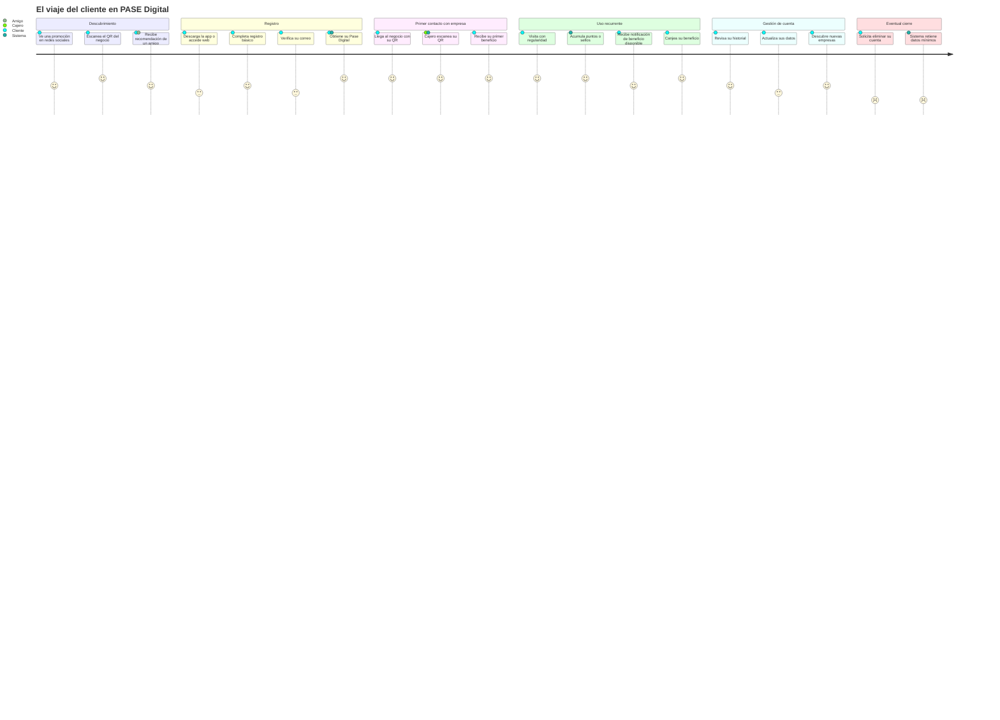
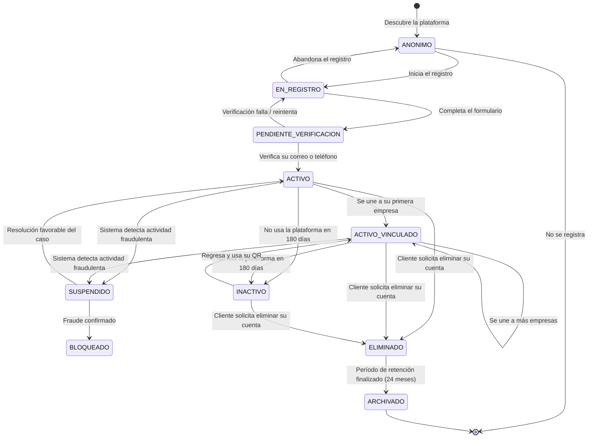

# Customers Module — Módulo de Clientes

**Documento:** CUM-001
**Versión:** 1.0.0
**Fecha:** 2026-06-27
**Estado:** Borrador Oficial
**Clasificación:** Documento de Producto — Especificación Funcional
**Proyecto:** PASE Digital Platform

---

> *"El cliente no usa la plataforma. El cliente vive en la plataforma. Su Pase Digital es la llave que abre los beneficios de cada empresa que decide conocer. Todo lo que el cliente necesita cabe en una sola pantalla: su QR."*

---

## Tabla de Contenidos

1. [Introducción — ¿Qué representa un Cliente dentro de la plataforma?](#1-introducción)
2. [Ciclo de Vida del Cliente](#2-ciclo-de-vida-del-cliente)
3. [Registro del Cliente](#3-registro-del-cliente)
4. [Perfil del Cliente](#4-perfil-del-cliente)
5. [Pase Digital](#5-pase-digital)
6. [Mis Promociones](#6-mis-promociones)
7. [Historial](#7-historial)
8. [Empresas Asociadas](#8-empresas-asociadas)
9. [Configuración Personal](#9-configuración-personal)
10. [Reglas del Módulo](#10-reglas-del-módulo)
11. [Escenarios Reales](#11-escenarios-reales)
12. [Experiencia del Cliente](#12-experiencia-del-cliente)
13. [Escalabilidad](#13-escalabilidad)
14. [Checklist de Implementación](#14-checklist-de-implementación)
15. [Autoauditoría](#15-autoauditoría)

---

## 1. Introducción

### 1.1 ¿Qué representa un Cliente dentro de la plataforma?

Un **Cliente** es la persona que recibe el valor que toda la plataforma existe para generar. Si las empresas son quienes crean y configuran los beneficios, el cliente es quien los activa, los usa, los acumula y los convierte en experiencias reales.

Dentro de PASE Digital, el cliente no es simplemente un usuario con una cuenta. Es el protagonista de un ecosistema de relaciones simultáneas: puede tener vínculo con su barbería de confianza, con el gimnasio al que va tres veces por semana, con el restaurante donde come los viernes y con la farmacia del barrio. Cada una de esas relaciones tiene su propia lógica de beneficios, su propio historial, su propio nivel de fidelización. Y sin embargo, el cliente las gestiona todas desde un único lugar, con una única identidad y un único instrumento: su Pase Digital.

Esta centralidad del cliente en la arquitectura del producto no es accidental. Responde a una realidad del mercado que la mayoría de los programas de fidelización ignoran: **el cliente no se fideliza con una sola empresa, se fideliza con las marcas que le hacen sentir reconocido**. Un programa de beneficios que obliga al cliente a recordar 12 tarjetas físicas, 8 apps distintas y 5 sistemas de puntos diferentes está condenado al abandono. PASE Digital apuesta por lo contrario: un solo perfil, un solo QR, múltiples empresas, experiencia unificada.

### 1.2 Por qué el cliente es el actor más importante del sistema

El Motor de Promociones (PE-001) es el corazón técnico del sistema. El módulo de Empresas (CM-001) es el contexto operativo. Pero sin el cliente, ninguno de los dos tiene propósito.

El cliente es el actor que:
- **Activa** cada Promoción al presentar su Pase Digital
- **Genera** los datos de comportamiento que las empresas usan para mejorar sus programas
- **Justifica** la existencia de la plataforma ante sus clientes empresariales
- **Recomienda** (o no) la plataforma a otros clientes potenciales
- **Determina** con su adopción si un programa de fidelización tiene éxito o fracasa

Un administrador que configura mal una Promoción puede corregirlo sin consecuencias. Un cajero que comete un error puede ser capacitado. Pero un cliente que tiene una mala experiencia no avisa: simplemente deja de usar el sistema. Y cuando deja de usarlo, la empresa pierde datos, la plataforma pierde valor, y el ciclo virtuoso de la fidelización se rompe.

Por esto, el Módulo de Clientes está diseñado desde una premisa radical: **la experiencia del cliente debe ser tan simple que nunca requiera instrucciones**.

### 1.3 ¿Qué objetivo tiene el cliente al usar la plataforma?

El cliente tiene un objetivo deceptivamente simple: **obtener beneficios reales en los lugares que ya frecuenta, sin esfuerzo adicional**.

La clave está en "sin esfuerzo adicional". El cliente no quiere aprender un nuevo sistema. No quiere recordar contraseñas. No quiere llenar formularios largos. No quiere entender la diferencia entre puntos, sellos y créditos. Quiere llegar a su barbería, mostrar su teléfono, obtener su descuento y seguir con su día.

Todo lo que la plataforma hace de forma invisible — el Motor de Elegibilidad evaluando condiciones, el Motor de Restricciones verificando límites, el sistema de compatibilidad resolviendo conflictos — debe resultar para el cliente en una experiencia de tres segundos: mostrar QR, escuchar "listo, su descuento fue aplicado".

### 1.4 ¿Qué valor obtiene el cliente al usar la plataforma?

**Valor económico directo:**
- Descuentos reales en servicios que ya consume
- Beneficios por acumulación (la visita gratis, el café por el que ya pagó 9 veces)
- Planes prepagados que le dan acceso a más por menos

**Valor de experiencia:**
- Ser reconocido por las empresas que frecuenta, sin necesidad de presentarse cada vez
- Recibir beneficios de cumpleaños, sorpresas de empresa, promociones exclusivas
- Sentir que su lealtad tiene recompensa tangible

**Valor de organización:**
- Tener todas sus membresías, planes y beneficios en un solo lugar
- Saber exactamente cuántos beneficios tiene disponibles y cuándo vencen
- No necesitar llevar tarjetas físicas ni recordar códigos

**Valor de confianza:**
- Saber que sus datos son privados y que ninguna empresa puede acceder a información que no autorizó
- Tener un historial de todas las transacciones que involucran sus beneficios
- Poder reclamar si algo salió mal, con evidencia de lo que ocurrió

---

## 2. Ciclo de Vida del Cliente

### 2.1 Mapa del ciclo completo



### 2.2 Diagrama de estados del cliente



### 2.3 Descripción detallada de cada etapa

#### ETAPA 1 — DESCUBRIMIENTO (estado: ANÓNIMO)

El cliente no sabe todavía que la plataforma existe. El descubrimiento ocurre por uno de estos caminos:

**Canal A — QR físico en el establecimiento:**
El cliente llega a un negocio (barbería, cafetería, car wash) y ve un sticker o cartel con el QR de la empresa. Puede decir algo como: "Escanea y obtén tu beneficio de bienvenida". El cliente escanea con la cámara de su teléfono y llega a la página de la empresa en PASE Digital, donde ve las Promociones disponibles. Si quiere obtenerlas, necesita registrarse.

**Canal B — Redes sociales de la empresa:**
La empresa comparte su Promoción en Instagram, Facebook o TikTok con un enlace. El cliente hace clic, llega a la página pública de la Promoción y ve que necesita registrarse para acceder.

**Canal C — Referido por otro cliente:**
Un amigo del cliente ya usa PASE Digital y lo recomienda. El amigo puede compartir un enlace de referido o simplemente mostrarle cómo funciona en el negocio.

**Canal D — Búsqueda orgánica:**
El cliente busca "beneficios en [empresa]" o "descuentos en [servicio]" y encuentra la plataforma.

En todos los casos, el cliente llega con una motivación específica: hay una empresa concreta que le interesa y una Promoción particular que quiere usar. El registro no es el objetivo; el beneficio es el objetivo. El registro es el costo de entrada. Por esto, el registro debe ser lo más corto posible.

---

#### ETAPA 2 — REGISTRO (estado: EN_REGISTRO)

Ver Sección 3 para el diseño detallado del proceso de registro.

El estado EN_REGISTRO dura el tiempo que el cliente tarda en completar el formulario. Si abandona sin terminar y el sistema capturó su correo, puede enviar un recordatorio con el enlace para continuar. Si el sistema no capturó ningún dato de contacto, el cliente vuelve simplemente al estado ANÓNIMO.

---

#### ETAPA 3 — VERIFICACIÓN (estado: PENDIENTE_VERIFICACION)

El cliente completó el formulario pero aún no ha verificado su identidad de contacto (correo o teléfono). El Pase Digital no está disponible hasta que la verificación sea completada.

**¿Por qué es necesaria la verificación?**
- Garantiza que el correo y teléfono son reales y le pertenecen al cliente
- Previene el registro masivo de cuentas falsas
- Permite la recuperación de cuenta en el futuro
- Asegura que las notificaciones llegarán a la persona correcta

**¿Cuánto tiempo tiene el cliente para verificar?**
El código o enlace de verificación tiene validez de 24 horas. Si no se usa en ese tiempo, el cliente puede solicitar uno nuevo. La cuenta queda en estado PENDIENTE_VERIFICACION por hasta 7 días. Después de eso, la cuenta incompleta es eliminada automáticamente.

---

#### ETAPA 4 — ACTIVO (cuenta verificada, sin vínculos empresariales)

El cliente tiene cuenta activa y Pase Digital generado, pero aún no se ha unido a ninguna empresa. En este estado:
- Puede acceder a su perfil y configurarlo
- Puede explorar el directorio de empresas en la plataforma
- Puede ver las Promociones públicas de las empresas
- Tiene su QR disponible, pero escanearlo en un negocio simplemente lo registraría como nuevo cliente

---

#### ETAPA 5 — ACTIVO_VINCULADO (con vínculos a una o más empresas)

El estado operativo normal del cliente. Tiene cuenta activa y está vinculado a al menos una empresa. Puede:
- Usar su QR para activar beneficios
- Acumular puntos, sellos o créditos
- Ver y gestionar todas sus Promociones activas
- Consultar su historial
- Descubrir y unirse a nuevas empresas

Este es el estado en el que el cliente pasa la mayor parte de su vida en la plataforma.

---

#### ETAPA 6 — INACTIVO

El cliente no ha tenido ninguna actividad en la plataforma (ningún escaneo de QR, ningún inicio de sesión, ninguna acción) en los últimos 180 días (6 meses).

**¿Qué ocurre en este estado?**
- Sus beneficios activos siguen vigentes (no son cancelados por inactividad del cliente)
- Sus puntos o sellos acumulados pueden estar sujetos a vencimiento según la política de cada empresa
- El sistema puede enviar una notificación de "te echamos de menos" si la empresa del cliente tiene configurada una Promoción de reactivación (PROMO-D06)
- El cliente puede volver a ACTIVO_VINCULADO en cualquier momento con solo usar su QR

El estado INACTIVO no tiene consecuencias para el cliente; es un estado de análisis interno de la plataforma para métricas de retención.

---

#### ETAPA 7 — ELIMINACIÓN Y ARCHIVADO

Ver Sección 9.7 para el proceso detallado de eliminación de cuenta.

---

### 2.4 El momento del primer escaneo: la experiencia más crítica

El primer escaneo del QR del cliente es el momento de mayor impacto emocional en toda la relación con la plataforma. Es el instante en que la abstracción del "beneficio digital" se convierte en algo concreto: el cajero dice "listo, su primera visita quedó registrada" o "su descuento fue aplicado".

Si este momento falla (QR no se lee, el sistema está lento, el cajero no sabe cómo proceder, el beneficio prometido no aparece), el cliente puede no regresar. No porque la falla sea grave, sino porque la promesa fue alta y la realidad no la cumplió.

Por esto, el primer escaneo tiene un tratamiento especial en el sistema:
- El cajero ve claramente que es la primera visita del cliente (no solo un cliente más)
- El cliente recibe una notificación de bienvenida personalizada de la empresa
- Si hay un beneficio de bienvenida configurado (PROMO-A05), se aplica automáticamente
- El proceso de registro del vínculo cliente-empresa se hace en segundo plano, sin interrumpir la transacción

---

## 3. Registro del Cliente

### 3.1 Principio de registro mínimo

El registro del cliente debe ser el más corto posible. Cada campo adicional que se solicita reduce la tasa de conversión. Un formulario de 10 campos pierde entre el 40% y el 60% de los usuarios que lo iniciaron.

El principio de diseño es: **pide lo mínimo para crear la cuenta, enriquece el perfil con el tiempo**.

### 3.2 Flujo de registro

**Paso 1 — Punto de entrada (3 opciones)**

| Opción | Descripción |
|---|---|
| **Correo + contraseña** | El método clásico. El cliente ingresa su correo y crea una contraseña. |
| **Google / Apple Sign In** | El cliente usa su cuenta de Google o Apple. El sistema obtiene nombre, correo y foto de perfil automáticamente. Reduce el registro a 2 toques. |
| **Número de teléfono** | El cliente ingresa su número; recibe un código SMS; lo ingresa. No necesita contraseña. |

La opción de Google / Apple Sign In es la recomendada para maximizar la conversión. En mercados latinoamericanos donde el acceso a Google es alto, esta opción puede captar hasta el 70% de los registros.

**Paso 2 — Datos mínimos (si no vienen del proveedor de identidad)**

Si el cliente eligió correo + contraseña, se le piden en pantalla única:
- Nombre (solo el nombre, no el apellido — el apellido es opcional y puede agregarse después)
- Correo electrónico
- Contraseña (con indicador de fortaleza)

Eso es todo en el registro. Tres campos.

Si eligió Google o Apple, el nombre y correo ya vienen pre-llenados. El cliente solo confirma.

Si eligió teléfono, solo se pide el nombre después de la verificación del código SMS.

**Paso 3 — Verificación**

- Para correo: Se envía un enlace de verificación. El cliente hace clic en el enlace desde su correo.
- Para teléfono: Se envía un código SMS de 6 dígitos. El cliente lo ingresa en pantalla.
- Para Google/Apple: La verificación es implícita (el proveedor ya verificó el correo).

**Paso 4 — Generación del Pase Digital**

Inmediatamente después de la verificación exitosa, el sistema genera el Pase Digital del cliente (ver Sección 5). El cliente ve por primera vez su QR. Este momento es celebrado visualmente en la interfaz.

**Paso 5 — Vinculación a la empresa de origen (si aplica)**

Si el cliente llegó al registro a través del QR o enlace de una empresa específica, al completar el registro el sistema lo vincula automáticamente a esa empresa y le muestra las Promociones disponibles para nuevos clientes.

### 3.3 Campos del formulario de registro

| Campo | Obligatorio | Momento de solicitud |
|---|---|---|
| **Nombre** | Sí | En el registro |
| **Correo electrónico** | Sí (o teléfono) | En el registro |
| **Teléfono** | Sí (o correo) | En el registro |
| **Contraseña** | Sí (si no usa SSO) | En el registro |
| **Apellido** | No | Sugerido en onboarding post-registro |
| **Fecha de nacimiento** | No | Sugerido en onboarding (necesario para Promociones de cumpleaños) |
| **Ciudad** | No | Sugerido en onboarding |
| **Foto de perfil** | No | Nunca solicitada activamente; el cliente la sube si quiere |
| **Género** | No | Nunca solicitado activamente salvo que una empresa lo requiera para una Promoción específica |
| **Dirección** | No | Nunca solicitado salvo que el cliente quiera recibirlo |

### 3.4 Prevención de registros duplicados

El sistema detecta duplicados por:

**Duplicado de correo electrónico:**
Si el correo ya existe en el sistema, el formulario muestra: "Este correo ya tiene una cuenta. ¿Quieres iniciar sesión?" No revela qué datos están asociados a ese correo.

**Duplicado de número de teléfono:**
Si el número ya existe, mismo mensaje. El teléfono es un identificador tan único como el correo.

**Duplicado por SSO:**
Si el cliente intenta registrarse con Google con una cuenta que ya fue usada para crear una cuenta existente, el sistema lo detecta y en lugar de crear una nueva cuenta, inicia sesión en la existente.

**Detección de cuentas sospechosas de ser el mismo cliente:**
Si un cliente tiene el mismo nombre + ciudad + fecha de nacimiento que una cuenta existente pero diferente correo, el sistema no bloquea el registro pero genera una señal interna para revisión. Esta situación es normal (dos personas con el mismo nombre y ciudad), así que no se expone al cliente.

### 3.5 Validaciones en tiempo real durante el registro

- El correo es validado en formato antes de avanzar
- La contraseña muestra en tiempo real si cumple los requisitos mínimos (8 caracteres, al menos un número)
- El número de teléfono se formatea automáticamente al ingresar para mostrar el formato correcto según el código de país seleccionado
- Los campos obligatorios no pueden quedar vacíos; el sistema muestra el error antes del envío, no después

### 3.6 ¿Qué ocurre inmediatamente después del registro?

1. El Pase Digital es generado (instantáneo)
2. El cliente ve una pantalla de bienvenida con su QR
3. Si llegó desde una empresa específica: ve las Promociones de esa empresa disponibles para él
4. El sistema envía un correo de bienvenida con el resumen de la cuenta y el enlace directo a su QR
5. Se activa (opcionalmente) el flujo de completar perfil: una secuencia de 2–3 preguntas simples que enriquecen el perfil (fecha de nacimiento, ciudad) con una barra de progreso que muestra el beneficio de completarlo ("Agrega tu cumpleaños para recibir sorpresas de tus empresas favoritas")

---

## 4. Perfil del Cliente

### 4.1 El perfil como identidad única en la plataforma

El perfil del cliente es su representación en la plataforma. Tiene dos dimensiones:

**Dimensión pública:** Lo que las empresas vinculadas pueden ver sobre el cliente para personalizar su experiencia (nombre, nivel de membresía, historial de visitas en esa empresa).

**Dimensión privada:** Lo que solo el cliente y el equipo PASE Digital pueden ver (correo, teléfono, fecha de nacimiento completa, dirección, historial completo en todas las empresas).

Esta distinción es fundamental: una empresa nunca puede ver el teléfono, el correo o la dirección exacta del cliente. Puede ver el nombre (para el saludo en el momento de la validación) y los datos específicos de su relación con ese cliente (cuántas visitas tiene, qué plan activo tiene, qué nivel de membresía tiene). Nada más.

### 4.2 Secciones del perfil

#### Sección 1 — Identidad personal

| Campo | Descripción | Editable | Visible para empresas |
|---|---|---|---|
| **Nombre** | Primer nombre del cliente | Sí | Sí (para el saludo) |
| **Apellido** | Apellido del cliente | Sí | Solo la inicial (e.g., "Carlos M.") |
| **Foto de perfil** | Imagen opcional. No es usada en la validación | Sí | No |
| **Nombre para mostrar** | Si el cliente prefiere ser llamado de otra forma (e.g., "Kike" en lugar de "Enrique") | Sí | Sí |

#### Sección 2 — Datos de contacto

| Campo | Descripción | Editable | Visible para empresas |
|---|---|---|---|
| **Correo electrónico** | Principal medio de contacto y recuperación | Sí, con verificación | No |
| **Teléfono** | Número con código de país | Sí, con verificación | No |
| **Correo secundario** | Para recuperación de cuenta si el principal es inaccesible | Sí | No |

Los cambios de correo y teléfono requieren verificación del nuevo dato antes de ser guardados. El sistema notifica al dato anterior que fue cambiado, para que el cliente sepa si alguien está intentando cambiar sus datos de acceso sin su autorización.

#### Sección 3 — Datos personales

| Campo | Descripción | Editable | Visible para empresas | ¿Por qué se pide? |
|---|---|---|---|---|
| **Fecha de nacimiento** | Día, mes y año | Sí (con confirmación requerida después de la primera vez) | Solo el día y mes (no el año) | Activa Promociones de cumpleaños (PROMO-D01) |
| **Género** | Género con el que se identifica el cliente | Sí | Solo si la empresa tiene Promociones con filtro de género (CE-P06) | Habilita Promociones de segmentación demográfica |
| **Ciudad** | Ciudad de residencia | Sí | Solo la ciudad (no la dirección) | Permite Promociones geográficas y localización de empresas cercanas |
| **Dirección** | Dirección postal | Sí | No | Uso futuro (notificaciones físicas, envíos) |
| **Código postal** | Para precisión geográfica | Sí | No | Uso futuro |

**Nota sobre la fecha de nacimiento:** Una vez que el cliente la ingresa y la verifica con una primera confirmación, solo puede ser cambiada mediante un proceso especial que requiere soporte. Esto previene que los clientes cambien su fecha de nacimiento cada año para activar repetidamente las Promociones de cumpleaños.

#### Sección 4 — Preferencias

| Campo | Descripción |
|---|---|
| **Idioma de la interfaz** | El idioma en que el cliente ve la plataforma. Independiente del idioma de las empresas. |
| **Industrias de interés** | Categorías de negocios que le interesan al cliente. Usado para sugerencias de empresas en el directorio. |
| **Frecuencia de resumen por correo** | Con qué frecuencia quiere recibir un resumen de sus beneficios activos (diario / semanal / mensual / nunca) |
| **Modo oscuro** | Preferencia visual de la interfaz |
| **Zona horaria** | Detectada automáticamente, ajustable. Usada para mostrar vencimientos en la hora local del cliente |

#### Sección 5 — Empresas asociadas

Lista de todas las empresas con las que el cliente tiene vínculo activo. Para cada empresa:
- Nombre y logo
- Número de visitas registradas
- Beneficios activos disponibles
- Plan o membresía activa (si tiene)
- Nivel de membresía (si aplica)
- Última visita

Ver Sección 8 para el diseño completo de Empresas Asociadas.

#### Sección 6 — Pase Digital

Acceso directo al QR del cliente. Ver Sección 5 para el diseño completo del Pase Digital.

#### Sección 7 — Historial

Acceso al historial completo de transacciones del cliente. Ver Sección 7 para el diseño detallado.

---

## 5. Pase Digital

### 5.1 ¿Qué es el Pase Digital?

El **Pase Digital** es el instrumento central de la relación del cliente con la plataforma. Es un código QR único, personal e intransferible que representa la identidad del cliente en el sistema.

No es un cupón. No es una tarjeta de puntos. No es una membresía de ninguna empresa específica. Es una **llave de identidad** que, al ser escaneada, le dice al sistema quién es el cliente para que el Motor de Promociones pueda evaluar qué beneficios le aplican en ese momento y lugar.

Metáfora: el Pase Digital es como un DNI digital. El DNI no dice cuánto dinero tienes en el banco ni qué propiedades tienes; simplemente confirma quién eres. Cuando el banco ve tu DNI, consulta sus propios sistemas para saber tu saldo. Cuando el Motor escanea el Pase Digital, consulta sus propios sistemas para saber qué beneficios tiene el cliente.

### 5.2 ¿Qué contiene el QR?

El QR contiene **únicamente** un identificador opaco y cifrado. Este identificador:
- No revela el nombre del cliente
- No revela el correo ni el teléfono
- No revela qué Promociones tiene activas
- No revela en cuántas empresas está registrado
- No revela su historial ni su saldo de puntos
- No es el ID interno de la base de datos (para prevenir enumeración)
- Es una cadena criptográficamente generada que solo tiene significado dentro del sistema de PASE Digital

Si alguien escanea el QR del cliente con una aplicación de lectura de QR genérica, no obtiene ninguna información útil. El QR solo funciona cuando es escaneado por la app de PASE Digital usada por un cajero autorizado.

### 5.3 ¿Cómo se genera el Pase Digital?

El Pase Digital se genera automáticamente en el momento en que el cliente completa la verificación de su cuenta (correo o teléfono verificado). No requiere ninguna acción adicional del cliente.

El proceso de generación es:
1. El sistema crea un identificador único para el cliente
2. Sobre ese identificador, genera un token cifrado con una clave que rota periódicamente
3. El token cifrado se codifica como QR
4. El QR es asociado a la cuenta del cliente y almacenado

El cliente nunca ve el identificador interno. Solo ve el QR resultante.

### 5.4 ¿Cuándo cambia el Pase Digital?

El Pase Digital (el código QR visual) cambia en los siguientes casos:

| Evento | Acción sobre el QR | Razón |
|---|---|---|
| **Rotación programada de seguridad** | El token subyacente rota cada 30 días, pero el QR visual puede permanecer igual | El QR es un contenedor; el token que valida puede rotar sin cambiar el QR visible |
| **El cliente reporta su cuenta como comprometida** | El QR anterior es invalidado inmediatamente y se genera uno nuevo | Seguridad: previene que alguien que copió el QR lo siga usando |
| **El cliente solicita explícitamente un nuevo QR** | El QR anterior es invalidado y se genera uno nuevo | El cliente puede querer renovar su QR por cualquier razón personal |
| **El cliente cambia el correo o teléfono** | El QR permanece igual | El QR no está vinculado al correo ni al teléfono, sino a la identidad del cliente en el sistema |
| **El cliente agrega o elimina un vínculo con una empresa** | El QR permanece igual | Los vínculos empresariales son datos del sistema, no del QR |

### 5.5 ¿Cuándo deja de ser válido el Pase Digital?

El Pase Digital deja de ser válido en estos casos:

| Causa | Qué ocurre |
|---|---|
| **La cuenta del cliente está en estado SUSPENDIDO** | El QR es rechazado al escanearse. El cajero ve: "Este pase no está disponible temporalmente." |
| **La cuenta del cliente está en estado BLOQUEADO** | El QR es rechazado sin mensaje explicativo al cajero (por privacidad) |
| **La cuenta del cliente fue eliminada** | El QR ya no existe en el sistema. Escanearlo devuelve "código no reconocido." |
| **El QR fue marcado como comprometido** | El QR anterior es invalidado hasta que el cliente genera uno nuevo |
| **El token interno está vencido y el QR no ha sido actualizado por la app** | El QR muestra como vencido hasta que la app del cliente sincroniza con el servidor y actualiza el token |

### 5.6 ¿Qué ocurre si el cliente cambia de teléfono?

Este es uno de los escenarios más frecuentes de soporte en plataformas de fidelización. El diseño del Pase Digital lo resuelve de forma elegante:

**El Pase Digital no vive en el teléfono. Vive en la cuenta del cliente.**

Cuando el cliente cambia de teléfono:
1. Descarga la app en el nuevo teléfono (o accede por web)
2. Inicia sesión con sus credenciales (correo + contraseña, Google, Apple o código SMS al mismo teléfono)
3. Su Pase Digital aparece exactamente igual que antes: mismo QR, mismo historial, mismos beneficios

No hay pérdida de datos. No hay necesidad de solicitar un "nuevo QR". El QR que el cliente tenía antes sigue siendo válido.

**Caso especial: el cliente cambió también de número de teléfono**
Si el método de acceso era por SMS al número anterior y el número ya no es del cliente, necesita usar el correo como método de recuperación. Por esto, al registrarse se recomienda siempre configurar tanto correo como teléfono. Si el cliente solo tiene teléfono y lo cambia, el proceso de recuperación de cuenta se activa (ver Sección 9.7).

### 5.7 ¿Qué ocurre si el cliente pierde acceso a su cuenta?

Ver proceso completo en Sección 9.7 — Recuperación de cuenta.

El punto clave: mientras el cliente no recupere su cuenta, su Pase Digital no puede ser usado por nadie (ni por él ni por otra persona). Esto protege sus beneficios acumulados.

### 5.8 ¿Qué ocurre si el cliente elimina su cuenta?

Al eliminar la cuenta:
1. El Pase Digital es invalidado inmediatamente
2. Las Promociones activas son canceladas
3. Los beneficios acumulados (puntos, sellos, créditos) son borrados
4. Los planes prepagados vigentes: la empresa es notificada para gestionar el reembolso si aplica según su política
5. El historial de transacciones es anonimizado (se conserva para reportes de las empresas, pero sin vinculación al cliente eliminado)

El QR físico que pudiera haberse guardado como captura de pantalla deja de funcionar inmediatamente.

### 5.9 Seguridad del Pase Digital

**¿Qué pasa si alguien fotografía el QR del cliente?**

Si alguien obtiene una copia del QR (fotografía de la pantalla del cliente), técnicamente podría intentar usarlo. El sistema tiene las siguientes protecciones:

1. **Verificación de dispositivo:** La app puede detectar si el QR que se intenta usar proviene de la app del cajero correcto o de una imagen estática
2. **Validación por intervalo:** Si el mismo QR es escaneado dos veces en menos de 5 minutos en sucursales distintas o lejanas geográficamente, el sistema genera una alerta de "uso sospechoso"
3. **Rotación periódica del token:** Aunque el QR visual no cambie, el token interno rota. Una imagen estática del QR puede quedar desactualizada cuando el token rota
4. **Restricciones de la Promoción:** La mayoría de las Promociones tienen restricción de intervalo mínimo entre usos (ej: 30 minutos entre validaciones del mismo cliente), lo que limita el abuso incluso si alguien tiene el QR

**¿Debe el QR tener una contraseña de protección adicional?**

Para el diseño v1.0, no. Agregar un PIN o biometría para mostrar el QR añade fricción en el momento más crítico de la experiencia. La seguridad existente es suficiente para el riesgo real de abuso. En versiones futuras, puede ofrecerse como opción para los clientes que quieran mayor seguridad.

### 5.10 Experiencia visual del Pase Digital

El Pase Digital no es solo un QR sobre fondo blanco. Es una tarjeta digital con identidad visual:

```
┌─────────────────────────────────────┐
│  [LOGO DE EMPRESA]   PASE DIGITAL   │
│                                     │
│         ┌───────────────┐           │
│         │               │           │
│         │   [QR CODE]   │           │
│         │               │           │
│         └───────────────┘           │
│                                     │
│  Hola, Carlos                       │
│  ─────────────────────────────────  │
│  Barbería El Clásico                │
│  ★★★ Nivel Gold · 8/10 visitas      │
│                                     │
│  Café La Bohemia                    │
│  ☕ 1 beneficio disponible          │
└─────────────────────────────────────┘
```

Cuando el cliente tiene vínculo con varias empresas, el Pase Digital puede mostrarse de dos formas:
1. **Vista unificada:** El QR en el centro con la lista de empresas y beneficios disponibles debajo
2. **Vista por empresa:** El cliente desliza horizontalmente para ver una tarjeta individual por empresa, con los colores de marca de cada empresa

En ambos modos, el QR es el mismo. Solo cambia la presentación contextual del beneficio.

---

## 6. Mis Promociones

### 6.1 El problema que resuelve esta sección

Un cliente que lleva 6 meses usando la plataforma puede tener:
- Un plan mensual activo en el gimnasio
- 7 de 10 sellos acumulados en la barbería
- Un cupón de cumpleaños que vence en 3 días
- Un beneficio de "visita 5 gratis" en la cafetería que ya está listo para usar
- Una membresía Gold en el car wash
- 3 Promociones de empresas que ya no frecuenta tanto

Sin una organización clara, toda esa información es ruido. El cliente no sabe qué usar, cuándo usarlo ni dónde.

La sección "Mis Promociones" resuelve esto con una organización que responde a la pregunta más urgente del cliente: **¿qué beneficio puedo usar hoy?**

### 6.2 Organización de las Promociones del cliente

#### Capa 1 — "Usa ahora" (prioritaria, visible de inmediato)

Beneficios que están listos para ser usados, sin condiciones pendientes de cumplir:

| Tipo | Descripción del ítem | Urgencia visual |
|---|---|---|
| **Beneficio completo listo** | "Tu visita gratis en Barbería El Clásico está lista" | Alta — botón verde |
| **Próximo a vencer (menos de 7 días)** | "Tu cupón de cumpleaños en Café La Bohemia vence en 3 días" | Alta — indicador rojo de urgencia |
| **Plan activo** | "Tu Plan Mensual en Gym Zona Norte: 12 visitas restantes" | Media — información |
| **Membresía con descuento** | "Tu membresía Gold en Car Wash: 20% de descuento en cada visita" | Media — siempre visible |

#### Capa 2 — "En progreso" (acumulaciones activas)

Beneficios que están siendo acumulados pero aún no están listos para usar:

| Tipo | Visualización |
|---|---|
| **Sellos / Tarjeta digital** | Tarjeta con los sellos obtenidos y los faltantes. "7 de 10 sellos. Te falta 3 visitas." |
| **Puntos acumulados** | Barra de progreso. "320 de 500 puntos para tu próximo beneficio." |
| **Reto de consumo** | Progreso en el reto. "Has visitado 2 de 5 veces este mes." |
| **Nivel de membresía próximo** | "Te faltan $150 de consumo para alcanzar el nivel Oro." |

#### Capa 3 — "Disponibles en mi(s) empresa(s)"

Promociones activas de las empresas vinculadas al cliente que podría usar (pero que requieren una visita o un gasto mínimo que quizás no se cumple en la transacción actual):

| Tipo | Descripción |
|---|---|
| **Promoción activa por visita** | "En tu próxima visita al Car Wash puedes usar: Descuento de martes 15%" |
| **Promoción temporal activa** | "Café La Bohemia tiene Café doble por uno esta semana" |
| **Cupón disponible (no personal)** | "Usa el código ENERO20 en Lavandería Clean & Fast para 20% de descuento" |

#### Capa 4 — "Historial de Promociones" (archivadas)

Promociones que el cliente ya usó o que vencieron:

| Estado | Descripción |
|---|---|
| **Usada** | "Cupón de bienvenida — Barbería El Clásico — Usado el 15 de marzo" |
| **Vencida sin usar** | "Promoción de Año Nuevo — Car Wash — Venció el 31 de enero" |
| **Plan terminado** | "Plan Mensual — Gym Zona Norte — Junio 2026 — 14/15 visitas usadas" |

### 6.3 Filtros y búsqueda

El cliente puede filtrar su vista de Promociones por:
- **Empresa:** Ver solo las Promociones de una empresa específica
- **Estado:** Solo las "listas para usar" / solo las "en progreso" / solo el historial
- **Tipo:** Solo planes / solo cupones / solo acumulaciones / solo descuentos directos
- **Disponibilidad:** Solo las que puede usar hoy según su ubicación y el día de la semana

### 6.4 Notificaciones proactivas de Promociones

El cliente no debe necesitar revisar activamente si tiene beneficios disponibles. El sistema le avisa:

| Evento | Notificación |
|---|---|
| Se completa una acumulación | "¡Tu visita gratis en Barbería El Clásico está lista! Preséntate cuando quieras." |
| Un beneficio vencerá en 3 días | "Tu cupón de cumpleaños en Café La Bohemia vence el [fecha]. ¡Úsalo pronto!" |
| Se activa una Promoción temporal relevante | "Esta semana, Gym Zona Norte tiene clases grupales gratis para miembros Gold." |
| El plan del cliente está próximo a vencer | "Tu Plan Mensual en Gym Zona Norte vence en 5 días. ¿Renovar?" |
| Se acerca el cumpleaños | "¡Tu beneficio de cumpleaños en Café La Bohemia estará disponible en 2 días!" |

---

## 7. Historial

### 7.1 El historial como instrumento de confianza

El historial no es solo un registro técnico de eventos. Para el cliente, es la prueba de que la plataforma está trabajando para él. Ver que una visita fue registrada, que un beneficio fue aplicado, que sus sellos aumentaron — todo eso genera confianza.

El historial también es el instrumento de resolución de disputas. Si un cajero comete un error y el descuento no fue aplicado correctamente, el cliente puede mostrar su historial como evidencia de que la visita ocurrió.

### 7.2 ¿Qué aparece en el historial?

#### 7.2.1 Historial de visitas y validaciones

Cada vez que el QR del cliente es escaneado por un cajero de cualquier empresa vinculada, aparece una entrada en el historial:

| Campo visible | Descripción |
|---|---|
| **Fecha y hora** | Timestamp exacto de la validación |
| **Empresa** | Nombre y logo de la empresa |
| **Sucursal** | Nombre de la sucursal específica donde ocurrió |
| **Beneficio aplicado** | Nombre de la Promoción que fue activada (si aplica) |
| **Descripción del beneficio** | Lo que el cliente obtuvo (e.g., "Descuento del 20% aplicado") |
| **Estado** | Exitosa / Rechazada / Cancelada |
| **Si fue rechazada** | Motivo visible al cliente (sin tecnicismos): e.g., "Esta promoción ya fue usada hoy" |

#### 7.2.2 Historial de acumulación

Los cambios en el saldo de puntos, sellos o créditos:

| Campo visible | Descripción |
|---|---|
| **Fecha** | Cuándo ocurrió el cambio |
| **Empresa** | A qué empresa corresponde |
| **Tipo de cambio** | Acumulación / Canje / Vencimiento / Ajuste |
| **Cantidad** | Cuántas unidades se sumaron o restaron |
| **Saldo resultante** | El saldo después del cambio |
| **Descripción** | "Sellos acumulados: visita #7 de 10" / "Canje: visita gratis usada" |

#### 7.2.3 Historial de planes y membresías

Los movimientos relacionados con planes prepagados:

| Evento | Descripción en el historial |
|---|---|
| Activación de plan | "Plan Mensual activado — Gym Zona Norte — Válido hasta [fecha]" |
| Uso de visita del plan | "Visita #3 de 15 usada — Plan Mensual — Gym Zona Norte" |
| Renovación | "Plan Mensual renovado — Gym Zona Norte — Nuevo período [fecha inicio] al [fecha fin]" |
| Vencimiento del plan | "Plan Mensual vencido — Gym Zona Norte — 12/15 visitas usadas" |

#### 7.2.4 Historial de cambios en el perfil

Por seguridad, el cliente ve un registro de los cambios importantes en su cuenta:

| Evento | Descripción en el historial de cuenta |
|---|---|
| Cambio de contraseña | "Contraseña actualizada desde [ciudad] el [fecha]" |
| Cambio de correo | "Correo electrónico cambiado al [nuevo correo parcialmente oculto]" |
| Nuevo dispositivo | "Inicio de sesión desde un nuevo dispositivo: [tipo de dispositivo, ciudad]" |
| Generación de nuevo QR | "Pase Digital renovado el [fecha]" |

### 7.3 Filtros del historial

- **Por empresa:** Ver solo las entradas de una empresa específica
- **Por período:** Últimos 7 días / Este mes / Últimos 3 meses / Año en curso / Todo
- **Por tipo de evento:** Solo visitas / Solo beneficios / Solo cambios de saldo / Solo cambios de cuenta
- **Por estado:** Solo exitosas / Solo rechazadas

### 7.4 Comprobante de visita

El cliente puede "descargar" o "compartir" el comprobante de cualquier visita registrada. El comprobante es una representación visual de la entrada del historial, en formato que puede ser guardado como imagen. Incluye:
- Logo de la empresa
- Fecha, hora y sucursal
- Beneficio aplicado
- Código de verificación único de la transacción (para resolución de disputas)
- Leyenda: "Este comprobante es generado por PASE Digital y refleja la información registrada en el sistema"

---

## 8. Empresas Asociadas

### 8.1 La relación cliente-empresa

Un cliente puede estar vinculado a múltiples empresas simultáneamente. Cada vínculo es independiente: el nivel de membresía en el gym no tiene nada que ver con los sellos en la barbería.

Los vínculos se crean de tres formas:

**Forma A — Escaneo en el establecimiento:**
El cajero escanea el QR del cliente por primera vez. El sistema pregunta: "Este cliente no está registrado en [empresa]. ¿Vincular?" El cajero confirma y el vínculo queda creado en ese momento.

**Forma B — El cliente explora el directorio y se une:**
El cliente busca una empresa en el directorio de la plataforma y selecciona "Unirme" o "Obtener mis beneficios". El vínculo queda creado. La empresa recibe una notificación de un nuevo cliente registrado.

**Forma C — Enlace o QR de captación de la empresa:**
La empresa publica un enlace o QR de captación (en sus redes, en un flyer, en su local). Cuando el cliente llega por ese canal y se registra o inicia sesión, el vínculo se crea automáticamente.

### 8.2 ¿Cómo ve el cliente sus empresas asociadas?

La sección "Mis empresas" muestra una lista/galería de todas las empresas vinculadas:

**Para cada empresa, el cliente ve:**
- Logo y nombre de la empresa
- Industria / categoría
- Número de visitas registradas
- Beneficio más relevante disponible (el de mayor urgencia o valor)
- Indicador de nuevas Promociones desde la última visita
- Estado del plan activo (si tiene)
- Nivel de membresía (si tiene)
- Botón "Ver mis beneficios" que lleva al detalle de esa empresa

**Ordenamiento por defecto:**
Las empresas se ordenan por frecuencia de visita (la que más visita el cliente aparece primero). El cliente puede reordenarlas manualmente o fijar una como "favorita".

### 8.3 Descubrimiento de nuevas empresas

El cliente puede explorar un directorio de empresas disponibles en la plataforma:

**Directorio con filtros:**
- Por industria / categoría
- Por ciudad
- Por distancia (si el cliente habilita la ubicación)
- Por "nuevas en la plataforma"
- Por "mayor descuento disponible"
- Por "las más populares en mi ciudad"

**Recomendaciones personalizadas:**
Basadas en las industrias que el cliente ya frecuenta: "Otros clientes de Barbería El Clásico también usan Café La Bohemia y Gym Zona Norte. ¿Te interesa conocerlas?"

Esta funcionalidad de recomendación cruzada es uno de los mecanismos de crecimiento de la plataforma: un cliente satisfecho con una empresa descubre otras.

### 8.4 ¿Cómo deja de estar vinculado a una empresa?

El cliente puede "desvincularse" de una empresa desde su perfil. Al hacerlo:
- Sus beneficios acumulados con esa empresa son archivados (no eliminados)
- Si tenía un plan prepagado activo, recibe una advertencia de que lo perderá
- Sus visitas históricas con esa empresa permanecen en su historial (no pueden borrarse)
- La empresa recibe una notificación de que el cliente se desvinculó

Si el cliente quiere volver a vincularse a esa empresa en el futuro, puede hacerlo. La plataforma le pregunta si quiere recuperar su historial anterior (si aún está dentro del período de retención).

---

## 9. Configuración Personal

### 9.1 Seguridad de la cuenta

#### 9.1.1 Contraseña

- Cambio de contraseña desde la configuración con verificación del dato actual antes de aceptar el nuevo
- Indicador de fortaleza de contraseña en tiempo real al crear o cambiar
- Política mínima: 8 caracteres, al menos 1 letra y 1 número
- Historial de contraseñas: el sistema no permite reusar las últimas 3 contraseñas

#### 9.1.2 Autenticación de dos factores (2FA)

Disponible y recomendada pero no obligatoria en v1.0:
- 2FA por SMS: el sistema envía un código al teléfono registrado en cada inicio de sesión desde un dispositivo nuevo
- 2FA por app autenticadora (Google Authenticator, Authy): el cliente configura la app y usa los códigos rotativos
- 2FA por correo electrónico: código enviado al correo para inicio de sesión desde dispositivos no reconocidos

#### 9.1.3 Sesiones activas

El cliente puede ver todas las sesiones activas en su cuenta:
- Dispositivo (tipo: móvil / escritorio / tablet)
- Sistema operativo aproximado
- Ciudad y país estimados por IP
- Fecha y hora del último acceso
- Estado: activa ahora / activa en los últimos 7 días

El cliente puede cerrar cualquier sesión individual (si reconoce un acceso no autorizado) o cerrar todas las sesiones excepto la actual.

#### 9.1.4 Dispositivos autorizados

La plataforma puede recordar dispositivos de confianza para omitir el 2FA en usos futuros:
- Lista de dispositivos marcados como de confianza
- Opción de eliminar cualquier dispositivo de la lista

### 9.2 Configuración de privacidad

| Opción | Descripción | Por defecto |
|---|---|---|
| **Visibilidad en directorio** | Si el cliente puede ser encontrado en búsquedas de la plataforma | Desactivado |
| **Compartir datos de uso con empresas** | Si las empresas pueden ver datos analíticos sobre el comportamiento del cliente (anonimizados o nominales) | Solo anonimizados |
| **Recibir recomendaciones de otras empresas** | Si PASE Digital puede sugerirle nuevas empresas basándose en su historial | Activado |
| **Datos para personalización** | Si el sistema puede usar el historial del cliente para personalizar su experiencia | Activado |

### 9.3 Configuración de notificaciones

El cliente tiene control granular sobre qué notificaciones recibe y por qué canal:

| Notificación | Por app (push) | Por correo | Por SMS |
|---|---|---|---|
| Beneficio listo para usar | ✓ configurable | ✓ configurable | ✗ |
| Beneficio próximo a vencer | ✓ configurable | ✓ configurable | ✗ |
| Confirmación de visita registrada | ✓ configurable | ✗ | ✗ |
| Recordatorio de inactividad de empresa | ✓ configurable | ✓ configurable | ✗ |
| Nueva Promoción en mis empresas | ✓ configurable | ✓ configurable | ✗ |
| Seguridad: nuevo inicio de sesión | ✓ siempre | ✓ siempre | ✓ configurable |
| Seguridad: cambio de datos | ✓ siempre | ✓ siempre | ✓ siempre |
| Cumpleaños (recordatorio propio) | ✓ configurable | ✓ configurable | ✗ |
| Resumen semanal | ✗ | ✓ configurable | ✗ |

El cliente puede también silenciar notificaciones de una empresa específica sin desvincularse de ella.

### 9.4 Configuración de idioma y accesibilidad

- **Idioma de la interfaz:** Español / Inglés (y los idiomas que se agreguen en versiones futuras)
- **Tamaño de texto:** Normal / Grande / Muy grande (para accesibilidad)
- **Modo de alto contraste:** Para usuarios con dificultades visuales
- **Modo oscuro / claro / automático (sigue al sistema)**

### 9.5 Gestión de métodos de pago

Si la plataforma permite compra de planes directamente desde la app (en versiones futuras):
- Tarjetas de crédito / débito guardadas
- Métodos de pago digitales (según región: Apple Pay, Google Pay, etc.)
- Historial de pagos realizados en la plataforma

En v1.0, si los planes se pagan en el establecimiento, esta sección no es necesaria.

### 9.6 Exportación de datos personales

El cliente tiene derecho a exportar todos sus datos almacenados en la plataforma (cumplimiento GDPR / Ley de Protección de Datos). La exportación incluye:
- Perfil completo
- Historial de visitas y transacciones
- Beneficios activos y usados
- Registro de cambios en la cuenta

La exportación se entrega como archivo JSON o CSV descargable, generado en máximo 24 horas y disponible para descarga por 48 horas.

### 9.7 Recuperación de cuenta

**Escenario A — El cliente olvidó su contraseña:**
1. Hace clic en "Olvidé mi contraseña" en la pantalla de inicio de sesión
2. Ingresa su correo o teléfono
3. Recibe un enlace de restablecimiento (correo) o un código (SMS)
4. Crea una nueva contraseña
5. Queda iniciada la sesión automáticamente en el dispositivo

**Escenario B — El cliente ya no tiene acceso al correo registrado:**
1. El cliente contacta al soporte de PASE Digital
2. El equipo de soporte solicita datos verificativos (nombre completo, número de teléfono, empresa asociada, descripción de la última visita)
3. Si los datos son verificados, el soporte ayuda al cliente a recuperar la cuenta con un nuevo correo
4. Todo el proceso queda registrado en el historial de la cuenta

**Escenario C — El cliente ya no tiene acceso al correo NI al teléfono registrados (cambio de operador):**
Este es el escenario más difícil. El cliente necesita:
1. Contactar al soporte con evidencia más robusta (puede incluir el historial de visitas a empresas que recuerda)
2. El equipo de soporte puede verificar con la empresa vinculada si el cliente es conocido
3. Si la verificación es exitosa, el soporte crea una cuenta nueva y transfiere el historial y beneficios a la nueva cuenta
4. La cuenta antigua queda marcada como "migrada" y su QR es invalidado

**Escenario D — El cliente perdió el teléfono y teme acceso no autorizado:**
1. El cliente accede a PASE Digital desde otro dispositivo
2. Inicia sesión con correo y contraseña
3. Cierra todas las sesiones activas (el teléfono perdido queda sin sesión)
4. Opcionalmente, genera un nuevo QR para invalidar el anterior
5. Todo el historial y beneficios permanecen intactos

### 9.8 Eliminación de cuenta

La eliminación de cuenta es una decisión permanente. El sistema la presenta con suficiente fricción para asegurar que no sea accidental:

**Proceso de eliminación:**
1. El cliente solicita eliminar su cuenta desde Configuración → Privacidad → Eliminar cuenta
2. El sistema muestra un resumen de lo que se perderá: número de empresas vinculadas, beneficios activos, saldo acumulado
3. Si el cliente tiene planes prepagados activos, se le indica que debe coordinar el reembolso con cada empresa antes de eliminar
4. El cliente debe escribir "ELIMINAR" (o la palabra en su idioma) para confirmar
5. El sistema envía un correo de confirmación con un enlace para completar la eliminación (válido por 24 horas)
6. Si el cliente hace clic en el enlace, la cuenta es marcada como ELIMINADO

**¿Qué ocurre con los datos después de la eliminación?**
- Los datos del perfil (nombre, correo, teléfono, foto) son eliminados de las tablas de datos personales
- El historial de visitas y transacciones es anonimizado (se conserva el evento, no el sujeto)
- La empresa vinculada pierde el vínculo pero puede seguir viendo el historial de visitas de "un cliente eliminado" en sus reportes (anonimizado)
- Después de 24 meses, los datos anonimizados son también eliminados o convertidos en estadísticas agregadas

---

## 10. Reglas del Módulo

### 10.1 Reglas de identidad

**RCL-001 — Un cliente tiene un único Pase Digital en todo el sistema**
Independientemente de cuántas empresas esté vinculado, el cliente tiene un solo QR. No existe un QR por empresa.

**RCL-002 — Un cliente tiene un único perfil global**
El cliente no tiene un perfil diferente para cada empresa. Su nombre, fecha de nacimiento y datos de contacto son únicos y globales. Lo que varía por empresa es su historial y sus beneficios en esa empresa.

**RCL-003 — Las credenciales de acceso son únicas por cliente**
Un correo electrónico o número de teléfono no puede ser el acceso principal de más de una cuenta de cliente activa simultáneamente.

**RCL-004 — El QR no contiene información personal**
El QR nunca debe revelar ningún dato personal del cliente. Es un identificador opaco.

### 10.2 Reglas de relación cliente-empresa

**RCL-005 — Un cliente puede estar vinculado a múltiples empresas sin límite**
No existe un máximo de empresas a las que un cliente puede pertenecer.

**RCL-006 — Una empresa nunca puede modificar el perfil personal del cliente**
El nombre, correo, teléfono, fecha de nacimiento o cualquier dato del perfil personal del cliente son inaccesibles para modificación por parte de la empresa. La empresa puede ver el nombre y el nivel de membresía en su contexto, pero no puede cambiarlos.

**RCL-007 — Los beneficios del cliente con una empresa no afectan sus beneficios con otra**
El saldo de puntos en el Gym no puede usarse en la cafetería. Cada relación cliente-empresa es completamente independiente en cuanto a saldo, historial y beneficios.

**RCL-008 — El cliente puede desvincularse de cualquier empresa en cualquier momento**
No existe ninguna empresa que pueda "mantener cautivo" al cliente. El proceso de desvinculación siempre está disponible.

**RCL-009 — La empresa puede ver solo la información del cliente que es necesaria para la operación**
La empresa puede ver el nombre del cliente, su número de visitas en esa empresa, su nivel de membresía y los beneficios que tiene disponibles. No puede ver su correo, teléfono, fecha de nacimiento completa, dirección, ni su relación con otras empresas.

### 10.3 Reglas del Pase Digital

**RCL-010 — La Promoción nunca pertenece al QR; el QR únicamente identifica al cliente**
Un QR escaneado sin contexto no genera ningún beneficio automático. El beneficio es el resultado de la evaluación del Motor con todos los datos del cliente y de la empresa. El QR es solo el inicio del proceso.

**RCL-011 — Un QR invalidado no puede ser reactivado**
Si el Pase Digital fue invalidado (por seguridad o por eliminación de cuenta), el QR anterior no puede volver a activarse. Se genera un nuevo QR o se crea una nueva cuenta.

**RCL-012 — El Pase Digital funciona sin conexión a internet en el dispositivo del cliente**
El QR puede ser mostrado incluso sin conexión, porque el QR en sí es un dato estático que puede cachearse en el dispositivo. La conexión es necesaria en el dispositivo del cajero para procesar la validación, no en el del cliente.

### 10.4 Reglas de historial y privacidad

**RCL-013 — El historial del cliente es inmutable**
El cliente no puede eliminar entradas de su historial. Las empresas tampoco. Solo el sistema antifraude y el equipo PASE pueden marcar una entrada como "bajo revisión", pero no eliminarla.

**RCL-014 — El cliente puede acceder a todo su historial en todo momento**
No existe ninguna restricción de tiempo o plan que limite el acceso del cliente a su propio historial.

**RCL-015 — Los datos del cliente eliminado son anonimizados, no eliminados inmediatamente**
Para cumplimiento legal y resolución de disputas post-eliminación, los datos de transacciones se conservan 24 meses en forma anonimizada.

### 10.5 Reglas de notificaciones

**RCL-016 — El cliente controla sus notificaciones**
Ninguna empresa puede enviar notificaciones directas al cliente por fuera de la plataforma. Todas las notificaciones pasan por el sistema de notificaciones de PASE Digital y están sujetas a las preferencias del cliente.

**RCL-017 — Las notificaciones de seguridad no son desactivables**
El cliente puede desactivar notificaciones de marketing y de beneficios, pero no puede desactivar las notificaciones de seguridad (nuevo inicio de sesión, cambio de datos de acceso).

---

## 11. Escenarios Reales

### Escenario 01 — El primer contacto: cliente descubre la plataforma a través de redes sociales

**Actor:** María, 28 años, ciudad de México, usuaria activa de redes sociales.

María ve una publicación de "Café La Bohemia" en Instagram que dice: "¡Registra tu Pase Digital y tu próximo café es gratis!" con un enlace.

Hace clic en el enlace a las 7:45pm desde su teléfono. Llega a la página de la Promoción. Ve el beneficio (PROMO-A05: primera visita gratis) y decide registrarse. Selecciona "Continuar con Google". En dos toques, su cuenta queda creada con su nombre y correo de Google. Recibe en pantalla: "¡Bienvenida, María! Tu Pase Digital está listo."

Ve su QR por primera vez. La interfaz celebra el momento con una animación. Debajo del QR, ve: "Café La Bohemia: Tienes un café gratis esperándote."

Al día siguiente, va al café. El cajero escanea su QR. El sistema registra: primera visita, Promoción PROMO-A05 activa. El cajero dice: "Tu primer café es gratis. ¡Bienvenida al programa!" María recibe una notificación push: "Primera visita registrada en Café La Bohemia. Tu café gratis fue aplicado."

Esa misma noche, María abre la app para ver su historial. Ve la entrada: "Café La Bohemia — Hoy 10:23am — Primera visita gratis aplicada." Sonríe. Vuelve al café el viernes.

---

### Escenario 02 — Un cliente acumula sellos y canjea su visita gratis

**Actor:** Pablo, 35 años, visita Barbería El Clásico regularmente.

Pablo tiene 8 de 10 sellos acumulados en la Barbería. Cada visita le agrega 1 sello. La Promoción (PROMO-B03) da un corte gratis al completar 10.

El martes va a la barbería. Miguel (cajero) escanea su QR. El sistema registra la visita #9 y envía a Pablo una notificación: "¡Ya tienes 9 de 10 visitas! Una más y tu próximo corte es gratis."

El jueves siguiente vuelve. Miguel escanea. El sistema registra la visita #10 y activa el canje. Miguel ve en su pantalla: "Cliente Pablo: ¡Visita número 10! Corte gratis aplicado. Nuevo ciclo iniciado." Pablo recibe: "🎉 ¡Completaste tus 10 visitas! Tu corte de hoy es gratis. Se inicia un nuevo ciclo con 0 sellos."

Pablo consulta su historial: ve la progresión completa de sus 10 visitas, el momento exacto del canje y el inicio del nuevo ciclo. Su saldo actual: 0 de 10 sellos (nuevo ciclo).

---

### Escenario 03 — Un cliente usa un cupón de cumpleaños antes de que venza

**Actor:** Isabel, 42 años. Su cumpleaños fue hace 5 días. La Promoción de cumpleaños de Gym Zona Norte da 1 mes gratis y está activa durante todo el mes de cumpleaños.

Isabel recibió una notificación 3 días antes de su cumpleaños: "¡Tu beneficio de cumpleaños en Gym Zona Norte estará disponible desde el [fecha]!" El día de su cumpleaños recibió otra: "¡Feliz cumpleaños, Isabel! Tu mes gratis en Gym Zona Norte está esperándote. Válido hasta el [fin de mes]."

Hoy, día 26 del mes (a 4 días de que venza), Isabel recibe: "Tu beneficio de cumpleaños en Gym Zona Norte vence en 4 días. ¡No dejes que expire!" Va al gimnasio. El cajero escanea. El sistema detecta PROMO-D01 activa (cumpleaños dentro de la ventana). El mes gratis queda activado desde hoy hasta la misma fecha del mes siguiente.

Isabel consulta su perfil: ve en "Planes activos" el nuevo mes. En el historial: "Beneficio de cumpleaños activado — Gym Zona Norte — 1 mes gratis desde [fecha inicio] hasta [fecha fin]."

---

### Escenario 04 — Un cliente intenta usar una Promoción vencida

**Actor:** Carlos, llega al Car Wash y presenta su QR.

El cajero escanea el QR de Carlos. El Motor evalúa: Carlos tiene una Promoción de "Primer lavado premium gratis" que venció hace 3 días (EXPIRED).

El cajero ve: "Carlos no tiene beneficios activos disponibles en este momento. La Promoción 'Primer lavado premium' venció el [fecha]."

Carlos ve en su app: en la sección "Historial de promociones", aparece la Promoción con estado "Vencida — no usada".

El cajero puede explicarle que la Promoción venció pero que puede registrar su visita normal (sin beneficio). La visita queda registrada en el historial de Carlos (sin beneficio aplicado).

---

### Escenario 05 — Un cliente compra un plan y lo usa en su siguiente visita

**Actor:** Rodrigo, cliente frecuente del Gym Zona Norte, actualmente sin plan.

El administrador del gym configuró: Plan de 10 Visitas por $400 (PROMO-C02). Rodrigo decide comprarlo. Va al gym, se acerca a la recepción y le dice al cajero que quiere el Plan de 10 Visitas. El cajero activa el plan desde el sistema vinculándolo a la cuenta de Rodrigo.

Rodrigo recibe una notificación: "¡Tu Plan de 10 Visitas en Gym Zona Norte fue activado! Válido por 90 días. Tienes 10 visitas disponibles."

Al día siguiente, Rodrigo vuelve. El cajero escanea su QR. El Motor evalúa: Plan de 10 Visitas activo, 10 visitas disponibles. Aplica: 1 visita del plan usada, 9 restantes. Rodrigo recibe: "Visita registrada con tu plan. Te quedan 9 visitas."

En la app, Rodrigo ve su plan en "Mis Promociones → Planes activos" con una barra de progreso: "1 de 10 visitas usadas. Te quedan 9."

---

### Escenario 06 — Un cliente pierde su teléfono y recupera su cuenta

**Actor:** Laura, pierde su teléfono en el transporte público.

Laura recuerda que su cuenta en PASE Digital estaba abierta en el teléfono perdido. Teme que alguien pueda usar su QR para obtener sus beneficios (tiene 8 de 10 sellos acumulados en la cafetería favorita).

Desde el teléfono de un amigo, accede a la web de PASE Digital. Inicia sesión con su correo y contraseña. Inmediatamente va a Configuración → Seguridad → Sesiones activas. Ve la sesión del teléfono perdido. La cierra. El teléfono perdido ya no tiene sesión activa.

Genera un nuevo QR desde Configuración → Pase Digital → Renovar QR. El QR anterior queda invalidado en ese momento.

Compra un teléfono nuevo, descarga la app, inicia sesión. Su cuenta está intacta: 8 de 10 sellos, historial completo, todas las empresas vinculadas. El nuevo teléfono tiene un nuevo QR que el sistema ya generó.

---

### Escenario 07 — Un cliente intenta usar dos Promociones incompatibles

**Actor:** Diego, visita un Car Wash que tiene activas dos Promociones: Plan Gold (25% descuento, EXCLUSIVE) y Martes Doble (50% descuento en el segundo servicio, STACKABLE).

Diego tiene el Plan Gold activo. Hoy es martes. Al escanear su QR, el Motor evalúa:
- Plan Gold (EXCLUSIVE, prioridad 10): elegible ✓
- Martes Doble (STACKABLE, prioridad 60): elegible ✓
- Compatibilidad: EXCLUSIVE vs STACKABLE → EXCLUSIVE anula a la otra
- Plan Gold tiene mayor prioridad y valor para la transacción de Diego

El cajero ve: "Aplicado: Plan Gold — 25% de descuento." Diego recibe: "Descuento de tu Plan Gold aplicado: 25%. (La Promoción Martes Doble no puede combinarse con tu Plan Gold.)"

Diego consulta el detalle en su historial y ve: "Promoción aplicada: Plan Gold. Promoción no aplicada: Martes Doble (incompatible con Plan Gold activo)." El mensaje es claro y sin tecnicismos.

---

### Escenario 08 — Un cliente solicita eliminar su cuenta

**Actor:** Ana, decide dejar de usar la plataforma.

Ana va a Configuración → Privacidad → Eliminar cuenta. El sistema le muestra: "Tienes 4 empresas vinculadas, 1 plan activo (Plan Mensual en Gym Zona Norte, 8 visitas restantes, vence en 20 días), y 6 visitas acumuladas en Barbería El Clásico."

El sistema le advierte: "Si eliminas tu cuenta, perderás todos tus beneficios. Si tienes planes prepagados, debes coordinar el reembolso con la empresa antes de proceder."

Ana decide continuar. Escribe "ELIMINAR" y confirma. Recibe un correo con el enlace de confirmación final. Hace clic. La cuenta queda en estado ELIMINADO.

Ana recibe un correo final: "Tu cuenta ha sido eliminada. Tienes 30 días para solicitar la exportación de tus datos históricos antes de que sean anonimizados permanentemente."

---

## 12. Experiencia del Cliente

### 12.1 Los tres principios de experiencia del cliente en PASE Digital

**Principio EX-01 — Cero confusión**
El cliente nunca debe preguntarse qué tiene que hacer a continuación. Cada pantalla tiene un único propósito y una única acción principal. Los beneficios disponibles son presentados con claridad: qué es, dónde se usa, cuándo vence, cuántas veces se puede usar.

**Principio EX-02 — Cero fricción en el momento crítico**
El momento de la validación (mostrar el QR al cajero) debe ser el más rápido posible. El QR debe ser la primera cosa que ve el cliente al abrir la app. No debe haber menús, confirmaciones ni pasos intermedios para llegar al QR.

**Principio EX-03 — Información siempre disponible, pero nunca en el camino**
El cliente puede acceder a su historial, a la configuración, a los detalles de cada Promoción. Pero esa información está disponible cuando la busca, no empujada en su cara cada vez que abre la app. La pantalla principal es el QR y los beneficios inmediatos. El resto está a un gesto de distancia.

### 12.2 Lo que el cliente siempre debe poder responder de forma inmediata

Al abrir la app, el cliente debe poder responder a estas preguntas en menos de 3 segundos sin necesidad de navegar:

| Pregunta | Cómo se responde en la interfaz |
|---|---|
| ¿Cuáles son mis beneficios listos para usar? | Tarjetas visibles inmediatamente bajo el QR |
| ¿Cuándo vence mi próxima Promoción? | Fecha visible con indicador de urgencia (rojo si menos de 7 días) |
| ¿Dónde puedo usar este beneficio? | Nombre de la empresa visible en cada tarjeta de beneficio |
| ¿Cuántos usos me quedan de este beneficio? | Número visible en cada tarjeta |
| ¿Cómo uso mi Pase Digital? | El QR es la primera pantalla |

### 12.3 Comunicación con el cliente: tono y lenguaje

El sistema habla con el cliente en lenguaje humano, no en lenguaje de sistema:

| No escribir | Escribir |
|---|---|
| "PROMO-D01 activada. Condición CE-P07 satisfecha." | "¡Tu beneficio de cumpleaños en Café La Bohemia está activo!" |
| "Restricción CR-C03 violada. Límite diario excedido." | "Ya usaste este beneficio hoy. Puedes volver a usarlo mañana." |
| "Estado: EXHAUSTED" | "Esta Promoción llegó a su límite. Ya no está disponible." |
| "Token inválido. Regeneración requerida." | "Tu Pase Digital necesita actualizarse. Abre la app para actualizarlo." |

### 12.4 El momento del primer beneficio: diseño de la celebración

Cuando el cliente usa su beneficio por primera vez (el primer descuento, el primer sello registrado, la primera visita del plan activada), la interfaz lo celebra:
- Animación suave de confirmación (no molesta ni exagerada)
- Mensaje cálido: "¡Tu primer beneficio fue aplicado! Así de fácil."
- Invitación a ver el historial: "Puedes ver el detalle en tu historial."
- Si el cliente tiene otros beneficios disponibles que aún no sabe que tiene: "Por cierto, también tienes 2 beneficios más listos para usar."

### 12.5 Diseño para el cliente que no es "tech-savvy"

La plataforma tiene que funcionar para una persona de 70 años que nunca ha usado una app de fidelización, igual que para una persona de 25 que usa apps todos los días. Los principios de diseño para este usuario:

- **Texto grande y legible** como configuración opcional (ya definida en Sección 9.4)
- **El QR ocupa el máximo espacio posible** en la pantalla de validación (no hay elementos pequeños alrededor que confundan)
- **Un solo botón grande para la acción principal** en cada pantalla
- **Sin jerga:** "Tus beneficios" en lugar de "Mis Promociones". "Tu tarjeta de visitas" en lugar de "Sistema de sellos". (El vocabulario final lo define el equipo de UX Writing.)
- **Confirmación verbal del cajero:** El sistema está diseñado para que el cajero siempre diga en voz alta el resultado de la validación. No depende solo de que el cliente lea la notificación.

---

## 13. Escalabilidad

### 13.1 Cómo el módulo soporta millones de clientes

El módulo de clientes está diseñado con la premisa de que eventualmente habrá millones de usuarios activos simultáneos. Los principios de escalabilidad son:

**Perfil global único:** El perfil del cliente es un único registro ligero. No importa cuántas empresas esté vinculado: el perfil no crece linealmente con el número de vínculos. Los vínculos son tablas separadas.

**Historial particionado:** El historial de transacciones no se guarda en el mismo lugar que el perfil activo. Es un registro inmutable y append-only que puede ser particionado por fecha o por empresa sin afectar la experiencia del usuario.

**El QR no requiere servidor para mostrarse:** El QR puede ser renderizado en el dispositivo del cliente sin consultar al servidor. Solo la validación (en el dispositivo del cajero) requiere una llamada en tiempo real.

**Datos del cliente en caché local:** La app del cliente puede cachear su QR, sus beneficios activos y su perfil básico. Si no hay conexión, el cliente puede mostrar su QR. La sincronización ocurre en segundo plano.

### 13.2 Cómo la experiencia escala sin degradarse

Un cliente con 1 empresa vinculada y uno con 50 empresas vinculadas deben tener la misma experiencia de rendimiento al abrir la app. Esto se logra mediante:

- **Carga progresiva:** La pantalla principal muestra el QR y los beneficios más urgentes inmediatamente. El resto de los datos (historial completo, lista completa de empresas) se carga en segundo plano.
- **Paginación inteligente:** El historial no se carga completo; muestra los últimos 30 eventos y carga más cuando el usuario hace scroll.
- **Ordenamiento por relevancia:** Las empresas y beneficios más recientes y urgentes aparecen primero, independientemente de cuántos haya.

### 13.3 Internacionalización

El módulo está diseñado para funcionar en múltiples países desde su arquitectura:
- Zona horaria por cliente (para vencimientos en hora local)
- Idioma por cliente (la interfaz en el idioma del cliente, independiente del idioma de la empresa)
- Formato de fecha y moneda según la configuración regional del cliente
- Número de teléfono con código de país en todos los campos

---

## 14. Checklist de Implementación

### 14.1 Funcionalidades obligatorias — Prioridad CRÍTICA (Sprint 1-2)

| ID | Funcionalidad | Descripción |
|---|---|---|
| **F-001** | Registro con correo + contraseña | Formulario básico, 3 campos, validación en tiempo real |
| **F-002** | Registro con Google SSO | Integración OAuth con Google |
| **F-003** | Verificación de correo | Envío de enlace de verificación, expiración en 24h |
| **F-004** | Generación de Pase Digital | Al verificar la cuenta, generar QR automáticamente |
| **F-005** | Visualización del QR | Pantalla de QR como pantalla principal de la app |
| **F-006** | Vinculación automática al escanear por primera vez | Al escanear el QR de un nuevo cliente, crear el vínculo empresa-cliente |
| **F-007** | Inicio de sesión (correo + contraseña) | Con opción "Recordar sesión" |
| **F-008** | Recuperación de contraseña por correo | Flujo completo de reseteo |
| **F-009** | Vista básica de Mis Promociones | Lista de beneficios disponibles |
| **F-010** | Historial básico | Últimas 30 entradas del historial de validaciones |

### 14.2 Funcionalidades importantes — Prioridad ALTA (Sprint 3-4)

| ID | Funcionalidad |
|---|---|
| **F-011** | Registro con número de teléfono + SMS |
| **F-012** | Registro con Apple Sign In |
| **F-013** | Perfil completo del cliente (todas las secciones) |
| **F-014** | Configuración de notificaciones (granular) |
| **F-015** | Cierre de sesiones activas remotas |
| **F-016** | Vista de Empresas Asociadas |
| **F-017** | Directorio de empresas (básico, con filtro por industria) |
| **F-018** | Desvinculación de empresa |
| **F-019** | Generación de nuevo QR (renovación manual) |
| **F-020** | Exportación de datos del cliente |

### 14.3 Funcionalidades complementarias — Prioridad MEDIA (Sprint 5+)

| ID | Funcionalidad |
|---|---|
| **F-021** | Autenticación de dos factores (2FA) |
| **F-022** | Gestión de dispositivos autorizados |
| **F-023** | Comprobante de visita descargable |
| **F-024** | Recomendaciones de empresas personalizadas |
| **F-025** | Filtros avanzados del historial |
| **F-026** | Resumen semanal por correo (digest) |
| **F-027** | Modo oscuro y accesibilidad (texto grande, alto contraste) |
| **F-028** | Proceso de eliminación de cuenta |
| **F-029** | Configuración de privacidad (granular) |
| **F-030** | Notificaciones de seguridad indesactivables |

### 14.4 Validaciones críticas

| ID | Validación | Comportamiento esperado |
|---|---|---|
| **V-001** | Correo duplicado en registro | Mostrar "ya existe una cuenta" y redirigir a inicio de sesión |
| **V-002** | Teléfono duplicado en registro | Mismo comportamiento que V-001 |
| **V-003** | QR escaneado de cuenta suspendida | El cajero ve "pase no disponible temporalmente" |
| **V-004** | QR escaneado de cuenta eliminada | El cajero ve "código no reconocido" |
| **V-005** | Token del QR vencido | La app lo detecta y regenera en background automáticamente |
| **V-006** | Cambio de correo sin verificar el nuevo | El cambio no se aplica hasta verificar el nuevo correo |
| **V-007** | Cambio de fecha de nacimiento post-primera-configuración | Requiere proceso de soporte; no es editable desde el perfil directamente |
| **V-008** | Enlace de verificación vencido | El sistema ofrece enviar uno nuevo |
| **V-009** | Sesión inactiva por más de 30 minutos (cajero) | Cierre automático de sesión del cajero (no del cliente) |
| **V-010** | Cliente intenta escanear su propio QR | El sistema detecta que el escaneador y el dueño del QR son la misma cuenta y rechaza |

### 14.5 Casos de uso a cubrir en pruebas

| ID | Caso de uso | Tipo |
|---|---|---|
| **CU-001** | Registro exitoso con Google SSO | Happy path |
| **CU-002** | Registro fallido por correo ya existente | Error path |
| **CU-003** | Primer escaneo: nueva empresa, beneficio de bienvenida | Happy path |
| **CU-004** | Primer escaneo: nueva empresa, sin beneficio de bienvenida | Happy path alternativo |
| **CU-005** | Canje de sellos completos | Happy path |
| **CU-006** | Intento de validación con Promoción vencida | Error path |
| **CU-007** | Intento de validación con Promoción EXCLUSIVE vs. STACKABLE | Compatibilidad |
| **CU-008** | Pérdida de teléfono: recuperación y renovación de QR | Recovery path |
| **CU-009** | Cambio de correo: verificación del nuevo antes de aplicar | Security path |
| **CU-010** | Eliminación de cuenta con plan prepagado activo | Warning path |
| **CU-011** | Cliente con 50 empresas vinculadas: rendimiento de la pantalla principal | Performance |
| **CU-012** | Cliente sin conexión a internet: visualización del QR | Offline path |
| **CU-013** | Cumpleaños: activación en el primer día de la ventana | Temporal trigger |
| **CU-014** | Cumpleaños: Promoción no disponible fuera de la ventana | Temporal restriction |
| **CU-015** | Dos validaciones del mismo cliente en menos de 5 minutos | Anti-abuse |

### 14.6 Dependencias con otros módulos

| Módulo | Dependencia |
|---|---|
| **Motor de Promociones (PE-001)** | La validación del QR siempre invoca al Motor. Sin el Motor, no hay evaluación de beneficios. |
| **Módulo de Empresas (CM-001)** | El vínculo cliente-empresa depende del módulo de empresas para existir. |
| **Motor de Notificaciones** | Todas las notificaciones al cliente son generadas por eventos del módulo de clientes pero entregadas por el motor de notificaciones. |
| **Sistema Antifraude** | Las alertas de uso sospechoso del QR y la suspensión de cuentas dependen del sistema antifraude. |
| **Módulo de Autenticación / Identidad** | El registro con SSO (Google, Apple) y la gestión de sesiones dependen de este módulo. |
| **Sistema de Correo Transaccional** | Verificación de cuenta, recuperación de contraseña, notificaciones por correo. |
| **Sistema de SMS** | Verificación por teléfono, 2FA por SMS. |

### 14.7 Riesgos conocidos

| ID | Riesgo | Probabilidad | Impacto | Mitigación |
|---|---|---|---|---|
| **R-001** | El cliente pierde acceso al correo y al teléfono simultáneamente | Media | Alto | Proceso de recuperación por soporte con verificación de identidad alternativa |
| **R-002** | Un cliente comparte su QR voluntariamente con otro para aprovechar un beneficio | Media | Medio | Verificación de intervalo entre validaciones; detección de uso en ubicaciones imposibles |
| **R-003** | Fallo en el servicio de SSO (Google/Apple) durante registro masivo | Baja | Alto | Siempre ofrecer alternativa de correo + contraseña |
| **R-004** | El cliente cambia su fecha de nacimiento para activar múltiples veces el beneficio de cumpleaños | Baja | Bajo | La fecha de nacimiento solo puede modificarse por soporte, con verificación |
| **R-005** | Alta latencia en la evaluación del Motor durante picos de tráfico | Media | Alto | Caché de la última evaluación, con flag de "revalidar en background" |
| **R-006** | El cliente no entiende por qué un beneficio no fue aplicado | Alta | Medio | Mensajes de rechazo en lenguaje claro y sin tecnicismos |
| **R-007** | Proliferación de cuentas duplicadas del mismo cliente | Baja | Medio | Detección activa de duplicados en registro; proceso de fusión por soporte |

### 14.8 Prioridad de implementación (resumen)

| Fase | Sprints | Entregable |
|---|---|---|
| **MVP** | 1–2 | Registro, QR, vinculación básica, validación, historial básico |
| **V1.0** | 3–4 | Perfil completo, notificaciones, múltiples empresas, directorio básico |
| **V1.1** | 5–6 | 2FA, comprobantes, directorio avanzado, recomendaciones |
| **V1.2** | 7+ | Eliminación de cuenta, exportación de datos, modos de accesibilidad |

---

## 15. Autoauditoría

### 15.1 Procesos faltantes identificados

**PAF-01 — Proceso de fusión de cuentas duplicadas**
Un cliente que se registró dos veces (una con correo, una con Google que usa el mismo correo) tiene el mismo correo como identificador, así que el sistema los detecta como duplicados. Pero si usó correos diferentes para las dos cuentas, puede tener historial y beneficios fragmentados. El proceso de fusión de cuentas duplicadas no está definido en este documento. El equipo de soporte necesitará un proceso interno para gestionar esto.

**PAF-02 — Proceso de herencia de beneficios por fallecimiento**
Si un cliente fallece y tenía un plan prepagado activo en una empresa, sus familiares no tienen ningún mecanismo definido para reclamar el reembolso o la transferencia del beneficio. Este es un caso borde pero real, especialmente en planes anuales de valor alto.

**PAF-03 — Proceso para clientes menores de edad**
El documento no define ningún tratamiento especial para clientes menores de 18 años. En varios países, los menores requieren consentimiento parental para registrarse en plataformas digitales que almacenan sus datos. El módulo no tiene un mecanismo de verificación de edad ni de consentimiento parental.

**PAF-04 — Cliente que quiere separar sus datos entre contextos**
Un cliente que usa la plataforma tanto para sus gastos personales como para gastos de empresa (e.g., un dueño de negocio que va al car wash también con sus vehículos de trabajo) podría querer dos perfiles separados. El modelo actual de "perfil único" no lo permite. No hay un modo "cliente corporativo" definido.

**PAF-05 — Proceso de reactivación post-eliminación**
Un cliente que eliminó su cuenta y 3 meses después decide volver. ¿Puede recuperar su historial? ¿Sus antiguas empresas lo reconocen? El documento menciona que el historial es anonimizado, pero no define si existe un proceso de "re-vinculación" del historial anonimizado al crear una nueva cuenta.

### 15.2 Inconsistencias identificadas

**INC-01 — La fecha de nacimiento es "opcional" pero es crítica para Promociones de cumpleaños**
El documento categoriza la fecha de nacimiento como campo opcional. Sin embargo, la Sección 5.2 de PE-001 indica que sin fecha de nacimiento verificada, la condición CE-P07 es evaluada como FALSA. Para el cliente que quiere beneficios de cumpleaños, la fecha de nacimiento es obligatoria. Esta tensión entre "opcional en el perfil" y "obligatoria para un beneficio específico" no está comunicada claramente al usuario.

**Resolución sugerida:** La fecha de nacimiento permanece opcional, pero cuando una empresa tiene una Promoción de cumpleaños activa y el cliente vinculado no tiene fecha de nacimiento, el sistema debe avisarle: "Para recibir el beneficio de cumpleaños de [empresa], agrega tu fecha de nacimiento en tu perfil."

**INC-02 — El QR funciona sin conexión en el cliente pero el cajero sí necesita conexión**
La Sección 5.9 y la Sección 10 (RCL-012) establecen que el QR puede mostrarse sin conexión en el dispositivo del cliente. Sin embargo, si el cajero tampoco tiene conexión (escenario de corte de internet en la sucursal), la validación no puede procesarse. El documento no define qué ocurre en este escenario del lado del cajero. Esto está definido parcialmente en CM-001 (modo offline), pero no desde la perspectiva del cliente.

**INC-03 — El cliente puede renovar su QR "por cualquier razón personal", pero los beneficios quedan vinculados al nuevo QR automáticamente**
Si el cliente renueva su QR y tiene un beneficio en proceso (e.g., un plan activo), el plan debe seguir activo y vinculado al nuevo QR. El documento asume que esto ocurre automáticamente, pero no lo describe explícitamente.

**Resolución sugerida:** Agregar explícitamente que al renovar el QR, todos los beneficios, planes y vínculos activos migran automáticamente al nuevo QR. El QR anterior queda invalidado pero el nuevo es funcionalmente equivalente.

### 15.3 Casos de uso no contemplados

**CUC-01 — Cliente que quiere usar el QR en un reloj inteligente o wearable**
La mayoría de los usuarios de wearables quieren mostrar el QR desde su smartwatch sin sacar el teléfono. El modelo actual no contempla una versión wearable del Pase Digital.

**CUC-02 — Cliente que prefiere una tarjeta física en lugar del QR digital**
Existen segmentos de población (principalmente adultos mayores) que prefieren una tarjeta física con el QR impreso en lugar de una app. El modelo actual es 100% digital. No hay un mecanismo de "Pase Digital impreso" definido.

**CUC-03 — Cliente que tiene múltiples teléfonos (trabajo + personal)**
El cliente puede querer tener la app en dos teléfonos simultáneamente. El modelo actual permite sesiones múltiples, pero no define si el QR mostrado en ambos teléfonos es idéntico y válido simultáneamente, o si hay alguna restricción.

**CUC-04 — Cliente que recibe la cuenta de PASE Digital como regalo**
Una empresa podría querer regalar una cuenta o un plan a un cliente que no está registrado aún. El modelo actual no tiene un mecanismo de "invitación de regalo" o "activación por tercero".

**CUC-05 — Cliente con nombre que contiene caracteres especiales o en idiomas no latinos**
Un cliente cuyo nombre está en caracteres chinos, árabes, cirílicos, o que contiene tildes, diéresis o caracteres no ASCII. El modelo no especifica las restricciones de caracteres en el campo nombre ni cómo se muestra en la pantalla del cajero.

### 15.4 Reglas pendientes de definir

**RPD-01 — Política de vencimiento de puntos / sellos cuando el cliente se desvincula**
Si un cliente tiene 9 de 10 sellos acumulados y se desvincula de la empresa, ¿los sellos se archivan (y pueden recuperarse si se vuelve a vincular) o se pierden definitivamente?

**RPD-02 — Política de notificaciones para clientes en estado INACTIVO**
¿El sistema puede enviarle notificaciones de reactivación a un cliente que lleva 6 meses sin usar la plataforma? ¿Cuántas notificaciones antes de considerarlo un cliente perdido y dejar de enviar?

**RPD-03 — Límite máximo de empresas vinculadas**
El documento dice "sin límite". ¿Es esto viable operativamente? ¿Un cliente con 500 empresas vinculadas tendría un impacto en el rendimiento del sistema? Se necesita un análisis técnico para confirmar o ajustar este supuesto.

**RPD-04 — Definición de "verificación de identidad" para la condición CR-A03**
La restricción CR-A03 del Motor de Promociones requiere que el cliente tenga "identidad verificada". El Módulo de Clientes no define qué constituye una "identidad verificada": ¿es suficiente con haber verificado el correo? ¿Requiere verificación del teléfono también? ¿Requiere documento de identidad? Esto necesita alinearse con el Motor de Promociones.

### 15.5 Módulos que este documento asume pero no define

| Módulo | Dependencia en este documento |
|---|---|
| **Motor de Notificaciones** | Decenas de eventos en este documento generan notificaciones. El motor que las gestiona no está especificado. |
| **Sistema de Autenticación / Identidad** | SSO con Google y Apple, gestión de sesiones y tokens, 2FA — todos requieren un módulo de autenticación no definido. |
| **Sistema de Correo Transaccional** | Verificación, recuperación, exportación, notificaciones por correo. El proveedor y el sistema no están definidos. |
| **Sistema de SMS** | Verificación por teléfono, 2FA, notificaciones SMS. No definido. |
| **Motor Antifraude** | Alertas por uso sospechoso del QR, suspensiones automáticas. La lógica de detección no está definida. |
| **Módulo de Reportes y Analytics** | Las métricas del cliente que las empresas ven en su dashboard requieren un sistema de procesamiento de eventos que no está especificado. |

---

*Documento CUM-001 v1.0.0 — PASE Digital Platform*
*Confidencial — Uso interno del equipo de producto e ingeniería*
*Próxima revisión programada: 3 meses desde la fecha de emisión*
