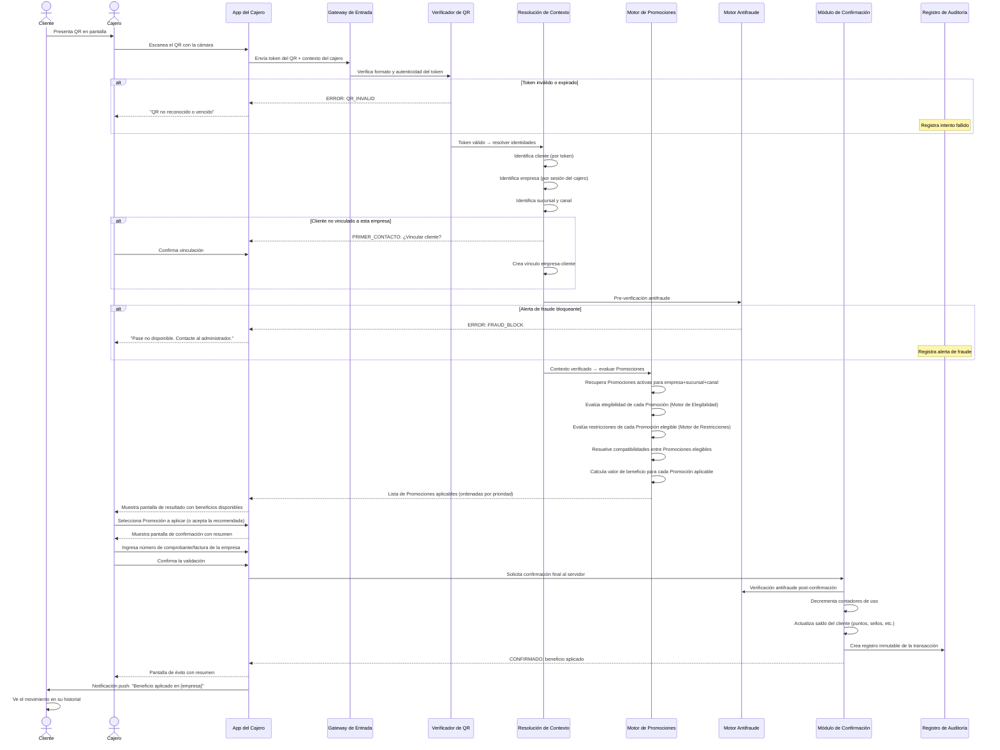
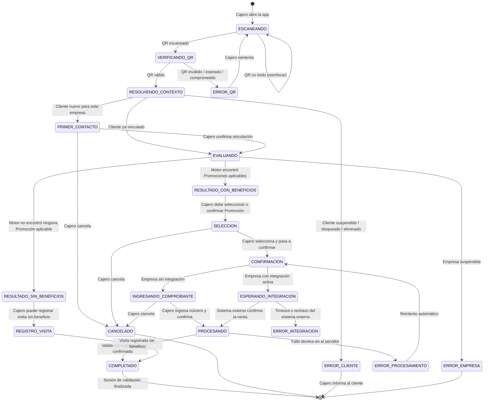

# QR Validation Engine — Motor de Validación QR

**Documento:** QVE-001
**Versión:** 1.0.0
**Fecha:** 2026-06-27
**Estado:** Borrador Oficial
**Clasificación:** Documento de Producto — Especificación Funcional
**Proyecto:** PASE Digital Platform

---

> *"El QR no contiene ningún beneficio. El QR no toma ninguna decisión. El QR solo dice quién es el cliente. Todo lo demás lo decide el Motor. En esa separación reside la seguridad de toda la plataforma."*

---

## Tabla de Contenidos

1. [Introducción — ¿Qué representa el Motor de Validación?](#1-introducción)
2. [Filosofía del Motor](#2-filosofía-del-motor)
3. [Flujo Completo de Validación](#3-flujo-completo-de-validación)
4. [Información Mostrada al Empleado](#4-información-mostrada-al-empleado)
5. [Confirmación de la Operación](#5-confirmación-de-la-operación)
6. [Relación con el Sistema de la Empresa](#6-relación-con-el-sistema-de-la-empresa)
7. [Motor Antifraude](#7-motor-antifraude)
8. [Registro de Evidencias](#8-registro-de-evidencias)
9. [Historial](#9-historial)
10. [Manejo de Errores](#10-manejo-de-errores)
11. [Experiencia del Empleado](#11-experiencia-del-empleado)
12. [Escenarios Reales](#12-escenarios-reales)
13. [Escalabilidad](#13-escalabilidad)
14. [Checklist de Implementación](#14-checklist-de-implementación)
15. [Autoauditoría](#15-autoauditoría)

---

## 1. Introducción

### 1.1 ¿Qué representa el Motor de Validación?

El **Motor de Validación QR** es el proceso central de la plataforma. Es el momento donde todo lo que fue diseñado — los perfiles de empresa, los perfiles de cliente, las reglas del Motor de Promociones, los niveles de membresía, las restricciones anti-abuso — se convierte en una acción concreta: el cajero escanea un QR, el sistema evalúa, y en segundos el cliente obtiene o no obtiene su beneficio.

Si el Motor de Promociones (PE-001) es el cerebro que define qué existe, el Motor de Validación es el momento en que el cerebro actúa. Todo lo demás en la plataforma es preparación o consecuencia de este instante.

Desde la perspectiva del negocio, el Motor de Validación es lo que hace real el valor de la plataforma:
- Para el **cliente**: es el instante en que la promesa del beneficio se convierte en ahorro o en experiencia diferencial
- Para la **empresa**: es la transacción de fidelización que genera datos, refuerza la relación con el cliente y cumple el compromiso comercial que la empresa hizo al publicar la Promoción
- Para **PASE Digital**: es la evidencia de que la plataforma funciona, el evento que genera los datos de uso y el momento donde se valida técnicamente toda la arquitectura construida

### 1.2 Por qué el Motor de Validación es el corazón operativo del sistema

Un sistema de gestión de usuarios puede fallar y los usuarios simplemente no pueden iniciar sesión durante unas horas. Un sistema de configuración puede fallar y los administradores no pueden editar Promociones por un tiempo. Pero si el Motor de Validación falla, los cajeros no pueden atender a los clientes que llegan con sus beneficios. La confianza en la plataforma se rompe en el punto más visible: el mostrador.

Por esto, el Motor de Validación tiene los requisitos de disponibilidad más altos de toda la plataforma. Es el componente que debe:
- Responder más rápido
- Fallar con menor frecuencia
- Degradarse de forma más elegante cuando algo sale mal
- Registrar con mayor precisión cada evento

### 1.3 Por qué el QR solo identifica al cliente

Esta es la decisión de diseño más importante de toda la arquitectura de validación, y merece ser explicada en profundidad.

**La alternativa equivocada:** el QR "inteligente"

En muchos sistemas de cupones y tarjetas digitales, el QR contiene el beneficio en sí mismo. El código QR tiene codificado: "este cupón vale un 20% de descuento en servicios de lavado hasta el 31 de diciembre". El cajero escanea, lee el descuento, lo aplica y listo.

Este diseño tiene problemas graves:

1. **El QR puede ser copiado.** Una foto del QR en el teléfono del cliente es una copia perfecta del beneficio. Cualquier persona con esa foto puede usarlo.

2. **El QR no puede ser revocado.** Si la empresa decide cambiar o cancelar la Promoción, los QR ya distribuidos siguen siendo válidos hasta que venzan. No hay forma de detenerlos.

3. **El QR no puede verificar restricciones complejas.** ¿Ya fue usado hoy? ¿El cliente tiene el plan activo? ¿La Promoción fue suspendida hace 5 minutos? Un QR estático no puede responder estas preguntas.

4. **El QR expone información sensible.** Codificar beneficios en el QR puede revelar información sobre el perfil del cliente que no debería ser pública.

**El diseño correcto:** el QR como llave, no como contenido

El QR de PASE Digital contiene exclusivamente un identificador opaco del cliente. No dice qué beneficios tiene. No dice qué empresa. No dice cuántas visitas lleva. Solo dice: "Soy el cliente con este identificador."

Cuando el cajero escanea ese identificador, el Motor de Validación consulta en tiempo real:
- ¿Existe este cliente?
- ¿Está activo?
- ¿Está vinculado a esta empresa?
- ¿Qué Promociones tiene disponibles en este momento, en esta sucursal, por este canal?
- ¿Hay restricciones activas que impidan alguna de ellas?

Toda esa lógica se ejecuta en el servidor, con la información más actualizada disponible, en el momento exacto de la transacción.

**Consecuencias de este diseño:**
- Una Promoción suspendida hace 30 segundos no puede ser usada, aunque el cliente ya tenga el "QR de bienvenida" guardado
- Un cliente suspendido por fraude no puede usar su QR, aunque no haya cambiado su teléfono
- Los límites de uso se verifican en tiempo real: no puede haber dos usos simultáneos del mismo beneficio
- El historial de cada transacción queda registrado sin posibilidad de alteración desde el lado del cliente

### 1.4 Por qué toda la lógica debe ejecutarse en el servidor

La lógica de validación podría, en teoría, ejecutarse parcialmente en el dispositivo del cajero. Algunos sistemas distribuidos hacen esto para reducir la latencia. Sin embargo, para PASE Digital esta opción es rechazada por razones de seguridad y consistencia:

**Razón 1 — Los dispositivos del cajero no son de confianza**
Un dispositivo comprometido (con software modificado, con un sistema operativo desactualizado, o controlado por un empleado deshonesto) podría manipular la lógica local para aplicar beneficios no autorizados. Si la decisión final siempre la toma el servidor, ese vector de ataque no existe.

**Razón 2 — Los límites de uso requieren estado centralizado**
Para saber si una Promoción ya fue usada 3 veces hoy por este cliente, se necesita acceder al historial completo. Ese historial no puede estar en cada dispositivo de cada cajero actualizado en tiempo real sin una fuente central de verdad.

**Razón 3 — La revocación debe ser instantánea**
Si un administrador pausa una Promoción a las 10:47am, ninguna validación desde las 10:47am debe aplicar esa Promoción, independientemente del dispositivo del cajero o del estado de caché local.

**Razón 4 — La auditoría requiere un registro único e inmutable**
El registro de cada validación debe existir en un lugar único que ni el cajero ni el cliente ni la empresa puedan modificar. Ese lugar es el servidor.

---

## 2. Filosofía del Motor

### 2.1 Principio PVM-01 — Nunca confiar en el QR

El QR es un canal de entrada, no una fuente de verdad. Lo que el QR transporta (el identificador del cliente) es únicamente el punto de inicio del proceso. El Motor no asume que el QR es correcto, que no fue manipulado, ni que pertenece a quien lo está presentando.

El Motor verifica:
- Que el identificador del QR existe en el sistema
- Que el formato del identificador es válido (no fue alterado)
- Que el token criptográfico del QR no ha expirado
- Que el QR no fue marcado como comprometido o inválido
- Que la cuenta del cliente asociada está en estado activo

Si cualquiera de estas verificaciones falla, el Motor rechaza la operación antes de consultar cualquier Promoción.

**¿Por qué este nivel de desconfianza?** Porque cualquier información que llega al servidor debe ser tratada como potencialmente hostil hasta que sea verificada. Un QR puede ser:
- Fotografiado y presentado por alguien que no es el cliente
- Generado por software malicioso intentando imitar un QR válido
- Un QR expirado de una cuenta ya eliminada
- Un QR de prueba que no debería funcionar en producción

La desconfianza en el QR no es una señal de paranoia. Es una práctica estándar de seguridad conocida como "zero trust at the boundary".

### 2.2 Principio PVM-02 — Nunca confiar únicamente en el empleado

Los empleados de las empresas son, en su gran mayoría, personas honestas que usan el sistema correctamente. Sin embargo, el Motor no puede diseñarse asumiendo eso. Debe funcionar de forma segura incluso en presencia de un empleado que intente abusar del sistema.

Los vectores de abuso desde el lado del empleado incluyen:
- Validar el beneficio de un cliente sin que el cliente esté realmente presente
- Usar el QR de un cliente conocido (amigo, familiar) para otorgarle beneficios sin consumo real
- Repetir la misma validación múltiples veces en rápida sucesión
- Validar en una sucursal diferente a la que está asignado
- Aplicar un beneficio y registrar una factura falsa

El Motor responde a estos vectores con:
- Verificación de que el empleado tiene permiso para validar en esa sucursal
- Detección de patrones de validación anómalos (ver Sección 7)
- Registro inmutable de todas las acciones con el identificador del empleado
- Requerimiento de un identificador de factura o comprobante para completar la transacción

**Importante:** el Motor no es punitivo hacia el empleado. La gran mayoría de los rechazos son por configuración incorrecta o por desconocimiento del sistema. Los controles no deben crear fricciones para la operación honesta; deben ser invisibles en el uso normal y solo activarse ante anomalías.

### 2.3 Principio PVM-03 — Nunca confiar únicamente en el cliente

El cliente que presenta su QR es, en casi todos los casos, el dueño legítimo del mismo. Sin embargo, el Motor asume que puede haber clientes que:
- Compartan su QR intencionalmente para que otro use sus beneficios
- Intenten presentar el QR en múltiples lugares simultáneamente
- Reporten falsamente una pérdida de cuenta para intentar duplicar beneficios

Los controles del Motor frente a estos escenarios:
- Verificación de intervalo mínimo entre validaciones del mismo QR
- Detección de validaciones del mismo QR en ubicaciones geográficamente imposibles
- Las restricciones de uso (límite diario, límite por período) se aplican independientemente de quién esté presentando el QR
- Un QR reportado como comprometido se invalida inmediatamente

### 2.4 Principio PVM-04 — Toda validación debe verificarse

Ninguna validación se aprueba por inferencia, por defecto, o por caché. Cada validación es una consulta nueva al estado actual del sistema.

"Verificar" significa:
- Comprobar el estado actual de la Promoción (no el estado hace 5 minutos)
- Comprobar el saldo de usos actual (no el calculado en la visita anterior)
- Comprobar el estado actual del cliente (no el que estaba cuando llegó al local)
- Comprobar que la empresa está activa en este momento

Esto tiene una implicación de diseño: el Motor no usa cachés de largo plazo para datos críticos de validación. La latencia adicional de consultar el estado real es el costo del diseño seguro. (Ver Sección 13 para cómo se maneja esta latencia a escala.)

### 2.5 Principio PVM-05 — Toda validación debe quedar registrada

Independientemente del resultado — aprobación, rechazo, error técnico — el Motor crea un registro de la validación. No existe ningún camino de ejecución que no pase por el registro.

Este principio es la base del sistema de auditoría. Un cajero no puede "deshacer" un escaneo. No existe un modo silencioso. No existe una validación de prueba que no quede en el log. Todo queda.

El registro incluye:
- El resultado (aprobada / rechazada / error)
- La razón exacta del resultado
- El estado de todos los datos consultados en el momento de la evaluación
- El identificador del empleado, dispositivo, sucursal y empresa
- El timestamp con precisión de milisegundos en la zona horaria de la empresa

### 2.6 Principio PVM-06 — Toda validación debe poder auditarse

El registro no sirve si no puede ser consultado de forma significativa. El Motor garantiza que cada transacción registrada puede ser:
- Encontrada por empresa, sucursal, cajero, cliente, Promoción, fecha y resultado
- Reproducida conceptualmente: dado el estado del sistema en ese momento, ¿el resultado habría sido el mismo?
- Explicada en lenguaje humano: no solo un código de error sino una descripción de por qué fue aprobada o rechazada
- Exportada como evidencia en caso de disputa

### 2.7 Principio PVM-07 — La velocidad es parte de la seguridad

Un motor de validación lento no es un motor seguro. Si el proceso de validación tarda 15 segundos en completarse, los cajeros comenzarán a buscar atajos: registrar sin confirmar, dar el beneficio antes de que el sistema responda, ignorar las alertas por prisa.

El Motor está diseñado para que en condiciones normales el tiempo desde el escaneo del QR hasta la pantalla de resultado sea menor a 2 segundos. Este requisito no es un lujo de UX: es un requisito de seguridad operativa.

---

## 3. Flujo Completo de Validación

### 3.1 Diagrama de flujo principal



### 3.2 Diagrama de estados de una sesión de validación



### 3.3 Descripción paso a paso del flujo

#### PASO 1 — Presentación del QR por el cliente

El cliente saca su teléfono y abre la app de PASE Digital (o accede desde el navegador móvil). La primera pantalla que ve es su Pase Digital con el QR. No necesita navegar. No necesita buscar. El QR está en la pantalla principal.

El cliente gira el teléfono hacia el cajero (o acerca el teléfono al lector si hay lector físico). El brillo de la pantalla es visible. Si el cliente tiene el modo oscuro activado, el QR puede tener dificultades para ser leído; el sistema alerta al cliente: "Aumenta el brillo si hay problemas con la lectura."

**¿Qué pasa si el cliente no tiene app?**
El cajero puede ofrecer el ingreso manual del código de cliente (un código de 8 dígitos visible debajo del QR en la app). El cliente dicta el código, el cajero lo ingresa. El flujo continúa de la misma forma.

---

#### PASO 2 — El cajero escanea con la app

El cajero usa la app de PASE Digital en su propio dispositivo (teléfono de la empresa o personal si está autorizado). Activa la cámara desde la app y apunta al QR del cliente. La lectura es automática: en el momento en que la cámara detecta el QR, el proceso comienza sin que el cajero necesite presionar ningún botón.

La app envía al servidor: el token del QR + el identificador de sesión del cajero + el timestamp.

El cajero **nunca** ve el contenido del QR (el identificador opaco). Solo ve la interfaz de resultado.

---

#### PASO 3 — Verificación del token QR

El servidor verifica en menos de 100 milisegundos:
- Que el token tiene el formato correcto (estructura criptográfica válida)
- Que la firma criptográfica es auténtica (no fue generado fuera del sistema)
- Que el token no está en la lista de tokens revocados (QR comprometidos o de cuentas eliminadas)
- Que el token no está expirado según su timestamp interno

Si la verificación falla, el proceso se detiene aquí. El cajero ve una pantalla de error. El intento queda registrado en auditoría.

---

#### PASO 4 — Resolución del contexto

Con el token verificado, el servidor resuelve las identidades involucradas:

**Identidad del cliente:** El token descifrado apunta al ID interno del cliente. El servidor verifica que ese cliente:
- Existe en la base de datos
- Está en estado ACTIVO o ACTIVO_VINCULADO (no suspendido, bloqueado o eliminado)
- No tiene ninguna restricción activa que impida la validación

**Identidad de la empresa y sucursal:** La sesión del cajero está vinculada a una empresa y sucursal específicas (el cajero inició sesión en un contexto de empresa/sucursal). El servidor verifica que:
- La empresa está en estado ACTIVO
- La sucursal está activa
- El cajero tiene permiso para validar en esa sucursal

**Vínculo cliente-empresa:** Si el cliente nunca ha sido vinculado a esta empresa, el Motor lo detecta aquí. El cajero ve: "Este cliente es nuevo en [empresa]. ¿Registrarlo?" El cajero confirma y el vínculo se crea en ese momento.

---

#### PASO 5 — Pre-verificación antifraude

Antes de consultar las Promociones, el Motor Antifraude realiza una revisión rápida del contexto. Ver Sección 7 para el detalle completo. En esta etapa, el antifraude evalúa:
- ¿El mismo QR fue escaneado hace menos del intervalo mínimo configurado?
- ¿El cajero tiene una frecuencia de escaneo anómala en las últimas horas?
- ¿Hay alertas previas sobre este cliente que requieren atención?

Si hay una alerta bloqueante (fraude confirmado), el proceso se detiene. Si hay una alerta de seguimiento (posible abuso pero no confirmado), el proceso continúa pero la alerta queda registrada para revisión posterior.

---

#### PASO 6 — Evaluación del Motor de Promociones

El Motor de Promociones (PE-001) recibe el contexto completo y ejecuta la evaluación:

1. Recupera todas las Promociones en estado ACTIVE para la empresa
2. Filtra por sucursal, canal y servicio (si aplican)
3. Evalúa la elegibilidad del cliente para cada Promoción (Motor de Elegibilidad)
4. Evalúa las restricciones de cada Promoción elegible (Motor de Restricciones)
5. Resuelve compatibilidades entre Promociones elegibles (reglas de EXCLUSIVE, STACKABLE, etc.)
6. Calcula el valor del beneficio para cada Promoción aplicable
7. Ordena los resultados por prioridad y valor

El resultado es una lista estructurada:
- **Aplicables:** Promociones que cumplen todas las condiciones y pueden ser aplicadas
- **No elegibles:** Promociones que el cliente no cumple (con razón de cada una)
- **Restringidas:** Promociones que el cliente cumpliría pero tienen una restricción activa (con razón)

---

#### PASO 7 — Presentación al cajero

El cajero ve la pantalla de resultado en 2 segundos o menos desde el escaneo. La pantalla muestra:
- El nombre del cliente (solo el nombre, no apellido completo ni otros datos)
- Las Promociones aplicables de forma clara y accionable
- Si no hay Promociones aplicables, un mensaje claro de la razón

Ver Sección 4 para el diseño detallado de la información mostrada al empleado.

---

#### PASO 8 — Selección de la Promoción

Si hay una sola Promoción aplicable: el cajero simplemente confirma.

Si hay varias Promociones aplicables: el sistema puede recomendar automáticamente la combinación óptima (la que maximiza el beneficio del cliente según la configuración de la empresa). El cajero puede aceptar la recomendación o seleccionar manualmente.

En ambos casos, el cajero realiza una acción consciente de confirmación. La validación nunca es automática sin intervención humana.

---

#### PASO 9 — Ingreso del comprobante

Antes de confirmar definitivamente la validación, el cajero ingresa el identificador de la transacción en el sistema de la empresa:
- Número de factura
- Número de orden
- Número de ticket
- Código de la transacción en el POS de la empresa

Ver Sección 6 para el diseño completo de este paso según si la empresa tiene o no integración.

---

#### PASO 10 — Confirmación final

El cajero ve un resumen de lo que está a punto de confirmar:
- Nombre del cliente
- Beneficio que se va a aplicar
- Valor del beneficio (lo que el cliente ahorra o recibe)
- Número de comprobante ingresado
- Empresa y sucursal

El cajero confirma. Esta acción es irreversible desde el punto de vista del cliente (el beneficio fue aplicado). Si fue un error, requiere un proceso de anulación (ver Sección 5.4).

---

#### PASO 11 — Procesamiento de confirmación

En el servidor:
1. Se decrementa el contador de usos de la Promoción
2. Se actualiza el saldo del cliente (puntos, sellos, créditos si aplica)
3. Se crea el registro inmutable en auditoría
4. Se genera el comprobante interno de la transacción
5. Se evalúa si la Promoción alcanzó algún límite (pasar a EXHAUSTED)
6. Se disparan notificaciones al cliente

---

#### PASO 12 — Notificación al cliente

El cliente, en el mismo momento en que el cajero confirma, recibe en su teléfono:
- Una notificación push con el resumen del beneficio aplicado
- El historial actualizado si tiene la app abierta
- Opcionalmente: el próximo beneficio que le queda disponible ("Ya tienes 5 de 10 visitas. ¡A mitad del camino!")

La notificación es el cierre del ciclo para el cliente. Le confirma que el sistema funcionó y que el beneficio fue real.

---

## 4. Información Mostrada al Empleado

### 4.1 Principio de mínima exposición necesaria

El cajero solo debe ver lo que necesita para completar la validación correctamente. Mostrar información extra no solo distrae: puede ser una violación de la privacidad del cliente.

La regla es: **si el cajero no necesita ese dato para decidir qué hacer, no se muestra.**

### 4.2 Pantalla de resultado: estructura

#### Zona 1 — Identificación del cliente (parte superior)

| Dato | Descripción | ¿Por qué se muestra? |
|---|---|---|
| **Nombre de pila** | Solo el nombre, sin apellido completo | El cajero necesita saber con quién habla para una interacción humana y cálida |
| **Inicial del apellido** | Ej: "Carlos M." | Diferencia a dos clientes con el mismo nombre sin exponer el apellido completo |
| **Foto de perfil** | Si el cliente la tiene configurada (miniatura) | Confirmación visual de identidad (opcional, el cliente puede no tenerla) |
| **Indicador de estado** | "Cliente activo" / "Cliente nuevo" / "Cliente recurrente" | El cajero sabe si es la primera vez o si es un cliente frecuente |
| **Nivel de membresía** | "Nivel Gold" / "Miembro Standard" / sin nivel | El cajero puede dar un trato diferenciado al cliente según su nivel |

**Datos que NUNCA se muestran al cajero:**
- Correo electrónico del cliente
- Número de teléfono completo del cliente
- Fecha de nacimiento
- Dirección
- Historial en otras empresas
- Número de otras empresas a las que pertenece
- Información de pago del cliente

#### Zona 2 — Beneficios aplicables (parte central, protagonista)

Esta es la zona más importante de la pantalla. Muestra de forma clara y accionable qué puede ofrecerse al cliente:

**Para cada Promoción aplicable:**

| Dato | Descripción | ¿Por qué se muestra? |
|---|---|---|
| **Nombre de la Promoción** | El nombre configurado por la empresa | Para que el cajero pueda comunicarlo verbalmente al cliente |
| **Descripción corta del beneficio** | "20% de descuento" / "Visita gratis" / "Sello #7 de 10" | El cajero debe poder explicarlo sin consultar nada |
| **Usos restantes** | "Te quedan 3 usos de esta Promoción" | El cajero puede mencionar esto al cliente para gestionar expectativas |
| **Fecha de vencimiento** | "Válida hasta el 31 de julio" | El cajero puede mencionarla si está próxima |
| **Indicador visual de urgencia** | Icono rojo si vence en menos de 7 días | Llama la atención del cajero sin texto adicional |

**Si hay múltiples Promociones aplicables:**
El sistema muestra la recomendación automática destacada ("Recomendado: aplicar Plan Gold + Cupón de cumpleaños") con la opción de ver todas y seleccionar manualmente.

#### Zona 3 — Información de acumulación en progreso

Solo si el cliente tiene un programa de acumulación activo con esa empresa:

| Dato | Descripción |
|---|---|
| **Progreso visual** | Barra o iconos de sellos: "●●●●●○○○○○ — 5 de 10 visitas" |
| **Próximo hito** | "Le faltan 5 visitas para su visita gratis" |
| **Después de esta validación** | "Si valida ahora: quedará en 6 de 10 visitas" |

#### Zona 4 — Advertencias y restricciones visibles

Si hay algo que el cajero debe saber antes de proceder:

| Advertencia | Cuándo aparece |
|---|---|
| **"Cliente sin beneficios disponibles"** | Cuando ninguna Promoción aplica. Se muestra la razón genérica |
| **"Último uso disponible"** | Cuando la Promoción que se va a aplicar tiene solo 1 uso restante para este cliente |
| **"Promoción próxima a vencer"** | Si la Promoción vence en menos de 24 horas |
| **"Cliente con alerta de seguimiento"** | Solo visible para el supervisor/gerente, no para el cajero estándar |

#### Zona 5 — Contexto de la operación (pie de pantalla, secundario)

Información de contexto para verificación del cajero:

| Dato | Descripción |
|---|---|
| **Empresa y sucursal** | Confirmación de que el cajero está operando en el contexto correcto |
| **Hora y fecha** | Timestamp actual en la zona horaria de la empresa |
| **Identificador del cajero** | El propio nombre del cajero logueado (para que sepa que es su sesión) |

### 4.3 Lo que el cajero NO necesita ver

El cajero no necesita (y no debe ver):
- Los detalles de configuración de la Promoción (condiciones de elegibilidad, parámetros técnicos)
- El historial completo del cliente
- Las Promociones no elegibles o sus razones técnicas (solo si el supervisor lo consulta)
- Información fiscal de la empresa
- Datos de otros cajeros
- Métricas y reportes

### 4.4 Escenario especial: cliente sin beneficios disponibles

Si el Motor evalúa todas las Promociones activas y ninguna aplica al cliente, el cajero ve una pantalla específica:

**Lo que muestra:**
- Nombre del cliente (el mismo saludo)
- Mensaje: "No hay beneficios disponibles en este momento"
- Razón genérica más relevante (solo una, la más útil): ejemplos: "Has alcanzado el límite de usos de hoy" / "No tienes un plan activo" / "La próxima Promoción disponible será el [día]"
- Opción: "Registrar visita de todas formas" — para acumular la visita en programas de sellos/puntos aunque no aplique beneficio inmediato

**Lo que NO muestra:**
- Lista de todas las Promociones rechazadas y sus razones técnicas (eso es información de auditoría, no operativa)
- Comparaciones con otros clientes
- Sugerencias de compra de planes

---

## 5. Confirmación de la Operación

### 5.1 Por qué existe una pantalla de confirmación explícita

En sistemas de alta velocidad (un car wash con cola de espera, una cafetería en hora pico), existe la tentación de eliminar la confirmación para ganar velocidad. Esta tentación debe resistirse.

La confirmación explícita existe porque:
1. **Previene aplicaciones accidentales.** Un cajero que escaneó el QR de la persona equivocada (pasó por detrás, el QR de otra persona quedó visible) puede cancelar antes de que el beneficio sea aplicado.
2. **Fuerza la lectura del resultado.** El cajero debe ver conscientemente qué beneficio está aplicando antes de confirmar. No puede "pasar por encima" de la pantalla de resultado.
3. **Crea un momento de responsabilidad.** Al confirmar, el cajero acepta que lo que ve en la pantalla es correcto y que autoriza la aplicación.

La confirmación no debe ser lenta. Está diseñada para completarse en un solo gesto (un toque grande) una vez que el cajero ha leído el resumen.

### 5.2 ¿Cuándo el sistema solicita una confirmación adicional?

En operaciones de alta importancia, el sistema agrega una segunda verificación:

| Escenario | Confirmación adicional |
|---|---|
| **Beneficio de valor alto** (configurable por empresa, ej: beneficio > $100) | El sistema pide al cajero escribir el monto del beneficio para confirmar que lo leyó correctamente |
| **Último uso de una Promoción valiosa** (ej: último lavado de un plan de 10 prepagado) | El sistema muestra un aviso prominente: "Este es el último uso del Plan Premium de este cliente" |
| **Primera validación del día del cajero** | No hay confirmación adicional, pero el cajero ve su nombre en la pantalla (confirmación de identidad) |
| **Canje de beneficio acumulado** (ej: sellos completos) | El sistema muestra el resumen del ciclo completo: "10 de 10 visitas. Canje aplicado. Nuevo ciclo inicia." |

### 5.3 ¿Cómo evitar dobles validaciones?

**Problema:** El cajero confirma la operación, hay un fallo de red justo después, la app muestra un error, y el cajero vuelve a confirmar creyendo que la primera confirmación no fue procesada.

**Solución — Idempotencia de la confirmación:**
Cada solicitud de confirmación tiene un ID único generado en el momento del escaneo (no en el momento de la confirmación). Si el mismo ID de solicitud llega dos veces al servidor, el servidor responde con el resultado de la primera (éxito) sin procesar la segunda. El cajero ve el resultado exitoso en ambos casos.

**En la pantalla del cajero:**
Si la app detecta que está reintentando una solicitud que ya fue enviada, muestra un indicador de "Verificando..." con un spinner en lugar de permitir al cajero confirmar de nuevo. Cuando recibe la respuesta del servidor (exitosa la primera vez), muestra el resultado final.

**Ventana de protección:**
Una vez que una validación es confirmada con éxito, el mismo QR no puede ser confirmado de nuevo por 2 minutos, independientemente del cajero o dispositivo. Si se intenta, el sistema muestra: "Esta visita ya fue registrada. Si crees que es un error, consulta con tu gerente."

### 5.4 Anulación de una validación confirmada

Ocurre cuando el cajero confirma por error (cliente equivocado, monto incorrecto en el sistema de la empresa, etc.).

**¿Quién puede anular?**
- El Cajero puede anular en los primeros 5 minutos si aún tiene la sesión activa de esa validación. Solo puede hacerlo una vez.
- El Supervisor puede anular en las últimas 4 horas.
- El Gerente puede anular en las últimas 24 horas.
- El Administrador puede anular cualquier validación del día en curso con justificación.
- Validaciones de días anteriores requieren un proceso de disputa formal (ver Sección 8).

**¿Qué ocurre al anular?**
- El beneficio se "revierte": el uso se descuenta del contador, el saldo del cliente se restaura
- El registro original NO es eliminado. Se crea un nuevo registro de "anulación" vinculado al original
- El cliente recibe una notificación: "La validación de [empresa] del día de hoy fue anulada. Si tienes dudas, contacta a la empresa."
- La anulación requiere una razón obligatoria (de una lista: "Error en el escaneo" / "Cliente incorrecto" / "Transacción cancelada" / "Otro")

### 5.5 El número de comprobante: por qué es obligatorio

El número de comprobante (factura, orden, ticket) es el vínculo entre la transacción en PASE Digital y la transacción en el sistema propio de la empresa. Es obligatorio para:

1. **Auditoría cruzada:** Si hay una disputa ("el cajero aplicó el beneficio pero no lo otorgó al cliente"), la empresa puede cruzar el número de PASE Digital con el número de ticket de su propio sistema para verificar que la transacción existió.

2. **Prevención de validaciones sin venta:** El cajero no puede confirmar la validación sin ingresar un comprobante. Si no hay venta, no hay comprobante, no hay validación. Esto es la barrera operativa más importante contra el abuso.

3. **Trazabilidad completa:** El historial de PASE Digital puede ser cruzado con el historial del sistema de la empresa para detectar patrones anómalos (muchas validaciones sin comprobantes que coincidan, comprobantes repetidos, etc.).

**¿Qué pasa si la empresa no usa comprobantes numerados?**
Algunas empresas (especialmente pequeñas) no tienen un sistema de numeración de ventas. En ese caso:
- La empresa puede configurar el campo de comprobante como "libre" (cualquier texto)
- El cajero puede ingresar la hora de la transacción, una descripción o un código informal
- El campo nunca puede quedar vacío

---

## 6. Relación con el Sistema de la Empresa

### 6.1 El problema de los dos mundos

PASE Digital gestiona beneficios. El sistema de la empresa gestiona ventas (su POS, su caja, su ERP). Estos son dos sistemas independientes que deben hablar sobre la misma transacción.

La pregunta clave es: ¿cómo sabe PASE Digital que una venta real ocurrió antes de confirmar el beneficio? La respuesta depende del nivel de integración de la empresa.

### 6.2 Escenario A — Empresa sin integración (manual)

Este es el modelo de operación de la mayoría de las empresas pequeñas y medianas que usan PASE Digital.

**¿Cómo funciona?**

El proceso tiene dos momentos separados en el tiempo, con una orden específica:

**Momento 1 — La venta ocurre en el sistema de la empresa**
El cajero registra la venta en el POS, la caja registradora, o el sistema de tickets del negocio. El sistema de la empresa genera un comprobante (número de factura, número de orden, número de ticket).

**Momento 2 — El beneficio se confirma en PASE Digital**
El cajero escanea el QR del cliente en PASE Digital y, cuando llega al paso de confirmación, ingresa el número de comprobante generado en el paso anterior. Solo entonces confirma la validación.

**¿Por qué en este orden (venta primero, luego beneficio)?**
Si el beneficio se confirma primero (se aplica el descuento antes de registrar la venta), el cajero podría confirmar el beneficio y luego "olvidar" registrar la venta en el sistema de la empresa. El cliente obtuvo el descuento pero la empresa no tiene registro de ingresos. Este orden también previene que el beneficio sea aplicado a una venta que después se cancela.

**Pantalla del cajero en Escenario A:**

```
┌───────────────────────────────────────────────┐
│  CONFIRMAR VALIDACIÓN                         │
│                                               │
│  Cliente: Carlos M.                           │
│  Beneficio: Plan Gold — 20% de descuento      │
│                                               │
│  Antes de confirmar, registra la venta        │
│  en tu sistema y anota el comprobante.        │
│                                               │
│  ┌─────────────────────────────────────────┐  │
│  │  Número de comprobante:                 │  │
│  │  [ _____________________ ]              │  │
│  └─────────────────────────────────────────┘  │
│                                               │
│  [CANCELAR]            [CONFIRMAR BENEFICIO]  │
└───────────────────────────────────────────────┘
```

**¿Qué hace PASE Digital con el número de comprobante?**
Lo almacena como parte del registro de auditoría. No lo valida en tiempo real (no tiene acceso al sistema de la empresa para verificar que ese número existe). La validación cruzada puede realizarse manualmente por el administrador de la empresa o a través de reportes.

**Limitaciones del Escenario A:**
- La empresa no puede verificar automáticamente que el número de comprobante es real
- Existe una pequeña ventana de tiempo entre el registro de la venta y la confirmación del beneficio donde el cajero podría cancelar la venta y aun así confirmar el beneficio
- La conciliación entre el sistema de la empresa y PASE Digital es un proceso manual

**Ventajas del Escenario A:**
- Sin configuración técnica
- Funciona con cualquier sistema de caja, incluyendo sistemas muy básicos
- El cajero puede operar incluso si el sistema de la empresa falla (registra en PASE Digital y luego concilia)
- Es el modelo de operación de la gran mayoría de los negocios objetivo

---

### 6.3 Escenario B — Empresa con integración (automática)

Para empresas con capacidades técnicas (plan BUSINESS o ENTERPRISE), PASE Digital puede recibir una confirmación automática del sistema de la empresa.

**¿Cómo funciona?**

Cuando la venta es registrada en el sistema de la empresa (POS, ERP, software de gestión), ese sistema envía automáticamente a PASE Digital una señal de confirmación que incluye el número de transacción y el identificador del cliente. PASE Digital no necesita esperar que el cajero ingrese manualmente el comprobante.

**El flujo desde la perspectiva del cajero:**

En lugar de ver el campo manual de comprobante, el cajero ve:

```
┌───────────────────────────────────────────────┐
│  CONFIRMAR VALIDACIÓN                         │
│                                               │
│  Cliente: Carlos M.                           │
│  Beneficio: Plan Gold — 20% de descuento      │
│                                               │
│  ✓ Venta confirmada automáticamente           │
│  Comprobante: #TKT-2026-04817                 │
│                                               │
│  [CANCELAR]            [CONFIRMAR BENEFICIO]  │
└───────────────────────────────────────────────┘
```

El número de comprobante ya apareció pre-llenado, confirmado por el sistema de la empresa.

**Variante de integración — Confirmación automática completa:**
En la integración más profunda, cuando el sistema de la empresa confirma la venta, PASE Digital puede confirmar el beneficio automáticamente sin intervención del cajero. El cajero ve en su pantalla: "Beneficio aplicado automáticamente. Informe al cliente."

**Ventajas del Escenario B:**
- Mayor velocidad de operación (sin entrada manual)
- Eliminación del riesgo de error humano en el comprobante
- Conciliación perfecta entre el sistema de la empresa y PASE Digital
- Posibilidad de beneficios aplicados sin presencia física del cajero (e.g., autoservicio)

**Limitaciones del Escenario B:**
- Requiere trabajo técnico de integración
- Si la integración falla (el sistema de la empresa no envía la confirmación), el proceso debe caer al Escenario A como modo de respaldo
- La empresa debe mantener la integración actualizada

**Escenarios futuros para el Escenario B:**
- Integración con TPV y POS de mercado (Square, iZettle, Clip, etc.)
- Integración con software de gestión sectorial (sistemas específicos de restaurantes, gimnasios, etc.)
- Webhooks bidireccionales donde PASE Digital también envía confirmaciones al sistema de la empresa
- API pública documentada para que cualquier empresa pueda construir su propia integración

---

## 7. Motor Antifraude

### 7.1 Visión general

El Motor Antifraude es el sistema que protege la integridad económica de la plataforma. No es una capa de seguridad que se agrega al final; es una función transversal que opera en múltiples momentos del flujo de validación.

El antifraude trabaja en dos modos:
- **Preventivo:** Detecta patrones que indican intención fraudulenta antes de que el fraude ocurra y lo bloquea o alerta
- **Correctivo:** Identifica transacciones ya realizadas que parecen fraudulentas y las marca para revisión posterior

### 7.2 Escenarios de fraude y sus respuestas

#### Escenario F-01 — Empleado aplica beneficio sin que haya venta real

**¿Cómo ocurre?** El empleado escanea el QR de un familiar o amigo y confirma el beneficio sin que exista una transacción real. Puede ingresar un número de comprobante inventado.

**Detección:**
- **Señal 1 — Comprobante repetido:** El mismo número de comprobante es ingresado más de una vez en el mismo día o período. Los números de comprobante de un sistema real no se repiten.
- **Señal 2 — Patrón de comprobantes:** Los comprobantes ingresados por este cajero no siguen una secuencia numérica razonablemente coherente (algunos sistemas generan comprobantes secuenciales).
- **Señal 3 — Validaciones sin variación de cliente:** Un cajero valida repetidamente al mismo cliente en períodos cortos (un empleado validando a su familiar cada día).
- **Señal 4 — Horario fuera de lo habitual:** Validaciones realizadas fuera del horario declarado de la empresa o de la sucursal.

**Respuesta:**
- Alerta para revisión del gerente/administrador (no bloqueo automático en la primera instancia)
- Si el patrón persiste: bloqueo preventivo + notificación al administrador para revisión
- Si se confirma fraude: suspensión del empleado + registro del incidente

---

#### Escenario F-02 — Empleado usa el QR de un cliente sin su presencia

**¿Cómo ocurre?** El empleado guardó una imagen del QR de un cliente regular (o tiene acceso al teléfono del cliente sin su consentimiento) y lo usa para aplicar beneficios en su nombre.

**Detección:**
- **Señal 1 — QR estático:** El QR siempre tiene exactamente el mismo token. Si el sistema detecta que un QR está siendo usado desde un dispositivo diferente al habitual del cliente, genera una alerta.
- **Señal 2 — Geolocalización:** Si el cliente tiene habilitada la ubicación en la app, el sistema puede detectar si el QR está siendo escaneado en una sucursal mientras el cliente está físicamente en otro lugar (solo para empresas que habiliten esta verificación premium).
- **Señal 3 — Doble uso simultáneo:** El mismo QR no puede ser procesado en dos transacciones simultáneas. Si hay dos escaneos del mismo QR en menos de 30 segundos, el segundo es rechazado automáticamente.

**Respuesta:**
- Alerta al cliente: "Tu Pase Digital fue usado en [empresa / sucursal] a las [hora]. ¿Fuiste tú?" con opciones "Sí, fui yo" / "No, no fui yo"
- Si el cliente responde "No fui yo": el QR es invalidado inmediatamente y se genera uno nuevo. Se abre una investigación.

---

#### Escenario F-03 — Cliente comparte su QR intencionalmente

**¿Cómo ocurre?** El cliente comparte la imagen de su QR con un amigo para que este use sus beneficios.

**Detección:**
- **Señal 1 — Uso en ubicaciones inconsistentes:** Si el QR es escaneado en dos lugares físicamente distantes en un tiempo imposible (e.g., escaneo en Monterrey a las 3pm y escaneo en Ciudad de México a las 4pm).
- **Señal 2 — Frecuencia anómala:** El cliente normalmente visita la empresa 2 veces por semana. Esta semana ya tiene 7 visitas registradas.
- **Señal 3 — Patrón de dispositivos:** El QR es escaneado por cajeros que normalmente no escanean el mismo cliente.

**Respuesta:**
- Las restricciones de la Promoción (intervalo mínimo, límite diario) son la primera línea de defensa
- Alerta de seguimiento para revisión manual
- Si el patrón es confirmado: notificación al cliente advirtiendo que el QR debe ser de uso personal

---

#### Escenario F-04 — Intento de validación repetida en rápida sucesión

**¿Cómo ocurre?** Un empleado o cliente intenta escanear el mismo QR múltiples veces seguidas, posiblemente intentando aprovechar un error técnico o una ventana de procesamiento.

**Detección y respuesta:**
- El sistema aplica un **bloqueo de ventana de 30 segundos** por QR. Si el mismo QR es escaneado de nuevo en menos de 30 segundos (dentro de la misma sesión de validación), el segundo escaneo es rechazado automáticamente con mensaje al cajero.
- Si hay más de 3 intentos en 60 segundos, el QR queda bloqueado por 5 minutos para ese cajero específico.

---

#### Escenario F-05 — Uso de una Promoción suspendida o vencida

Este es el escenario más sencillo para el antifraude porque el Motor de Restricciones (de PE-001) ya lo maneja como parte de la evaluación normal. La Promoción en estado SUSPENDED o EXPIRED simplemente no aparece en la lista de Promociones aplicables. No puede ser seleccionada.

Sin embargo, el Motor Antifraude registra si un cajero intenta forzar la aplicación de una Promoción no listada (a través de código manual o API no autorizada) y lo marca como incidente de seguridad.

---

#### Escenario F-06 — Intentos masivos desde múltiples dispositivos

**¿Cómo ocurre?** Un actor malicioso intenta hacer scraping o sondeo masivo de la API de validación, probando identificadores de QR de forma automatizada para descubrir cuentas válidas o patrones en los tokens.

**Detección y respuesta:**
- **Rate limiting por IP y por cajero:** Máximo de N solicitudes por minuto. Si se supera, el acceso se bloquea temporalmente.
- **Anomalía en la secuencia de tokens:** Los tokens intentados son analizados en busca de patrones de enumeración (e.g., incrementos secuenciales).
- **Alerta al equipo de seguridad PASE Digital:** Los intentos masivos generan una alerta al equipo interno para investigación.

---

#### Escenario F-07 — Cajero opera en sucursal no asignada

**¿Cómo ocurre?** El cajero de la Sucursal A se traslada físicamente a la Sucursal B y intenta validar desde el dispositivo de esa sucursal, o intenta usar remotamente el sistema de una sucursal diferente.

**Detección y respuesta:**
- La sesión del cajero está vinculada a la sucursal asignada. Si intenta validar en una sucursal diferente, el sistema rechaza la operación con mensaje: "No tienes permiso para operar en esta sucursal. Contacta a tu administrador."
- El intento queda registrado en auditoría.

---

#### Escenario F-08 — Patrones sospechosos de largo plazo

Los fraudes no siempre son eventos únicos. A veces son patrones graduales diseñados para pasar desapercibidos. El Motor Antifraude evalúa métricas de largo plazo:

| Métrica | Umbral de alerta | Período de evaluación |
|---|---|---|
| Validaciones por cajero | > 2 desviaciones estándar del promedio histórico | Semanal |
| Ratio de validaciones exitosas vs. rechazadas por cajero | > 95% de éxito (anómalamente alto) | Mensual |
| Número de clientes únicos validados por cajero | > 2 desviaciones estándar del promedio | Semanal |
| Beneficios de alto valor aplicados por cajero | > promedio histórico en 50% | Mensual |
| Validaciones fuera del horario declarado de la empresa | > 0 (cualquier validación fuera de horario) | Inmediato |

### 7.3 Clasificación de alertas antifraude

| Nivel | Nombre | Descripción | Respuesta |
|---|---|---|---|
| 🔴 **CRÍTICO** | Fraude confirmado | Patrón claro de abuso verificado | Bloqueo automático del cajero/cliente + notificación al administrador + apertura de caso |
| 🟠 **ALTO** | Sospecha alta | Múltiples señales coincidentes | Alerta al administrador + supervisión aumentada + posible bloqueo preventivo |
| 🟡 **MEDIO** | Señal de seguimiento | Una señal aislada o patrón débil | Registro del evento + revisión en el siguiente reporte periódico |
| 🔵 **INFORMATIVO** | Anomalía menor | Desvío pequeño del patrón normal | Solo registro interno, sin acción inmediata |

---

## 8. Registro de Evidencias

### 8.1 Por qué cada transacción es una evidencia completa

Un registro de auditoría incompleto no sirve para nada. Si el registro dice "validación aplicada a las 10:30" pero no dice quién la aplicó, qué beneficio fue, en qué sucursal, o cuál fue el comprobante, ese registro no puede ser usado para resolver ninguna disputa.

El principio del registro de evidencias es: **cada transacción debe ser completamente reproducible a partir del registro, sin necesidad de consultar otros sistemas**.

### 8.2 Datos registrados en cada transacción

#### Bloque 1 — Contexto temporal

| Dato | Descripción |
|---|---|
| **Timestamp de inicio** | Momento exacto en que el QR fue escaneado (en UTC y en la zona horaria de la empresa) |
| **Timestamp de confirmación** | Momento exacto en que el cajero confirmó (puede ser segundos o minutos después del escaneo) |
| **Timestamp de registro** | Momento en que el servidor registró la transacción en la base de datos |
| **Duración del proceso** | Tiempo desde el escaneo hasta la confirmación (útil para detectar demoras sospechosas) |

#### Bloque 2 — Actores

| Dato | Descripción |
|---|---|
| **ID del cliente** | Identificador interno (no el token del QR) |
| **Nombre del cliente en el momento** | Nombre tal como estaba en su perfil en el instante de la transacción |
| **Estado del cliente en el momento** | ACTIVO / ACTIVO_VINCULADO — el estado en ese instante |
| **ID del cajero** | Identificador del empleado que procesó la validación |
| **Nombre del cajero** | Nombre tal como estaba en su perfil |
| **Rol del cajero** | Para auditoría de permisos |
| **ID de la empresa** | Identificador de la empresa |
| **ID de la sucursal** | Identificador de la sucursal específica |

#### Bloque 3 — Dispositivo y canal

| Dato | Descripción |
|---|---|
| **Identificador del dispositivo** | ID único del dispositivo del cajero (para detectar cambios de dispositivo) |
| **Tipo de dispositivo** | Móvil / Tablet / Terminal fija |
| **Versión de la app** | Para detectar si el problema está relacionado con una versión específica |
| **Canal de validación** | QR escaneado / Código manual / Integración automática |
| **IP de la solicitud** | Para detección de patrones geográficos en accesos anómalos |

#### Bloque 4 — Promoción y beneficio

| Dato | Descripción |
|---|---|
| **ID de la Promoción aplicada** | Identificador interno |
| **Nombre de la Promoción** | Nombre en el momento de la transacción (puede cambiar después) |
| **Tipo de Promoción** | PROMO-A01, PROMO-B03, etc. |
| **Valor del beneficio calculado** | El valor económico exacto del beneficio en esa transacción |
| **Todas las Promociones evaluadas** | Lista completa con el resultado de cada una (aplicada / no elegible / restringida) |
| **Razón de no aplicación** | Para cada Promoción no aplicada, el código de rechazo exacto |
| **Reglas de compatibilidad aplicadas** | Qué reglas de EXCLUSIVE / STACKABLE se ejecutaron |

#### Bloque 5 — Comprobante de la empresa

| Dato | Descripción |
|---|---|
| **Número de comprobante** | El ingresado por el cajero o el recibido por integración |
| **Fuente del comprobante** | Manual (ingresado por cajero) / Automático (integración) |
| **Estado de la venta en el sistema externo** | Solo si hay integración: Confirmada / Pendiente / Rechazada |

#### Bloque 6 — Resultado y estado

| Dato | Descripción |
|---|---|
| **Resultado final** | APROBADA / RECHAZADA / ERROR / CANCELADA / ANULADA |
| **Código de resultado** | Código específico (PROMO_APPLIED, RESTRICTED_DAILY_LIMIT, etc.) |
| **Descripción del resultado** | Texto en lenguaje natural explicando el resultado |
| **Alertas antifraude generadas** | Si el Motor Antifraude generó alguna alerta durante esta transacción |
| **Saldo del cliente después** | El saldo actualizado (puntos, sellos) después de la transacción |

#### Bloque 7 — Cadena de custodia (para anulaciones)

| Dato | Descripción |
|---|---|
| **ID de la transacción que anuló esta** | Si esta transacción fue anulada posteriormente |
| **ID de la transacción original** | Si esta transacción es la anulación de otra |
| **Actor de la anulación** | Quién realizó la anulación y su rol |
| **Razón de la anulación** | Texto seleccionado + comentario opcional |

---

## 9. Historial

### 9.1 El historial como vistas del mismo conjunto de datos

Todos los actores acceden al mismo conjunto de datos de transacciones. Lo que cambia es el **filtro** (qué datos ve cada actor) y la **profundidad** (cuánto detalle puede ver).

### 9.2 Vista del cliente

Ver Sección 7 de CUM-001 para el diseño detallado del historial del cliente.

En resumen, el cliente ve:
- Sus visitas registradas, empresa por empresa
- El beneficio que fue aplicado en cada visita
- El progreso de sus acumulaciones después de cada visita
- Los movimientos de su plan si tiene uno activo
- Los rechazos recientes con un mensaje en lenguaje humano

**Lo que el cliente NO ve:**
- Los detalles técnicos de la evaluación (qué condiciones se evaluaron y con qué resultado)
- Los datos del cajero que procesó la validación
- Las alertas antifraude generadas
- El número de comprobante de la empresa
- Las validaciones de otros clientes

### 9.3 Vista de la empresa (cajero y gerente)

El cajero puede ver el historial básico de su propia actividad:
- Las validaciones que procesó en su turno actual
- El resultado de cada una

El gerente y el administrador pueden ver el historial completo de la sucursal o la empresa:
- Todas las validaciones ordenadas cronológicamente
- Filtros por cajero, cliente, Promoción, resultado, período
- Señales antifraude de nivel MEDIO o superior vinculadas a sus transacciones
- Exportación para conciliación con el sistema propio de la empresa

**Lo que la empresa NO puede ver:**
- El historial del cliente en otras empresas
- Los datos de sesión del sistema PASE Digital
- Las alertas antifraude de nivel CRÍTICO (esas son gestionadas por el equipo PASE)

### 9.4 Vista del Superadmin PASE Digital

El Superadmin tiene acceso a todas las transacciones de todas las empresas, con filtros globales. Este acceso está restringido a personal autorizado y toda consulta al historial de una empresa específica queda registrada (el observador también es observado).

El Superadmin puede ver:
- Métricas globales de validación en tiempo real
- Alertas antifraude de todos los niveles
- El historial completo de cualquier transacción para resolución de disputas
- Patrones anómalos a nivel de plataforma (no solo a nivel de empresa)

### 9.5 Vista de auditoría técnica

Para la resolución de disputas formales y las auditorías de seguridad, existe una vista de auditoría que incluye todos los datos del Bloque 1 al Bloque 7 definidos en la Sección 8. Este nivel de detalle no está disponible en las vistas regulares; requiere un proceso de solicitud formal con motivo documentado.

---

## 10. Manejo de Errores

### 10.1 Filosofía del manejo de errores

Un error en el Motor de Validación no es solo un problema técnico: es un momento de frustración en la experiencia del cajero y del cliente. El diseño de errores debe seguir estas reglas:

1. **El error debe ser descriptivo, no técnico.** El cajero no sabe qué significa "HTTP 422" o "token validation failed". Sabe qué significa "El QR no pudo ser leído".
2. **El error debe sugerir la siguiente acción.** No solo decir qué salió mal, sino qué hacer a continuación.
3. **El error debe ser el menos disruptivo posible.** Un error que cierra toda la sesión del cajero es peor que uno que permite reintentar.
4. **Todo error queda registrado.** Incluso los errores que el cajero nunca reporta quedan en los logs del sistema.

### 10.2 Catálogo de errores y protocolos de respuesta

#### ERROR-01 — QR ilegible (problema físico de lectura)

**¿Qué ocurre?** La cámara del cajero no puede leer el QR del cliente (pantalla sucia, brillo bajo, ángulo incorrecto, QR dañado).

**Mensaje al cajero:** "No se pudo leer el QR. Pide al cliente que limpie la pantalla o aumente el brillo. Si el problema persiste, el cliente puede dictarte su código manual."

**Protocolo:**
1. El cajero pide al cliente que ajuste la pantalla
2. Si persiste: el cajero activa el modo de "ingreso manual de código"
3. El cliente lee en voz alta el código de 8 dígitos visible debajo del QR en su app
4. El cajero lo ingresa manualmente
5. El flujo continúa normalmente

---

#### ERROR-02 — QR no reconocido en el sistema

**¿Qué ocurre?** El QR se lee correctamente pero el token no existe en la base de datos o tiene un formato inválido.

**Causas posibles:**
- El cliente mostró un QR de otra plataforma por error
- El QR fue generado fuera del sistema (intento de fraude)
- El token expiró y la app del cliente no lo renovó

**Mensaje al cajero:** "Este código no está registrado en PASE Digital. Verifica que el cliente esté mostrando su Pase Digital PASE."

**Protocolo:**
1. El cajero verifica que el cliente tiene la app PASE Digital abierta
2. Si el cliente tiene la app pero el QR sigue sin funcionar: el cajero sugiere al cliente cerrar y abrir la app (para forzar la renovación del token)
3. Si persiste: el cajero reporta el incidente y atiende al cliente sin el beneficio, con nota en el sistema para seguimiento

---

#### ERROR-03 — Cliente suspendido o bloqueado

**¿Qué ocurre?** El cliente existe pero su cuenta está en estado SUSPENDIDO o BLOQUEADO.

**Mensaje al cajero:** "Este Pase Digital no está disponible temporalmente. El cliente debe contactar a PASE Digital para resolver el inconveniente."

**Protocolo:**
- El cajero comunica al cliente de forma discreta (sin señalar ni crear vergüenza pública)
- El cajero no atiende al cliente con el beneficio en este caso
- El incidente queda registrado

---

#### ERROR-04 — Empresa suspendida

**¿Qué ocurre?** La empresa del cajero está en estado SUSPENDIDA en PASE Digital (por falta de pago, incumplimiento, etc.).

**Mensaje al cajero:** "El sistema de beneficios no está disponible en este momento. Contacta a tu administrador."

**Protocolo:**
- El cajero no puede procesar ninguna validación
- El administrador de la empresa recibe una notificación simultánea
- El cajero puede atender al cliente sin el beneficio y dejar una nota manual para conciliar cuando se reactive

---

#### ERROR-05 — Sin conexión a internet

**¿Qué ocurre?** El dispositivo del cajero pierde la conexión durante el proceso de validación.

**Mensaje al cajero:** "Sin conexión. Revisa tu conexión a internet. El proceso se puede retomar cuando se restaure la conexión."

**Protocolo:**
- La app del cajero intenta reconectar automáticamente hasta 3 veces en intervalos de 5 segundos
- Si no puede reconectar, permite al cajero cancelar la sesión y atender al cliente sin beneficio
- Si la empresa tiene configurado el "modo offline degradado" (plan BUSINESS+), el cajero puede registrar una validación pendiente de sincronización

**¿Puede el cajero confirmar la validación sin conexión?**
No en la versión estándar. La lógica de validación se ejecuta en el servidor. Sin conexión, no hay evaluación, no hay confirmación.

El "modo offline degradado" es un caso especial para planes BUSINESS+: permite al cajero registrar que una visita ocurrió, sin evaluar Promociones. Al restaurarse la conexión, el sistema evalúa retroactivamente si correspondía algún beneficio y actualiza el historial.

---

#### ERROR-06 — Comprobante inválido o duplicado

**¿Qué ocurre?** El cajero ingresa un número de comprobante que el sistema detecta como ya usado en la misma empresa en el mismo día.

**Mensaje al cajero:** "Este número de comprobante ya fue usado hoy. Verifica que no estés ingresando un número repetido. Si crees que es correcto, contacta a tu gerente."

**Protocolo:**
1. El cajero verifica en su sistema propio que el número es correcto
2. Si es un error tipográfico: corrige y continúa
3. Si es genuinamente el mismo número (sistema que reutiliza números): el gerente puede autorizar la excepción con nota justificativa

---

#### ERROR-07 — Fallo técnico del servidor

**¿Qué ocurre?** El servidor devuelve un error inesperado (fallo interno, timeout de base de datos, etc.).

**Mensaje al cajero:** "Ocurrió un error inesperado. Estamos trabajando para resolverlo. Por favor, inténtalo de nuevo en 30 segundos."

**Protocolo:**
1. La app reintenta automáticamente la solicitud hasta 2 veces con intervalo de 5 segundos
2. Si el reintento falla: se muestra el mensaje al cajero
3. El error queda registrado automáticamente para el equipo técnico de PASE Digital
4. Si el error afecta a múltiples cajeros simultáneamente, el sistema de monitoreo activa una alerta al equipo de ingeniería

---

#### ERROR-08 — Empleado sin permisos para esa operación

**¿Qué ocurre?** El cajero intenta realizar una acción que está fuera de sus permisos de rol (e.g., intentar anular una validación siendo un Cajero, o intentar validar en una sucursal no asignada).

**Mensaje al cajero:** "No tienes permiso para realizar esta acción. Contacta a tu supervisor o gerente."

**Protocolo:**
- La acción no se ejecuta
- El intento queda registrado en auditoría (con el identificador del cajero)
- Si el intento se repite con el mismo tipo de acción prohibida, se genera una alerta de nivel MEDIO para el gerente

---

## 11. Experiencia del Empleado

### 11.1 El principio de las tres acciones

El diseño operativo del Motor de Validación tiene un objetivo de experiencia claro: **el flujo completo de validación no debe requerir más de tres acciones conscientes del cajero**.

Las tres acciones son:
1. **Escanear el QR** (o ingresar el código manualmente)
2. **Seleccionar / confirmar el beneficio** (en muchos casos, solo un toque de confirmación)
3. **Ingresar el número de comprobante y confirmar**

Todo lo demás ocurre automáticamente: la verificación del QR, la evaluación de Promociones, la resolución de compatibilidades, el registro de auditoría. El cajero no necesita entender cómo funciona el Motor. Solo necesita saber qué hacer cuando ve cada pantalla.

### 11.2 La pantalla del cajero: diseño funcional

```
ESTADO 1 — Esperando escaneo (pantalla inicial del cajero)
┌─────────────────────────────────────────────────────┐
│  PASE Digital                    [Barbería El Clásico│
│  Sucursal: Centro     ●  Miguel R. (Cajero)         │
│                                                     │
│                                                     │
│           [Icono grande de cámara]                  │
│                                                     │
│        Escanea el Pase Digital del cliente          │
│                                                     │
│                                                     │
│        [ Ingresar código manualmente ]              │
└─────────────────────────────────────────────────────┘

ESTADO 2 — Resultado con beneficio disponible
┌─────────────────────────────────────────────────────┐
│  ← Cancelar                                         │
│                                                     │
│  Hola, Carlos M.       ★ Nivel Gold                 │
│  ─────────────────────────────────────────────────  │
│                                                     │
│  ✅ BENEFICIO DISPONIBLE                            │
│                                                     │
│  Plan Gold — 20% de descuento                       │
│  Válido hasta el 31 de julio                        │
│                                                     │
│  ─────────────────────────────────────────────────  │
│  Progreso: ██████████░░ 8 de 10 visitas             │
│  Te faltan 2 para tu visita gratis                  │
│                                                     │
│         [ CONTINUAR CON ESTE BENEFICIO ]            │
└─────────────────────────────────────────────────────┘

ESTADO 3 — Confirmación con comprobante
┌─────────────────────────────────────────────────────┐
│  ← Volver                                           │
│                                                     │
│  Confirmar validación                               │
│  ─────────────────────────────────────────────────  │
│  Cliente:    Carlos M.                              │
│  Beneficio:  Plan Gold — 20% de descuento           │
│                                                     │
│  Número de comprobante / ticket:                    │
│  ┌─────────────────────────────────────────────┐    │
│  │  _________________________________________  │    │
│  └─────────────────────────────────────────────┘    │
│                                                     │
│            [ CONFIRMAR BENEFICIO ]                  │
└─────────────────────────────────────────────────────┘

ESTADO 4 — Confirmación exitosa
┌─────────────────────────────────────────────────────┐
│                                                     │
│                  ✅                                 │
│                                                     │
│            BENEFICIO APLICADO                       │
│                                                     │
│  Carlos M. · Plan Gold · 20% de descuento          │
│                                                     │
│  Visitas del plan: 9 de 10                          │
│  Próxima visita: Última del plan                    │
│                                                     │
│        [ ESCANEAR SIGUIENTE CLIENTE ]               │
│                                                     │
└─────────────────────────────────────────────────────┘
```

### 11.3 Lo que el cajero siempre sabe al terminar

Al final de cada validación, el cajero sabe:
- **Quién era el cliente** (nombre, confirmación visual)
- **Qué beneficio fue aplicado** (o por qué no se aplicó ninguno)
- **Qué debe comunicarle al cliente** (el sistema sugiere un texto para el cajero: "¡Tu 20% quedó aplicado, Carlos! Te faltan 2 visitas para tu visita gratis.")
- **El estado actual del cliente** (cuántas visitas del plan le quedan, si su beneficio está próximo a completarse)

### 11.4 Tiempos de respuesta esperados

El cajero experimentará los siguientes tiempos típicos en condiciones normales de red:

| Momento | Tiempo esperado | Tiempo máximo aceptable |
|---|---|---|
| Del escaneo al resultado del Motor | < 1.5 segundos | 3 segundos |
| De la confirmación del cajero al "Beneficio aplicado" | < 1 segundo | 2 segundos |
| Total de la transacción de validación | < 5 segundos | 8 segundos |

Si el sistema supera los tiempos máximos aceptables, el cajero ve un indicador de "Procesando..." para saber que el sistema está trabajando y no volver a escanear.

### 11.5 Capacitación del cajero

El cajero no necesita una capacitación técnica extensa. Necesita saber:
1. Cómo abrir la app y verificar que está en su sucursal correcta
2. Cómo apuntar la cámara al QR del cliente
3. Cómo leer la pantalla de resultado
4. Cómo ingresar el número de comprobante
5. Qué hacer cuando hay un error (el protocolo de cada tipo de error es parte de la capacitación)

La capacitación completa puede realizarse en 30 minutos. El sistema está diseñado para que sea así.

---

## 12. Escenarios Reales

### Escenario 01 — Cliente con Plan Gold usa su visita mensual

**Empresa:** Gym Zona Norte (plan BUSINESS, con integración)
**Cliente:** Rodrigo, Plan Gold activo (15 visitas incluidas, lleva 12 usadas, 3 restantes)
**Cajero:** Andrea, recepcionista del turno matutino

Rodrigo llega al gimnasio a las 7:20am, muestra su QR. Andrea lo escanea.

El Motor evalúa:
- Plan Gold activo: ✓
- 3 visitas restantes del plan: ✓
- Restricción CE-M03 (plan activo): aplica
- Sin restricciones de horario o día: aplica normalmente

Andrea ve: "Rodrigo M. — Plan Gold — Visita 13/15 — Válido hasta el 31 de julio."

La integración con el sistema del gym ya recibió la señal de entrada de Rodrigo. El comprobante aparece pre-llenado: "ENTRADA-0720-089".

Andrea confirma. El sistema registra visita 13/15. Rodrigo recibe: "Visita 13 de 15 registrada en Gym Zona Norte. Te quedan 2 visitas en tu plan."

Andrea ve en pantalla: "✅ Beneficio aplicado. Rodrigo, 2 visitas restantes en tu Plan Gold."

---

### Escenario 02 — Cliente con dos Promociones simultáneas y compatible

**Empresa:** Café La Bohemia (plan GROWTH, sin integración)
**Cliente:** María, con Plan Mensual activo (modo SUBSTITUTE entre membresías) y Cupón de cumpleaños (EXCLUSIVE)
**Cajero:** Fernando

Hoy es el cumpleaños de María. Fernando escanea su QR.

El Motor evalúa:
- Cupón de cumpleaños (EXCLUSIVE, prioridad 10): ✓ Elegible (CE-P07 satisfecho)
- Plan Mensual (SUBSTITUTE, prioridad 20): ✓ Elegible
- Compatibilidad: EXCLUSIVE anula SUBSTITUTE
- Resultado: solo Cupón de cumpleaños aplicable

Fernando ve: "María S. — ✅ BENEFICIO DISPONIBLE: Cupón de Cumpleaños — 30% de descuento — Hoy es su cumpleaños 🎂"

Fernando ingresa el número de ticket de la caja: "0089". Confirma.

El sistema aplica el 30% y registra: María recibe: "🎂 ¡Feliz cumpleaños! Tu 30% de descuento en Café La Bohemia fue aplicado."

Fernando dice a María: "¡Feliz cumpleaños! Tu 30% quedó aplicado."

---

### Escenario 03 — Cliente en el último lavado disponible de su plan

**Empresa:** Car Wash Rápido (plan STARTER, sin integración)
**Cliente:** Pablo, Plan de 5 Lavados, lleva 4 usados. Este es el último.
**Cajero:** Tomás

Pablo llega. Tomás escanea el QR.

El Motor evalúa: Plan de 5 Lavados, visita 5/5. Esta es la última.

Tomás ve: "Pablo R. — ⚠️ ÚLTIMO USO DEL PLAN — Plan de 5 Lavados — Visita 5 de 5"

El sistema muestra el aviso prominente: "ATENCIÓN: Este es el último lavado del plan de este cliente. Después de confirmar, el plan quedará agotado."

Tomás ingresa el ticket: "LV-0234". Confirma.

El sistema registra el canje final. El plan pasa a estado EXHAUSTED. Pablo recibe: "Tu Plan de 5 Lavados en Car Wash Rápido fue utilizado en su totalidad. ¿Quieres contratar un nuevo plan?"

Tomás ve en pantalla: "✅ Último lavado del plan aplicado. El plan de Pablo ha sido completado."

Tomás le dice a Pablo: "¡Listo! Ese fue tu último lavado del plan. Si quieres uno nuevo, puedes contratarlo desde la app o aquí mismo."

---

### Escenario 04 — Cliente intenta usar una Promoción vencida

**Empresa:** Barbería El Clásico
**Cliente:** Carlos, intenta usar un cupón de "20% de descuento" que venció hace 2 días
**Cajero:** Miguel

Carlos muestra su QR convencido de que tiene un cupón activo.

Miguel escanea. El Motor evalúa: el cupón existe en el historial de Carlos pero está en estado EXPIRED (venció el 25). No aparece en la lista de Promociones activas.

Miguel ve: "Carlos M. — Sin beneficios disponibles en este momento."

En la pantalla hay una información secundaria: "El cupón '20% de descuento' que tenía este cliente venció el 25 de junio. No puede ser aplicado."

Miguel le explica a Carlos de forma empática: "El cupón de 20% venció hace unos días, así que ya no está activo. Pero tienes 8 de 10 visitas acumuladas para tu corte gratis. ¿Lo registramos igual?"

Carlos acepta. Miguel confirma la visita sin beneficio. Carlos recibe: "Visita registrada en Barbería El Clásico. 8 de 10 visitas acumuladas. ¡2 más y tu próximo corte es gratis!"

---

### Escenario 05 — Cliente con beneficio de cumpleaños fuera de la ventana

**Empresa:** Café La Bohemia
**Situación:** El cumpleaños de un cliente fue hace 3 semanas; la Promoción tenía una ventana de 30 días

El cajero escanea. El Motor evalúa la condición CE-P07: el cumpleaños fue el día 5 del mes pasado, la ventana es de 30 días, hoy es el día 28 del mismo mes. Días transcurridos: 23. La ventana es de 30 días. ✓ Aún está dentro de la ventana.

**Si hubiera pasado 31 días:** la condición CE-P07 devuelve FALSO. El cajero ve: "Sin beneficios disponibles. El beneficio de cumpleaños de este cliente expiró." El cliente no puede reclamarlo.

---

### Escenario 06 — Empresa sin integración: el orden correcto de las operaciones

**Empresa:** Lavandería Clean & Fast (plan GROWTH, sin integración)
**Cajero:** Daniela
**Situación:** Cliente quiere usar su Membresía Gold (20% de descuento)

Daniela escanea el QR. El Motor devuelve el beneficio. **Antes de confirmar en PASE**, Daniela:
1. Abre el sistema de la lavandería en la otra tablet
2. Registra el servicio: "Lavado y planchado premium — $350"
3. El sistema genera ticket: "TKT-1847"
4. Daniela vuelve a PASE Digital
5. Ingresa "TKT-1847" en el campo de comprobante
6. Confirma la validación

El cliente recibe el beneficio con el número de ticket vinculado al registro en el sistema de la lavandería.

---

### Escenario 07 — Validación fallida por conexión interrumpida y recuperación

**Empresa:** Car Wash Rápido
**Situación:** El cajero confirma, la red cae justo después de la confirmación

El cajero confirma. La solicitud sale del dispositivo. Hay un corte de 4 segundos en la red.

La app muestra: "Confirmando..." con un spinner. Después de 8 segundos sin respuesta, muestra: "Verificando si la operación fue procesada..."

En el servidor, la transacción ya fue procesada exitosamente (llegó antes del corte). El servidor tiene el resultado guardado con el ID único de la solicitud.

Cuando la red se recupera, la app reenvía la solicitud con el mismo ID (idempotente). El servidor responde: "Esta operación ya fue procesada exitosamente. Resultado: APROBADA."

La app muestra la pantalla de éxito. El cajero no se entera del problema. El cliente recibe su notificación.

---

## 13. Escalabilidad

### 13.1 El desafío de escalar el Motor de Validación

El Motor de Validación es el componente con mayor demanda de recursos en momentos de pico. Si una empresa de car wash tiene 50 sucursales y en la hora de mayor demanda (sábado por la mañana, 9am–12pm) cada sucursal procesa 2 validaciones por minuto, eso son 100 validaciones simultáneas para esa sola empresa. Multiplicado por 1,000 empresas en la plataforma, son 100,000 validaciones en una hora de pico.

### 13.2 Estrategias de escalabilidad

**Estrategia 1 — Separación de la evaluación y el registro**

El flujo de validación tiene dos partes con requisitos de rendimiento diferentes:

- **Evaluación:** Consultar promociones, elegibilidad, restricciones. Requiere datos frescos pero puede ser optimizado con cachés de corta duración (5–10 segundos para datos que cambian poco, como la configuración de la Promoción).

- **Registro:** Escribir el resultado en auditoría, decrementar contadores, enviar notificaciones. No necesita ser síncrono para la respuesta al cajero. Puede procesarse en una cola de tareas en paralelo.

Esto permite que el cajero reciba la respuesta rápidamente mientras el registro se procesa en background.

**Estrategia 2 — Caché inteligente por empresa**

Los datos que no cambian en el corto plazo (la configuración de las Promociones activas de una empresa, los niveles de membresía, los horarios de sucursal) pueden ser cacheados en memoria por períodos de 30–60 segundos. La mayoría de las validaciones de una empresa en un momento dado consultan los mismos datos base.

**Los datos que NUNCA se cachean para validación:**
- El estado actual del cliente (activo / suspendido)
- El saldo de usos restantes de una Promoción (cambia con cada uso)
- El saldo de puntos / sellos del cliente (cambia con cada visita)
- El estado actual de la Promoción (puede cambiar a PAUSED en cualquier momento)

**Estrategia 3 — Pre-carga del contexto del cajero**

Cuando el cajero inicia su sesión de turno (a las 9am), la app puede pre-cargar en background los datos de las Promociones activas de su empresa y sucursal. Cuando llega el primer cliente, los datos base ya están en memoria local de la app. Solo se necesita consultar el estado del cliente específico.

**Estrategia 4 — Degradación elegante**

Si el sistema está bajo presión extrema, la degradación prioriza las operaciones más críticas:
1. La verificación del QR y el estado del cliente siempre se procesan
2. La evaluación del Motor de Promociones puede ser simplificada temporalmente (solo aplicar la Promoción más prioritaria en lugar de evaluar todas)
3. El registro de auditoría puede ser encolado con un retraso de segundos antes de escribirse
4. Las notificaciones al cliente pueden enviarse con hasta 30 segundos de retraso

El cajero ve el resultado correcto. El registro se completa en segundos. Las notificaciones llegan un poco tarde. La experiencia central no se degrada.

### 13.3 Disponibilidad objetivo

| Métrica | Objetivo |
|---|---|
| **Disponibilidad anual** | 99.9% (máximo 8.7 horas de inactividad total por año) |
| **Tiempo de respuesta p50** | < 800ms (mitad de las validaciones responden en menos de 800ms) |
| **Tiempo de respuesta p99** | < 2,000ms (99% de las validaciones responden en menos de 2 segundos) |
| **Tiempo máximo aceptable** | 3,000ms (si supera 3 segundos, el sistema muestra un indicador de espera) |

### 13.4 Monitoreo continuo

El Motor de Validación es monitoreado en tiempo real con alertas automáticas para:
- Tiempo de respuesta promedio supera 1,500ms por 5 minutos consecutivos
- Tasa de errores técnicos supera 0.1% en un minuto
- Cola de registros de auditoría supera 1,000 eventos pendientes
- Algún componente del Motor reporta degradación

---

## 14. Checklist de Implementación

### 14.1 Funcionalidades del núcleo — Prioridad CRÍTICA (Sprint 1-2)

| ID | Funcionalidad | Descripción |
|---|---|---|
| **QVE-F001** | Lectura de QR con cámara | Integración con la cámara del dispositivo del cajero para lectura de QR |
| **QVE-F002** | Verificación criptográfica del token | Validar firma, formato y estado de revocación del token del QR |
| **QVE-F003** | Resolución de contexto (cliente + empresa + sucursal) | Identificar todos los actores a partir del token y la sesión del cajero |
| **QVE-F004** | Integración con el Motor de Promociones | Llamar al Motor y recibir la lista de Promociones evaluadas |
| **QVE-F005** | Pantalla de resultado para el cajero | Mostrar los beneficios disponibles de forma clara y accionable |
| **QVE-F006** | Ingreso manual de código de cliente | Alternativa cuando el QR no puede ser leído |
| **QVE-F007** | Confirmación de validación con comprobante | Pantalla de confirmación + campo de número de comprobante |
| **QVE-F008** | Procesamiento de confirmación (decrementar usos, actualizar saldo) | Actualizar el estado del sistema tras la confirmación |
| **QVE-F009** | Registro de auditoría inmutable | Crear el registro completo de la transacción (todos los bloques del Bloque 1 al 7) |
| **QVE-F010** | Notificación al cliente post-validación | Envío inmediato de push notification al cliente |

### 14.2 Funcionalidades de seguridad — Prioridad CRÍTICA (Sprint 1-2)

| ID | Funcionalidad |
|---|---|
| **QVE-F011** | Bloqueo de dobles validaciones (ventana de 30 segundos) |
| **QVE-F012** | Idempotencia de confirmación (ID único por solicitud) |
| **QVE-F013** | Verificación de permisos del cajero por sucursal |
| **QVE-F014** | Detección de validaciones en rapid succession (Escenario F-04) |
| **QVE-F015** | Alertas antifraude de nivel CRÍTICO (bloqueo automático) |
| **QVE-F016** | Manejo de errores con mensajes en lenguaje humano |

### 14.3 Funcionalidades de operación — Prioridad ALTA (Sprint 3-4)

| ID | Funcionalidad |
|---|---|
| **QVE-F017** | Vinculación de primer contacto (cliente nuevo en la empresa) |
| **QVE-F018** | Anulación de validación por Cajero (primeros 5 minutos) |
| **QVE-F019** | Anulación de validación por Supervisor (últimas 4 horas) |
| **QVE-F020** | Anulación de validación por Gerente (últimas 24 horas) |
| **QVE-F021** | Historial de validaciones del día para el cajero |
| **QVE-F022** | Alertas antifraude de nivel ALTO y MEDIO (para administrador) |
| **QVE-F023** | Manejo de modo sin conexión (error y reintento automático) |
| **QVE-F024** | Detección de comprobante duplicado |

### 14.4 Funcionalidades de integración — Prioridad ALTA (Sprint 4-5)

| ID | Funcionalidad |
|---|---|
| **QVE-F025** | Recepción de confirmación automática de sistemas externos (Escenario B) |
| **QVE-F026** | Pre-llenado del comprobante desde integración |
| **QVE-F027** | Modo de confirmación automática completa (sin intervención del cajero) |
| **QVE-F028** | Modo offline degradado para plan BUSINESS+ |

### 14.5 Validaciones críticas

| ID | Validación | Comportamiento esperado |
|---|---|---|
| **QVE-V001** | Token con firma inválida | Rechazar con ERROR-02, registrar intento |
| **QVE-V002** | Token de cuenta eliminada | Rechazar con "código no reconocido" (sin revelar que existía) |
| **QVE-V003** | Mismo QR en menos de 30 segundos | Segundo intento rechazado automáticamente |
| **QVE-V004** | Mismo ID de solicitud recibido dos veces | Devolver el resultado de la primera sin procesar la segunda |
| **QVE-V005** | Cajero intentando validar en sucursal no asignada | Rechazo + registro del intento |
| **QVE-V006** | Confirmación con comprobante vacío | El sistema no permite confirmar sin comprobante |
| **QVE-V007** | Confirmación con comprobante igual al de otra validación del mismo día | Advertencia al cajero + bloqueo hasta autorización del gerente |
| **QVE-V008** | Empresa en estado SUSPENDIDA al momento de validar | Rechazar toda validación con mensaje al cajero |
| **QVE-V009** | Tiempo de respuesta del servidor > 5 segundos | La app muestra indicador de espera y reintenta |
| **QVE-V010** | Promoción pasó a PAUSED durante la evaluación | La Promoción no aparece en el resultado aunque el Motor la evaluó al inicio |

### 14.6 Casos de prueba

| ID | Caso de prueba | Tipo |
|---|---|---|
| **QVE-CU001** | Flujo completo exitoso, cliente con una Promoción aplicable, sin integración | Happy path |
| **QVE-CU002** | Flujo completo exitoso, cliente con múltiples Promociones, selección manual | Happy path |
| **QVE-CU003** | QR ilegible → ingreso de código manual → flujo exitoso | Recovery path |
| **QVE-CU004** | Cliente sin beneficios → registro de visita sin beneficio | No-benefit path |
| **QVE-CU005** | Doble escaneo del mismo QR en menos de 30 segundos | Anti-abuse |
| **QVE-CU006** | Confirmación con red que cae justo después → recovery por idempotencia | Network failure |
| **QVE-CU007** | Cajero sin permiso intenta validar en sucursal incorrecta | Security |
| **QVE-CU008** | Validación de empresa en estado SUSPENDIDA | Error path |
| **QVE-CU009** | Comprobante duplicado → advertencia → autorización de gerente → confirmación | Exception path |
| **QVE-CU010** | Anulación de validación por Cajero dentro de los 5 minutos | Reversal path |
| **QVE-CU011** | Anulación de validación por Supervisor después de 5 minutos y antes de 4 horas | Reversal path |
| **QVE-CU012** | Intento de anulación por Cajero después de 5 minutos | Permission error |
| **QVE-CU013** | Empresa con integración: comprobante pre-llenado automático | Integration path |
| **QVE-CU014** | Empresa con integración: sistema externo no responde → caída a Escenario A | Fallback path |
| **QVE-CU015** | Alerta antifraude CRÍTICO durante la evaluación → bloqueo antes de mostrar resultado | Fraud block |

### 14.7 Dependencias con otros módulos

| Módulo | Tipo de dependencia |
|---|---|
| **Motor de Promociones (PE-001)** | El Motor de Validación invoca al Motor de Promociones como un subproceso en cada evaluación. Sin PE-001, el Motor de Validación no puede determinar beneficios. |
| **Módulo de Clientes (CUM-001)** | El Motor consulta el estado del cliente, su saldo acumulado y su historial de usos. |
| **Módulo de Empresas (CM-001)** | El Motor verifica el estado de la empresa, la sucursal y los permisos del cajero. |
| **Motor de Notificaciones** | Después de cada validación, el Motor envía un evento al Motor de Notificaciones para que este envíe el push al cliente. |
| **Sistema de Auditoría** | El Motor escribe en el sistema de auditoría en cada transacción, independientemente del resultado. |
| **Motor Antifraude** | El Motor invoca al Motor Antifraude en la pre-verificación y en la confirmación. El Motor Antifraude puede bloquear el flujo si detecta fraude. |

### 14.8 Riesgos conocidos

| ID | Riesgo | Probabilidad | Impacto | Mitigación |
|---|---|---|---|---|
| **QVE-R001** | Cajero capacitado insuficientemente que no sabe qué hacer cuando hay un error | Alta | Medio | Mensajes de error con instrucción explícita de próximos pasos |
| **QVE-R002** | Empresa que no usa sistema de comprobantes numerados y reutiliza números | Media | Medio | Configuración de campo de comprobante en modo "libre" para esas empresas |
| **QVE-R003** | Fallo del Motor de Promociones durante una hora de pico, afectando a todas las validaciones | Baja | Muy alto | Modo de degradación: registrar visita sin evaluar Promociones, evaluar retroactivamente |
| **QVE-R004** | Cajero que confirma en serie sin leer la pantalla (confirmar rápido) | Media | Bajo | Breve retardo visual de 0.5 segundos antes de activar el botón de confirmación |
| **QVE-R005** | Empresa con integración que tiene downtime en su propio sistema | Media | Alto | El Motor siempre tiene Escenario A como fallback; la integración nunca es el único camino |
| **QVE-R006** | Abuso de la función de ingreso manual de código (alguien que conoce el código de otro cliente) | Baja | Medio | El código manual tiene una longitud que hace improbable el adivino; se aplican las mismas restricciones que al QR |

---

## 15. Autoauditoría

### 15.1 Escenarios no contemplados en el flujo principal

**AUD-01 — Validación en un evento o contexto fuera del establecimiento**
El modelo asume que la validación siempre ocurre en una sucursal física de la empresa. Sin embargo, algunas empresas pueden querer validar en ferias, eventos o contextos temporales donde no hay una "sucursal" en el sentido tradicional. El concepto de "sucursal temporal" o "validación de evento" no está cubierto.

**AUD-02 — Cliente que presenta el QR de otra persona por error**
Un cliente saca el teléfono equivocado (el de su pareja o amigo que también usa PASE Digital). El Motor puede vincularlo a la empresa si es la primera vez que ese QR es escaneado allí. Este error es difícil de detectar automáticamente sin verificación de identidad adicional. El protocolo de anulación cubre la corrección post-hecho, pero no la prevención.

**AUD-03 — Múltiples cajeros atienden al mismo cliente simultáneamente**
En una empresa con formato de atención paralela (e.g., un spa donde se puede recibir dos servicios al mismo tiempo), dos cajeros podrían escanear al mismo cliente en el mismo momento. El sistema de bloqueo de 30 segundos detendría el segundo escaneo, pero el cajero del segundo servicio vería un error sin entender por qué. El protocolo para este escenario no está definido.

**AUD-04 — Validación de beneficio que requiere verificación presencial que el cajero no puede hacer**
Una Promoción de "verificación de identidad requerida" (CR-A03) asume que el cajero puede verificar la identidad del cliente. En la práctica, la mayoría de los cajeros no tienen capacidad de verificar documentos de identidad. El flujo no define cómo se materializa esta verificación operativamente.

**AUD-05 — Cliente que objeta el resultado de la validación en el momento**
El cajero confirma el beneficio, el cliente cree que debería haber recibido algo diferente y lo objeta verbalmente frente al cajero. El flujo no incluye un protocolo para la "disputa en el mostrador" que no requiera llamar al gerente.

### 15.2 Inconsistencias identificadas

**INC-01 — El período de anulación del Cajero (5 minutos) puede ser muy corto**
En establecimientos concurridos, puede haber una cola de clientes. Si el cajero procesa 8 clientes en 5 minutos y el error fue en el tercero, cuando llega el tercero de vuelta a reclamar el error puede haber pasado más de 5 minutos. La ventana de 5 minutos para anulación del cajero podría necesitar ser ajustable por empresa.

**INC-02 — La notificación al cliente es post-confirmación, no post-anulación**
El flujo define que el cliente recibe una notificación cuando el cajero confirma. Pero la Sección 5.4 menciona que si la validación es anulada, el cliente también recibe una notificación de anulación. La consistencia del mensaje al cliente en el escenario de anulación (confirmación + anulación = dos mensajes) puede ser confusa. ¿Cómo se presenta esto en el historial del cliente?

**INC-03 — El comprobante es obligatorio pero no verificado**
El comprobante previene operaciones sin venta (Escenario F-01), pero como no es verificado en tiempo real, un cajero deshonesto puede ingresar cualquier texto. La efectividad del comprobante como control antifraude depende de la conciliación posterior por parte de la empresa. El documento describe este como un control, pero su limitación no se comunica suficientemente al administrador.

**INC-04 — La relación entre el "modo offline degradado" y el Motor Antifraude**
El modo offline degradado registra visitas sin evaluar Promociones. Pero si el cajero registra muchas visitas offline de forma fraudulenta, el Motor Antifraude no puede detectarlas hasta que el sistema se sincroniza. La ventana de fraude potencial en modo offline no está cuantificada ni tiene controles específicos.

### 15.3 Posibles vectores de fraude no cubiertos

**FRAUDE-01 — Coordinación entre cajero y cliente conocido**
Un cajero que es amigo o familiar del cliente puede, de forma coordinada, omitir el registro de la venta en el sistema de la empresa mientras confirma el beneficio en PASE Digital. El control del comprobante mitiga esto parcialmente, pero la conciliación cruzada (número del comprobante en el sistema de la empresa vs. en PASE Digital) requiere trabajo activo del administrador.

**FRAUDE-02 — Captura del QR durante el proceso de validación**
Un actor malicioso posicionado cerca del cajero podría fotografiar el QR del cliente mientras este está siendo presentado. Si logra usarlo antes de que el cliente salga del establecimiento, podría activar un beneficio. El sistema de bloqueo de 30 segundos y el intervalo mínimo entre validaciones mitigan esto, pero no lo eliminan completamente en todos los escenarios.

**FRAUDE-03 — Generación de tokens válidos por parte de un empleado con acceso al sistema**
Si alguien con acceso interno al sistema de PASE Digital puede generar tokens válidos de QR, podría crear cuentas falsas de cliente para canjear beneficios. Este es un riesgo de seguridad interna del sistema, no del Motor de Validación en sí, pero tiene impacto en la validación.

### 15.4 Mejoras identificadas para versiones futuras

**MEJ-01 — Verificación biométrica opcional en beneficios de alto valor**
Para empresas que ofrecen beneficios de alto valor económico (planes anuales, descuentos >50%), podría ofrecerse como opción premium la verificación biométrica: el cajero solicita al cliente que ponga la huella digital en el dispositivo para confirmar que el QR es suyo. Esto eliminaría el riesgo del QR compartido.

**MEJ-02 — QR dinámico con rotación visible**
El QR podría incluir un pequeño indicador visual (un ícono que cambia cada 30 segundos, similar a los autenticadores TOTP) que demuestre que está "vivo" y no es una imagen estática. Esto hace que los intentos de usar un QR fotografiado sean visualmente detectables por el cajero.

**MEJ-03 — Confirmación de identidad por el cliente**
En lugar de que solo el cajero confirme, el cliente podría recibir una notificación en su teléfono que diga: "El cajero de [empresa] está a punto de aplicar [beneficio]. ¿Confirmas?" El cliente aprueba con un toque. Esto eliminaría completamente los fraudes por uso del QR del cliente sin su presencia, pero añade fricción a la experiencia.

**MEJ-04 — Inteligencia de agrupación de comprobantes**
Con suficientes datos históricos, el sistema podría aprender los patrones de numeración de comprobantes de cada empresa y detectar automáticamente comprobantes que parecen inventados (no siguen el patrón histórico de la empresa). Esta capacidad requiere machine learning y está fuera del alcance de v1.0.

### 15.5 Módulos que este documento asume pero no define completamente

| Módulo | Dependencia |
|---|---|
| **Protocolo de integración con sistemas externos** | El Escenario B asume una integración pero no define el protocolo técnico. Requiere un documento de integración separado (ver DM-004 pendiente). |
| **Motor Antifraude — Especificación completa** | Este documento describe las señales y las respuestas del antifraude, pero el Motor Antifraude como sistema independiente no tiene su propio documento de especificación. |
| **Sistema de rate limiting** | La protección contra intentos masivos (Escenario F-06) asume un sistema de rate limiting. Los parámetros específicos no están definidos. |
| **Política de retención de logs de auditoría** | El documento establece que el registro es inmutable pero no define por cuánto tiempo se conservan los logs de auditoría completos (todos los 7 bloques). |
| **Protocolo de modo offline para BUSINESS+** | El modo offline degradado es mencionado como una capacidad del plan BUSINESS+ pero no está completamente especificado en ningún documento. |

---

*Documento QVE-001 v1.0.0 — PASE Digital Platform*
*Confidencial — Uso interno del equipo de producto e ingeniería*
*Próxima revisión programada: 3 meses desde la fecha de emisión*
