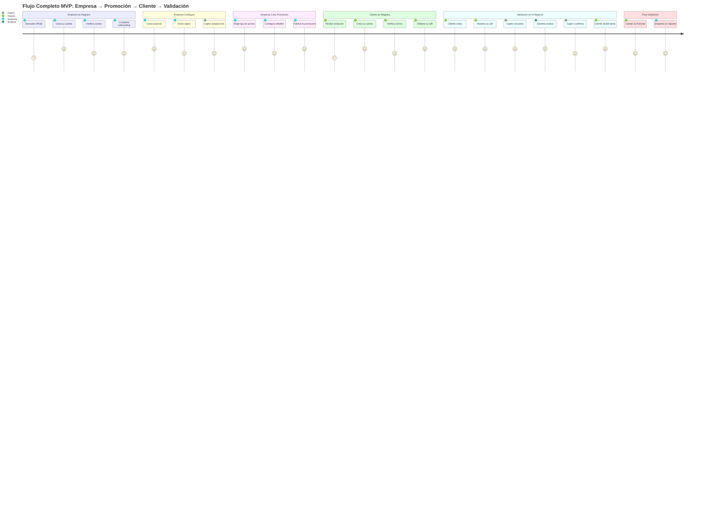
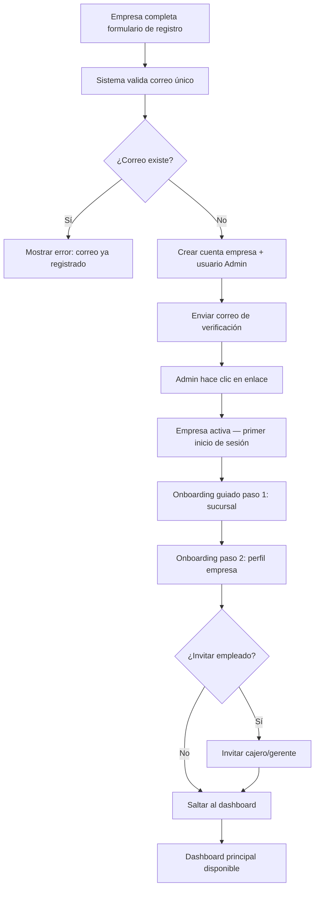
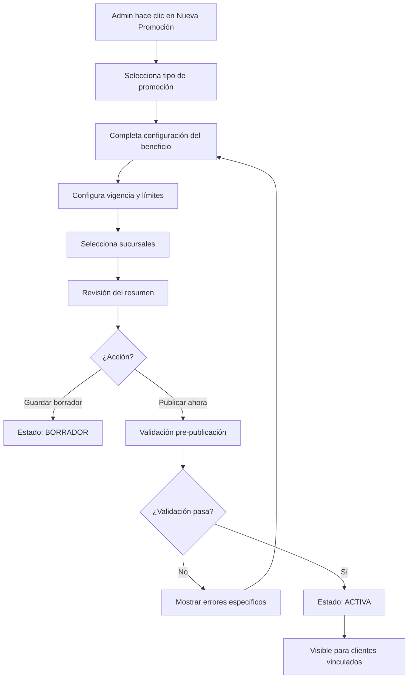
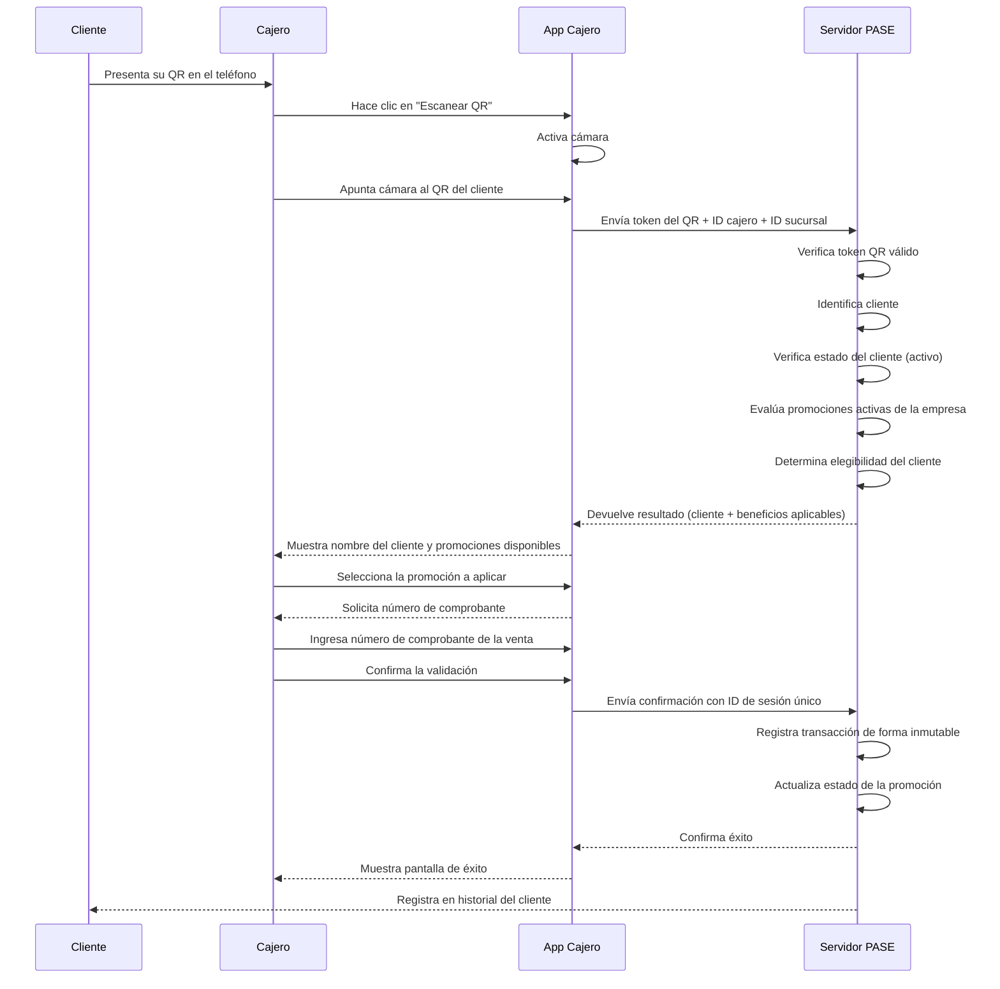

# MVP Scope & Functional Specification
# Definición Oficial del MVP

**Documento:** MVP-001
**Versión:** 1.0.0
**Estado:** Aprobado — Referencia Oficial del Proyecto
**Fecha:** 2026-06-27
**Clasificación:** Contrato Funcional del Proyecto

---

> **ADVERTENCIA:** Este documento es el contrato funcional del proyecto. Todo lo que se desarrolle deberá estar dentro del alcance aquí definido. Si una funcionalidad no aparece en este documento, no deberá desarrollarse en la primera versión. Cualquier adición al alcance deberá pasar por el proceso formal de cambio descrito en la Sección 12.

---

## Tabla de Contenidos

1. [Objetivo del MVP](#1-objetivo-del-mvp)
2. [Público Objetivo del MVP](#2-público-objetivo-del-mvp)
3. [Funcionalidades Obligatorias](#3-funcionalidades-obligatorias)
4. [Funcionalidades Opcionales](#4-funcionalidades-opcionales)
5. [Funcionalidades Excluidas](#5-funcionalidades-excluidas)
6. [Módulos Oficiales del MVP](#6-módulos-oficiales-del-mvp)
7. [Flujo Funcional Completo](#7-flujo-funcional-completo)
8. [Criterios de Éxito](#8-criterios-de-éxito)
9. [Riesgos del MVP](#9-riesgos-del-mvp)
10. [Roadmap Posterior al MVP](#10-roadmap-posterior-al-mvp)
11. [Checklist de Implementación](#11-checklist-de-implementación)
12. [Reglas del Proyecto](#12-reglas-del-proyecto)
13. [Autoauditoría](#13-autoauditoría)

---

## 1. Objetivo del MVP

### 1.1 Declaración de Propósito

El MVP (Minimum Viable Product) de PASE Digital Platform es la primera versión comercializable del sistema. No es un prototipo, no es una demostración, no es un experimento. Es la versión más pequeña del producto que puede venderse, usarse y generar valor real para empresas y clientes reales.

El propósito del MVP puede resumirse en una sola oración:

**Permitir que una empresa publique promociones digitales y que sus clientes las utilicen con un código QR, dejando trazabilidad completa de cada interacción.**

Esa es toda la promesa del MVP. Nada más, nada menos.

---

### 1.2 El Problema que Resuelve

Hoy, una empresa que quiere administrar promociones enfrenta uno o varios de estos problemas:

**Problema 1 — La promoción vive en papel o en tarjeta física.**
Las tarjetas de lealtad, sellos, cupones impresos y stickers son difíciles de controlar. Se pierden, se falsifican, se transfieren, y no dejan ningún registro verificable. La empresa no sabe si la promoción está funcionando. El cliente no sabe cuánto le falta para su beneficio.

**Problema 2 — La promoción vive en hojas de cálculo o en la memoria del cajero.**
La empresa lleva el control manualmente. Esto genera errores, inconsistencias entre sucursales, y depende del criterio personal de cada empleado. No hay historial, no hay auditoría, no hay evidencia.

**Problema 3 — La empresa no tiene visibilidad sobre el comportamiento de sus clientes.**
No sabe cuántas veces visita cada cliente, qué promociones usa, cuáles no usa, qué sucursal es más activa. Toma decisiones de marketing a ciegas.

**Problema 4 — El cliente no recuerda qué beneficios tiene.**
El cliente no sabe si tiene alguna promoción disponible, cuánto ha acumulado, qué necesita para canjear. La fricción hace que no use los beneficios aunque los tenga.

**Problema 5 — La empresa no puede escalar su programa de lealtad.**
Si quiere agregar una sucursal nueva, cambiar una promoción, o ver un reporte consolidado, el proceso es manual, lento y propenso a errores.

El MVP resuelve todos estos problemas de forma directa. No parcialmente, sino completamente, para el caso de uso central: empresa → promoción → cliente → validación → historial.

---

### 1.3 Por qué es Suficiente para Comenzar a Vender

Un producto puede comenzar a venderse cuando resuelve un problema real para un segmento real de clientes con suficiente calidad para que paguen por ello.

El MVP cumple esas tres condiciones:

**Resuelve un problema real:** Las empresas necesitan administrar promociones digitales. Sus clientes necesitan acceder a esas promociones sin fricción. El MVP conecta ambas partes.

**Para un segmento real:** Restaurantes, cafeterías, tiendas de ropa, salones de belleza, gimnasios, farmacias independientes. Negocios que ya tienen clientes, que ya hacen promociones informalmente, y que necesitan hacerlo de forma profesional.

**Con calidad suficiente para pagar:** El MVP no es incompleto. Cubre el flujo completo de principio a fin. Una empresa puede registrarse, configurar su negocio, publicar una promoción, y tener clientes usándola el mismo día. Eso tiene valor medible y pagable.

---

### 1.4 Por qué no Resolveremos Todo desde la Primera Versión

Esta pregunta tiene una respuesta directa: porque intentar resolver todo al mismo tiempo es la causa número uno de fracaso en productos de software.

Cada funcionalidad extra que se agrega al MVP:

- Aumenta el tiempo de desarrollo
- Introduce nuevas dependencias técnicas
- Genera nuevas superficies de error
- Distrae al equipo del flujo principal
- Retrasa la salida al mercado
- Aumenta el riesgo de construir algo que nadie usa

La decisión correcta no es construir el mejor producto posible desde el inicio. La decisión correcta es construir el producto mínimo que permita aprender, vender, iterar y mejorar con retroalimentación real.

Las funcionalidades que no están en el MVP no están descartadas. Están diferidas. Existirán en versiones futuras, construidas sobre la base de lo que el mercado confirmó que funciona.

**Principio guía:** Es mejor tener 10 funcionalidades que funcionan perfectamente que 30 funcionalidades que funcionan a medias.

---

## 2. Público Objetivo del MVP

### 2.1 Definición del Cliente Empresarial del MVP

El MVP no está diseñado para grandes corporaciones. No está diseñado para cadenas internacionales con cientos de sucursales, sistemas ERP propios, y equipos de tecnología dedicados. Esos clientes tienen necesidades de integración, personalización y escala que el MVP no puede satisfacer.

El cliente empresarial del MVP es el siguiente:

---

**Perfil A — El Negocio Independiente con Ambición de Crecer**

- Empresa con 1 a 3 sucursales
- Entre 2 y 15 empleados en contacto con clientes
- Ya tiene clientes recurrentes pero no los tiene identificados
- Ya hace promociones pero de forma informal (tarjetas de papel, descuentos verbales, "la décima gratis")
- Quiere profesionalizar su programa de lealtad sin complicarse
- No tiene equipo de tecnología propio
- Tiene capacidad de pago entre $20 y $80 USD mensuales

**Industrias representativas:** Restaurantes, cafeterías, panaderías, barberías, salones de belleza, tiendas de ropa boutique, heladerías, pizzerías, spas pequeños, estudios de yoga o pilates, librerías, floristerías.

---

**Perfil B — La Empresa Mediana en Expansión**

- Empresa con 3 a 10 sucursales
- Entre 15 y 80 empleados operativos
- Ya tiene algún sistema de administración (punto de venta, facturación)
- Quiere agregar un programa de lealtad digital sin reemplazar su sistema actual
- Necesita reportes consolidados entre sucursales
- Tiene algún área de marketing que diseña las promociones
- Tiene capacidad de pago entre $80 y $250 USD mensuales

**Industrias representativas:** Cadenas de restaurantes locales, clínicas dentales con varias sedes, gimnasios con múltiples locales, farmacias regionales independientes, tiendas de ropa con varias tiendas, cadenas de lavandería, servicios de limpieza profesional, centros de salud estética.

---

**Perfil C — La Empresa en Proceso de Digitalización**

- Empresa de cualquier tamaño que por primera vez quiere tener un programa de lealtad digital
- No tiene referencia de cómo funciona este tipo de plataforma
- Necesita simplicidad extrema en la configuración y en la operación diaria
- Valorará más la facilidad de uso que la cantidad de funcionalidades
- Tomará decisiones de adopción basándose en cuánto tiempo le toma implementar la plataforma

**Razón de inclusión:** Este perfil es el más importante para el MVP. Si el producto es suficientemente simple para ellos, el resto de perfiles no tendrá problemas de adopción.

---

### 2.2 Industrias Compatibles con el MVP

El MVP es compatible con cualquier industria donde se cumplan estas tres condiciones:

1. La empresa tiene clientes que regresan (recurrencia de visitas)
2. La empresa puede ofrecer un beneficio tangible en el punto de venta (descuento, producto, servicio)
3. La operación puede interrumpirse brevemente para escanear un QR (entre 5 y 30 segundos)

| Industria | Compatibilidad | Justificación |
|-----------|---------------|---------------|
| Restaurantes y cafeterías | Alta | Alta recurrencia, beneficios claros, proceso de pago ya existe |
| Servicios personales (salones, spas, barberías) | Alta | Recurrencia media-alta, beneficios directos, tiempo disponible |
| Tiendas de ropa y accesorios | Alta | Recurrencia media, descuentos son el beneficio natural |
| Farmacias independientes | Alta | Recurrencia alta, descuentos en productos específicos |
| Gimnasios y centros deportivos | Alta | Membresías son el modelo natural |
| Panaderías y pastelerías | Alta | Recurrencia muy alta, beneficios de acumulación funcionan bien |
| Clínicas y consultorios | Media | Recurrencia variable, pero planes de membresía son relevantes |
| Librerías y papelerías | Media | Recurrencia media, descuentos en compras específicas |
| Ferreterías independientes | Media | Recurrencia baja-media, programas de acumulación pueden funcionar |
| Supermercados locales | Baja | Complejidad de integración con sistema POS, catálogo extenso |
| E-commerce puro | No compatible | El MVP no cubre flujos sin punto de venta físico |
| Empresas de servicios B2B | No compatible | El cliente final debe ser una persona, no una empresa |

---

### 2.3 El Cliente Final del MVP

El cliente final es la persona que utiliza el Pase Digital para acceder a promociones.

**Características del cliente objetivo del MVP:**

- Adulto entre 18 y 55 años
- Tiene teléfono inteligente con acceso a internet
- Está acostumbrado a usar aplicaciones web o móviles
- Ya es cliente recurrente de al menos una empresa que usará la plataforma
- Valorará poder ver sus beneficios en un solo lugar sin necesidad de llevar tarjetas físicas

**Lo que el MVP le ofrece al cliente final:**

- Registro simple en menos de 3 minutos
- Un Pase Digital con código QR que no necesita imprimirse
- Visualización clara de promociones disponibles en los negocios donde es cliente
- Historial de cada vez que usó una promoción
- Certeza de que sus beneficios están registrados y no se perderán

---

### 2.4 A quién NO está Dirigido el MVP

Ser explícito sobre quién no es el cliente del MVP es tan importante como definir quién sí lo es.

**No es el cliente del MVP:**

- Grandes cadenas internacionales con más de 50 sucursales
- Empresas que necesitan integración con su sistema ERP o POS como requisito obligatorio
- Empresas con programas de lealtad ya establecidos y complejos que quieren migrar
- Empresas que necesitan una aplicación móvil nativa como canal principal
- Empresas cuyo modelo de negocio es 100% digital (e-commerce, delivery)
- Empresas que operan en múltiples países con múltiples monedas
- Empresas del sector financiero o bancario

Rechazar estos perfiles en el MVP no significa perderlos para siempre. Significa no complicar el MVP para satisfacer necesidades que requieren versiones futuras más maduras.

---

## 3. Funcionalidades Obligatorias

Las funcionalidades obligatorias son aquellas sin las cuales el MVP no puede funcionar. Si una de ellas falta, el producto no es vendible ni usable. Cada funcionalidad obligatoria tiene una justificación explícita de por qué pertenece al MVP y no puede diferirse.

---

### 3.1 Registro de Empresas

**Descripción:** El proceso completo por el cual una empresa crea su cuenta en la plataforma, proporciona su información básica, y queda activa para comenzar a usar el sistema.

**Por qué es obligatoria:** Sin registro de empresas no existe ningún otro flujo. Es la puerta de entrada a todo el sistema. Sin esto, no hay plataforma.

**Qué incluye en el MVP:**
- Formulario de registro con datos básicos de la empresa (nombre comercial, industria, país, ciudad, teléfono, correo electrónico)
- Creación automática del usuario Administrador de Empresa
- Verificación de correo electrónico
- Flujo de onboarding inicial guiado (mínimo: nombre de la primera sucursal y hora de operación)
- Estado inicial: empresa activa lista para configurar

**Qué no incluye en el MVP:**
- Verificación de identidad fiscal avanzada
- Aprobación manual por parte de PASE antes de activar la cuenta
- Integración con registros mercantiles o sistemas fiscales externos

---

### 3.2 Inicio de Sesión Empresarial

**Descripción:** El mecanismo por el cual los usuarios de una empresa (Administrador, Gerente, Cajero) acceden a la plataforma.

**Por qué es obligatoria:** Sin autenticación no hay acceso. Sin acceso no hay operación.

**Qué incluye en el MVP:**
- Inicio de sesión con correo electrónico y contraseña
- Recuperación de contraseña por correo electrónico
- Sesión persistente con cierre manual
- Diferenciación de vistas por rol (Administrador ve diferente que el Cajero)
- Cierre de sesión por inactividad prolongada

**Qué no incluye en el MVP:**
- Autenticación de dos factores (2FA) para empleados
- SSO con Google o Microsoft
- Inicio de sesión biométrico

---

### 3.3 Administración de Sucursales

**Descripción:** La capacidad del Administrador de Empresa para registrar, configurar y administrar las sucursales que forman parte de la empresa.

**Por qué es obligatoria:** La plataforma opera a nivel de sucursal. Cada validación de QR ocurre en una sucursal específica. Sin este módulo, los reportes y el historial no tienen ubicación, y los empleados no saben desde dónde operan.

**Qué incluye en el MVP:**
- Creación de sucursales con nombre, dirección y horarios de operación
- Activación y desactivación de sucursales
- Asignación de empleados a sucursales
- Límite de sucursales según el plan contratado (STARTER: 1, GROWTH: 3, BUSINESS: 10)
- Vista de sucursales activas desde el dashboard del Administrador

**Qué no incluye en el MVP:**
- Geolocalización de sucursales en mapa
- Herencia de configuraciones entre sucursales (en el MVP, las configuraciones se aplican empresa-nivel)
- Consolidación de reportes específicos por sucursal en tiempo real

---

### 3.4 Administración de Empleados

**Descripción:** La capacidad del Administrador para registrar empleados, asignarles roles y controlar su acceso a la plataforma.

**Por qué es obligatoria:** Sin empleados registrados, nadie puede operar el sistema. El cajero que escanea el QR debe estar registrado y asignado a una sucursal. Sin esto, la validación no puede ejecutarse.

**Qué incluye en el MVP:**
- Invitación de empleados por correo electrónico
- Asignación de rol (Administrador, Gerente de Sucursal, Cajero)
- Asignación de empleado a una o más sucursales
- Activación y desactivación de empleados
- Restablecimiento de contraseña por parte del Administrador

**Roles incluidos en el MVP (3 de 5):**

| Rol | Incluido en MVP | Justificación |
|-----|----------------|---------------|
| Administrador de Empresa | Sí | Imprescindible para configurar todo |
| Gerente de Sucursal | Sí | Necesario para supervisión operativa |
| Cajero | Sí | Es quien ejecuta el escaneo de QR |
| Supervisor | No | El Gerente puede cubrir esta función en el MVP |
| Empleado Operativo | No | No tiene funciones críticas en el MVP |

**Qué no incluye en el MVP:**
- Permisos granulares personalizados por empleado
- Registro de asistencia o turnos
- Auditoría de acciones por empleado (los logs existen, pero la interfaz de auditoría queda para v1.1)

---

### 3.5 Registro de Clientes

**Descripción:** El proceso completo por el cual una persona crea su cuenta de cliente en la plataforma y obtiene su Pase Digital.

**Por qué es obligatoria:** Sin clientes registrados no hay QR que escanear. El cliente es el otro extremo del flujo central del sistema.

**Qué incluye en el MVP:**
- Registro con nombre, correo electrónico y contraseña
- Verificación de correo electrónico
- Número de teléfono (opcional en registro, recomendado)
- Foto de perfil (opcional)
- Generación automática del Pase Digital con código QR al completar el registro

**Qué no incluye en el MVP:**
- Registro con número de teléfono como único identificador (solo como complemento)
- Registro iniciado desde el establecimiento (el cajero no puede registrar clientes en el MVP)
- Importación masiva de clientes existentes

---

### 3.6 Inicio de Sesión del Cliente

**Descripción:** El mecanismo por el cual un cliente accede a su cuenta para ver sus promociones, su QR y su historial.

**Por qué es obligatoria:** El cliente necesita acceder a su Pase Digital para presentarlo. Si no puede iniciar sesión, no puede usar el sistema.

**Qué incluye en el MVP:**
- Inicio de sesión con correo electrónico y contraseña
- Recuperación de contraseña por correo electrónico
- Sesión persistente en el dispositivo
- Acceso rápido al código QR desde la pantalla principal (sin requerir navegación)

**Qué no incluye en el MVP:**
- Inicio de sesión con Google o Apple
- Autenticación biométrica
- Múltiples sesiones simultáneas en diferentes dispositivos con control granular

---

### 3.7 Pase Digital QR

**Descripción:** El código QR único e irrepetible que identifica a cada cliente dentro de la plataforma. Es el elemento central de toda la operación.

**Por qué es obligatoria:** El QR es el mecanismo de validación. Sin él, no hay escaneo, no hay validación, no hay beneficio, no hay historial. Es el corazón del sistema.

**Qué incluye en el MVP:**
- Generación automática del QR en el momento del registro del cliente
- QR como identificador opaco (contiene únicamente el ID del cliente, nada más)
- Visualización del QR en la pantalla principal de la app del cliente
- Regeneración del QR cuando el cliente la solicite (invalidación del anterior)
- QR de alta densidad visual para lectura bajo diversas condiciones de iluminación
- Indicador visual de vigencia del QR

**Principios que no se negocian:**
- El QR nunca contendrá información sobre promociones
- El QR nunca contendrá información de beneficios disponibles
- El QR nunca expondrá datos personales del cliente
- Toda la lógica de evaluación ocurre en el servidor, no en el QR

**Qué no incluye en el MVP:**
- QR imprimible en formato tarjeta (queda para v1.1 como complemento)
- QR con imagen de marca de la empresa superpuesta
- QR en formato Apple Wallet o Google Wallet

---

### 3.8 Creación de Promociones

**Descripción:** La capacidad del Administrador de Empresa para crear y configurar diferentes tipos de promociones que sus clientes podrán utilizar.

**Por qué es obligatoria:** Sin promociones no hay nada que los clientes puedan usar. La creación de promociones es el núcleo del valor de negocio de la plataforma para las empresas.

**Tipos de promoción incluidos en el MVP:**

| Tipo | Familia | Incluido | Justificación |
|------|---------|----------|---------------|
| Descuento porcentual directo | A | Sí | El tipo más solicitado universalmente |
| Descuento de monto fijo | A | Sí | Segunda opción más solicitada |
| Producto o servicio gratis | A | Sí | "La décima gratis" es el caso de uso más conocido |
| Acumulación por visitas | B | Sí | El programa de lealtad más común en negocios físicos |
| Acumulación por monto de compra | B | Sí | Variante natural del anterior |
| Canje de acumulado | B | Sí | Necesario para completar el ciclo de acumulación |
| Plan básico de membresía | C | Sí | Los gimnasios y spas dependen de esto |
| Cupón de un solo uso | G | Sí | Caso de uso clásico para nuevos clientes |
| Cupón de múltiples usos | G | Sí | Campañas de temporada |
| Promoción de tiempo limitado | D | Sí | Descuento de fin de semana, hora feliz básica |

**Tipos de promoción excluidos del MVP (diferidos a v1.1):**
- Descuento progresivo (aumenta con más compras)
- Plan por número de visitas con beneficios escalonados
- Promociones sociales (trae un amigo)
- Promociones combinadas complejas (compra A y B, obtén C)
- Membresías con renovación automática

**Qué incluye la creación de cada promoción en el MVP:**
- Nombre y descripción de la promoción
- Tipo de beneficio y configuración del beneficio
- Fechas de inicio y fin (vigencia)
- Límite de usos total y por cliente
- Restricción de sucursales donde aplica
- Estado inicial (borrador o activa al publicar)

**Qué no incluye la creación de promociones en el MVP:**
- Segmentación de clientes por perfil para elegibilidad avanzada
- Reglas de elegibilidad complejas (solo aplica si el cliente ha gastado más de X)
- A/B testing de promociones
- Imágenes o banners de las promociones

---

### 3.9 Publicación de Promociones

**Descripción:** El proceso por el cual el Administrador hace que una promoción pase de borrador a activa y quede disponible para los clientes.

**Por qué es obligatoria:** Una promoción creada pero no publicada no sirve para nada. La publicación es la acción que activa el flujo completo.

**Qué incluye en el MVP:**
- Botón de publicación explícito con confirmación
- Validación previa a publicación (verificar que todos los campos obligatorios estén completos)
- Cambio de estado a ACTIVA al publicar
- Posibilidad de pausar una promoción activa temporalmente
- Posibilidad de terminar una promoción antes de su fecha de fin

**Qué no incluye en el MVP:**
- Publicación programada (la promoción se publica en el momento, no en una fecha futura automáticamente — las fechas de vigencia cubren este caso)
- Aprobación interna antes de publicar (el Administrador puede publicar sin revisión)
- Notificaciones push al publicar una nueva promoción

---

### 3.10 Consulta de Promociones por el Cliente

**Descripción:** La interfaz en la que el cliente puede ver qué promociones tiene disponibles en los negocios donde está registrado.

**Por qué es obligatoria:** Si el cliente no puede ver sus promociones, no sabrá que las tiene, no las usará, y la plataforma no tendrá valor para él ni para la empresa.

**Qué incluye en el MVP:**
- Lista de promociones disponibles organizadas por empresa
- Estado de cada promoción (disponible, en progreso, usada)
- Detalle de cada promoción al tocarlo (nombre, descripción, vigencia, condiciones básicas)
- Indicador de progreso en promociones de acumulación (ej: "3 de 10 visitas completadas")
- Sección de historial de promociones usadas

**Qué no incluye en el MVP:**
- Explorar promociones de empresas donde el cliente aún no está registrado
- Búsqueda o filtrado de promociones
- Notificaciones cuando una nueva promoción está disponible

---

### 3.11 Escaneo de QR

**Descripción:** La acción mediante la cual un cajero captura el código QR del cliente con la cámara del dispositivo para iniciar el proceso de validación.

**Por qué es obligatoria:** El escaneo es el punto de entrada de toda la validación. Sin escaneo no hay validación, sin validación no hay beneficio.

**Qué incluye en el MVP:**
- Interfaz de escaneo accesible con un toque desde la pantalla principal del cajero
- Uso de la cámara del dispositivo para leer el QR
- Retroalimentación visual y auditiva al leer el QR correctamente
- Tiempo máximo de respuesta del sistema después del escaneo: 3 segundos
- Manejo de error cuando el QR no es reconocido (mensaje claro y opción de reintentar)

**Qué no incluye en el MVP:**
- Entrada manual del código del cliente como alternativa al QR (queda para v1.1)
- Escaneo desde hardware especializado externo
- Modo offline de escaneo

---

### 3.12 Validación de Promociones

**Descripción:** El proceso completo del servidor desde que recibe el QR escaneado hasta que confirma el beneficio aplicado y registra la transacción.

**Por qué es obligatoria:** La validación ES el producto. Todo lo demás existe para hacer posible este momento. Si la validación no funciona, no hay plataforma.

**Qué incluye en el MVP:**
- Verificación de identidad del QR (token válido, cliente activo)
- Resolución del contexto (empresa, sucursal, cajero)
- Evaluación de elegibilidad del cliente para cada promoción activa
- Presentación de resultados al cajero (qué promociones aplican)
- Selección de la promoción a aplicar por el cajero
- Registro del comprobante de venta (número o monto ingresado manualmente por el cajero)
- Confirmación explícita por parte del cajero
- Registro inmutable de la transacción
- Notificación al cliente (en la siguiente apertura de su app, no en tiempo real)
- Actualización del estado de la promoción (visitas acumuladas, usos consumidos)

**Qué no incluye en el MVP:**
- Validación sin confirmación explícita del cajero
- Integración automática con el sistema POS de la empresa para obtener el comprobante
- Modo offline de validación
- Validación desde la app del cliente sin intervención del cajero

---

### 3.13 Historial del Cliente

**Descripción:** El registro cronológico de todas las interacciones del cliente con la plataforma: visitas, usos de promociones, acumulaciones, canjes.

**Por qué es obligatoria:** El historial es la prueba de que el sistema funciona. Es lo que genera confianza en el cliente. Si el cliente no puede ver que su visita quedó registrada, no confiará en la plataforma.

**Qué incluye en el MVP:**
- Lista cronológica de validaciones realizadas
- Por cada entrada: fecha, hora, nombre de la empresa, nombre de la sucursal, tipo de beneficio aplicado
- Indicador de estado (completada, anulada)
- Vista de detalle de cada transacción
- Acceso desde la sección principal de la app del cliente

**Qué no incluye en el MVP:**
- Exportación del historial en PDF o CSV por parte del cliente
- Estadísticas personales (cuánto ha ahorrado, cuántas visitas ha hecho)
- Historial de cambios en el perfil del cliente

---

### 3.14 Historial de Validaciones Empresarial

**Descripción:** El registro completo de todas las validaciones realizadas en la empresa o sucursal, accesible para el Administrador y el Gerente.

**Por qué es obligatoria:** La empresa necesita poder verificar que el sistema está funcionando, identificar validaciones específicas, y tener evidencia de cada operación realizada.

**Qué incluye en el MVP:**
- Lista de todas las validaciones de la empresa ordenadas por fecha y hora
- Filtro por sucursal, por rango de fechas, por tipo de promoción
- Por cada entrada: fecha, hora, cliente (nombre enmascarado por defecto), cajero, sucursal, promoción, beneficio aplicado, estado
- Vista de detalle de cada transacción
- Posibilidad de anular una transacción dentro del período permitido (con registro del motivo)

**Qué no incluye en el MVP:**
- Exportación masiva del historial en el MVP (queda para v1.1)
- Búsqueda por nombre de cliente (queda para v1.1 — privacidad)
- Alertas automáticas por comportamiento inusual

---

### 3.15 Dashboard Empresarial

**Descripción:** La pantalla principal del portal empresarial que muestra un resumen del estado actual de la cuenta y las métricas más relevantes del día/semana/mes.

**Por qué es obligatoria:** El dashboard es la primera pantalla que ve el Administrador al entrar. Si no hay nada útil ahí, la percepción de valor del producto cae inmediatamente.

**Qué incluye en el MVP:**
- Total de validaciones del día
- Total de clientes activos vinculados a la empresa
- Promociones activas actualmente (con nombre y usos restantes)
- Últimas 10 validaciones (vista rápida)
- Alerta si hay promociones próximas a vencer (en los próximos 7 días)
- Alerta si hay promociones agotadas (sin usos disponibles)

**Qué no incluye en el MVP:**
- Gráficas avanzadas de tendencias
- Comparativos entre períodos
- Mapa de calor de sucursales

---

### 3.16 Dashboard Administrativo (PASE)

**Descripción:** El panel de administración que utiliza el equipo interno de PASE para monitorear el estado de la plataforma, las empresas registradas y los clientes activos.

**Por qué es obligatoria:** Sin este panel, el equipo de PASE no puede operar el negocio. No puede ver si hay empresas con problemas, no puede responder a solicitudes de soporte, no puede monitorear la salud del sistema.

**Qué incluye en el MVP:**
- Lista de todas las empresas registradas con su estado
- Activación y desactivación de empresas
- Lista de clientes registrados
- Métricas globales: total de empresas activas, total de clientes, total de validaciones del día
- Vista de detalle de cualquier empresa
- Capacidad de enviar correo a una empresa desde el panel

**Qué no incluye en el MVP:**
- Panel de métricas financieras (ingresos por suscripciones)
- Sistema de soporte técnico integrado (tickets)
- Monitoreo técnico de infraestructura

---

### 3.17 Reportes Básicos

**Descripción:** Los reportes mínimos que permiten a una empresa evaluar el desempeño de su programa de promociones.

**Por qué son obligatorios:** Un programa de promociones sin reportes es como hacer marketing sin medir resultados. Las empresas necesitan saber qué está funcionando para decidir si siguen pagando la plataforma.

**Qué incluye en el MVP:**

**Reporte 1 — Resumen de Validaciones:**
- Total de validaciones por período (día, semana, mes)
- Desglose por sucursal
- Desglose por tipo de promoción

**Reporte 2 — Desempeño de Promociones:**
- Por cada promoción: nombre, total de usos, porcentaje de cuota utilizada, días vigentes restantes
- Ordenable por más usada / menos usada

**Reporte 3 — Actividad de Clientes:**
- Total de clientes que visitaron en el período
- Clientes nuevos vs. clientes recurrentes (primera visita vs. visitas repetidas)
- Promedio de visitas por cliente

**Qué no incluye en el MVP:**
- Reportes de rentabilidad o impacto económico de las promociones
- Segmentación de clientes por perfil demográfico
- Exportación automática programada
- Reportes de comparativo entre períodos históricos extendidos

---

### 3.18 Configuración del Perfil de Empresa

**Descripción:** La sección donde el Administrador puede actualizar la información de su empresa y configurar los aspectos básicos de cómo opera la plataforma para su negocio.

**Por qué es obligatoria:** Las empresas necesitan poder mantener su información actualizada. También necesitan configurar al menos el nombre de la empresa tal como aparecerá para los clientes.

**Qué incluye en el MVP:**
- Actualización de nombre comercial, industria, teléfono, dirección principal
- Carga de logotipo de la empresa
- Configuración del color principal (para personalización básica del Pase Digital)
- Cambio del correo electrónico del Administrador
- Cambio de contraseña del Administrador
- Gestión del plan de suscripción (ver plan actual, fecha de próximo cobro)

**Qué no incluye en el MVP:**
- Branding avanzado (múltiples colores, fuentes personalizadas)
- Página pública de la empresa dentro de la plataforma
- Certificados o documentos legales de la empresa

---

### 3.19 Configuración del Perfil del Cliente

**Descripción:** La sección donde el cliente puede actualizar su información personal y gestionar su cuenta.

**Por qué es obligatoria:** Los clientes necesitan poder corregir su información, cambiar su contraseña y tener control básico sobre su cuenta. Es un derecho mínimo del usuario.

**Qué incluye en el MVP:**
- Actualización de nombre, teléfono, foto de perfil
- Cambio de correo electrónico (con reverificación)
- Cambio de contraseña
- Proceso de eliminación de cuenta (solicitud + confirmación por correo + período de gracia de 24 horas)

**Qué no incluye en el MVP:**
- Gestión de notificaciones (qué tipo de correos recibe)
- Configuración de privacidad granular
- Gestión de dispositivos de confianza

---

## 4. Funcionalidades Opcionales

Las funcionalidades opcionales son aquellas que agregarían valor real al MVP pero que pueden incluirse solo si el tiempo de desarrollo lo permite sin comprometer la calidad del flujo principal. Su inclusión se evaluará al final del desarrollo, cuando el flujo central esté completo y estable.

**Criterio de inclusión:** Una funcionalidad opcional solo se incluye si:
1. El flujo principal está completo y sin bugs conocidos
2. Su desarrollo no afecta ningún componente del flujo principal
3. No requiere más de 2 semanas de desarrollo adicional
4. Su ausencia en el lanzamiento no afecta la capacidad de vender el producto

---

### Funcionalidad Opcional 1 — Entrada Manual de ID de Cliente

**Descripción:** En caso de que el cajero no pueda escanear el QR (teléfono sin batería, pantalla rota), puede ingresar manualmente el código único del cliente.

**Impacto si se incluye:** Reduce la fricción operativa en situaciones de emergencia. Aumenta la resiliencia del sistema frente a fallas del dispositivo del cliente.

**Impacto si se excluye:** El cliente deberá tener su QR disponible para usar la plataforma. Esto es una restricción razonable para el MVP.

**Evaluación:** Vale la pena incluirla si el desarrollo de la pantalla de escaneo ya está completa. Es un campo de texto adicional en la misma pantalla.

---

### Funcionalidad Opcional 2 — Anulación de Transacciones por el Cajero

**Descripción:** Capacidad del cajero de anular una validación recién realizada (dentro de los primeros 5 minutos) sin necesidad de escalar al Gerente.

**Impacto si se incluye:** Reduce la dependencia del Gerente para errores operativos menores. Mejora la fluidez del proceso en el punto de venta.

**Impacto si se excluye:** El Gerente puede anular en las primeras 4 horas. El flujo principal no se rompe, solo hay un paso adicional.

**Evaluación:** Incluirla si el flujo de anulación del Gerente ya está completo. Es la misma lógica con un límite de tiempo y rol diferente.

---

### Funcionalidad Opcional 3 — Correo de Bienvenida Personalizado para Clientes

**Descripción:** Al registrarse el cliente en una empresa específica (primera vinculación), la empresa puede tener configurado un mensaje de bienvenida que se envía automáticamente.

**Impacto si se incluye:** Mejora la percepción de la empresa por parte del cliente desde el primer momento. Aumenta la retención temprana.

**Impacto si se excluye:** El cliente recibirá solo el correo de verificación estándar de PASE. Funcional pero sin personalización.

**Evaluación:** Solo si el sistema de correos ya está construido. No requiere nueva infraestructura, solo una plantilla adicional y un trigger.

---

### Funcionalidad Opcional 4 — Vista de Clientes Vinculados para el Administrador

**Descripción:** Una lista paginada de los clientes vinculados a la empresa, con información básica (nombre enmascarado, fecha de primera visita, total de visitas).

**Impacto si se incluye:** Da al Administrador una visión del tamaño y actividad de su base de clientes. Útil para evaluar el crecimiento del programa.

**Impacto si se excluye:** Los reportes ya muestran métricas agregadas. La lista granular puede esperar.

**Evaluación:** Baja prioridad. Solo si hay tiempo después de completar todos los reportes obligatorios.

---

### Funcionalidad Opcional 5 — Términos y Condiciones por Promoción

**Descripción:** Campo de texto libre donde el Administrador puede escribir las condiciones específicas de una promoción (ej: "No aplica en días festivos", "Solo en producto seleccionado").

**Impacto si se incluye:** Protege legalmente a la empresa y comunica mejor las condiciones al cajero y al cliente.

**Impacto si se excluye:** La descripción general de la promoción puede incluir esta información informalmente.

**Evaluación:** Fácil de implementar (es un campo de texto en el formulario de creación de promoción). Alta relación beneficio/esfuerzo.

---

## 5. Funcionalidades Excluidas

Las funcionalidades excluidas son aquellas que quedan definitivamente fuera del MVP. No son candidatas a incluirse sin importar cuánto tiempo sobre. Requieren evaluación y diseño específico para versiones futuras.

---

### 5.1 Gamificación

**Descripción:** Elementos de juego como insignias, niveles de cliente, clasificaciones, rachas de visitas, logros desbloqueables, etc.

**Por qué está excluida:**
La gamificación requiere una capa completa de diseño de experiencia independiente al flujo de validación. No es una funcionalidad que se agrega, es un sistema paralelo con su propio diseño, sus propias reglas, su propia interfaz y su propio mantenimiento. En el MVP, la empresa necesita que el cliente use sus promociones. La gamificación puede esperar hasta que haya suficiente data de uso real para diseñarla correctamente.

**Riesgo de incluirla:** Distraería el desarrollo de 3 a 6 semanas y agregaría complejidad a la base de datos y a la lógica del Motor de Promociones sin contribuir al flujo principal.

---

### 5.2 Sistema de Puntos

**Descripción:** Un sistema donde el cliente acumula puntos canjeables por beneficios, con equivalencias configurables (ej: $1 = 10 puntos, 100 puntos = 1 café gratis).

**Por qué está excluida:**
El sistema de puntos es sustancialmente más complejo que la acumulación por visitas incluida en el MVP. Requiere configurar tasas de conversión, gestionar saldos de puntos con precisión financiera, manejar canjes parciales y totales, y resolver casos de borde como puntos por expirar, puntos en litigio, y puntos en transacciones anuladas. El Motor de Promociones del MVP cubre acumulación por visitas y por monto de compra, que son casos de uso suficientes para el lanzamiento.

**Riesgo de incluirlo:** Duplica la complejidad del módulo de acumulación y puede introducir errores de consistencia que afecten la confianza del cliente en la plataforma.

---

### 5.3 Marketplace de Promociones

**Descripción:** Una sección pública dentro de la plataforma donde los clientes pueden explorar promociones de empresas donde aún no están registrados, similar a un directorio de ofertas.

**Por qué está excluida:**
El marketplace requiere un modelo de descubrimiento y adquisición de clientes completamente diferente al modelo del MVP. En el MVP, la empresa lleva a sus clientes a la plataforma. En el marketplace, PASE lleva clientes a las empresas. Eso implica diseñar una propuesta de valor diferente, un flujo de registro diferente, y un motor de búsqueda y recomendación. Es un producto diferente dentro del mismo producto.

**Riesgo de incluirlo:** Difumina el foco del MVP y crea expectativas de adquisición de clientes que la plataforma no puede satisfacer en la primera versión.

---

### 5.4 API Pública

**Descripción:** Una interfaz de programación que permite a terceros (otras aplicaciones, sistemas POS, ERPs) integrarse con la plataforma.

**Por qué está excluida:**
Una API pública implica estabilidad contractual. Una vez publicada, los clientes dependerán de ella y cualquier cambio puede romper sus integraciones. En el MVP, el producto está siendo definido y construido. Los modelos de datos, los flujos y las respuestas cambiarán. Publicar una API antes de que el producto esté estabilizado es una deuda técnica enorme.

**Riesgo de incluirla:** Congela el diseño del sistema antes de tener suficiente feedback para saber qué debe congelarse.

---

### 5.5 Aplicación Móvil Nativa

**Descripción:** Una aplicación instalable en iOS y/o Android construida con tecnología nativa o híbrida.

**Por qué está excluida:**
Una aplicación móvil nativa duplica el esfuerzo de desarrollo: cada funcionalidad debe construirse dos veces (web + app), mantenerse en dos plataformas, y pasar por procesos de aprobación en tiendas de apps que pueden tomar semanas. La plataforma web progresiva (PWA) cubre el 95% de los casos de uso del cliente en el MVP: presentar el QR, ver promociones, ver historial. La instalación en el dispositivo desde el navegador cubre el caso de acceso rápido.

**Riesgo de incluirla:** El tiempo de desarrollo de una app nativa consumiría entre 2 y 4 meses adicionales sin agregar funcionalidad nueva, solo duplicando la existente en otro canal.

---

### 5.6 Notificaciones Push

**Descripción:** Notificaciones que aparecen en la pantalla del teléfono del cliente sin que tenga la aplicación abierta.

**Por qué está excluida:**
Las notificaciones push en web requieren configuración técnica específica (service workers, permisos del navegador) y en móvil nativo requieren infraestructura dedicada. En el MVP, el correo electrónico cubre las notificaciones críticas (verificación, confirmación de beneficio). Las notificaciones push son un canal de marketing y retención que pertenece a versiones posteriores cuando ya hay datos suficientes para segmentar mensajes relevantes.

**Riesgo de incluirlas:** Agregar notificaciones push en el MVP sin estrategia de contenido puede resultar en notificaciones irrelevantes que el cliente silencia, dañando la percepción del producto.

---

### 5.7 Sistema de Referidos

**Descripción:** Funcionalidad donde un cliente puede invitar a otro cliente a registrarse y ambos reciben un beneficio por la referencia.

**Por qué está excluida:**
Los sistemas de referidos requieren un mecanismo de tracking de origen (link único, código de invitación), reglas de elegibilidad para el beneficio (¿cuándo se activa? ¿qué se da? ¿hay límite?), y gestión de fraude (prevenir auto-referencias). Es un submódulo completo con su propia lógica de negocio. En el MVP, la adquisición de clientes está a cargo de la empresa, no de la plataforma.

---

### 5.8 Programa de Afiliados

**Descripción:** Un sistema donde personas o empresas pueden recomendar PASE a nuevas empresas a cambio de comisiones o beneficios.

**Por qué está excluida:**
Es un módulo de canal de ventas completamente independiente al producto principal. Requiere gestión de comisiones, cálculo de pagos, paneles de afiliados y posiblemente integración con pasarelas de pago para transferir comisiones. No tiene ninguna relación con el flujo central del MVP.

---

### 5.9 Inteligencia Artificial

**Descripción:** Cualquier funcionalidad basada en modelos de aprendizaje automático: recomendaciones personalizadas, predicción de comportamiento, detección automática de anomalías, chatbots, etc.

**Por qué está excluida:**
La inteligencia artificial requiere datos históricos suficientes para entrenar modelos efectivos. En el MVP, esos datos aún no existen. Una IA entrenada con datos insuficientes produce resultados incorrectos que dañan la confianza. Además, la infraestructura para entrenar, servir y monitorear modelos de ML no es parte del stack de una plataforma en su primera versión.

---

### 5.10 Automatizaciones Avanzadas

**Descripción:** Reglas automáticas configurables por la empresa: "si un cliente no ha visitado en 30 días, enviarle un cupón automáticamente", "si una promoción baja del 10% de uso, enviar alerta al gerente", etc.

**Por qué está excluida:**
Las automatizaciones requieren un motor de reglas, un sistema de disparadores (triggers), y infraestructura de procesamiento en segundo plano que va más allá del MVP. En el MVP, las acciones son manuales y conscientes. La automatización es una capa de eficiencia para versiones maduras.

---

### 5.11 Integraciones Complejas

**Descripción:** Integración bidireccional con sistemas POS específicos (Square, Toast, Lightspeed, NCR), ERPs (SAP, Oracle), sistemas de facturación, o plataformas de delivery.

**Por qué está excluida:**
Cada integración requiere análisis específico del sistema destino, desarrollo de conectores a medida, manejo de versiones de APIs externas, y soporte continuo. En el MVP, el cajero ingresa el número de comprobante manualmente. Eso es suficiente para el flujo principal. Las integraciones son un diferenciador competitivo para versiones posteriores.

---

### 5.12 Motor de Recomendaciones

**Descripción:** Un sistema que sugiere promociones relevantes a los clientes basándose en su comportamiento, historial y preferencias.

**Por qué está excluida:**
Un motor de recomendaciones efectivo requiere datos de comportamiento histórico, algoritmos de filtrado colaborativo o basado en contenido, y una capa de personalización en la interfaz del cliente. Nada de eso existe en el MVP. Además, la recomendación de algo que no existe (pocas empresas, pocas promociones) no tiene valor. Se construirá cuando haya suficiente volumen de datos.

---

### 5.13 Promociones Inteligentes

**Descripción:** Promociones que se ajustan automáticamente según el comportamiento del cliente, las condiciones del mercado o los objetivos de la empresa (precio dinámico, descuentos personalizados por perfil).

**Por qué está excluida:**
Igual que el motor de recomendaciones, las promociones inteligentes requieren datos históricos y capacidad de procesamiento que no existen en el MVP. El valor del MVP está en promociones simples, predecibles y correctamente ejecutadas.

---

### 5.14 Sistema Multimoneda

**Descripción:** Soporte para que la plataforma opere con diferentes monedas según el país de la empresa.

**Por qué está excluida:**
El MVP opera en un mercado inicial específico. La multimoneda requiere conversiones, tipos de cambio, redondeos y potencialmente implicaciones fiscales. Es complejidad innecesaria para el lanzamiento.

---

### 5.15 Sistema Multilenguaje

**Descripción:** La plataforma en múltiples idiomas (inglés, portugués, francés, etc.).

**Por qué está excluida:**
El MVP opera en un mercado hispanohablante. Agregar idiomas en el MVP implica internacionalizar toda la interfaz, los correos, los mensajes de error, y los documentos de ayuda. Es trabajo significativo que no agrega valor para el mercado inicial.

---

## 6. Módulos Oficiales del MVP

El MVP se compone exactamente de los siguientes módulos. No más, no menos. Cada módulo tiene un propósito específico y sus límites son claros.

```
┌─────────────────────────────────────────────────────────────────┐
│                     PASE DIGITAL PLATFORM                       │
│                         MVP — 6 Módulos                         │
│                                                                 │
│  ┌───────────────┐  ┌───────────────┐  ┌───────────────────┐  │
│  │   EMPRESAS    │  │   CLIENTES    │  │    PROMOCIONES    │  │
│  │               │  │               │  │                   │  │
│  │ • Registro    │  │ • Registro    │  │ • Creación        │  │
│  │ • Sucursales  │  │ • Pase QR     │  │ • Publicación     │  │
│  │ • Empleados   │  │ • Vinculación │  │ • Administración  │  │
│  │ • Perfil      │  │ • Historial   │  │ • Ciclo de vida   │  │
│  └───────────────┘  └───────────────┘  └───────────────────┘  │
│                                                                 │
│  ┌───────────────┐  ┌───────────────┐  ┌───────────────────┐  │
│  │  VALIDACIÓN   │  │   REPORTES    │  │  CONFIGURACIÓN    │  │
│  │     QR        │  │               │  │                   │  │
│  │ • Escaneo     │  │ • Validaciones│  │ • Empresa         │  │
│  │ • Evaluación  │  │ • Promociones │  │ • Cliente         │  │
│  │ • Confirmación│  │ • Actividad   │  │ • Admin PASE      │  │
│  │ • Registro    │  │   de clientes │  │ • Planes          │  │
│  └───────────────┘  └───────────────┘  └───────────────────┘  │
└─────────────────────────────────────────────────────────────────┘
```

---

### Módulo 1 — Empresas

**Propósito:** Gestionar todo el ciclo de vida de las empresas que usan la plataforma, desde su registro hasta la administración diaria de sucursales y empleados.

**Límites del módulo:**
- Todo lo relacionado con la empresa como entidad pertenece aquí
- La empresa no ve ni administra datos de otras empresas
- El módulo no gestiona la contabilidad ni las finanzas de la empresa

**Componentes:**
- Registro y onboarding de empresas
- Administración de sucursales
- Administración de empleados y roles
- Configuración del perfil empresarial
- Dashboard empresarial

---

### Módulo 2 — Clientes

**Propósito:** Gestionar el ciclo de vida de los clientes finales, desde su registro hasta la administración de su perfil y la visualización de sus beneficios.

**Límites del módulo:**
- El cliente es independiente de cualquier empresa (puede vincularse a múltiples)
- El módulo no gestionará el comportamiento de compra fuera de la plataforma
- Los datos del cliente son propiedad del cliente, no de la empresa

**Componentes:**
- Registro y verificación de clientes
- Generación y gestión del Pase Digital QR
- Visualización de promociones disponibles
- Historial de interacciones
- Configuración del perfil del cliente

---

### Módulo 3 — Promociones

**Propósito:** Permitir a las empresas crear, configurar, publicar y administrar sus promociones digitales.

**Límites del módulo:**
- Las promociones son de la empresa, no de la plataforma
- El módulo define la estructura de las promociones, no evalúa su aplicabilidad (eso es el Motor de Validación)
- El módulo no gestiona el impacto financiero de las promociones

**Componentes:**
- Creador de promociones (10 tipos en el MVP)
- Administración del ciclo de vida de cada promoción
- Configuración de vigencia, límites y restricciones
- Publicación y desactivación

---

### Módulo 4 — Validación QR

**Propósito:** Ejecutar el flujo completo de validación: desde el escaneo del QR hasta la confirmación del beneficio y el registro de la transacción.

**Límites del módulo:**
- Es el único punto donde se aplican beneficios a los clientes
- Toda evaluación de elegibilidad ocurre aquí, en el servidor
- El módulo registra pero no analiza (el análisis es de Reportes)

**Componentes:**
- Interfaz de escaneo para el cajero
- Motor de evaluación (server-side)
- Presentación de resultados al cajero
- Flujo de confirmación
- Registro inmutable de transacciones

---

### Módulo 5 — Reportes

**Propósito:** Proporcionar a la empresa información suficiente para evaluar el desempeño de su programa de promociones.

**Límites del módulo:**
- Los reportes son de lectura, no permiten modificar datos
- En el MVP, los reportes son estáticos (sin exportación masiva)
- No incluirán análisis predictivo ni recomendaciones

**Componentes:**
- Reporte de validaciones
- Reporte de desempeño de promociones
- Reporte de actividad de clientes

---

### Módulo 6 — Configuración

**Propósito:** Gestionar la configuración del sistema a nivel de empresa, de cliente y de la plataforma (PASE).

**Límites del módulo:**
- La configuración de empresa es visible solo para el Administrador de la empresa
- La configuración del cliente es visible solo para el propio cliente
- La configuración de PASE es visible solo para el equipo interno

**Componentes:**
- Configuración de perfil de empresa
- Configuración de perfil de cliente
- Panel administrativo de PASE (gestión de empresas y clientes desde el lado operador)

---

## 7. Flujo Funcional Completo

### 7.1 El Gran Flujo: De Empresa Nueva a Primera Validación

Este es el recorrido completo desde que una empresa decide usar PASE hasta que su primer cliente usa una promoción.



---

### 7.2 Flujo Detallado: Registro y Configuración de la Empresa

**Etapa 1 — Registro**

La empresa llega a la plataforma a través de cualquier canal de adquisición (publicidad, referencia, búsqueda). En la pantalla de registro, completa:

- Nombre comercial del negocio
- Industria (selecciona de una lista)
- País y ciudad
- Correo electrónico del Administrador
- Contraseña

Al enviar el formulario, el sistema:
1. Verifica que el correo no esté ya registrado
2. Crea la cuenta de la empresa en estado PRE_REGISTRO
3. Crea el usuario Administrador vinculado a esa empresa
4. Envía un correo de verificación al Administrador

Al hacer clic en el enlace de verificación, la empresa pasa a estado ACTIVA y el Administrador puede iniciar sesión.

**Etapa 2 — Onboarding Guiado**

Al iniciar sesión por primera vez, el Administrador ve una guía de configuración inicial. El sistema le pide completar tres pasos mínimos antes de que el dashboard esté disponible:

1. **Configurar la primera sucursal:** nombre y horario de operación
2. **Confirmar el perfil de la empresa:** el nombre ya está del registro, pero puede ajustar la industria y agregar teléfono de contacto
3. **Invitar al primer empleado (opcional):** puede saltarse este paso e invitar después

Una vez completados los pasos obligatorios, el dashboard principal está disponible.



---

### 7.3 Flujo Detallado: Invitación y Activación del Cajero

El Administrador va a la sección de Empleados y hace clic en "Invitar empleado". Completa:
- Nombre del empleado
- Correo electrónico
- Rol (Cajero o Gerente de Sucursal)
- Sucursal asignada

El sistema envía un correo de invitación al empleado. El correo contiene un enlace válido por 72 horas. Al hacer clic, el empleado:
1. Establece su contraseña
2. Queda activo y puede iniciar sesión

Desde su primera sesión, el cajero ve únicamente la pantalla de escaneo de QR. No tiene acceso a configuración de promociones ni a reportes.

---

### 7.4 Flujo Detallado: Creación y Publicación de Promoción

El Administrador va a la sección de Promociones y hace clic en "Nueva Promoción".

**Paso 1 — Selección del tipo:**
Ve una pantalla con los 10 tipos de promoción disponibles, cada uno con un ícono y una descripción de una línea. Selecciona el tipo que mejor describe lo que quiere ofrecer.

**Paso 2 — Configuración del beneficio:**
Según el tipo seleccionado, el formulario se adapta. Ejemplos:
- Si seleccionó "Descuento porcentual directo": ingresa el porcentaje (ej: 15%)
- Si seleccionó "Acumulación por visitas": ingresa el número de visitas requeridas y el beneficio al completar (ej: 10 visitas → 1 café gratis)
- Si seleccionó "Cupón de un solo uso": ingresa el beneficio del cupón y la cantidad de cupones disponibles

**Paso 3 — Configuración de vigencia y límites:**
- Fecha de inicio (puede ser hoy)
- Fecha de fin (obligatoria)
- Límite total de usos (opcional — si no se pone, es ilimitado dentro de la vigencia)
- Límite de usos por cliente (opcional — ej: máximo 1 por cliente por mes)
- Sucursales donde aplica (por defecto: todas)

**Paso 4 — Revisión y publicación:**
El Administrador ve un resumen de la promoción. Tiene dos opciones:
- "Guardar como borrador" — la promoción queda guardada pero no activa
- "Publicar ahora" — la promoción queda activa inmediatamente



---

### 7.5 Flujo Detallado: Registro del Cliente

El cliente llega al portal de clientes de PASE (web o PWA). En la pantalla de registro, completa:
- Nombre completo
- Correo electrónico
- Contraseña

El sistema envía un correo de verificación. Al verificar, el cliente:
1. Está activo en la plataforma
2. Tiene su Pase Digital generado automáticamente
3. Ve la pantalla principal con su código QR

El cliente aún no está vinculado a ninguna empresa. La vinculación ocurre en la primera validación.

---

### 7.6 Flujo Detallado: Primera Visita del Cliente al Negocio

Este es el momento más importante del flujo completo. El cliente llega al establecimiento y quiere usar PASE.

**Antes de la validación:**
El cliente abre la app de PASE en su teléfono. Ve su código QR en la pantalla principal. No necesita buscar nada, el QR está en primer plano.

El cajero tiene la pantalla de escaneo abierta en su dispositivo (tablet, teléfono o computadora con cámara).



---

### 7.7 Flujo Detallado: El Cliente Consulta su Historial

Después de la visita, el cliente puede abrir PASE y ver:
- La sección "Mis Promociones" muestra el progreso actualizado (ej: ahora tiene 4/10 visitas si era una acumulación)
- La sección "Historial" muestra la entrada de esa visita con fecha, hora, empresa, sucursal y beneficio recibido

Si fue su primera visita a esa empresa, la empresa ahora aparece en la sección "Mis Negocios" del cliente.

---

### 7.8 Flujo Detallado: La Empresa Consulta sus Reportes

El Administrador abre el portal empresarial y ve en el dashboard:
- La validación recién realizada aparece en "Últimas validaciones"
- El contador de validaciones del día se ha incrementado
- Si era la primera vez que ese cliente visitaba, el contador de clientes activos también creció

En la sección de Reportes, puede ver:
- El reporte de validaciones del día mostrando esa transacción
- El reporte de la promoción que se usó mostrando un uso más consumido

---

## 8. Criterios de Éxito

Los criterios de éxito del MVP no son métricas de código. Son condiciones funcionales verificables que demuestran que el producto hace lo que prometió. El MVP está terminado cuando todos estos criterios se cumplen sin excepción.

---

### Grupo A — Criterios de la Empresa

**CE-A01 — Una empresa puede registrarse de forma autónoma**
Una persona, sin ayuda del equipo de PASE, puede ir al portal, crear su cuenta, verificar su correo y ver el dashboard en menos de 10 minutos.

**CE-A02 — Una empresa puede crear su primera sucursal**
El Administrador puede registrar una sucursal con nombre y horario de operación en menos de 3 minutos.

**CE-A03 — Una empresa puede invitar a un cajero**
El Administrador puede enviar una invitación a un cajero y el cajero puede activar su cuenta y iniciar sesión en menos de 5 minutos desde que recibe el correo.

**CE-A04 — Una empresa puede crear y publicar una promoción**
El Administrador puede crear cualquiera de los 10 tipos de promoción incluidos, configurarla completamente y publicarla en menos de 5 minutos.

**CE-A05 — Una empresa puede ver su historial de validaciones**
El historial muestra todas las transacciones con fecha, hora, cliente, cajero, sucursal y beneficio aplicado. Es posible filtrar por sucursal y por rango de fechas.

**CE-A06 — Una empresa puede ver sus reportes básicos**
Los 3 reportes del MVP muestran datos correctos y consistentes con el historial de validaciones.

**CE-A07 — Una empresa puede pausar y reactivar una promoción**
El Administrador puede cambiar el estado de una promoción activa a pausada y viceversa, y el cambio tiene efecto inmediato en el sistema de validación.

---

### Grupo B — Criterios del Cliente

**CE-B01 — Un cliente puede registrarse de forma autónoma**
Una persona puede ir al portal de clientes, crear su cuenta, verificar su correo y ver su código QR en menos de 5 minutos.

**CE-B02 — El código QR es visible desde la pantalla principal**
Al abrir la app, el QR es lo primero que el cliente ve. No necesita navegar, buscar ni hacer scroll para encontrarlo.

**CE-B03 — El cliente puede ver sus promociones disponibles**
Después de la primera validación, el cliente puede ver la empresa vinculada y las promociones disponibles en esa empresa con su estado actualizado.

**CE-B04 — El cliente puede ver su historial completo**
Cada validación realizada aparece en el historial del cliente con información correcta: fecha, hora, empresa, sucursal y beneficio recibido.

**CE-B05 — El historial del cliente es consistente con el historial empresarial**
Una transacción que aparece en el historial de la empresa también aparece en el historial del cliente correspondiente, con la misma información.

---

### Grupo C — Criterios del Flujo de Validación

**CE-C01 — Una validación toma menos de 30 segundos en condiciones normales**
Desde que el cajero hace clic en "Escanear QR" hasta que ve la pantalla de éxito, el proceso completo (incluyendo la entrada del comprobante y la confirmación) toma menos de 30 segundos.

**CE-C02 — El sistema responde en menos de 3 segundos después del escaneo**
Desde que el QR es leído hasta que el cajero ve el nombre del cliente y sus beneficios, el tiempo de respuesta es menor a 3 segundos en condiciones de red normales.

**CE-C03 — Una validación no puede duplicarse**
Si el cajero hace clic en confirmar dos veces (por error de red o doble clic), el sistema solo registra una transacción. El segundo intento recibe un mensaje de confirmación de que ya fue procesada.

**CE-C04 — Una promoción agotada no puede aplicarse**
Si una promoción ya alcanzó su límite total de usos, el sistema no la muestra como disponible en el flujo de validación.

**CE-C05 — Una promoción vencida no puede aplicarse**
Si la fecha de fin de una promoción ya pasó, el sistema no la muestra como disponible aunque esté en estado activo.

**CE-C06 — El cajero solo ve lo necesario para operar**
La pantalla del cajero no muestra información sobre el cliente más allá de su nombre y foto (si tiene). No muestra correo electrónico, teléfono ni ningún dato sensible.

---

### Grupo D — Criterios de Integridad y Seguridad

**CE-D01 — Las transacciones son inmutables**
Una transacción registrada no puede modificarse. Solo puede anularse, y la anulación crea un registro adicional que referencia la transacción original.

**CE-D02 — El aislamiento entre empresas es absoluto**
Una empresa no puede ver ni acceder a los datos de otra empresa, incluyendo clientes, validaciones, promociones o reportes.

**CE-D03 — El sistema funciona correctamente bajo carga simultánea básica**
El sistema puede procesar validaciones simultáneas de múltiples cajeros en múltiples sucursales de múltiples empresas sin degradación de rendimiento ni pérdida de datos.

**CE-D04 — El QR de un cliente solo es válido para ese cliente**
No existe mecanismo para que una validación sea registrada con el QR de un cliente para beneficiar a otro cliente o a la empresa fraudulentamente.

---

### Grupo E — Criterios del Panel Administrativo PASE

**CE-E01 — El equipo de PASE puede ver todas las empresas registradas**
El panel administrativo muestra la lista completa de empresas con su estado actual, fecha de registro y plan contratado.

**CE-E02 — El equipo de PASE puede activar y desactivar empresas**
Un administrador de PASE puede cambiar el estado de cualquier empresa desde el panel, con efecto inmediato.

**CE-E03 — El panel administrativo muestra métricas globales básicas**
Total de empresas activas, total de clientes registrados y total de validaciones del día son visibles desde la pantalla principal del panel.

---

## 9. Riesgos del MVP

### 9.1 Riesgo R-01 — Creep de Alcance (Scope Creep)

**Descripción:** A medida que avanza el desarrollo, el equipo o los stakeholders proponen agregar funcionalidades que no estaban en el plan original. Cada funcionalidad extra parece "pequeña" por sí sola, pero en conjunto retrasan el lanzamiento y diluyen el enfoque.

**Señales de alerta:**
- "¿No sería bueno agregar X también?"
- "El cliente nos pidió Y, es solo una cosa pequeña"
- "Sin Z no creo que la gente lo use"

**Cómo evitarlo:**
- Este documento es la referencia. Toda propuesta de funcionalidad nueva debe pasar por la pregunta: "¿Está en el documento MVP-001?" Si no está, no se desarrolla.
- El Product Owner tiene veto sobre cualquier adición al alcance durante el MVP.
- Las funcionalidades propuestas durante el desarrollo se registran en un backlog de v1.1, no se agregan al MVP.
- Cada semana de desarrollo se hace una revisión rápida de alcance: ¿se está trabajando en algo que no está en este documento?

**Impacto si no se controla:** Retraso de 2 a 4 meses adicionales en el lanzamiento.

---

### 9.2 Riesgo R-02 — Sobrediseño Técnico

**Descripción:** El equipo técnico construye una infraestructura más compleja de lo necesario para el MVP, anticipando necesidades futuras que pueden no materializarse. Se diseñan sistemas para millones de usuarios cuando el MVP tendrá cientos.

**Señales de alerta:**
- "Necesitamos una arquitectura de microservicios desde el inicio"
- "Deberíamos construir el sistema de plugins ahora para facilitar integraciones futuras"
- "La base de datos necesita estar preparada para multi-región"

**Cómo evitarlo:**
- El MVP necesita ser correcto, no escalable a escala masiva.
- Las decisiones de arquitectura deben resolver el problema de hoy, con margen razonable para los próximos 18 meses, no para los próximos 10 años.
- La regla: si la complejidad técnica no se refleja en una funcionalidad de este documento, es sobrediseño.

**Impacto si no se controla:** Tiempo de desarrollo innecesario, deuda técnica por abstracciones prematuras, y dificultad para cambiar diseños que no han sido probados en producción.

---

### 9.3 Riesgo R-03 — Perfeccionismo Prematuro

**Descripción:** El equipo retrasa la entrega de funcionalidades por intentar que sean perfectas antes de que hayan sido usadas por usuarios reales. Se pule la interfaz de algo que puede cambiar radicalmente después del primer feedback.

**Señales de alerta:**
- "No podemos mostrar eso todavía, necesita más trabajo"
- "La animación de la pantalla de éxito no se ve profesional"
- "El reporte podría tener más columnas"

**Cómo evitarlo:**
- La pregunta correcta no es "¿está perfecto?" sino "¿cumple el criterio de éxito?"
- Un MVP se lanza cuando es correcto y estable, no cuando es bonito.
- El feedback real de usuarios reales es más valioso que 3 semanas adicionales de pulido en un producto sin usuarios.

**Impacto si no se controla:** Lanzamiento tardío, desgaste del equipo, y pérdida de la oportunidad de aprender con usuarios reales.

---

### 9.4 Riesgo R-04 — Retraso en el Flujo Principal

**Descripción:** El equipo desarrolla módulos secundarios antes de completar el flujo principal (registro → promoción → escaneo → validación → historial). Esto significa que al final del desarrollo, el flujo central no está completo aunque haya muchas funcionalidades secundarias terminadas.

**Señales de alerta:**
- El módulo de reportes está terminado pero el flujo de validación aún tiene bugs críticos
- La configuración de perfil del cliente está completa pero el cajero no puede escanear QR
- El dashboard empresarial está listo pero no hay promotions activas que mostrar

**Cómo evitarlo:**
- El orden de desarrollo respeta siempre la cadena del flujo principal.
- No se considera "terminado" ningún módulo secundario si el flujo principal aún no es funcional de extremo a extremo.
- La prioridad siempre es: flujo central funcional → módulos secundarios → mejoras y optimizaciones.

**Impacto si no se controla:** Un MVP que no puede demostrar su flujo principal no puede venderse, sin importar cuántas funcionalidades secundarias tenga.

---

### 9.5 Riesgo R-05 — Problemas de Adopción

**Descripción:** El producto lanza correctamente pero las empresas tienen dificultad para incorporarlo a su operación diaria, o los clientes no entienden cómo usarlo.

**Señales de alerta:**
- Alta tasa de abandono en el proceso de onboarding empresarial
- Cajeros que olvidan usar la plataforma o la usan solo ocasionalmente
- Clientes que se registran pero no usan su QR en la primera visita

**Cómo evitarlo:**
- El flujo de onboarding empresarial debe ser lo más corto posible. Mínimo pasos para llegar al dashboard.
- La pantalla del cajero tiene un solo propósito: escanear el QR. Sin distracciones.
- El cliente debe poder llegar a su QR en máximo 2 toques desde que abre la app.
- Antes del lanzamiento, hacer pruebas de usabilidad con personas reales que no hayan visto la plataforma.

**Impacto si no se controla:** El MVP puede funcionar técnicamente pero fallar comercialmente.

---

### 9.6 Riesgo R-06 — Complejidad del Motor de Validación

**Descripción:** El Motor de Validación es el componente más complejo del sistema y tiene el mayor número de casos de borde. Cualquier bug en este módulo afecta directamente la operación en el punto de venta y la confianza de la empresa en la plataforma.

**Señales de alerta:**
- Una promoción se aplica cuando no debería (elegibilidad incorrecta)
- Una validación se registra dos veces (problema de idempotencia)
- El sistema de evaluación es lento y la validación toma más de 3 segundos
- Un cajero confirma y el cliente no ve la actualización en su historial

**Cómo evitarlo:**
- El Motor de Validación debe tener cobertura de pruebas amplia antes del lanzamiento
- Los 15 casos de prueba definidos en QVE-001 deben pasar al 100%
- La validación debe probarse bajo condiciones de red degradada antes del lanzamiento
- El mecanismo de idempotencia (ID único por sesión de escaneo) debe implementarse desde el inicio, no como un parche posterior

**Impacto si no se controla:** Pérdida inmediata de confianza de las empresas y los clientes. Es el riesgo más crítico del MVP.

---

### 9.7 Riesgo R-07 — Cambios de Alcance por Demandas del Primer Cliente

**Descripción:** La primera empresa que prueba la plataforma pide funcionalidades específicas de su industria que no están en el MVP. Si el equipo las desarrolla, pierde el foco. Si las rechaza, puede perder al cliente.

**Señales de alerta:**
- "Sin integración con mi sistema de caja no puedo usarlo"
- "Necesito que el QR también funcione para reservas"
- "¿Pueden agregar un campo de nota libre en la validación?"

**Cómo evitarlo:**
- Ser explícito con los primeros clientes sobre qué incluye y qué no incluye el MVP.
- No prometer funcionalidades que no están en el roadmap inmediato.
- Registrar los pedidos en el backlog de v1.1 y comunicar el plan de versiones.
- Seleccionar los primeros clientes piloto entre los perfiles que mejor encajen con el MVP (perfil C del sección 2.1).

---

## 10. Roadmap Posterior al MVP

Este roadmap es una visión de alto nivel. No es un compromiso de fechas. Las prioridades de cada versión dependerán del feedback del mercado después del lanzamiento del MVP.

---

### Versión 1.1 — Consolidación y Pulido

**Objetivo:** Completar funcionalidades que fueron opcionales en el MVP y agregar las mejoras más solicitadas por los primeros clientes.

**Funcionalidades candidatas:**
- Entrada manual del código de cliente como alternativa al QR
- Anulación de transacciones por el Cajero (ventana de 5 minutos)
- Exportación del historial de validaciones en CSV
- Búsqueda en el historial empresarial por nombre enmascarado del cliente
- Vista de clientes vinculados para el Administrador
- Correo de bienvenida personalizado por empresa para nuevos clientes vinculados
- Términos y condiciones por promoción
- Descarga del Pase Digital en imagen para compartir o imprimir
- Gestión de notificaciones por correo del cliente (preferencias)
- Interfaz de auditoría de acciones por empleado para el Administrador

**Criterio para incluir en v1.1:** Al menos el 30% de las empresas activas en el MVP lo ha pedido explícitamente, o la funcionalidad resuelve un problema crítico de usabilidad identificado en las primeras semanas de operación.

---

### Versión 1.5 — Crecimiento del Valor

**Objetivo:** Agregar funcionalidades que aumentan el valor de la plataforma para empresas que ya la usan, incentivando la retención y el upgrade de plan.

**Funcionalidades candidatas:**
- Tipos de promoción adicionales: descuento progresivo, membresías con renovación, beneficios escalonados por visitas
- Sistema de notificaciones por correo para clientes (nueva promoción disponible, beneficio próximo a vencer)
- Exportación de reportes en PDF con formato profesional
- Comparativo de reportes entre períodos
- Vista de calor básica (qué sucursales tienen más validaciones)
- Página de perfil público de la empresa dentro de la plataforma (visible para clientes vinculados)
- Integración básica con un sistema POS específico (el más usado en el mercado objetivo)
- Modo de validación por URL (el cajero genera un link que el cliente abre en su teléfono para confirmar)

---

### Versión 2.0 — Plataforma Completa

**Objetivo:** Transformar PASE de una herramienta de gestión de promociones a una plataforma de fidelización completa con capacidades de análisis, automatización y ecosistema.

**Funcionalidades candidatas:**
- Sistema de puntos completo con tasas de conversión configurables
- Automatizaciones de marketing básicas (reglas disparadas por comportamiento)
- Motor de segmentación de clientes
- Marketplace de descubrimiento (clientes pueden explorar empresas cercanas)
- API pública documentada para integraciones de terceros
- Aplicación móvil nativa (iOS y Android)
- Notificaciones push en app móvil
- Motor de recomendaciones básico
- Sistema de referidos para clientes
- Soporte multimoneda para expansión internacional
- Soporte multilenguaje (inglés como segundo idioma inicial)

```mermaid
gantt
    title Roadmap de Alto Nivel Post-MVP
    dateFormat  YYYY-QQ
    section MVP
    Flujo Central Completo         :done,    mvp1, 2026-Q1, 2026-Q3
    section Versión 1.1
    Consolidación y Pulido         :active,  v11, 2026-Q3, 2026-Q4
    section Versión 1.5
    Crecimiento del Valor          :         v15, 2026-Q4, 2027-Q2
    section Versión 2.0
    Plataforma Completa            :         v20, 2027-Q2, 2027-Q4
```

---

## 11. Checklist de Implementación

Este checklist es el documento de seguimiento oficial del MVP. Todo el equipo de desarrollo debe referirse a él para saber qué construir, en qué orden, y con qué prioridad.

**Estados posibles:**
- `OBLIGATORIA` — Debe implementarse. Sin esto no hay MVP.
- `OPCIONAL` — Se implementa solo si el flujo principal está completo y hay tiempo.
- `EXCLUIDA` — No se implementa en el MVP. Si alguien lo propone, se rechaza.

---

### Bloque 1 — Infraestructura Base (Pre-requisito de todo)

| ID | Funcionalidad | Estado | Notas |
|----|--------------|--------|-------|
| INF-001 | Autenticación y sesiones | OBLIGATORIA | Base de todo |
| INF-002 | Aislamiento multiempresa (tenant isolation) | OBLIGATORIA | Seguridad crítica |
| INF-003 | Sistema de roles y permisos (3 roles MVP) | OBLIGATORIA | Sin esto no hay cajeros |
| INF-004 | Sistema de envío de correos transaccionales | OBLIGATORIA | Verificación, invitaciones |
| INF-005 | Generación de QR códigos | OBLIGATORIA | Core del producto |
| INF-006 | Registro de auditoría inmutable | OBLIGATORIA | Requerimiento legal y de confianza |

---

### Bloque 2 — Módulo de Empresas

| ID | Funcionalidad | Estado | Notas |
|----|--------------|--------|-------|
| EMP-001 | Formulario de registro de empresa | OBLIGATORIA | Puerta de entrada |
| EMP-002 | Verificación de correo del Administrador | OBLIGATORIA | Seguridad |
| EMP-003 | Onboarding guiado post-registro | OBLIGATORIA | Adopción |
| EMP-004 | Creación y edición de sucursales | OBLIGATORIA | Operación necesaria |
| EMP-005 | Límite de sucursales por plan | OBLIGATORIA | Monetización |
| EMP-006 | Invitación de empleados por correo | OBLIGATORIA | Operación |
| EMP-007 | Activación de empleados vía enlace | OBLIGATORIA | Operación |
| EMP-008 | Asignación de roles (Admin, Gerente, Cajero) | OBLIGATORIA | Control de acceso |
| EMP-009 | Asignación de empleados a sucursales | OBLIGATORIA | Contexto de validación |
| EMP-010 | Desactivación de empleados | OBLIGATORIA | Seguridad |
| EMP-011 | Configuración de perfil de empresa | OBLIGATORIA | Personalización básica |
| EMP-012 | Carga de logotipo | OBLIGATORIA | Identidad visual |
| EMP-013 | Dashboard empresarial | OBLIGATORIA | Percepción de valor |
| EMP-014 | Vista de clientes vinculados | OPCIONAL | Útil pero diferible |
| EMP-015 | Exportación de datos de empleados | EXCLUIDA | V1.1 |

---

### Bloque 3 — Módulo de Clientes

| ID | Funcionalidad | Estado | Notas |
|----|--------------|--------|-------|
| CLI-001 | Formulario de registro de cliente | OBLIGATORIA | |
| CLI-002 | Verificación de correo del cliente | OBLIGATORIA | |
| CLI-003 | Generación automática del Pase Digital QR | OBLIGATORIA | Core |
| CLI-004 | Visualización del QR en pantalla principal | OBLIGATORIA | UX crítica |
| CLI-005 | Inicio de sesión del cliente | OBLIGATORIA | |
| CLI-006 | Recuperación de contraseña del cliente | OBLIGATORIA | |
| CLI-007 | Sección "Mis Promociones" | OBLIGATORIA | Valor para el cliente |
| CLI-008 | Indicadores de progreso en acumulaciones | OBLIGATORIA | Retención |
| CLI-009 | Historial de validaciones del cliente | OBLIGATORIA | Confianza |
| CLI-010 | Detalle de cada transacción en historial | OBLIGATORIA | |
| CLI-011 | Perfil del cliente (edición) | OBLIGATORIA | Derecho mínimo |
| CLI-012 | Eliminación de cuenta | OBLIGATORIA | Derecho mínimo / GDPR |
| CLI-013 | Regeneración del QR por solicitud del cliente | OBLIGATORIA | Seguridad |
| CLI-014 | Inicio de sesión con Google/Apple | EXCLUIDA | V1.1 |
| CLI-015 | Descarga del Pase Digital en imagen | OPCIONAL | Diferible |
| CLI-016 | Notificaciones push | EXCLUIDA | V1.5 |
| CLI-017 | Gestión de privacidad granular | EXCLUIDA | V1.1 |
| CLI-018 | Estadísticas personales (ahorro acumulado) | EXCLUIDA | V1.5 |

---

### Bloque 4 — Módulo de Promociones

| ID | Funcionalidad | Estado | Notas |
|----|--------------|--------|-------|
| PRO-001 | Creación de promoción: descuento porcentual directo | OBLIGATORIA | |
| PRO-002 | Creación de promoción: descuento de monto fijo | OBLIGATORIA | |
| PRO-003 | Creación de promoción: producto/servicio gratis | OBLIGATORIA | |
| PRO-004 | Creación de promoción: acumulación por visitas | OBLIGATORIA | El más usado |
| PRO-005 | Creación de promoción: acumulación por monto | OBLIGATORIA | |
| PRO-006 | Creación de promoción: canje de acumulado | OBLIGATORIA | Completa el ciclo |
| PRO-007 | Creación de promoción: plan básico de membresía | OBLIGATORIA | |
| PRO-008 | Creación de promoción: cupón de un solo uso | OBLIGATORIA | |
| PRO-009 | Creación de promoción: cupón de múltiples usos | OBLIGATORIA | |
| PRO-010 | Creación de promoción: tiempo limitado | OBLIGATORIA | |
| PRO-011 | Configuración de vigencia (fechas inicio/fin) | OBLIGATORIA | |
| PRO-012 | Configuración de límites de uso | OBLIGATORIA | |
| PRO-013 | Restricción de sucursales por promoción | OBLIGATORIA | |
| PRO-014 | Publicación de promociones | OBLIGATORIA | |
| PRO-015 | Pausar/Reactivar promociones | OBLIGATORIA | Operación |
| PRO-016 | Terminar promoción anticipadamente | OBLIGATORIA | Operación |
| PRO-017 | Guardar promoción como borrador | OBLIGATORIA | Flujo de trabajo |
| PRO-018 | Términos y condiciones por promoción | OPCIONAL | Fácil de incluir |
| PRO-019 | Imágenes/banners de promoción | EXCLUIDA | V1.1 |
| PRO-020 | Descuento progresivo | EXCLUIDA | V1.1 |
| PRO-021 | Sistema de puntos | EXCLUIDA | V2.0 |
| PRO-022 | Promociones sociales (referidos) | EXCLUIDA | V1.5 |
| PRO-023 | A/B testing de promociones | EXCLUIDA | V2.0 |
| PRO-024 | Segmentación avanzada de elegibilidad | EXCLUIDA | V1.5 |

---

### Bloque 5 — Módulo de Validación QR

| ID | Funcionalidad | Estado | Notas |
|----|--------------|--------|-------|
| VAL-001 | Pantalla de escaneo para el cajero | OBLIGATORIA | Core |
| VAL-002 | Lectura de QR con cámara del dispositivo | OBLIGATORIA | Core |
| VAL-003 | Verificación de token QR en servidor | OBLIGATORIA | Seguridad |
| VAL-004 | Resolución de contexto (empresa, sucursal, cajero) | OBLIGATORIA | Core |
| VAL-005 | Evaluación de promociones aplicables | OBLIGATORIA | Core |
| VAL-006 | Presentación de resultados al cajero | OBLIGATORIA | UX |
| VAL-007 | Selección de promoción por el cajero | OBLIGATORIA | Operación |
| VAL-008 | Entrada del número de comprobante | OBLIGATORIA | Trazabilidad |
| VAL-009 | Confirmación explícita del cajero | OBLIGATORIA | Seguridad |
| VAL-010 | Mecanismo de idempotencia (anti-doble proceso) | OBLIGATORIA | Integridad |
| VAL-011 | Registro inmutable de la transacción | OBLIGATORIA | Auditoría |
| VAL-012 | Actualización del estado de la promoción | OBLIGATORIA | Consistencia |
| VAL-013 | Notificación al cliente (siguiente apertura de app) | OBLIGATORIA | Confianza |
| VAL-014 | Anulación de transacción por Gerente (4 horas) | OBLIGATORIA | Operación |
| VAL-015 | Anulación de transacción por Admin (día completo) | OBLIGATORIA | Control |
| VAL-016 | Manejo de errores con mensajes claros | OBLIGATORIA | UX |
| VAL-017 | Entrada manual del ID del cliente | OPCIONAL | Fallback |
| VAL-018 | Anulación por Cajero (5 minutos) | OPCIONAL | Conveniencia |
| VAL-019 | Modo offline | EXCLUIDA | V1.5 |
| VAL-020 | Integración automática con sistema POS | EXCLUIDA | V1.5 |
| VAL-021 | Validación iniciada por el cliente | EXCLUIDA | V2.0 |

---

### Bloque 6 — Módulo de Reportes

| ID | Funcionalidad | Estado | Notas |
|----|--------------|--------|-------|
| REP-001 | Reporte de validaciones por período | OBLIGATORIA | |
| REP-002 | Filtrado por sucursal en reportes | OBLIGATORIA | |
| REP-003 | Filtrado por rango de fechas | OBLIGATORIA | |
| REP-004 | Reporte de desempeño de promociones | OBLIGATORIA | |
| REP-005 | Reporte de actividad de clientes (básico) | OBLIGATORIA | |
| REP-006 | Historial de validaciones filtrable | OBLIGATORIA | Está en Validación, usa data de Reportes |
| REP-007 | Exportación en CSV | OPCIONAL | Diferible |
| REP-008 | Exportación en PDF con formato | EXCLUIDA | V1.5 |
| REP-009 | Comparativo entre períodos históricos | EXCLUIDA | V1.5 |
| REP-010 | Reportes automáticos por correo | EXCLUIDA | V1.5 |
| REP-011 | Dashboard de analítica avanzada | EXCLUIDA | V2.0 |

---

### Bloque 7 — Panel Administrativo PASE

| ID | Funcionalidad | Estado | Notas |
|----|--------------|--------|-------|
| ADM-001 | Lista de empresas registradas | OBLIGATORIA | Operación interna |
| ADM-002 | Vista de detalle de empresa | OBLIGATORIA | Soporte |
| ADM-003 | Activación/desactivación de empresa | OBLIGATORIA | Control |
| ADM-004 | Lista de clientes registrados | OBLIGATORIA | Operación interna |
| ADM-005 | Métricas globales en dashboard | OBLIGATORIA | Monitoreo |
| ADM-006 | Envío de correo a empresa desde el panel | OBLIGATORIA | Comunicación |
| ADM-007 | Panel de métricas financieras | EXCLUIDA | V1.1 |
| ADM-008 | Sistema de tickets de soporte integrado | EXCLUIDA | V1.1 |
| ADM-009 | Log de actividad del sistema | EXCLUIDA | V1.1 |

---

### Bloque 8 — Funcionalidades Excluidas (Resumen)

| Funcionalidad | Estado | Versión Objetivo |
|--------------|--------|-----------------|
| Gamificación | EXCLUIDA | V2.0 |
| Sistema de puntos | EXCLUIDA | V2.0 |
| Marketplace de promociones | EXCLUIDA | V2.0 |
| API pública | EXCLUIDA | V2.0 |
| Aplicación móvil nativa | EXCLUIDA | V2.0 |
| Notificaciones push | EXCLUIDA | V1.5 |
| Sistema de referidos | EXCLUIDA | V1.5 |
| Programa de afiliados | EXCLUIDA | V2.0 |
| Inteligencia Artificial | EXCLUIDA | V2.0+ |
| Automatizaciones avanzadas | EXCLUIDA | V1.5 |
| Integraciones complejas (POS, ERP) | EXCLUIDA | V1.5 |
| Motor de recomendaciones | EXCLUIDA | V2.0 |
| Promociones inteligentes | EXCLUIDA | V2.0 |
| Sistema multimoneda | EXCLUIDA | V2.0 |
| Sistema multilenguaje | EXCLUIDA | V2.0 |

---

## 12. Reglas del Proyecto

Las reglas del proyecto son el mecanismo de gobernanza del MVP. Son de cumplimiento obligatorio para todo el equipo. No son sugerencias. Son los límites dentro de los cuales el proyecto existe.

---

### Regla R-001 — El Flujo Principal es Inviolable

**Declaración:** El flujo central del MVP (registro empresa → crear promoción → registro cliente → escaneo → validación → historial) no puede modificarse durante el desarrollo sin aprobación explícita del Product Owner documentada por escrito.

**Justificación:** Todo el sistema existe para hacer posible ese flujo. Cualquier cambio en él puede tener efectos en cascada sobre múltiples módulos. El flujo principal es el producto. Todo lo demás es soporte del producto.

**Consecuencia de incumplimiento:** El cambio debe revertirse. Si ya está implementado, se analiza su impacto y se decide si se conserva o elimina antes de continuar.

**Excepción:** Correcciones de bugs que afecten la correcta ejecución del flujo son aprobadas automáticamente. Los cambios de funcionalidad no.

---

### Regla R-002 — Solo se Desarrolla lo que Está en el Checklist

**Declaración:** Ningún miembro del equipo puede comenzar a desarrollar una funcionalidad que no esté marcada como OBLIGATORIA en el Checklist de Implementación (Sección 11). Las funcionalidades OPCIONALES solo pueden iniciarse cuando todas las OBLIGATORIAS estén completas y verificadas.

**Justificación:** La tentación de desarrollar funcionalidades "fáciles" o "interesantes" que no son prioritarias es uno de los mayores riesgos de los proyectos de software. Esta regla elimina esa posibilidad.

**Cómo se aplica:** En cada revisión de sprint, el equipo verifica que el trabajo en progreso corresponde únicamente a funcionalidades OBLIGATORIAS del checklist.

---

### Regla R-003 — Ninguna Funcionalidad Nueva sin Proceso Formal

**Declaración:** Si alguien (cliente, empleado, inversor, usuario de prueba) propone una funcionalidad nueva durante el desarrollo del MVP, esta propuesta debe:
1. Registrarse en el backlog de v1.1 con descripción y nombre del proponente
2. No discutirse como candidata al MVP a menos que resuelva un bug crítico o un riesgo de no-lanzamiento
3. Evaluarse formalmente en la planificación de v1.1

**Justificación:** Las propuestas de funcionalidades durante el desarrollo son síntomas de que el producto está generando interés. Eso es bueno. Pero responder a cada propuesta con desarrollo inmediato destruye el foco del MVP.

**Excepción:** Una funcionalidad puede agregarse al MVP si y solo si: (a) resuelve un fallo crítico de usabilidad que impide que el flujo principal funcione, (b) el Product Owner la aprueba, (c) no requiere más de 3 días de desarrollo.

---

### Regla R-004 — Los Módulos No Pueden Extenderse más allá de sus Límites

**Declaración:** Cada módulo tiene un propósito definido y límites claros (Sección 6). Ningún módulo puede absorber responsabilidades de otro módulo.

**Ejemplos de violación:**
- El módulo de Empresas no puede gestionar la elegibilidad de las promociones (eso es del Motor de Validación)
- El módulo de Reportes no puede modificar datos de transacciones (solo leer)
- El módulo de Clientes no puede crear promociones

**Justificación:** La separación de responsabilidades evita el código espagueti, facilita el testing y permite que diferentes miembros del equipo trabajen en paralelo sin conflictos.

---

### Regla R-005 — La Simplicidad de la Experiencia es No Negociable

**Declaración:** Cualquier cambio de interfaz o flujo que agregue pasos, opciones o decisiones para el usuario final (cajero o cliente) debe justificarse con evidencia de que es necesario. Por defecto, la interfaz más simple gana.

**Métricas de referencia:**
- El cajero debe poder completar una validación en menos de 30 segundos
- El cliente debe llegar a su QR en máximo 2 toques desde que abre la app
- El Administrador debe poder crear y publicar una promoción en menos de 5 minutos

Si una propuesta de diseño incumple estos tiempos, debe simplificarse antes de implementarse.

**Justificación:** La adopción depende de la simplicidad. Un cajero que tarda 2 minutos en cada validación no usará la plataforma. Un cliente que no encuentra su QR rápidamente no lo presentará.

---

### Regla R-006 — La Seguridad del Aislamiento No Puede Comprometerse

**Declaración:** El aislamiento multiempresa (cada empresa solo ve sus propios datos) es un requerimiento absoluto. No existe ningún escenario en el MVP donde una empresa pueda acceder a datos de otra empresa. Ninguna optimización de desarrollo justifica cruzar esta línea.

**Justificación:** Una brecha de datos entre empresas destruiría la confianza en la plataforma de forma irreparable. Es el único riesgo que no tiene solución después de que ocurre.

**Cómo se verifica:** Antes del lanzamiento, se ejecuta un conjunto de pruebas específicas que intentan acceder a datos de otra empresa desde diferentes puntos del sistema. Todas deben fallar con error de acceso denegado.

---

### Regla R-007 — Las Transacciones son Inmutables por Diseño

**Declaración:** Una vez que una transacción de validación está registrada como COMPLETADA, no puede modificarse. La única operación permitida es la anulación, que crea un registro adicional referenciando la transacción original.

**Justificación:** La confianza de la empresa en el sistema depende de que el historial sea confiable. Si las transacciones pueden modificarse después, el historial no tiene valor como evidencia.

**Consecuencia técnica:** La base de datos no debe tener operaciones de UPDATE sobre tablas de transacciones. Solo INSERT (nueva transacción) y registros de anulación que crean filas nuevas.

---

### Regla R-008 — El MVP se Lanza Completo, no por Partes

**Declaración:** El MVP no tiene lanzamiento parcial por módulos. El producto se lanza cuando el flujo completo de extremo a extremo funciona correctamente: una empresa puede registrarse, crear una promoción, publicarla, un cliente puede registrarse, obtener su QR, presentarlo, el cajero puede escanearlo, confirmar el beneficio, y ambos pueden ver el historial.

**Justificación:** Un lanzamiento parcial (por ejemplo, solo el módulo de empresas sin validación) no tiene valor comercial. No puede venderse como producto. Solo genera expectativas que luego hay que gestionar.

**Excepción única:** Si existe un cliente piloto específico que acepta contractualmente usar una versión incompleta a cambio de retroalimentación activa, puede hacerse un lanzamiento soft con ese cliente mientras se completan los módulos restantes. Esto requiere acuerdo explícito del cliente y del Product Owner.

---

### Regla R-009 — No se Construye para Escala Hipotética

**Declaración:** Las decisiones de arquitectura e infraestructura deben soportar correctamente el volumen esperado del MVP (hasta 500 empresas, hasta 50,000 clientes, hasta 10,000 validaciones diarias). No deben diseñarse para el volumen hipotético de v3.0.

**Justificación:** Diseñar para escala que aún no existe genera complejidad innecesaria, ralentiza el desarrollo y puede producir sistemas más frágiles (porque la complejidad introduce más puntos de falla).

**Aplicación práctica:** Si la solución simple soporta el volumen del MVP, se usa la solución simple. Se optimiza cuando el problema existe, no antes.

---

### Regla R-010 — Cada Funcionalidad Necesita un Criterio de Verificación

**Declaración:** Ninguna funcionalidad del checklist puede marcarse como "terminada" sin un criterio de verificación explícito que un no-desarrollador pueda ejecutar para confirmar que funciona.

**Formato del criterio:** "Dado [condición inicial], cuando [acción], entonces [resultado esperado]."

**Ejemplo:** "Dado que existe una promoción de acumulación de 10 visitas y un cliente ha validado 9 veces, cuando el cajero escanea el QR de ese cliente, entonces el sistema muestra el mensaje 'Esta visita completa la promoción. El cliente recibirá [beneficio]'."

**Justificación:** Los criterios de verificación eliminan la ambigüedad sobre qué significa "terminado". Un feature sin criterio de verificación puede estar "terminado" y no funcionar correctamente en el escenario real.

---

## 13. Autoauditoría

### 13.1 Revisión de Completitud del Flujo Principal

Antes de declarar este documento como referencia oficial, se verifica que el flujo principal de extremo a extremo esté completamente cubierto.

**¿Puede una empresa registrarse?** ✓ — Sección 3.1, EMP-001 a EMP-003 en checklist
**¿Puede configurar sucursales y empleados?** ✓ — Sección 3.3 y 3.4, EMP-004 a EMP-009
**¿Puede crear y publicar promociones?** ✓ — Sección 3.8 y 3.9, PRO-001 a PRO-017
**¿Puede un cliente registrarse?** ✓ — Sección 3.5, CLI-001 a CLI-003
**¿Puede obtener su QR?** ✓ — Sección 3.7, CLI-003 a CLI-004
**¿Puede el cajero escanear el QR?** ✓ — Sección 3.11, VAL-001 a VAL-002
**¿Puede el sistema validar y confirmar?** ✓ — Sección 3.12, VAL-003 a VAL-013
**¿Puede la empresa ver el historial?** ✓ — Sección 3.14, REP-001 a REP-006
**¿Puede el cliente ver su historial?** ✓ — Sección 3.13, CLI-008 a CLI-009
**¿Puede PASE administrar el sistema?** ✓ — Sección 3.16, ADM-001 a ADM-006

**Resultado:** El flujo principal está completamente cubierto. No se identifican brechas.

---

### 13.2 Revisión de Funcionalidades Innecesarias

Se revisó cada funcionalidad obligatoria con la pregunta: "¿El MVP puede funcionar sin esto?"

**Resultados de la revisión:**

- `EMP-014 (Vista de clientes vinculados)` — Movida a OPCIONAL. Los reportes de actividad de clientes cubren la necesidad básica. La vista granular de clientes puede esperar.
- `CLI-015 (Descarga del Pase Digital)` — Mantenida como OPCIONAL. Agrega valor pero no es bloqueante.
- `PRO-018 (Términos y condiciones por promoción)` — Mantenida como OPCIONAL. La descripción de la promoción puede cubrir este caso informalmente.
- `VAL-017 (Entrada manual del ID)` — Mantenida como OPCIONAL. El flujo principal es QR. El fallback manual es conveniente pero no esencial.
- `VAL-018 (Anulación por Cajero 5 minutos)` — Mantenida como OPCIONAL. El Gerente puede anular. El flujo de operación no se rompe sin esto.

**Funcionalidades que se eliminaron durante la revisión:**
- "Configuración avanzada de notificaciones del cliente" — Eliminada del MVP. El cliente recibirá correos estándar de PASE. La configuración de notificaciones va a v1.1.
- "Comparativo mensual en el dashboard" — Eliminado. El dashboard del MVP muestra datos del período actual. Los comparativos van a v1.5.
- "Filtro de historial por tipo de promoción" — Eliminado del MVP. El filtro por sucursal y por fecha es suficiente para la primera versión.

---

### 13.3 Revisión de Simplicidad de Módulos

Se revisó si algún módulo puede simplificarse sin perder funcionalidad crítica.

**Módulo de Empresas:** El onboarding puede simplificarse aún más. En lugar de 3 pasos, puede ser 2: (1) configurar sucursal y (2) ir al dashboard. La invitación de empleados puede hacerse desde el dashboard sin ser parte del onboarding obligatorio. **Ajuste realizado:** El onboarding es de 2 pasos obligatorios. La invitación de empleados es opcional en el onboarding.

**Módulo de Reportes:** Los 3 reportes definidos son el mínimo viable. No se puede simplificar más sin perder el valor de "el sistema funciona y puedo verlo".

**Módulo de Validación:** La secuencia de pasos (escaneo → evaluación → selección → comprobante → confirmación) es el mínimo necesario. Cada paso tiene justificación. No se puede simplificar sin comprometer la integridad o la seguridad.

**Módulo de Clientes:** La pantalla de "Mis Promociones" puede simplificarse en el MVP: en lugar de 4 capas (usa ahora, en progreso, disponibles, historial), usar 2 vistas principales: "Activas" (las que puede usar ahora) e "Historial". La organización completa de 4 capas puede ir a v1.1. **Ajuste realizado:** La pantalla de promociones del cliente en el MVP tiene 2 secciones: Disponibles e Historial.

---

### 13.4 Revisión de Riesgos de Crecimiento Descontrolado

Se identifican los 3 puntos de mayor riesgo de scope creep durante el desarrollo:

**Punto de riesgo 1 — Tipos de promoción adicionales.**
El equipo podría sentirse tentado a agregar más tipos de promoción durante el desarrollo "ya que la infraestructura está ahí". Los 10 tipos definidos son suficientes para el MVP. Los tipos adicionales van al backlog de v1.1.

**Punto de riesgo 2 — Notificaciones.**
Cada módulo tiene puntos donde "sería natural" enviar una notificación al cliente o al Administrador. En el MVP, las notificaciones se limitan a: verificación de correo, invitación de empleados, recuperación de contraseña, y confirmación de validación. Nada más.

**Punto de riesgo 3 — Reportes personalizados.**
Las empresas pedirán reportes específicos de su industria. En el MVP, los 3 reportes estándar son invariables. Los reportes personalizados son una funcionalidad de versiones futuras que requiere un diseñador de reportes, no solo datos adicionales.

---

### 13.5 Evaluación Final de Viabilidad

**¿El MVP es suficientemente pequeño para desarrollarse en tiempo razonable?**

El MVP tiene 6 módulos con un total de 58 funcionalidades OBLIGATORIAS distribuidas en 8 bloques. Considerando un equipo de desarrollo de tamaño razonable (2-4 desarrolladores full-stack), el desarrollo del MVP debería completarse en un rango de 3 a 5 meses de desarrollo activo.

Este rango es razonable para un producto que puede comenzar a comercializarse.

**¿El MVP es suficientemente completo para comercializarse?**

Sí. Una empresa que usa el MVP puede:
- Registrarse de forma autónoma
- Configurar su negocio sin ayuda técnica
- Crear y publicar sus primeras promociones
- Tener cajeros operativos
- Atender clientes con Pase Digital desde el primer día
- Ver reportes de actividad
- Evaluar si el programa de lealtad está funcionando

Eso es un producto completo para el segmento objetivo definido en la Sección 2.

**¿Hay funcionalidades en el MVP que deberían moverse a v1.1?**

Tras la revisión, se identificaron tres funcionalidades opcionales que podrían moverse a v1.1 si el tiempo de desarrollo lo requiere:
- `VAL-014` (Anulación por Gerente) — Puede hacerse únicamente por el Administrador en el MVP si el tiempo es muy ajustado
- `REP-005` (Reporte de actividad de clientes) — Podría simplificarse a solo el total de clientes únicos si los primeros dos reportes consumen más tiempo de lo esperado
- `ADM-006` (Envío de correo a empresa desde el panel) — El equipo de PASE puede usar su correo externo temporalmente si la funcionalidad del panel no está lista

Estas tres son los candidatos a diferir si el proyecto está bajo presión de tiempo extrema. Todo lo demás en la lista OBLIGATORIA es inviolable.

---

### 13.6 Declaración de Cierre

Este documento ha pasado por revisión de completitud del flujo, revisión de funcionalidades innecesarias, revisión de simplicidad de módulos, y revisión de riesgos de crecimiento descontrolado.

El resultado es un MVP que:

- **Es pequeño:** 58 funcionalidades obligatorias en 6 módulos
- **Es completo:** Cubre el flujo completo de extremo a extremo
- **Es vendible:** Resuelve un problema real para un segmento real con capacidad de pago
- **Es enfocado:** Todo lo que no está aquí, no se construye

Este documento queda declarado como la **referencia oficial del proyecto** a partir de su fecha de aprobación.

Toda decisión de desarrollo que no esté respaldada por este documento debe pasar por el proceso formal de cambio: propuesta escrita → revisión del Product Owner → actualización del documento si se aprueba → implementación.

---

## Historial de Versiones

| Versión | Fecha | Autor | Cambios |
|---------|-------|-------|---------|
| 1.0.0 | 2026-06-27 | Equipo PM + PO + Arquitecto + BA + UX | Versión inicial aprobada |

---

*Documento MVP-001 v1.0.0 — PASE Digital Platform*
*Este es un documento funcional, no técnico. No describe implementación, base de datos, ni tecnologías. Describe qué construir, para quién, y con qué prioridad.*
