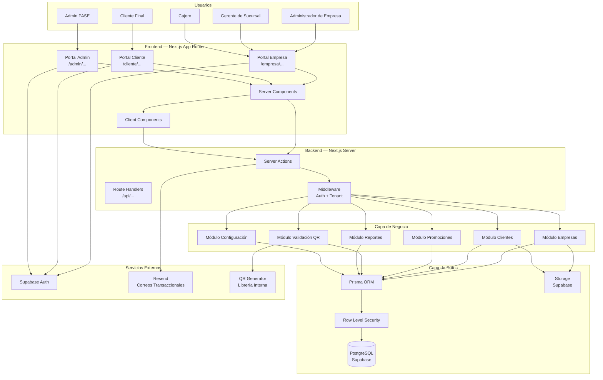
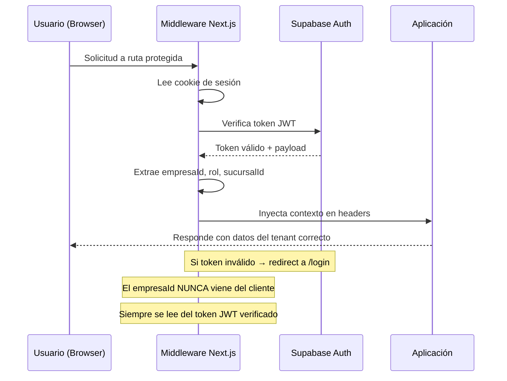
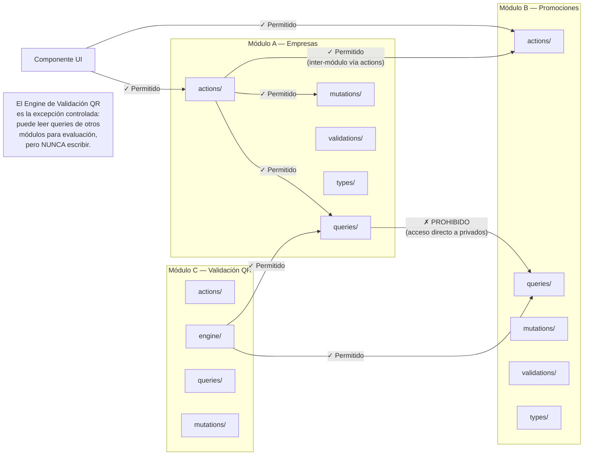
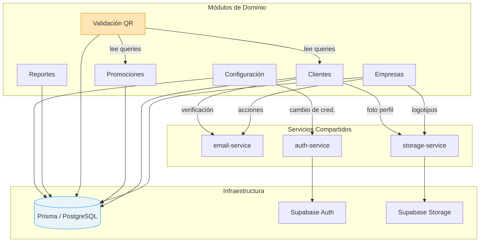
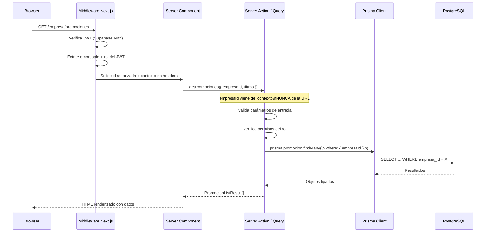
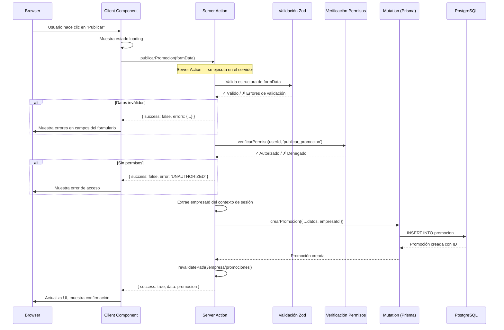
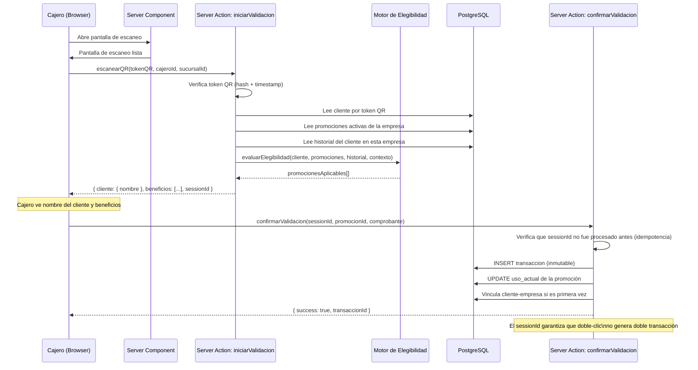
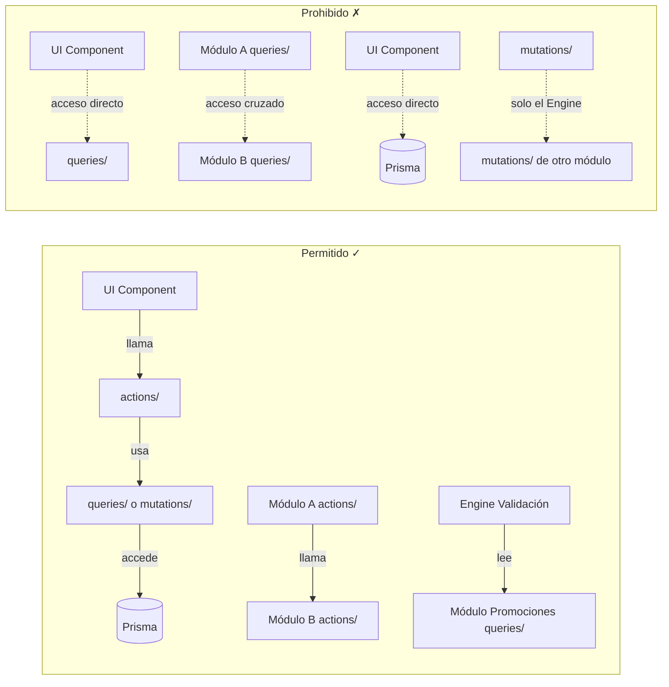
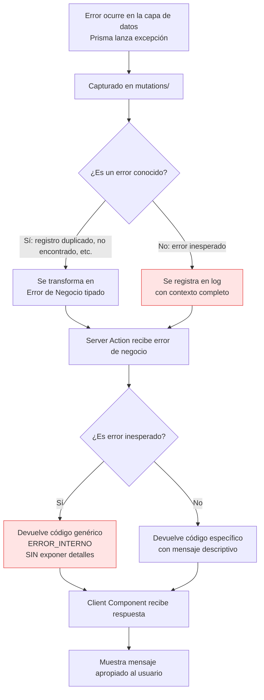

# Technical Blueprint
# Arquitectura Técnica del Sistema

**Documento:** TB-001
**Versión:** 1.0.0
**Estado:** Aprobado — Plano Oficial de Desarrollo
**Fecha:** 2026-06-27
**Fase:** B — Arquitectura Técnica
**Clasificación:** Referencia Técnica del Proyecto

---

> **ADVERTENCIA:** Este documento es el plano oficial de desarrollo. Todo el código escrito para este proyecto deberá seguir la arquitectura aquí definida. Ningún módulo, carpeta, convención de nombres o patrón de comunicación puede desviarse de este diseño sin aprobación explícita del Tech Lead documentada por escrito.

---

## Tabla de Contenidos

1. [Filosofía de la Arquitectura](#1-filosofía-de-la-arquitectura)
2. [Arquitectura General](#2-arquitectura-general)
3. [Organización del Proyecto](#3-organización-del-proyecto)
4. [Arquitectura Modular](#4-arquitectura-modular)
5. [Flujo General de una Solicitud](#5-flujo-general-de-una-solicitud)
6. [Separación de Responsabilidades](#6-separación-de-responsabilidades)
7. [Comunicación entre Módulos](#7-comunicación-entre-módulos)
8. [Gestión del Estado](#8-gestión-del-estado)
9. [Manejo de Errores](#9-manejo-de-errores)
10. [Logging](#10-logging)
11. [Escalabilidad](#11-escalabilidad)
12. [Convenciones](#12-convenciones)
13. [Checklist Técnico](#13-checklist-técnico)
14. [Autoauditoría](#14-autoauditoría)

---

## 1. Filosofía de la Arquitectura

### 1.1 Declaración de Principios

Antes de describir cualquier carpeta, módulo o patrón, es necesario establecer por qué se toman las decisiones que se toman. Una arquitectura sin principios claros se convierte en una colección de decisiones inconsistentes que se acumulan hasta hacer el sistema inmantenible.

La arquitectura de PASE Digital Platform se rige por cinco principios en orden de prioridad:

**Principio 1 — Simplicidad sobre Ingeniería Prematura**
El sistema debe ser tan simple como el problema lo permita, y no un ápice más complejo. Cada vez que existe una opción simple y una opción "más correcta en el papel", se elige la simple hasta que el problema real demuestre que la complejidad es necesaria. Un sistema que el equipo entiende completamente es infinitamente más valioso que uno que solo el arquitecto original comprende.

**Principio 2 — Convención sobre Configuración**
Las decisiones que no afectan la lógica de negocio deben estandarizarse una sola vez y seguirse automáticamente. Los nombres de archivos, la estructura de carpetas, el formato de los errores, el patrón de los hooks — todo debe tener una sola respuesta correcta para que el equipo nunca tenga que debatirlos durante el desarrollo. La creatividad se reserva para los problemas del negocio, no para la organización del código.

**Principio 3 — Separación Estricta de Responsabilidades**
Cada pieza del sistema tiene un único propósito y no puede tener otro. Un componente de interfaz no tiene lógica de negocio. Una función de negocio no tiene acceso directo a la base de datos. Un módulo no puede llamar directamente a las funciones internas de otro módulo. Esta separación no es ceremonial — es la que permite modificar una parte del sistema sin temer que otra parte se rompa.

**Principio 4 — Construido para Ser Reemplazado**
Ninguna decisión técnica debe crear una dependencia tan profunda que sea imposible cambiar. Supabase puede ser reemplazado por otro proveedor. El ORM puede cambiar. El proveedor de almacenamiento puede migrar. Si una decisión técnica crea una dependencia irreemplazable, debe ser cuestionada. La manera de lograrlo es encapsular las dependencias externas detrás de capas de abstracción propias del proyecto.

**Principio 5 — La Seguridad no es una Capa que se Agrega, es la Arquitectura**
El aislamiento multiempresa no es una feature que se agrega a la arquitectura. Es la arquitectura. Cada decisión de diseño debe hacerse considerando que existen múltiples empresas en el sistema y que ninguna puede ver los datos de otra. Esto aplica a la base de datos, a la API, a los server actions, a los reportes, y a cualquier pieza del sistema que toque datos.

---

### 1.2 Por Qué Este Stack Tecnológico

Las tecnologías definidas para el proyecto — Next.js, React, TypeScript, TailwindCSS, Supabase, Prisma, PostgreSQL, Vercel — no fueron elegidas por tendencia. Fueron elegidas porque cada una resuelve un problema específico del sistema con la menor complejidad posible.

**Next.js 14+ con App Router**

Next.js permite construir tanto el frontend como el backend en un solo proyecto, con una separación clara entre componentes del servidor y componentes del cliente. Para PASE, esto es fundamental: la lógica de validación de QR, la evaluación de promociones y el acceso a la base de datos nunca deben ejecutarse en el navegador del usuario. El App Router de Next.js hace que esta separación sea arquitecturalmente explícita: los Server Components son servidor por defecto, y los Client Components son la excepción declarada.

La capacidad de Next.js para generar rutas API, server actions y páginas estáticas en el mismo proyecto elimina la necesidad de un backend separado para el MVP, reduciendo la complejidad operacional sin sacrificar capacidad.

**React con TypeScript**

React es la capa de construcción de interfaces. TypeScript no es opcional — es el mecanismo principal de comunicación entre capas del sistema. Cuando un Server Action devuelve un resultado al cliente, TypeScript garantiza que el cliente sabe exactamente qué forma tiene ese resultado. Cuando un módulo llama a otro, TypeScript garantiza que los contratos entre módulos son verificados en tiempo de compilación, no en producción.

**TailwindCSS**

TailwindCSS elimina la capa de CSS como código separado. En un proyecto donde el diseño visual debe ser consistente a través de múltiples módulos y múltiples desarrolladores, la utilidad de clases predefinidas garantiza que las decisiones de diseño se toman a nivel de sistema (el tema de Tailwind) y no a nivel de componente individual.

**Supabase**

Supabase provee PostgreSQL administrado, autenticación integrada, almacenamiento de archivos y Row Level Security (RLS) en una sola plataforma. Para PASE, la RLS de Supabase es especialmente relevante: es una segunda capa de defensa para el aislamiento multiempresa que existe incluso si la aplicación tiene un bug. Si el código de la aplicación falla y hace una consulta sin el filtro de `empresaId`, la RLS de Supabase bloqueará esa consulta.

Supabase no reemplaza a Prisma como ORM — los dos cumplen funciones diferentes. Supabase provee la plataforma. Prisma provee la interfaz tipada para interactuar con esa plataforma desde el código.

**Prisma**

Prisma es el ORM que conecta el código TypeScript con PostgreSQL. Su función principal en esta arquitectura no es solo ejecutar consultas — es ser la fuente de verdad del esquema de datos. El schema de Prisma es el único lugar donde se define la estructura de la base de datos. No existe documentación de tablas separada, no existen scripts SQL manuales para cambios estructurales. El schema de Prisma es el contrato entre la aplicación y la base de datos.

**Vercel**

Vercel es la plataforma de despliegue natural para Next.js. Maneja el edge network, el CDN, los deploys automáticos por rama, los previews por PR, y el escalado automático sin configuración adicional. Para el MVP, esto elimina completamente la necesidad de un equipo de DevOps o de configuración de infraestructura.

---

### 1.3 Qué Esta Arquitectura No Es

Para evitar malentendidos durante el desarrollo, es importante declarar explícitamente qué patrones arquitectónicos NO se están usando y por qué.

**No es una arquitectura de microservicios.**
Cada módulo de negocio (empresas, clientes, promociones, validaciones) no es un servicio separado con su propia base de datos y su propio proceso. Son módulos dentro de una única aplicación. Esto no es una limitación — es una decisión consciente para el MVP. La complejidad operacional de los microservicios (descubrimiento de servicios, comunicación entre servicios, transacciones distribuidas, observabilidad distribuida) no está justificada para el tamaño y el estado del proyecto.

**No es una arquitectura hexagonal completa.**
Se toman conceptos de la arquitectura hexagonal (puertos, adaptadores, separación de dominio) pero no se implementa en su forma pura. Una implementación hexagonal completa tiene un overhead de abstracciones que no se justifica en el MVP.

**No es un monolito sin estructura.**
Aunque es una única aplicación, tiene módulos claramente delimitados que no pueden accederse arbitrariamente entre sí. La diferencia entre un monolito modular y un monolito sin estructura es la disciplina de los límites entre módulos. Aquí, esos límites son explícitos y se hacen cumplir por convención y revisión de código.

**No tiene una capa de GraphQL.**
Las interacciones entre el cliente y el servidor pasan por Server Actions y Route Handlers de Next.js. No se agrega GraphQL porque introduce una capa adicional de complejidad (resolvers, tipos GraphQL, cache de Apollo) que no aporta valor para el tipo de datos y operaciones de PASE.

---

## 2. Arquitectura General

### 2.1 Vista de Alto Nivel



---

### 2.2 Las Tres Capas del Sistema

La arquitectura se divide en tres capas horizontales. Cada capa tiene responsabilidades estrictamente definidas y solo puede comunicarse con la capa inmediatamente debajo de ella.

**Capa 1 — Presentación (Frontend)**
Responsable de lo que el usuario ve y con lo que interactúa. No tiene lógica de negocio. No tiene acceso directo a la base de datos. Solo sabe cómo mostrar datos y cómo disparar acciones. Se divide en Server Components (renderizan en el servidor, reciben datos directamente sin fetch del cliente) y Client Components (se hidratan en el navegador, manejan interactividad y estado local).

**Capa 2 — Aplicación (Backend/Lógica)**
Responsable de la lógica de negocio, las validaciones, las reglas, los permisos y la coordinación entre módulos. Esta capa recibe solicitudes de la capa de presentación, las valida, ejecuta la lógica correspondiente y devuelve resultados. Nunca expone la estructura de la base de datos directamente. Nunca contiene lógica de presentación.

**Capa 3 — Datos (Persistencia)**
Responsable de almacenar, recuperar y proteger los datos. Prisma es la única interfaz entre la capa de aplicación y la base de datos. PostgreSQL es el motor de persistencia. El almacenamiento de archivos (logotipos, imágenes) está en Supabase Storage. La RLS de Supabase es la segunda línea de defensa del aislamiento multiempresa.

---

### 2.3 Portales de Acceso

El sistema tiene tres portales distintos que comparten código base pero tienen rutas, layouts y contextos de autenticación separados.

**Portal de Empresa** (`/empresa`)
Utilizado por Administradores, Gerentes y Cajeros. Cada rol ve un subconjunto diferente de la interfaz pero accede al mismo portal. El contexto de empresa y sucursal está siempre presente en el estado de sesión.

**Portal de Cliente** (`/cliente`)
Utilizado por los clientes finales. Completamente separado del portal de empresa. El cliente solo ve sus propios datos: su QR, sus promociones, su historial. No tiene visibilidad de la configuración interna de ninguna empresa.

**Portal Administrativo PASE** (`/admin`)
Utilizado únicamente por el equipo interno de PASE. Tiene visibilidad cruzada de todas las empresas y clientes. Acceso estrictamente restringido por rol.

---

### 2.4 Autenticación y Sesiones



La autenticación es gestionada por Supabase Auth para ambos tipos de usuario (empresa y cliente). El token JWT de Supabase incluye claims personalizados: `empresaId`, `rol`, `sucursalId`. El middleware de Next.js verifica este token en cada solicitud y inyecta el contexto en los headers de la request antes de que llegue a cualquier Server Action o Route Handler.

**Principio crítico:** El `empresaId` que filtra los datos nunca viene de los parámetros de URL ni del cuerpo de la solicitud. Siempre se extrae del token JWT verificado. Esto garantiza que aunque un usuario malintencionado manipule la URL, solo verá los datos de su propia empresa.

---

### 2.5 Supabase y Prisma: División de Responsabilidades

Supabase y Prisma coexisten en el proyecto con roles distintos y no superpuestos.

| Responsabilidad | Supabase | Prisma |
|----------------|----------|--------|
| Gestión de usuarios y sesiones | ✓ | — |
| Tokens JWT personalizados | ✓ | — |
| Row Level Security (segunda defensa) | ✓ | — |
| Almacenamiento de archivos | ✓ | — |
| Consultas de negocio tipadas | — | ✓ |
| Migraciones de esquema | — | ✓ |
| Transacciones de negocio | — | ✓ |
| Relaciones entre entidades | — | ✓ |
| Fuente de verdad del esquema | — | ✓ |

El cliente de Supabase se usa exclusivamente en el frontend para gestión de sesiones (login, logout, recuperación de contraseña) y para subir/obtener archivos del Storage. **El cliente de Supabase nunca se usa para consultar datos de negocio desde el frontend.** Todas las consultas de datos pasan por Prisma en el servidor.

---

## 3. Organización del Proyecto

### 3.1 Estructura Completa de Carpetas

La siguiente es la estructura oficial del proyecto. Cada carpeta tiene una responsabilidad única y no puede ser usada para otro propósito.

```
pase-digital-platform/
│
├── prisma/
│   ├── schema.prisma              # Fuente de verdad del esquema de base de datos
│   ├── migrations/                # Historial de migraciones (generado por Prisma)
│   └── seed.ts                    # Datos iniciales para desarrollo
│
├── public/
│   ├── icons/                     # Íconos estáticos de la aplicación
│   └── images/                    # Imágenes estáticas del sistema
│
├── src/
│   │
│   ├── app/                       # Next.js App Router — Rutas y Layouts
│   │   ├── (auth)/                # Grupo de rutas: autenticación
│   │   │   ├── login/
│   │   │   ├── registro/
│   │   │   └── recuperar-contrasena/
│   │   │
│   │   ├── (empresa)/             # Grupo de rutas: portal de empresa
│   │   │   ├── layout.tsx         # Layout principal del portal empresa
│   │   │   ├── dashboard/
│   │   │   ├── sucursales/
│   │   │   ├── empleados/
│   │   │   ├── promociones/
│   │   │   ├── validaciones/
│   │   │   ├── reportes/
│   │   │   └── configuracion/
│   │   │
│   │   ├── (cliente)/             # Grupo de rutas: portal del cliente final
│   │   │   ├── layout.tsx         # Layout principal del portal cliente
│   │   │   ├── pase/              # Pantalla principal: QR + resumen
│   │   │   ├── promociones/
│   │   │   ├── historial/
│   │   │   └── perfil/
│   │   │
│   │   ├── (admin)/               # Grupo de rutas: panel PASE interno
│   │   │   ├── layout.tsx
│   │   │   ├── dashboard/
│   │   │   ├── empresas/
│   │   │   └── clientes/
│   │   │
│   │   ├── api/                   # Route Handlers (solo para webhooks y QR scan)
│   │   │   └── qr/
│   │   │       └── scan/
│   │   │           └── route.ts
│   │   │
│   │   ├── layout.tsx             # Root layout
│   │   ├── page.tsx               # Landing / redirect
│   │   ├── not-found.tsx
│   │   └── error.tsx
│   │
│   ├── modules/                   # Lógica de negocio por módulo
│   │   ├── empresas/
│   │   │   ├── actions/           # Server Actions del módulo
│   │   │   ├── queries/           # Consultas de lectura (Prisma)
│   │   │   ├── mutations/         # Operaciones de escritura (Prisma)
│   │   │   ├── validations/       # Esquemas Zod del módulo
│   │   │   └── types/             # Tipos TypeScript del módulo
│   │   │
│   │   ├── clientes/
│   │   │   ├── actions/
│   │   │   ├── queries/
│   │   │   ├── mutations/
│   │   │   ├── validations/
│   │   │   └── types/
│   │   │
│   │   ├── promociones/
│   │   │   ├── actions/
│   │   │   ├── queries/
│   │   │   ├── mutations/
│   │   │   ├── validations/
│   │   │   └── types/
│   │   │
│   │   ├── validacion-qr/
│   │   │   ├── actions/
│   │   │   ├── engine/            # Motor de evaluación de elegibilidad
│   │   │   ├── queries/
│   │   │   ├── mutations/
│   │   │   ├── validations/
│   │   │   └── types/
│   │   │
│   │   ├── reportes/
│   │   │   ├── actions/
│   │   │   ├── queries/
│   │   │   └── types/
│   │   │
│   │   └── configuracion/
│   │       ├── actions/
│   │       ├── queries/
│   │       ├── mutations/
│   │       ├── validations/
│   │       └── types/
│   │
│   ├── components/                # Componentes React compartidos
│   │   ├── ui/                    # Primitivos de interfaz (botones, inputs, modales)
│   │   │   ├── button/
│   │   │   ├── input/
│   │   │   ├── modal/
│   │   │   ├── card/
│   │   │   ├── badge/
│   │   │   ├── table/
│   │   │   └── ...
│   │   │
│   │   ├── forms/                 # Componentes de formulario reutilizables
│   │   │   ├── form-field/
│   │   │   ├── form-error/
│   │   │   └── submit-button/
│   │   │
│   │   ├── layout/                # Componentes de estructura visual
│   │   │   ├── sidebar/
│   │   │   ├── header/
│   │   │   ├── page-header/
│   │   │   └── empty-state/
│   │   │
│   │   └── shared/                # Componentes de dominio compartidos entre módulos
│   │       ├── qr-display/        # Renderizado del código QR del cliente
│   │       ├── promo-card/        # Tarjeta de promoción
│   │       └── status-badge/      # Badge de estados del sistema
│   │
│   ├── hooks/                     # Custom hooks de React
│   │   ├── use-current-user.ts
│   │   ├── use-empresa-context.ts
│   │   ├── use-form-action.ts
│   │   └── use-debounce.ts
│   │
│   ├── lib/                       # Inicialización de clientes y utilidades core
│   │   ├── prisma.ts              # Cliente singleton de Prisma
│   │   ├── supabase/
│   │   │   ├── client.ts          # Cliente Supabase para el browser
│   │   │   ├── server.ts          # Cliente Supabase para el servidor
│   │   │   └── middleware.ts      # Cliente Supabase para middleware
│   │   ├── qr/
│   │   │   ├── generator.ts       # Generación de códigos QR
│   │   │   └── scanner.ts         # Decodificación de QR en el servidor
│   │   ├── email/
│   │   │   ├── client.ts          # Inicialización del cliente de correo
│   │   │   └── templates/         # Plantillas de correos transaccionales
│   │   └── storage/
│   │       └── client.ts          # Abstracción sobre Supabase Storage
│   │
│   ├── services/                  # Servicios que orquestan múltiples módulos
│   │   ├── auth-service.ts        # Lógica de autenticación y sesiones
│   │   ├── email-service.ts       # Envío de correos transaccionales
│   │   └── storage-service.ts     # Gestión de archivos
│   │
│   ├── middleware.ts              # Middleware global de Next.js
│   │
│   ├── config/                    # Configuración del sistema
│   │   ├── app.config.ts          # Variables de entorno y constantes
│   │   ├── routes.config.ts       # Definición centralizada de rutas
│   │   └── permissions.config.ts  # Matriz de permisos por rol
│   │
│   ├── types/                     # Tipos TypeScript globales
│   │   ├── globals.d.ts           # Tipos globales de la aplicación
│   │   ├── auth.types.ts          # Tipos de autenticación y sesión
│   │   ├── api.types.ts           # Tipos de respuestas de acciones
│   │   └── enums.ts               # Enumeraciones del dominio
│   │
│   └── utils/                     # Funciones utilitarias puras
│       ├── date.utils.ts          # Formateo y cálculo de fechas
│       ├── format.utils.ts        # Formateo de texto, moneda, etc.
│       ├── validation.utils.ts    # Helpers de validación comunes
│       └── tenant.utils.ts        # Helpers de contexto multiempresa
│
├── docs/                          # Documentación del proyecto
│   └── ...                        # (ya existe)
│
├── .env.local                     # Variables de entorno de desarrollo (gitignored)
├── .env.example                   # Plantilla de variables de entorno
├── next.config.ts
├── tailwind.config.ts
├── tsconfig.json
└── package.json
```

---

### 3.2 Responsabilidad Detallada de Cada Carpeta

**`prisma/`**
Es la única fuente de verdad del esquema de base de datos. Nadie escribe SQL directamente. Los cambios estructurales a la base de datos solo ocurren a través de migraciones de Prisma. Esta carpeta no contiene lógica de negocio.

**`src/app/`**
Contiene exclusivamente lo que Next.js necesita para construir las rutas: layouts, páginas y error boundaries. Las páginas no contienen lógica de negocio — solo composición de componentes y llamadas a Server Actions. Un archivo de página en el App Router debería tener entre 10 y 50 líneas máximo.

**`src/modules/`**
Es el corazón de la aplicación. Aquí vive toda la lógica de negocio, separada por dominio. Cada módulo es autónomo: tiene sus propias acciones (punto de entrada desde el cliente), sus propias consultas de lectura, sus propias mutaciones de escritura, sus propios esquemas de validación y sus propios tipos.

La estructura interna de cada módulo es idéntica:

```
modules/[nombre-modulo]/
├── actions/        → Server Actions que el cliente puede invocar
├── queries/        → Funciones que leen datos de la BD (solo lectura)
├── mutations/      → Funciones que escriben datos en la BD
├── validations/    → Esquemas Zod para validar entradas
└── types/          → Tipos TypeScript específicos del módulo
```

**`src/components/`**
Componentes React reutilizables. No contienen lógica de negocio. No llaman directamente a la base de datos. Reciben datos por props y emiten eventos por callbacks. Se dividen en tres niveles:
- `ui/` — Los más primitivos (botón, input, modal). Sin contexto de dominio.
- `forms/` — Componentes de formulario que saben cómo mostrar errores de validación.
- `layout/` — Componentes de estructura visual (sidebar, header).
- `shared/` — Componentes que sí conocen el dominio pero son usados por múltiples módulos.

**`src/hooks/`**
Custom hooks de React para encapsular lógica de estado y efectos reutilizables. Un hook siempre empieza con `use`. No contiene lógica de negocio directa — llama a las acciones del módulo correspondiente.

**`src/lib/`**
Inicialización de clientes externos y utilidades de bajo nivel. El cliente de Prisma (`lib/prisma.ts`) es un singleton para evitar múltiples conexiones. El cliente de Supabase tiene tres versiones según el contexto de ejecución (browser, servidor, middleware). La librería de QR (`lib/qr/`) encapsula la dependencia externa de generación y lectura de códigos QR.

**`src/services/`**
Servicios que orquestan operaciones que no pertenecen a un solo módulo o que interactúan con sistemas externos (correo, almacenamiento). Los servicios son llamados desde las acciones de los módulos, no directamente desde los componentes.

**`src/config/`**
Configuración centralizada. `app.config.ts` es el único lugar donde se leen las variables de entorno — ningún módulo lee `process.env` directamente. `permissions.config.ts` contiene la matriz de qué rol puede hacer qué, consultada por el middleware y por las acciones.

**`src/types/`**
Tipos TypeScript que son compartidos por múltiples módulos. Si un tipo solo es usado por un módulo, vive en `modules/[modulo]/types/`. Si cruza fronteras de módulos, vive aquí.

**`src/utils/`**
Funciones puras sin efectos secundarios. No llaman a la base de datos. No dependen del contexto de la aplicación. Toman un input y devuelven un output. Son fácilmente testables sin setup.

**`src/middleware.ts`**
El único archivo de middleware de Next.js. Se ejecuta en el edge antes de cada solicitud. Verifica la sesión, extrae el contexto del tenant y redirige si no hay autenticación. Es la primera línea de defensa de seguridad.

---

## 4. Arquitectura Modular

### 4.1 Principio de Módulos Cerrados

Cada módulo en `src/modules/` es una unidad cerrada. Tiene una interfaz pública definida (sus `actions/`) y una implementación privada (sus `queries/`, `mutations/`, `engine/`). Un módulo externo solo puede invocar las acciones públicas de otro módulo. No puede importar directamente funciones de `queries/` o `mutations/` de otro módulo.



---

### 4.2 Módulo 1 — Empresas

**Propósito:** Gestionar el ciclo de vida de las empresas, sus sucursales, sus empleados y la configuración de la cuenta empresarial.

**Puede hacer:**
- Crear, activar, desactivar y archivar empresas
- Crear, activar y desactivar sucursales dentro de una empresa
- Invitar, activar y desactivar empleados
- Asignar roles y sucursales a empleados
- Leer y actualizar la configuración del perfil de empresa
- Consultar la lista de empresas para el panel de PASE

**No puede hacer:**
- Crear ni modificar promociones (eso es responsabilidad del módulo de Promociones)
- Registrar ni modificar clientes (eso es responsabilidad del módulo de Clientes)
- Ejecutar validaciones de QR (eso es responsabilidad del módulo de Validación QR)
- Acceder directamente a las tablas de otros módulos

**Dependencias permitidas:**
- `services/storage-service` — Para subir logotipos
- `services/email-service` — Para enviar invitaciones a empleados
- `config/permissions.config` — Para validar permisos de rol

**Punto de entrada externo:** `modules/empresas/actions/` — Cualquier operación del módulo de empresas que necesite ser invocada desde fuera del módulo se expone aquí.

---

### 4.3 Módulo 2 — Clientes

**Propósito:** Gestionar el ciclo de vida de los clientes finales, su Pase Digital y su vinculación con empresas.

**Puede hacer:**
- Registrar clientes y gestionar su estado
- Generar y regenerar el Pase Digital QR
- Leer el perfil del cliente
- Actualizar datos del perfil del cliente
- Gestionar el proceso de eliminación de cuenta
- Vincular un cliente a una empresa (ocurre automáticamente en la primera validación)

**No puede hacer:**
- Evaluar si un cliente es elegible para una promoción (eso es del módulo de Validación QR)
- Crear ni gestionar promociones
- Acceder al historial de validaciones directamente (lee del módulo de Validación QR vía acciones)

**Dependencias permitidas:**
- `lib/qr/generator` — Para generar el QR del Pase Digital
- `services/email-service` — Para correos de verificación
- `services/storage-service` — Para foto de perfil

**Nota arquitectónica sobre el QR:**
El QR es generado por `lib/qr/generator` y almacenado como un token opaco en la tabla de clientes. El módulo de Clientes no sabe qué significa ese token — solo lo genera y lo entrega para visualización. La interpretación del token ocurre en el módulo de Validación QR.

---

### 4.4 Módulo 3 — Promociones

**Propósito:** Gestionar el ciclo de vida completo de las promociones: creación, configuración, publicación, pausa, y terminación.

**Puede hacer:**
- Crear, editar y eliminar (archivar) promociones
- Validar la estructura de una promoción según su tipo
- Publicar, pausar y terminar promociones
- Leer la lista de promociones de una empresa
- Leer el estado actual de una promoción (usos restantes, vigencia)
- Leer las promociones disponibles para mostrar a un cliente (sin evaluación de elegibilidad)

**No puede hacer:**
- Evaluar si un cliente específico es elegible para una promoción (eso es del Motor de Validación)
- Ejecutar la aplicación de un beneficio (eso es del módulo de Validación QR)
- Decrementar contadores de uso directamente (eso lo hace el módulo de Validación QR al confirmar)

**Dependencias permitidas:**
- Ninguna dependencia inter-módulo. Es un módulo completamente autónomo.

**Nota arquitectónica sobre los tipos de promoción:**
Cada tipo de promoción (descuento porcentual, acumulación por visitas, cupón, membresía, etc.) tiene su propia lógica de validación en `modules/promociones/validations/`. El módulo sabe si una promoción está bien formada. No sabe si un cliente puede usarla.

---

### 4.5 Módulo 4 — Validación QR

**Propósito:** Ejecutar el flujo completo de validación de extremo a extremo: desde la recepción del token QR hasta el registro inmutable de la transacción.

Este es el módulo más complejo del sistema y contiene un subdirectorio especial: `engine/`.

**Puede hacer:**
- Recibir un token QR y verificar su validez
- Resolver el contexto de la validación (empresa, sucursal, cajero)
- Leer las promociones activas de la empresa (consultando `modules/promociones/queries/`)
- Leer el perfil y el historial de validaciones del cliente para evaluar elegibilidad
- Ejecutar el Motor de Elegibilidad (en `engine/`)
- Presentar los resultados al cajero
- Registrar la confirmación del cajero
- Escribir la transacción de validación de forma inmutable
- Actualizar el contador de usos de la promoción
- Registrar la vinculación cliente-empresa si es la primera visita
- Registrar anulaciones con referencia a la transacción original

**No puede hacer:**
- Crear ni modificar promociones
- Modificar el perfil del cliente
- Acceder a datos de otra empresa (el contexto de empresa viene del token JWT, no de parámetros)

**Dependencias permitidas (lectura únicamente):**
- `modules/promociones/queries/` — Para leer promociones activas durante la evaluación
- `modules/clientes/queries/` — Para leer el perfil del cliente durante la evaluación

**El subdirectorio `engine/`:**
Contiene la implementación del Motor de Evaluación de Elegibilidad. Este motor recibe el contexto completo (cliente, empresa, sucursal, promociones activas, historial del cliente en esa empresa) y devuelve la lista de promociones para las que el cliente es elegible. Es una función pura de negocio: recibe datos, devuelve resultados, no escribe nada. La escritura ocurre en `mutations/` después de que el cajero confirma.

---

### 4.6 Módulo 5 — Reportes

**Propósito:** Proporcionar vistas agregadas de los datos de validaciones y promociones para la toma de decisiones.

**Puede hacer:**
- Leer datos de validaciones para construir reportes agregados
- Filtrar por empresa, sucursal, rango de fechas, tipo de promoción
- Calcular métricas derivadas (total de validaciones, clientes únicos, usos por promoción)

**No puede hacer:**
- Escribir ningún dato (es un módulo de solo lectura en su totalidad)
- Acceder a datos de otra empresa
- Modificar el estado de ninguna entidad

**Dependencias permitidas (lectura únicamente):**
- Lee directamente de la base de datos a través de sus propias `queries/`
- No depende de otros módulos

**Nota arquitectónica:** Los reportes no usan los queries de otros módulos — tienen sus propias consultas optimizadas para agregación, que pueden incluir JOINs y GROUP BYs que los módulos operacionales no necesitan.

---

### 4.7 Módulo 6 — Configuración

**Propósito:** Gestionar la configuración del sistema a nivel de empresa, de cliente, y de la plataforma PASE.

**Puede hacer:**
- Leer y actualizar la configuración de empresa (nombre, industria, teléfono, logotipo, color)
- Leer y actualizar el perfil del cliente autenticado
- Gestionar el cambio de correo y contraseña
- Leer la configuración del sistema (para el panel de PASE)

**No puede hacer:**
- Modificar promociones ni validaciones
- Acceder a configuración de otra empresa

**Dependencias permitidas:**
- `services/storage-service` — Para logotipos y fotos de perfil
- `services/auth-service` — Para cambio de correo y contraseña (pasa por Supabase Auth)

---

### 4.8 Mapa de Dependencias entre Módulos



---

## 5. Flujo General de una Solicitud

### 5.1 Recorrido de una Solicitud Típica (Lectura)

El siguiente es el recorrido de una solicitud de lectura: el Administrador abre la lista de promociones de su empresa.



**Puntos clave del recorrido:**
1. El middleware actúa antes de que la solicitud llegue a cualquier código de la aplicación
2. El `empresaId` es extraído del token JWT, no de los parámetros de la URL
3. El Server Component obtiene los datos directamente sin pasar por el cliente
4. El cliente nunca hace fetch de datos a una API — el HTML ya llega renderizado con los datos

---

### 5.2 Recorrido de una Mutación (Server Action)

El siguiente es el recorrido de una escritura: el Administrador publica una nueva promoción.



---

### 5.3 Recorrido del Flujo de Validación QR (Caso Especial)

La validación de QR es el flujo más crítico del sistema y tiene algunas diferencias arquitectónicas respecto al flujo típico.



**Por qué la validación usa un Route Handler en `/api/qr/scan/` en lugar de un Server Action:**

Los Server Actions están diseñados para formularios web y son invocados desde componentes React. Para el escaneo de QR, la cámara del dispositivo puede estar procesando el código antes de que el componente esté completamente listo para una Server Action. El Route Handler de `/api/qr/scan/` acepta la solicitud inmediatamente y la procesa de forma síncrona, lo que garantiza el tiempo de respuesta más bajo posible para esta operación crítica.

---

## 6. Separación de Responsabilidades

### 6.1 Qué Pertenece al Frontend

El frontend es responsable únicamente de:

- **Renderizar datos:** Mostrar la información que llegó del servidor en el formato visual apropiado
- **Capturar input del usuario:** Formularios, clics, gestos, escaneo de cámara
- **Gestionar estado de UI:** Loading states, estados de formularios, visibilidad de modales
- **Invocar Server Actions:** Pasar los inputs del usuario al servidor para procesamiento
- **Manejar errores de UI:** Mostrar mensajes de error al usuario de forma amigable
- **Navegación:** Cambiar entre rutas

El frontend **nunca** debe:
- Calcular si un cliente es elegible para una promoción
- Filtrar datos por empresa (aunque tenga el `empresaId` en el contexto de sesión)
- Tomar decisiones de negocio
- Acceder directamente a la base de datos
- Contener reglas del Motor de Elegibilidad

---

### 6.2 Qué Pertenece al Backend (Server Actions y Route Handlers)

El backend es responsable de:

- **Validar entradas:** Todo input que llegue del cliente es potencialmente malicioso hasta que se valide
- **Verificar autenticación y autorización:** Cada acción verifica que el usuario está autenticado y tiene el rol correcto
- **Ejecutar lógica de negocio:** Las reglas del negocio viven aquí, no en el cliente
- **Orquestar módulos:** Cuando una operación requiere coordinar múltiples módulos (ej: la validación QR)
- **Interactuar con servicios externos:** Envío de correos, generación de QR, almacenamiento
- **Devolver resultados tipados:** Siempre devuelve un tipo definido, nunca un objeto arbitrario

El backend **nunca** debe:
- Confiar en datos que vienen del cliente sin validar
- Leer el `empresaId` de la URL o del cuerpo de la solicitud para decisiones de seguridad
- Exponer IDs internos de la base de datos en respuestas públicas
- Devolver errores que expongan la estructura interna del sistema

---

### 6.3 Qué Pertenece a Supabase

Supabase gestiona exclusivamente:

- **Identidades de usuario:** El registro, el inicio de sesión, la verificación de correo y la recuperación de contraseña pasan por Supabase Auth
- **Tokens JWT:** Supabase genera y firma los tokens de sesión que el middleware verifica
- **Claims personalizados:** `empresaId`, `rol`, `sucursalId` son claims inyectados en el JWT mediante database webhooks o funciones de Supabase
- **Almacenamiento de archivos:** Logotipos de empresas y fotos de perfil de clientes
- **Row Level Security:** Segunda línea de defensa del aislamiento multiempresa

Supabase **no gestiona**:
- La lógica de negocio de ningún módulo
- Las consultas de datos de la aplicación (eso es Prisma)
- La evaluación de elegibilidad de promociones

---

### 6.4 Qué Pertenece a Prisma

Prisma es responsable de:

- **Definir el esquema de datos:** El archivo `prisma/schema.prisma` es la única fuente de verdad
- **Gestionar migraciones:** Los cambios estructurales a la base de datos se hacen a través de migraciones de Prisma
- **Proveer la interfaz tipada de consultas:** Todos los accesos a datos desde la lógica de negocio pasan por el cliente de Prisma
- **Garantizar tipos en tiempo de compilación:** Si el esquema cambia, TypeScript señala todos los lugares del código que necesitan actualizarse

Prisma **no gestiona**:
- La autenticación de usuarios
- El almacenamiento de archivos
- La lógica de negocio (Prisma ejecuta consultas, no toma decisiones)

---

### 6.5 Qué Pertenece a los Módulos

Los módulos son los contenedores de la lógica de negocio. Cada módulo sabe:

- Las reglas de validación de sus entidades (`validations/`)
- Las consultas necesarias para sus operaciones (`queries/`)
- Las operaciones de escritura con sus invariantes de negocio (`mutations/`)
- Los tipos que definen sus datos (`types/`)
- Las acciones que expone al mundo exterior (`actions/`)

Los módulos **no saben**:
- Cómo renderizar sus datos (eso es del frontend)
- Cómo se guardan físicamente sus datos (eso es Prisma/PostgreSQL)
- Cómo se autentican los usuarios (eso es Supabase Auth)

---

## 7. Comunicación entre Módulos

### 7.1 La Regla de las Interfaces Públicas

Un módulo solo puede ser llamado a través de sus `actions/`. Las `queries/` y `mutations/` son privadas al módulo. Esta regla tiene una única excepción documentada: el Motor de Elegibilidad en `modules/validacion-qr/engine/` puede llamar directamente a `queries/` de los módulos de Promociones y Clientes, porque necesita leer datos de múltiples módulos para hacer su evaluación y el overhead de pasar por `actions/` intermedios añadiría latencia inaceptable en el flujo de validación.

Esta excepción está documentada explícitamente en el código con un comentario que explica la razón. No es un patrón, es una excepción controlada.

---

### 7.2 Dependencias Permitidas



---

### 7.3 Comunicación Asíncrona (Casos Especiales)

En el MVP, toda la comunicación entre módulos es síncrona. No existe un sistema de mensajería, colas de trabajo ni eventos de dominio. Si en el futuro un módulo necesita disparar una operación en otro módulo de forma asíncrona (ej: enviar un correo después de una validación), se usará el patrón de cola de tareas de Supabase o una herramienta como Inngest, pero eso está fuera del alcance del MVP.

En el MVP, el flujo de validación es completamente síncrono: el cajero espera la respuesta del servidor antes de confirmar. Los correos de confirmación al cliente se encolan en segundo plano pero no bloquean la respuesta al cajero.

---

### 7.4 Evitar el Acoplamiento

El acoplamiento entre módulos se evita a través de tres mecanismos:

**Tipos en `src/types/`:** Los tipos compartidos entre módulos no viven en ninguno de los dos módulos que los usan. Viven en `src/types/`. Así, ningún módulo importa tipos del otro.

**Interfaces de actions bien definidas:** Cada acción recibe parámetros primitivos o tipos de `src/types/`, no objetos internos de otro módulo. Un módulo no puede pasar un "objeto Prisma" a otro módulo.

**Servicios para lógica transversal:** Si una operación necesita dos módulos (ej: invitar a un empleado requiere crear el usuario en Supabase Auth Y crear el registro en la tabla de empleados), esa orquestación vive en `services/`, no en ninguno de los dos módulos.

---

## 8. Gestión del Estado

### 8.1 Estrategia General

La gestión del estado en PASE sigue un principio fundamental: **el servidor es la fuente de verdad, no el cliente**. En lugar de gestionar un estado global complejo en el frontend que replica datos del servidor, los Server Components de Next.js obtienen los datos directamente del servidor en cada renderizado. El estado del cliente se usa únicamente para lo que el servidor no puede gestionar: interactividad inmediata, formularios y UI transient states.

---

### 8.2 Estado del Servidor (Server State)

**Patrón utilizado:** Server Components + `revalidatePath` / `revalidateTag`

Los datos de la base de datos (lista de promociones, historial de validaciones, dashboard metrics) se obtienen en Server Components directamente llamando a los `queries/` del módulo correspondiente. No existe una capa de fetch de API en el cliente para datos de negocio.

Cuando una mutación ocurre (se publica una promoción, se confirma una validación), el Server Action llama a `revalidatePath()` o `revalidateTag()` para invalidar el cache de Next.js, lo que hace que la próxima solicitud a esa ruta obtenga datos frescos.

**Por qué este patrón:**
- Los datos nunca quedan desincronizados entre lo que el usuario ve y lo que está en la base de datos
- No existe la complejidad de gestionar el cache del cliente manualmente
- La UI siempre refleja el estado real del servidor

---

### 8.3 Estado de Autenticación

**Patrón utilizado:** Supabase Auth SSR + Context de React para acceso en Client Components

El estado de autenticación es gestionado por Supabase Auth con soporte SSR. El servidor siempre tiene acceso a la sesión a través de las cookies. Los Client Components que necesitan saber si el usuario está autenticado usan un hook `useCurrentUser()` que lee del contexto provisto por el proveedor de Supabase en el layout raíz.

**Lo que el estado de autenticación incluye:** ID del usuario, correo, rol, `empresaId`, `sucursalId`.

**Lo que el estado de autenticación no incluye:** Datos de negocio (nombre de la empresa, lista de sucursales). Esos datos se obtienen de los Server Components cuando se necesitan.

---

### 8.4 Estado de Formularios

**Patrón utilizado:** React state local + `useFormState` / `useActionState` de React

Los formularios de la aplicación gestionan su propio estado local: el valor de cada campo, el estado de loading, los errores de validación. No existe un gestor de formularios global.

Para el manejo de errores de Server Actions, se usa el hook `useActionState` de React (introducido en React 19), que mantiene el estado de la última respuesta del servidor y lo hace disponible para el formulario sin necesidad de una librería adicional.

**Cuando se usa una librería de formularios:** Si un formulario tiene más de 8 campos o tiene lógica de validación condicional compleja, se puede usar React Hook Form + Zod para el manejo de estado y validación del lado del cliente. La validación del servidor con Zod siempre existe independientemente de si hay validación del cliente.

---

### 8.5 Estado Global (UI State)

**Patrón utilizado:** React Context para estado verdaderamente global, Zustand para estado de UI complejo si se necesita

En el MVP, el estado verdaderamente global es mínimo:
- El contexto de la empresa actual (nombre, logotipo, color) — usado por el layout del portal de empresa
- El tema de la aplicación (si en el futuro se agrega modo oscuro)

No se usa Redux ni un gestor de estado global pesado. El estado que parece necesitar ser global generalmente puede resolverse con Server Components que proveen los datos directamente.

**Regla:** Antes de agregar estado global, preguntarse si el problema se puede resolver con un Server Component. Si la respuesta es sí, se usa el Server Component.

---

### 8.6 Estado Local de Componentes

Para estados de UI puramente locales (visibilidad de un dropdown, estado de un accordion, valor temporal de un input de búsqueda), se usa `useState` y `useReducer` de React directamente. No existe ningún mecanismo global para estos estados.

---

## 9. Manejo de Errores

### 9.1 Tipos de Error y su Origen

El sistema puede producir cuatro categorías de error, cada una con su propio manejo:

| Categoría | Origen | Ejemplo | Manejo |
|-----------|--------|---------|--------|
| Error de validación | Input del usuario | "El nombre es obligatorio" | Se devuelve en la respuesta de la acción, se muestra en el campo correspondiente |
| Error de autorización | Permisos del rol | "No tienes permiso para publicar" | Se devuelve como error tipado, se muestra un mensaje al usuario |
| Error de negocio | Regla del dominio | "La promoción ya está agotada" | Se devuelve como error tipado con código, se muestra mensaje descriptivo |
| Error del sistema | Base de datos, red, servicio externo | "Error al conectar con la base de datos" | Se registra en el log, se muestra mensaje genérico al usuario |

---

### 9.2 Contrato de Respuesta de Server Actions

Todos los Server Actions devuelven un tipo unificado. Nunca lanzan excepciones al cliente sin capturar.

```
tipo de retorno de toda Server Action:
{
  success: boolean
  data?: T              (presente cuando success = true)
  error?: {
    code: string        (ej: "UNAUTHORIZED", "VALIDATION_ERROR", "NOT_FOUND")
    message: string     (mensaje para mostrar al usuario)
    fields?: Record<string, string>  (errores por campo, para formularios)
  }
}
```

Este contrato garantiza que el componente cliente siempre sabe qué forma tiene la respuesta y nunca recibe una excepción no manejada.

---

### 9.3 Propagación de Errores



**Principio de seguridad en errores:** Ningún error del sistema (stack trace, query SQL, mensajes internos de Prisma) debe llegar al cliente. Los errores inesperados se registran completos en el log del servidor y se devuelven al cliente con un mensaje genérico.

---

### 9.4 Error Boundaries en el Frontend

Next.js provee `error.tsx` para capturar errores de renderizado en Server Components. Cada grupo de rutas (`(empresa)`, `(cliente)`, `(admin)`) tiene su propio `error.tsx` que muestra una página de error apropiada al contexto sin exponer información técnica.

Para errores de carga de datos en componentes específicos, se usa el componente `<Suspense>` de React con `<ErrorBoundary>` para que un componente fallido no bloquee el renderizado del resto de la página.

---

### 9.5 Errores Críticos del Flujo de Validación

El flujo de validación de QR tiene manejo de errores especial porque ocurre en tiempo real en el punto de venta. Los errores se clasifican y se muestran al cajero con acciones de recuperación claras:

| Código de Error | Mensaje al Cajero | Acción Sugerida |
|----------------|-------------------|-----------------|
| QR_INVALID | "El código QR no es reconocido por el sistema" | "Pida al cliente que regenere su QR" |
| CLIENT_INACTIVE | "La cuenta del cliente está inactiva" | "El cliente debe contactar soporte" |
| NO_PROMOTIONS | "No hay promociones activas para este cliente en este momento" | "Complete la venta normalmente" |
| PROMO_EXHAUSTED | "La promoción ha llegado a su límite de usos" | "La promoción se ha agotado" |
| DUPLICATE_SESSION | "Esta validación ya fue procesada" | "No realice ninguna acción adicional" |
| TIMEOUT | "El tiempo de respuesta excedió el límite" | "Reintente el escaneo" |

---

## 10. Logging

### 10.1 Estrategia General

El sistema tiene tres niveles de logging con propósitos distintos:

**Nivel 1 — Logs de Aplicación (para desarrollo y debugging)**
Registran el flujo normal de la aplicación: qué acciones se invocaron, qué módulos se llamaron, cuánto tiempo tomaron las consultas. Solo están activos en desarrollo. En producción, solo se registran los errores.

**Nivel 2 — Logs de Error (para monitoring en producción)**
Registran todos los errores del sistema con su contexto completo: stack trace, parámetros de la solicitud (sin datos sensibles), timestamp, request ID, user ID. Se envían a un sistema de monitoring externo (Sentry o similar).

**Nivel 3 — Logs de Auditoría (permanentes e inmutables)**
Registran todas las operaciones de negocio críticas en la base de datos: validaciones de QR, anulaciones de transacciones, cambios de estado de empresas, cambios de rol de empleados. Estos logs no son de infraestructura — son registros de negocio que viven en la base de datos y son visibles en el panel de auditoría.

---

### 10.2 Qué se Registra en Cada Nivel

**Logs de Aplicación (solo desarrollo):**
- Inicio y fin de Server Actions con duración
- Consultas de Prisma con tiempo de ejecución
- Llamadas a servicios externos

**Logs de Error (producción):**
- Toda excepción no manejada con stack trace
- Errores de validación con el input que los causó (sin datos personales)
- Errores de autenticación (intentos fallidos, tokens inválidos)
- Errores de base de datos con código de error

**Lo que nunca se registra:**
- Contraseñas ni tokens de sesión
- Números de tarjeta u otros datos de pago
- Contenido de mensajes privados
- Datos personales completos de clientes (se puede registrar el ID, no el nombre ni el correo)

**Logs de Auditoría (base de datos):**
- Toda validación de QR (exitosa o fallida)
- Toda anulación de transacción
- Creación y publicación de promociones
- Cambios de estado de empresas (activar, suspender)
- Cambios de roles de empleados
- Eliminaciones de cuenta

---

### 10.3 Estructura de un Log de Auditoría

Cada entrada del log de auditoría en la base de datos tiene la siguiente información:

```
{
  id:            identificador único del log
  timestamp:     fecha y hora exacta (con zona horaria UTC)
  requestId:     ID único de la solicitud HTTP
  actorId:       ID del usuario que realizó la acción
  actorRole:     rol del usuario (para contexto)
  empresaId:     tenant al que pertenece la acción
  evento:        código del evento (ej: "VALIDACION_CONFIRMADA")
  entidadTipo:   tipo de entidad afectada (ej: "TRANSACCION")
  entidadId:     ID de la entidad afectada
  metadatos:     datos adicionales específicos del evento
  resultado:     EXITO | FALLO
  codigoError:   (presente si resultado = FALLO)
}
```

---

### 10.4 Contexto del Request ID

Cada solicitud HTTP recibe un ID único (`requestId`) en el middleware. Este ID se propaga a través de toda la cadena de llamadas: middleware → server action → módulo → base de datos. Cuando ocurre un error en producción, el `requestId` permite rastrear todos los pasos de esa solicitud específica a través de los logs.

---

## 11. Escalabilidad

### 11.1 Escalabilidad Horizontal en Vercel

Vercel escala automáticamente las instancias de la aplicación Next.js según la demanda. Cada request se maneja de forma stateless (el estado vive en la base de datos, no en memoria del servidor), lo que permite escalar horizontalmente sin coordinación entre instancias.

Para el MVP, esto no requiere ninguna configuración adicional — Vercel lo maneja automáticamente.

---

### 11.2 Escalabilidad de la Base de Datos

PostgreSQL en Supabase escala de dos formas:

**Vertical:** Supabase permite aumentar el plan de la base de datos para obtener más CPU, RAM y almacenamiento sin cambios de código.

**Connection pooling:** Prisma está configurado para usar connection pooling a través de PgBouncer (disponible en Supabase). Esto permite que múltiples instancias de la aplicación compartan un pool de conexiones sin sobrecargar la base de datos.

**Índices estratégicos:** El esquema de Prisma define índices en los campos más consultados: `empresaId` en todas las tablas (para el aislamiento multiempresa), `tokenQR` en la tabla de clientes (para el escaneo), `estado` en la tabla de promociones (para filtrar activas). Estos índices son suficientes para el volumen del MVP.

---

### 11.3 Agregar un Nuevo Módulo en el Futuro

La arquitectura modular permite agregar nuevos módulos sin modificar los existentes. El proceso es:

1. Crear la carpeta `src/modules/nuevo-modulo/` con la estructura estándar
2. Agregar las entidades al `prisma/schema.prisma` y generar la migración
3. Crear las rutas correspondientes en `src/app/`
4. Actualizar `src/config/permissions.config.ts` con los permisos del nuevo módulo
5. Actualizar el middleware si el nuevo módulo requiere manejo especial

Los módulos existentes no necesitan cambios. Esta es la prueba de que la separación de responsabilidades está funcionando.

---

### 11.4 Agregar un Nuevo Tipo de Promoción

El Motor de Elegibilidad en `modules/validacion-qr/engine/` está diseñado para recibir el tipo de promoción como un discriminador y aplicar la lógica correspondiente. Agregar un nuevo tipo de promoción requiere:

1. Agregar el tipo al enum en `prisma/schema.prisma`
2. Agregar el esquema de validación en `modules/promociones/validations/`
3. Agregar el caso en el formulario de creación de promoción
4. Agregar el caso en el motor de evaluación en `modules/validacion-qr/engine/`

El resto del sistema no cambia. Esto valida el principio del documento PE-001 (Motor de Promociones): un nuevo tipo de promoción no debe modificar la arquitectura principal.

---

### 11.5 Escalabilidad del Código (Mantenibilidad)

La arquitectura escala no solo en términos de carga, sino en términos de equipo. Cada módulo es independiente: un desarrollador puede trabajar en el módulo de Reportes sin conocer los detalles internos del módulo de Validación QR. Los tipos de TypeScript garantizan que los contratos entre módulos se respetan.

La regla de que el `empresaId` siempre viene del JWT, nunca del cliente, puede verificarse automáticamente en la revisión de código: cualquier Server Action que lea `empresaId` de `formData` o de la URL es un bug de seguridad visible.

---

## 12. Convenciones

### 12.1 Convenciones de Nombres

**Archivos:**
- Componentes React: `kebab-case.tsx` (ej: `promo-card.tsx`, `submit-button.tsx`)
- Server Actions: `kebab-case.actions.ts` (ej: `crear-promocion.actions.ts`)
- Queries: `kebab-case.queries.ts` (ej: `get-promociones.queries.ts`)
- Mutations: `kebab-case.mutations.ts` (ej: `crear-empresa.mutations.ts`)
- Hooks: `use-kebab-case.ts` (ej: `use-empresa-context.ts`)
- Tipos: `kebab-case.types.ts` (ej: `empresa.types.ts`)
- Validaciones: `kebab-case.validations.ts` (ej: `crear-promocion.validations.ts`)
- Utilidades: `kebab-case.utils.ts` (ej: `date.utils.ts`)
- Configuración: `kebab-case.config.ts` (ej: `permissions.config.ts`)
- Páginas de Next.js: siempre `page.tsx`, `layout.tsx`, `error.tsx`, `loading.tsx`

---

**Componentes React:**
- PascalCase siempre: `PromoCard`, `SubmitButton`, `DashboardHeader`
- Nombre descriptivo del dominio, no del tipo: `PromoCard` no `Card`, `CreatePromoForm` no `Form`
- Los componentes de `ui/` son genéricos: `Button`, `Input`, `Modal`
- Los componentes de `shared/` son de dominio: `PromoCard`, `QrDisplay`, `StatusBadge`

---

**Funciones:**
- camelCase siempre
- Las Server Actions usan verbos de acción: `crearEmpresa`, `publicarPromocion`, `confirmarValidacion`
- Las queries usan prefijo `get`: `getPromocionesActivas`, `getClientePorToken`
- Las mutations usan verbos de escritura: `insertarTransaccion`, `actualizarEstadoPromocion`
- Los hooks usan prefijo `use`: `useEmpresaContext`, `useFormAction`
- Las funciones de utilidad son descriptivas: `formatearFecha`, `calcularDiasRestantes`

---

**Variables y Constantes:**
- Variables: camelCase (`empresaId`, `promocionActiva`, `totalValidaciones`)
- Constantes de configuración: SCREAMING_SNAKE_CASE (`MAX_SUCURSALES_STARTER`, `QR_TOKEN_LENGTH`)
- Enumeraciones: PascalCase para el tipo, SCREAMING_SNAKE_CASE para los valores
  ```
  enum EstadoPromocion {
    BORRADOR
    ACTIVA
    PAUSADA
    AGOTADA
    EXPIRADA
    ARCHIVADA
  }
  ```

---

### 12.2 Convenciones de Tipos TypeScript

**Interfaces vs Types:**
- `interface` para objetos que representan entidades del dominio: `interface Empresa`, `interface Promocion`
- `type` para uniones, aliases y tipos computados: `type PromocionTipo = 'DESCUENTO_PORCENTUAL' | 'ACUMULACION_VISITAS'`

**Nunca usar `any`:**
El uso de `any` está prohibido. Si el tipo no se conoce en tiempo de compilación, usar `unknown` y hacer narrowing explícito.

**Tipos de retorno explícitos en funciones públicas:**
Las funciones en `actions/`, `queries/`, `mutations/` siempre tienen tipos de retorno explícitos. Las funciones internas pueden inferirlos.

**Prefijos de tipos:**
- `T` para generics: `TResult<T>`
- Sin prefijos para interfaces y types de dominio (no `IEmpresa`, solo `Empresa`)
- Sufijo `Props` para props de componentes: `PromoCardProps`
- Sufijo `Payload` para datos de entrada de acciones: `CrearPromocionPayload`
- Sufijo `Result` para respuestas de acciones: `CrearPromocionResult`

---

### 12.3 Convenciones de Imports

**Orden de imports (siempre en este orden):**
1. Librerías externas (`react`, `next`, `prisma`, etc.)
2. Módulos internos de la aplicación (con alias `@/`)
3. Imports relativos (solo permitidos dentro del mismo módulo)

**Alias configurado en `tsconfig.json`:**
```
@/app        → src/app
@/modules    → src/modules
@/components → src/components
@/hooks      → src/hooks
@/lib        → src/lib
@/services   → src/services
@/config     → src/config
@/types      → src/types
@/utils      → src/utils
```

**Regla de imports relativos:**
Dentro de un módulo, se usan imports relativos para hacer explícita la dependencia interna. Fuera del módulo, siempre se usa el alias `@/modules/[nombre]`.

---

### 12.4 Convenciones de Componentes

**Estructura interna de un componente:**
```
1. Imports
2. Definición de tipos/props
3. Función del componente
   a. Hooks (todos al inicio)
   b. Variables derivadas
   c. Handlers (funciones de eventos)
   d. Render (el return)
4. Export
```

**Componentes de servidor vs cliente:**
- Los componentes son Server Components por defecto (sin `'use client'`)
- Solo agregar `'use client'` cuando se necesita: interactividad, hooks de React, acceso al browser
- Nunca agregar `'use client'` en un layout raíz que envuelve Server Components — rompe la separación

**Tamaño de componentes:**
- Un componente que no cabe en una pantalla (más de ~80 líneas) probablemente necesita dividirse
- La excepción son las páginas que componen múltiples componentes pequeños

---

### 12.5 Convenciones de la Base de Datos (Prisma Schema)

**Nombres de modelos:** PascalCase singular (`Empresa`, `Promocion`, `Transaccion`)

**Nombres de campos:** camelCase (`empresaId`, `creadoEn`, `estadoActual`)

**Nombres de tablas en PostgreSQL:** snake_case plural (manejado por la configuración de Prisma: `@@map("empresas")`)

**Campos obligatorios en cada modelo:**
- `id` — UUID generado automáticamente
- `creadoEn` — timestamp automático
- `actualizadoEn` — timestamp automático

**Campos de tenant:**
Toda tabla que contenga datos de negocio (promociones, transacciones, empleados, sucursales) tiene un campo `empresaId` con relación explícita a la tabla `Empresa`.

---

### 12.6 Convenciones de Server Actions

**Estructura estándar de toda Server Action:**
```
1. Verificar autenticación (obtener sesión del servidor)
2. Extraer empresaId del token JWT
3. Validar payload de entrada con Zod
4. Verificar permisos del rol
5. Ejecutar la lógica de negocio
6. Revalidar paths/tags si es una mutación
7. Devolver resultado tipado
```

Ningún paso puede omitirse. El orden es siempre el mismo.

---

## 13. Checklist Técnico

Este checklist define todo lo que debe existir y estar verificado antes de comenzar a desarrollar el primer módulo de negocio. Es la configuración base del proyecto.

### Bloque A — Proyecto y Configuración Base

| ID | Ítem | Descripción |
|----|------|-------------|
| TC-A01 | Repositorio inicializado | Next.js 14+ con App Router y TypeScript |
| TC-A02 | TailwindCSS configurado | Con tema personalizado básico (colores, tipografía) |
| TC-A03 | Prisma instalado | Con conexión a PostgreSQL de Supabase |
| TC-A04 | Alias de TypeScript configurados | Todos los `@/` paths del `tsconfig.json` |
| TC-A05 | Variables de entorno documentadas | Archivo `.env.example` con todas las variables necesarias |
| TC-A06 | ESLint configurado | Con reglas que prohiben `any` y enforzan el orden de imports |
| TC-A07 | Prettier configurado | Con configuración consistente para todo el equipo |
| TC-A08 | Git hooks configurados | Pre-commit con lint y type-check |

### Bloque B — Supabase y Autenticación

| ID | Ítem | Descripción |
|----|------|-------------|
| TC-B01 | Proyecto Supabase creado | Con entorno de desarrollo y producción |
| TC-B02 | Cliente Supabase para browser | `src/lib/supabase/client.ts` |
| TC-B03 | Cliente Supabase para servidor | `src/lib/supabase/server.ts` |
| TC-B04 | Cliente Supabase para middleware | `src/lib/supabase/middleware.ts` |
| TC-B05 | Middleware de autenticación | Verifica JWT en cada ruta protegida |
| TC-B06 | Claims personalizados en JWT | `empresaId`, `rol`, `sucursalId` inyectados en el token |
| TC-B07 | Rutas protegidas definidas | En `src/config/routes.config.ts` |
| TC-B08 | Row Level Security habilitada | Al menos en la tabla de empresas como prueba de concepto |
| TC-B09 | Supabase Storage configurado | Con buckets para logotipos y fotos de perfil |

### Bloque C — Prisma y Base de Datos

| ID | Ítem | Descripción |
|----|------|-------------|
| TC-C01 | Schema de Prisma inicial | Con los 6 módulos del MVP modelados |
| TC-C02 | Primera migración ejecutada | El esquema está aplicado en la base de datos |
| TC-C03 | Cliente Prisma singleton | `src/lib/prisma.ts` con patrón singleton para evitar múltiples conexiones |
| TC-C04 | Connection pooling configurado | Via PgBouncer de Supabase |
| TC-C05 | Script de seed básico | `prisma/seed.ts` con datos de desarrollo |

### Bloque D — Estructura del Proyecto

| ID | Ítem | Descripción |
|----|------|-------------|
| TC-D01 | Estructura de carpetas creada | Tal como se define en la Sección 3.1 |
| TC-D02 | Root layout creado | Con provider de Supabase Auth |
| TC-D03 | Layouts por portal creados | `(empresa)`, `(cliente)`, `(admin)` con sus layouts base |
| TC-D04 | Página 404 personalizada | `src/app/not-found.tsx` |
| TC-D05 | Error boundaries por portal | `error.tsx` en cada grupo de rutas |
| TC-D06 | Loading states base | `loading.tsx` en rutas principales |

### Bloque E — Tipos y Configuración

| ID | Ítem | Descripción |
|----|------|-------------|
| TC-E01 | Tipos de autenticación | `src/types/auth.types.ts` con la sesión y el usuario |
| TC-E02 | Tipos de respuesta de acciones | `src/types/api.types.ts` con el contrato `ActionResult<T>` |
| TC-E03 | Enumeraciones del dominio | `src/types/enums.ts` con todos los estados del sistema |
| TC-E04 | Configuración de permisos | `src/config/permissions.config.ts` con la matriz de roles |
| TC-E05 | Configuración de la aplicación | `src/config/app.config.ts` leyendo variables de entorno |

### Bloque F — Componentes Base

| ID | Ítem | Descripción |
|----|------|-------------|
| TC-F01 | Componentes UI primitivos | Button, Input, Modal, Card, Badge (sin lógica de dominio) |
| TC-F02 | Componentes de formulario | FormField, FormError, SubmitButton |
| TC-F03 | Componentes de layout | Sidebar, Header, PageHeader, EmptyState |
| TC-F04 | Componente QrDisplay | Para mostrar el QR del cliente |

### Bloque G — Servicios y Librerías

| ID | Ítem | Descripción |
|----|------|-------------|
| TC-G01 | Servicio de correo configurado | `src/lib/email/client.ts` con Resend o similar |
| TC-G02 | Plantillas de correo base | Verificación de cuenta, invitación de empleado |
| TC-G03 | Librería de QR integrada | `src/lib/qr/generator.ts` — genera QR a partir de un token |
| TC-G04 | Servicio de almacenamiento | `src/lib/storage/client.ts` abstrayendo Supabase Storage |

### Bloque H — Calidad y Despliegue

| ID | Ítem | Descripción |
|----|------|-------------|
| TC-H01 | Proyecto en Vercel configurado | Con entorno de producción y preview |
| TC-H02 | Variables de entorno en Vercel | Todas las del `.env.example` configuradas |
| TC-H03 | Deploy automático configurado | Push a `main` despliega automáticamente |
| TC-H04 | Preview deployments habilitados | Cada PR tiene su URL de preview |
| TC-H05 | Dominio configurado | (o subdomain de Vercel para el MVP) |

---

## 14. Autoauditoría

### 14.1 Revisión de Complejidad

Se revisa cada decisión arquitectónica con la pregunta: "¿Estamos agregando complejidad que el MVP no necesita?"

**Decisión: Un solo proyecto Next.js para frontend + backend**
¿Necesitamos un backend separado? No. Next.js Server Actions y Route Handlers cubren todas las necesidades del MVP. Un backend separado agregaría un segundo servicio para desplegar, mantener y monitorear. Se mantiene un solo proyecto. ✓

**Decisión: Sin GraphQL**
¿Necesitamos GraphQL? No. Las interacciones del MVP son CRUD clásico con algunas agregaciones para reportes. GraphQL agrega una capa de complejidad (schema, resolvers, types duplicados) sin beneficio para este patrón de acceso. Se mantiene Server Actions + Route Handlers. ✓

**Decisión: Sin gestor de estado global (Redux/Zustand) por defecto**
¿Necesitamos Redux o Zustand? No en el MVP. El 95% del estado del sistema vive en el servidor. Server Components + React Context para el contexto de empresa es suficiente. Zustand puede agregarse si surge una necesidad específica. Se evita la complejidad inicial. ✓

**Decisión: Sin sistema de colas de trabajo**
¿Necesitamos colas? No en el MVP. Los correos se envían de forma síncrona al confirmar operaciones. Si el correo falla, el sistema lo registra en el log. Para el volumen del MVP, esto es suficiente. Las colas se agregan en v1.1 si el volumen de correos lo justifica. ✓

**Decisión: Sin cache Redis**
¿Necesitamos Redis? No en el MVP. El cache de Next.js (`revalidatePath`) cubre el caso de las páginas. Las consultas de la base de datos son suficientemente rápidas para el volumen esperado. Redis se evalúa en v1.5 si los reportes comienzan a ser lentos. ✓

---

### 14.2 Revisión de Dependencias Incorrectas

Se verifica que ningún módulo tenga dependencias que violen los principios de la Sección 7.

**¿Puede el módulo de Empresas escribir en la tabla de Validaciones?** No. No tiene acceso a `mutations/` de Validación QR. ✓

**¿Puede el módulo de Reportes modificar algún dato?** No. Sus `queries/` son de solo lectura. No tiene `mutations/`. ✓

**¿Puede el Motor de Elegibilidad confirmar una validación?** No. El motor solo lee datos. La confirmación es una `mutation/` separada en el módulo de Validación QR que el motor no puede llamar. ✓

**¿Puede el frontend acceder directamente a Prisma?** No. Prisma solo se importa en `src/lib/prisma.ts` (el singleton) y en los `queries/` y `mutations/` de los módulos, que son server-only. Si alguien importa Prisma en un Client Component, Next.js lanzará un error en tiempo de build. ✓

**¿Puede un módulo acceder al `empresaId` de la URL para filtrar datos?** No. La convención obliga a usar el `empresaId` del token JWT. Esta verificación es parte del checklist de revisión de código. ✓

---

### 14.3 Revisión de Módulos Innecesarios

¿Hay módulos en la arquitectura que no corresponden al MVP definido en MVP-001?

- Módulo de Empresas: ✓ En MVP-001 (Sección 6, Módulo 1)
- Módulo de Clientes: ✓ En MVP-001 (Sección 6, Módulo 2)
- Módulo de Promociones: ✓ En MVP-001 (Sección 6, Módulo 3)
- Módulo de Validación QR: ✓ En MVP-001 (Sección 6, Módulo 4)
- Módulo de Reportes: ✓ En MVP-001 (Sección 6, Módulo 5)
- Módulo de Configuración: ✓ En MVP-001 (Sección 6, Módulo 6)

No existen módulos adicionales. La arquitectura técnica es un reflejo exacto del alcance funcional del MVP. ✓

---

### 14.4 Revisión de Puntos de Acoplamiento

**¿Existe algún componente que sabe demasiado?**

El Middleware es el componente que más "sabe" del sistema: conoce las rutas de los tres portales, la lógica de redirección por rol, y el formato del JWT. Esto es inevitable — el middleware es el punto de control central. Lo que se puede hacer es mantener la lógica del middleware lo más declarativa posible: la lista de rutas protegidas y sus requisitos de rol viven en `config/routes.config.ts`, no directamente en el código del middleware.

**¿El Motor de Elegibilidad es demasiado acoplado?**

El motor lee de `queries/` de Promociones y Clientes, lo que es una excepción a la regla de módulos cerrados. Esto se acepta conscientemente porque es la única forma de evaluar la elegibilidad sin pasar datos innecesarios entre módulos. La alternativa (pasar todos los datos al motor desde la action) implicaría que la action de validación tiene que conocer qué datos necesita el motor, que es una responsabilidad que debería vivir en el motor. La excepción está documentada y controlada. ✓

---

### 14.5 Declaración de Cierre

La arquitectura definida en este documento cumple los cinco principios declarados en la Sección 1:

**Simplicidad:** Un solo proyecto Next.js, sin servicios separados, sin GraphQL, sin gestores de estado complejos. Solo lo necesario para el MVP.

**Convención:** Una estructura de carpetas estándar, un contrato de respuesta unificado para Server Actions, convenciones de nombres explícitas y sin ambigüedad.

**Separación de responsabilidades:** El frontend muestra, el backend decide, la base de datos persiste. Los módulos son cerrados con excepciones documentadas.

**Construido para ser reemplazado:** Supabase está detrás de abstracciones (`lib/supabase/`). El almacenamiento está detrás de `services/storage-service`. El sistema de correos está detrás de `services/email-service`. Cambiar cualquiera de ellos no requiere tocar la lógica de negocio.

**Seguridad como arquitectura:** El `empresaId` siempre del JWT. El middleware siempre activo. La RLS de Supabase como segunda defensa. Los errores internos nunca expuestos al cliente.

Este documento queda declarado como el **plano oficial de desarrollo** a partir de su fecha de aprobación. Todo código escrito para el proyecto debe seguir esta arquitectura.

---

## Historial de Versiones

| Versión | Fecha | Autor | Cambios |
|---------|-------|-------|---------|
| 1.0.0 | 2026-06-27 | Equipo CTO + Arquitecto + Tech Lead + Engineer | Versión inicial aprobada |

---

*Documento TB-001 v1.0.0 — PASE Digital Platform*
*Este es un documento de arquitectura, no de implementación. No contiene código, SQL ni APIs. Define cómo organizar el software, cómo comunican sus partes, y bajo qué principios se toman las decisiones técnicas.*
